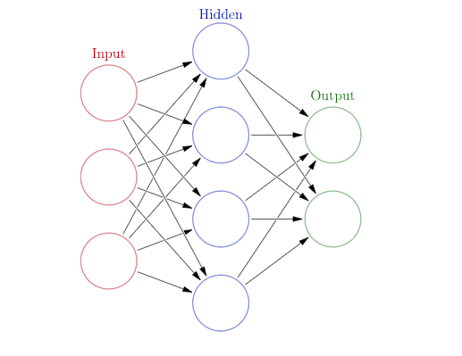

<Card title="View on GitHub" icon="github" href="https://github.com/Classiq/classiq-library/blob/main/algorithms/QML/hybrid_qnn/hybrid_qnn_for_subset_majority.ipynb">
  Open this notebook in GitHub to run it yourself
</Card>

## Classical Neural Networks

Neural networks is one of the major branches in machine learning, with wide use in applications and research. A neural network - or, more generally, a deep neural network - is a parametric function of a specific structure (inspired by neural networks in biology), which is trained to capture specific functionality.

In its most basic form, a neural network for learning a function $\vec{f}: \mathbb{R}^N\rightarrow \mathbb{R}^M$ looks as follows:

1. There is an input vector of size $N$ (red circles in Fig. 1).
1. Each entry of the input goes into a hidden layer of size $K$, where each neuron (blue circles in Fig. 1) is defined with an "activation function" $y^{k}(\vec{w}^{(1)}; \vec{x})$ for $k=1,\dots,K$, and $\vec{w}^{(1)}$ are parameters.
1. The output of the hidden layer is sent to the output layer (green circles in Fig. 1) $\tilde{f}^{m}(\vec{w}^{(2)};\vec{y})$ for $m=1,\dots,M$, and $\vec{w}^{(2)}$ are parameters.

The output $\vec{\tilde{f}}$ is thus a parametric function (in $\vec{w}^{(1)},\,\vec{w}^{(2)}$), which can be trained to capture the target function $\vec{f}$.



<Frame caption="Figure 

1. A single layer classical neural network (from Wikipedia). Here, the input size is $N=3$, the output size is $M=3$, and the hidden layer has $L=4$ neurons." />

**Deep neural networks** are similar to the description above, having more than one hidden layer.

This provides a more complex structure that can capture more complex functionalities.

## Quantum Neural Networks

The idea of a quantum neural network refers to combining parametric circuits as a replacement for all or some of the classical layers in classical neural networks.

The basic object in QNN is thus a **quantum layer**, which has a classical input and returns a classical output.

The output is obtained by running a quantum program. A quantum layer is thus composed of three parts:

1. A quantum part that encodes the input: This is a parametric quantum function for representing the entries of a single data point.

There are three canonical ways to encode a data vector of size $N$: [angle-encoding](https://github.com/Classiq/classiq-library/blob/main/functions/qmod_library_reference/classiq_open_library/variational_data_encoding/variational_data_encoding.ipynb) using $N$ qubits, [dense angle-encoding](https://github.com/Classiq/classiq-library/blob/main/functions/qmod_library_reference/classiq_open_library/variational_data_encoding/variational_data_encoding.ipynb) using $\lceil N/2\rceil$ qubits, and amplitude-encoding using $\lceil\log_2N\rceil$ qubits.
1. A quantum ansatz part: This is a parametric quantum function, whose parameters are trained as the weights in classical layers.
1. A postprocess classical part, for returning an output classical vector.

The integration of quantum layers in classical neural networks may offer reduction in resources for a given functionality, as the network (or part of it) is expressed via the Hilbert space, providing different expressibility compared to classical networks.

This notebook demonstrates QNN by treating a specific function - the subset majority - for which we construct, train, and verify a hybrid classical-quantum neural network.

The notebook assumes familiarity with Classiq and NN with PyTorch.

See the [QML guide with Classiq](https://github.com/Classiq/classiq-library/blob/main/tutorials/basic_tutorials/qml_with_classiq_guide/qml_with_classiq_guide.ipynb).

## Example: Hybrid Neural Network for the Subset Majority Function

For an integer $N$ and a given subset of indices $S \subset \{0,1,\dots,N\}$ we define the subset majority function, $M_{S}:\{0,1\}^{\times N}\rightarrow \{0,1\}$ that acts on binary strings of size $N$ as follows: it returns 1 if the number of ones within the substring according to $S$ is larger than $|S|//2$, and 0 otherwise,

$$
M_S(\vec{b}) = \left\{ \begin{array}{l l }
1 & \text{if } \sum_{j\in S} b_{j}>|S|//2, \\
0 & \text{otherwise}
\end{array}
\right .
$$
For example, we consider $N=7$ and $S=\{0,1,4\}$:

- The string 0101110 corresponds to the substring 011, for which the number of ones is 2(>1). Therefore, $M_S(0101110)=1$.
- The string 0011111 corresponds to the substring 001, for which the number of ones is 1(=1). Therefore, $M_S(0101110)=0$.

#

## Generating Data for a Specific Example

Let us consider a specific example for our demonstration. We choose $N=10$ and generate all possible data of $2^N$ bit strings. We also take a specific subset $S=\{1, 3, 4, 6, 7, 9\}$.

```python
!pip install -qq -U "classiq[qml]"
```
```python

import random

import numpy as np

np.random.seed(0)
random.seed(1)

STRING_LEN = 10
majority_data = [
    [int(d) for d in np.binary_repr(k, STRING_LEN)] for k in range(2**STRING_LEN)
]
random.shuffle(majority_data)  # shuffling the data
```
```python

SUBSET_INDICES = [1, 3, 4, 6, 7, 9]
subset_indicator = np.zeros(STRING_LEN)
subset_indicator[SUBSET_INDICES] = 1
```
```python

majority = (majority_data @ subset_indicator > len(SUBSET_INDICES) // 2) * 1
labels = [[l] for l in majority]
```

We choose data for training and data for verification, and define the batch size for the corresponding data loaders:

```python
TRAINING_SIZE = 340
TEST_SIZE = 512

training_data = majority_data[0:TRAINING_SIZE]
training_labels = labels[0:TRAINING_SIZE]
test_data = majority_data[TRAINING_SIZE : TRAINING_SIZE + TEST_SIZE]
test_labels = labels[TRAINING_SIZE : TRAINING_SIZE + TEST_SIZE]
```
```python

BATCH_SIZE = 64
```
```python

import numpy as np
import torch
from torch.utils.data import DataLoader, TensorDataset

training_dataset = TensorDataset(
    torch.Tensor(training_data), torch.Tensor(training_labels)
)  # create dataset
training_dataloader = DataLoader(
    training_dataset, batch_size=BATCH_SIZE, shuffle=True, drop_last=False
)  # create dataloader

test_dataset = TensorDataset(
    torch.Tensor(test_data), torch.Tensor(test_labels)
)  # create your dataset
test_dataloader = DataLoader(
    test_dataset, batch_size=BATCH_SIZE, shuffle=True, drop_last=False
)  # create your dataloader
```
#

## Constructing a Hybrid Network

We build the following hybrid neural network:

**Data flattening $\rightarrow$ A classical linear layer of size 10 to 4 with `Tanh` activation $\rightarrow$ A qlayer of size 4 to 2 $\rightarrow$ a classical linear layer of size 2 to 1 with `ReLU` activation.**

The classical layers can be defined with PyTorch built-in functions.

The quantum layer is constructed with

(1) a [dense angle-encoding](https://github.com/Classiq/classiq-library/blob/main/functions/qmod_library_reference/classiq_open_library/variational_data_encoding/variational_data_encoding.ipynb) function

(2) a simple ansatz with RY and RZZ rotations

(3) a postprocess that is based on a measurement per qubit

#

### The Quantum Layer

```python
from classiq import *
from classiq.applications.qnn.types import SavedResult
from classiq.execution import ExecutionPreferences, execute_qnn


@qfunc
def my_ansatz(weights: CArray[CReal], qbv: QArray) -> None:
    """
    Gets a quantum variable of $m$ qubits, and applies RY gate on each qubit and RZZ gate on each pair of qubits
    in a linear connectivity.

The classical array weights represents the $2m-1$ parametric rotations.
    """
    repeat(
        count=qbv.len,
        iteration=lambda index: RY(weights[index], qbv[index]),
    )
    repeat(
        count=qbv.len - 1,
        iteration=lambda index: RZZ(weights[qbv.len + index], qbv[index : index + 2]),
    )
```
```python

QLAYER_SIZE = 4
num_qubits = int(np.ceil(QLAYER_SIZE / 2))
num_weights = 2 * num_qubits - 1
NUM_SHOTS = 4096


@qfunc
def main(
    input_vec: CArray[CReal, QLAYER_SIZE],
    weight: CArray[CReal, num_weights],
    result: Output[QArray],
) -> None:
    """
    The quantum part of the quantum layer.

The prefix for the data loading parameters must be set to `input_` or `i_`.

The prefix for the ansatz parameters must be set to `weights_` or `weight`
    """
    encode_on_bloch(input_vec, result)
    my_ansatz(weights=weight, qbv=result)


qmod = create_model(
    main, execution_preferences=ExecutionPreferences(num_shots=NUM_SHOTS)
)
qprog = synthesize(qmod)
show(qprog)
```
<Info>
  **Output:**

  

```

Quantum program link: https://platform.classiq.io/circuit/32pQqOSulTv1Qvssd71mPgf4btU
  

```
</Info>

```python
def my_post_process(result: SavedResult, num_qubits, num_shots) -> torch.Tensor:
    """
    Classical postprocess function.

Gets the histogram after execution and returns a vector $\vec{y}$,
    where $y_i$ is the probability of measuring 1 on the $i$-th qubit.
    """
    res = result.value
    yvec = [
        (res.counts_of_qubits(k)["1"] if "1" in res.counts_of_qubits(k) else 0)
        / num_shots
        for k in range(num_qubits)
    ]

    return torch.tensor(yvec)
```
#

### The Full Hybrid Network

Now, we can define the full network.

```python
import torch.nn as nn

from classiq.applications.qnn import QLayer


def create_net(*args, **kwargs) -> nn.Module:
    class Net(nn.Module):
        def __init__(self, *args, **kwargs):
            super().__init__()
            self.flatten = nn.Flatten()
            self.linear_1 = nn.Linear(STRING_LEN, 4)
            self.activation_1 = nn.Tanh()
            self.linear_2 = nn.Linear(2, 1)
            self.activation_2 = nn.ReLU()

            self.qlayer = QLayer(
                qprog,
                execute_qnn,
                post_process=lambda res: my_post_process(
                    res, num_qubits=num_qubits, num_shots=NUM_SHOTS
                ),
                *args,
                **kwargs,
            )

        def forward(self, x):
            x = self.flatten(x)
            x = self.linear_1(x)
            x = self.activation_1(x)
            x = self.qlayer(x)  # 4 to 2
            x = self.linear_2(x)  # 2 to 1
            x = self.activation_2(x)
            return x

    return Net(*args, **kwargs)


my_network = create_net()
```
#

## Training and Verifying the Networks

We define some hyperparameters such as loss function and optimization method, and a training function:

```python
import torch.nn as nn
import torch.optim as optim

LEARNING_RATE = 0.05

# choosing our loss function
loss_func = nn.MSELoss()

# choosing our optimizer
optimizer = optim.SGD(my_network.parameters(), lr=LEARNING_RATE)
```

Next, we define a `train` function:

```python
import time as time

from torch.utils.data import DataLoader


def train(
    network: nn.Module,
    data_loader: DataLoader,
    loss_func: nn.modules.loss._Loss,
    optimizer: optim.Optimizer,
    epoch: int = 20,
) -> None:
    for index in range(epoch):
        start = time.time()
        for data, label in data_loader:

            optimizer.zero_grad()
            output = network(data)
            loss = loss_func(output, label.type(output.dtype))
            loss.backward()

            optimizer.step()

        print(index, f"\tloss = {loss.item()}", "time", time.time() - start)
```

We also define a validation function, `check_accuracy`, which tests a trained network on new data:

```python
from torch import Tensor


def get_correctly_guessed_labels_function(
    model: nn.Module, data: Tensor, labels: Tensor
) -> int:
    predictions = model(data)
    list_of_predictions = [
        round(prediction.type(torch.float).item()) for prediction in predictions
    ]
    correct = sum(
        [
            list_of_predictions[k] == labels.flatten().tolist()[k]
            for k in range(len(predictions))
        ]
    )
    return correct


def _get_amount_of_labels(labels: Tensor) -> int:
    # the first dimension of `labels` is `batch_size`
    return labels.size(0)


def check_accuracy(
    network: nn.Module,
    data_loader: DataLoader,
    should_print: bool = True,
) -> float:
    num_correct = 0
    total = 0

    network.eval()

    with torch.no_grad():
        for data, labels in data_loader:
            num_correct += get_correctly_guessed_labels_function(network, data, labels)
            total += _get_amount_of_labels(labels)

    accuracy = float(num_correct) / float(total)

    if should_print:
        print(f"Test accuracy of the model: {accuracy*100:.2f}%")
        print(f"num correct: {num_correct}, total: {total}")

    return accuracy
```
#

## Training and Verifying the Network

For convenience, we load a pre-trained model and set the epoch size to 

1. Training a network takes around 30 epochs.

```python
# comment out for training
my_network.load_state_dict(torch.load("trained_model.pth"))
num_epoch = 1
# uncomment out for training
# epoch=30
```
```python

data_loader = training_dataloader
train(my_network, training_dataloader, loss_func, optimizer, epoch=num_epoch)
```
<Info>
  **Output:**

  

```
0 	loss = 0.09676678478717804 time 169.12708473205566
  

```
</Info>

```python
accuracy = check_accuracy(my_network, test_dataloader)
```
<Info>
  **Output:**

  

```

Test accuracy of the model: 97.07%
  num correct: 497, total: 512
  

```
</Info>