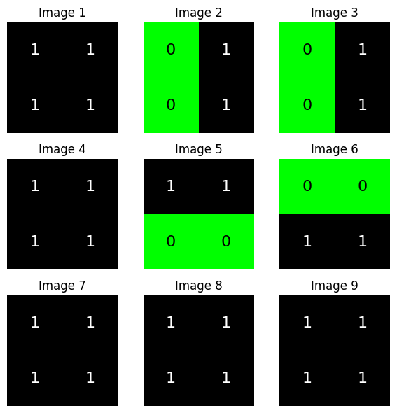
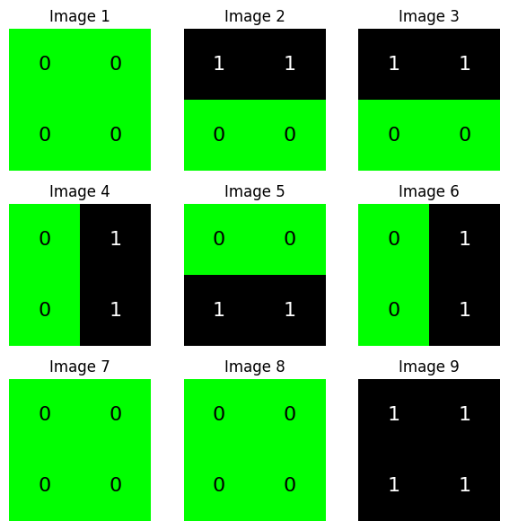
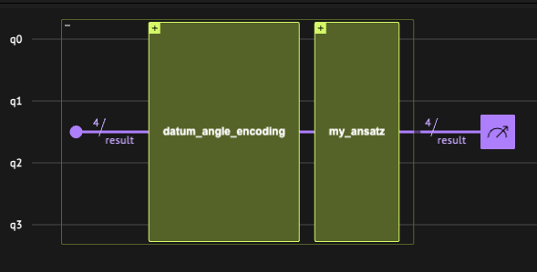
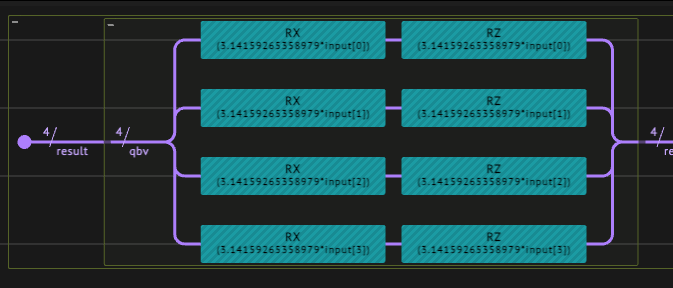
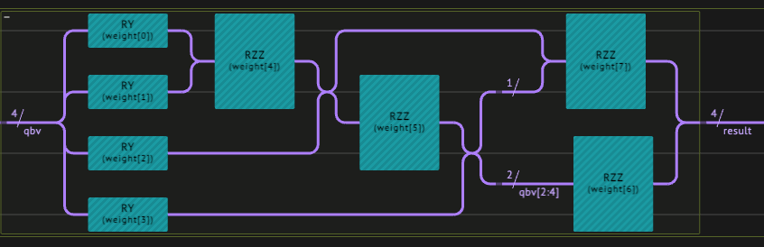

<Card title="View on GitHub" icon="github" href="https://github.com/Classiq/classiq-library/blob/main/algorithms/QML/qgan/qgan_bars_and_strips.ipynb">
  Open this notebook in GitHub to run it yourself
</Card>

***

Generative AI, especially through Generative Adversarial Networks (GANs), revolutionizes content creation across domains by producing highly realistic output.

Quantum GANs further elevate this potential by leveraging quantum computing, promising unprecedented advancements in complex data simulation and analysis.

***

In this notebook, we explore the concept of Quantum Generative Adversarial Networks (QGANs) and implement a simple QGAN model using the Classiq SDK.

We study a simple use case of a Bars and Stripes dataset. We begin with a classical implementation of a GAN, and then move to a hybrid quantum-classical GAN model.

## 1 Data Preparation

We generate the Bars and Stripes dataset, a simple binary dataset consisting of 2x2 images with either a horizontal or vertical stripe pattern:

```python
!pip install -qq -U "classiq[qml]"
```
```python

import time

import numpy as np


# Function to create Bars and Stripes dataset
def create_bars_and_stripes_dataset(num_samples):
    samples = []
    for _ in range(num_samples):
        horizontal = np.random.randint(0, 2) == 0
        if horizontal:
            stripe = np.random.randint(0, 2, size=(2, 1))
            sample = np.tile(stripe, (1, 2))
        else:
            stripe = np.random.randint(0, 2, size=(1, 2))
            sample = np.tile(stripe, (2, 1))
        samples.append(sample)
    return np.array(samples, dtype=np.uint8)
```
```python

# Generate Bars and Stripes dataset
dataset = create_bars_and_stripes_dataset(num_samples=1000)
```
#

## 1.1 Visualizing the Generated Data

Let's plot a few samples from the dataset to visualize the bars and stripes patterns:

```python
import matplotlib.pyplot as plt
from matplotlib.colors import LinearSegmentedColormap


# Plot images in a 3 by 3 grid
def plot_nine_images(generated_images):
    # Define custom colormap
    classiq_cmap = LinearSegmentedColormap.from_list(
        "teal_white", ["#00FF00", "black"]  # Green to black
    )
    fig, axes = plt.subplots(3, 3, figsize=(6, 6))
    for i, ax in enumerate(axes.flat):
        ax.imshow(generated_images[i].reshape(2, 2), cmap=classiq_cmap, vmin=0, vmax=1)
        ax.axis("off")
        ax.set_title(f"Image {i+1}")
        for j in range(2):
            for k in range(2):
                label = int(generated_images[i].reshape(2, 2)[j, k])
                ax.text(
                    k,
                    j,
                    f"{label}",
                    ha="center",
                    va="center",
                    color="white" if label == 1 else "black",
                    fontsize=16,
                )
    plt.tight_layout()
    plt.show()
```
```python

# Generate images
generated_images = create_bars_and_stripes_dataset(9)
plot_nine_images(generated_images)
```


We create a PyTorch DataLoader to feed the dataset to the GAN model during training:

```python
import torch
from torch.utils.data import DataLoader, TensorDataset

# Create DataLoader for training
tensor_dataset = TensorDataset(torch.tensor(dataset, dtype=torch.float))
dataloader = DataLoader(tensor_dataset, batch_size=64, shuffle=True)
```

## 2 Classical Network

#

## 2.1 Defining a Classical GAN

We begin by defining the generator and discriminator models (architecture) for the classical GAN.
We work with `tensorboard` to save our logs (uncomment the following line to install the package):

```python
# ! pip install tensorboard
```
```python

import torch.nn as nn


class Generator(nn.Module):
    def __init__(self, input_size=2, output_size=4, hidden_size=32):
        super(Generator, self).__init__()
        self.model = nn.Sequential(
            nn.Linear(input_size, hidden_size // 2),  # Adjusted hidden layer size
            nn.ReLU(),
            nn.Linear(hidden_size // 2, hidden_size),  # Adjusted hidden layer size
            nn.ReLU(),
            nn.Linear(hidden_size, output_size),
            nn.Sigmoid(),  # Sigmoid activation to output probabilities
        )

    def forward(self, x):
        return torch.round(self.model(x))


class Discriminator(nn.Module):
    def __init__(self, input_size=4, hidden_size=16):
        super(Discriminator, self).__init__()
        self.model = nn.Sequential(
            nn.Linear(input_size, hidden_size // 2),  # Adjusted hidden layer size
            nn.LeakyReLU(0.2),
            nn.Linear(hidden_size // 2, hidden_size),  # Adjusted hidden layer size
            nn.LeakyReLU(0.25),
            nn.Dropout(0.3),
            nn.Linear(hidden_size, 1),
            nn.Sigmoid(),  # Sigmoid activation to output probabilities
        )

    def forward(self, x):
        x = x.view(-1, 4)  # Flatten input for fully connected layers
        return self.model(x)
```
#

## 2.2 Training a Classical GAN

We define the training loop for the classical GAN:

```python
import os
from datetime import datetime

import torch
import torch.nn as nn
import torchvision.utils as vutils
from torch.utils.tensorboard import SummaryWriter


def train_gan(
    generator,
    discriminator,
    dataloader,
    log_dir_name,
    fixed_noise,
    random_fake_data_generator,
    num_epochs=100,
    device="cpu",
):

    # Initialize TensorBoard writer
    run_id = datetime.now().strftime("%Y%m%d_%H%M%S")
    log_dir = os.path.join(log_dir_name, run_id)
    writer = SummaryWriter(log_dir=log_dir)

    # Define loss function and optimizer
    criterion = nn.BCELoss()
    g_optimizer = torch.optim.Adam(generator.parameters(), lr=0.0002)
    d_optimizer = torch.optim.Adam(discriminator.parameters(), lr=0.0002)

    generator.to(device)
    discriminator.to(device)

    for epoch in range(num_epochs):
        for i, batch in enumerate(dataloader):
            real_data = batch[0].to(device)
            batch_size = real_data.size(0)

            # Train Discriminator with real data
            d_optimizer.zero_grad()
            real_output = discriminator(real_data)
            d_real_loss = criterion(real_output, torch.ones_like(real_output))
            d_real_loss.backward()

            # Train Discriminator with fake data
            z = random_fake_data_generator(batch_size)
            fake_data = generator(z)
            fake_output = discriminator(fake_data.detach())
            d_fake_loss = criterion(fake_output, torch.zeros_like(fake_output))
            d_fake_loss.backward()
            d_optimizer.step()

            # Train Generator
            g_optimizer.zero_grad()
            z = random_fake_data_generator(batch_size)
            fake_data = generator(z)
            fake_output = discriminator(fake_data)
            g_loss = criterion(fake_output, torch.ones_like(fake_output))
            g_loss.backward()
            g_optimizer.step()

            # Log losses to TensorBoard
            step = epoch * len(dataloader) + i
            writer.add_scalar("Generator Loss", g_loss.item(), step)
            writer.add_scalar("Discriminator Real Loss", d_real_loss.item(), step)
            writer.add_scalar("Discriminator Fake Loss", d_fake_loss.item(), step)

            if i % 100 == 0:
                print(
                    f"Epoch [{epoch+1}/{num_epochs}], Step [{i+1}/{len(dataloader)}], "
                    f"Generator Loss: {g_loss.item():.4f}, "
                    f"Discriminator Real Loss: {d_real_loss.item():.4f}, "
                    f"Discriminator Fake Loss: {d_fake_loss.item():.4f}"
                )

        # Generate and log sample images for visualization
        # if (epoch+1) % (num_epochs // 10) == 0:
        #     with torch.no_grad():
        #         generated_images = generator(fixed_noise).detach().cpu()
        #     img_grid = vutils.make_grid(generated_images, nrow=3, normalize=True)
        #     writer.add_image('Generated Images', img_grid, epoch+1)

    # Close TensorBoard writer
    writer.close()
```

We train our model and save the trained generator in `'generator_model.pth'`:

```python
# Fixed noise for visualizing generated samples
fixed_noise = torch.randn(9, 2)


def random_fake_data_for_gan(batch_size, input_size):
    return torch.randn(batch_size, input_size)
```
```python

generator = Generator(input_size=2, output_size=4, hidden_size=32)
discriminator = Discriminator(input_size=4, hidden_size=16)

# For simplicitly we load a pretrained model
checkpoint = torch.load("resources/generator_trained_model.pth")
generator.load_state_dict(checkpoint)

train_gan(
    generator=generator,
    discriminator=discriminator,
    dataloader=dataloader,
    log_dir_name="logs",
    fixed_noise=fixed_noise,
    random_fake_data_generator=lambda b_size: random_fake_data_for_gan(b_size, 2),
    num_epochs=10,
    device="cpu",
)

# Save trained generator model
torch.save(generator.state_dict(), "resources/generator_model.pth")
```
<Info>
  **Output:**

  

```

Epoch [1/10], Step [1/16], Generator Loss: 0.8823, Discriminator Real Loss: 0.8992, Discriminator Fake Loss: 0.5271
  Epoch [2/10], Step [1/16], Generator Loss: 0.8759, Discriminator Real Loss: 0.8870, Discriminator Fake Loss: 0.5399
  Epoch [3/10], Step [1/16], Generator Loss: 0.8639, Discriminator Real Loss: 0.8805, Discriminator Fake Loss: 0.5475
  Epoch [4/10], Step [1/16], Generator Loss: 0.8575, Discriminator Real Loss: 0.8665, Discriminator Fake Loss: 0.5581
  Epoch [5/10], Step [1/16], Generator Loss: 0.8437, Discriminator Real Loss: 0.8473, Discriminator Fake Loss: 0.5668
  Epoch [6/10], Step [1/16], Generator Loss: 0.8406, Discriminator Real Loss: 0.8405, Discriminator Fake Loss: 0.5634
  Epoch [7/10], Step [1/16], Generator Loss: 0.8327, Discriminator Real Loss: 0.8389, Discriminator Fake Loss: 0.5701
  Epoch [8/10], Step [1/16], Generator Loss: 0.8203, Discriminator Real Loss: 0.8191, Discriminator Fake Loss: 0.5787
  Epoch [9/10], Step [1/16], Generator Loss: 0.8226, Discriminator Real Loss: 0.8198, Discriminator Fake Loss: 0.5721
  Epoch [10/10], Step [1/16], Generator Loss: 0.8109, Discriminator Real Loss: 0.8159, Discriminator Fake Loss: 0.5799
  

```
</Info>

#

## 2.3 Evaluating the Performance

```python
# Load state dictionary with mismatched sizes
generator = Generator()
checkpoint = torch.load("resources/generator_model.pth")
generator.load_state_dict(checkpoint)
num_samples = 100
z = random_fake_data_for_gan(num_samples, 2)
gen_data = generator(z)


def evaluate_generator(samples):
    count_err = 0
    for img in samples:
        img = img.reshape(2, 2)
        diag1 = int(img[0, 0]) * int(img[1, 1])
        diag2 = int(img[0, 1]) * (int(img[1, 0]))
        if (diag1 == 1 or diag2 == 1) and diag1 * diag2 != 1:
            count_err += 1
    return (samples.shape[0] - count_err) / samples.shape[0]


accuracy_classical = evaluate_generator(samples=gen_data)
print(f"Classically trained generator accuracy: {accuracy_classical:.2%}%")
```
<Info>
  **Output:**

  

```

Classically trained generator accuracy: 70.00%%
  

```
</Info>

Visualizing generator examples:

```python
# Initialize generator for evaluation
generator_for_evaluation = Generator(input_size=2, output_size=4)
generator_for_evaluation.load_state_dict(
    torch.load("resources/generator_model.pth")
)  # Load trained model
generator_for_evaluation.eval()

# Generate images
with torch.no_grad():
    noise = torch.randn(9, 2)
    generated_images = generator_for_evaluation(noise).detach().cpu().numpy()

# Plot images in a 3 by 3 grid
generated_images = create_bars_and_stripes_dataset(9)
plot_nine_images(generated_images)
```


## 3 Quantum Hybrid Network Implementation

In this section we define a quantum generator circuit and integrate it into a hybrid quantum-classical GAN model. We then train the QGAN model and evaluate its performance.

#

## 3.1 Defining the Quantum GAN

#

### 3.1.1 Defining the Quantum Generator

We define the three components of the quantum layer.

This is where the quantum network architect's creativity comes into play!

The design we choose:

1. Data encoding - we take a `datum_angle_encoding` that encodes $n$ data points on $n$ qubits.
1. A variational ansatz - we combine RY and RZZ gates.
1. Classical postprocess - we take the vector $(p_1, p_2, \dots, p_n)$, with $p_i$ being the probability to measure 1 on the $i$-th qubit.

```python
from typing import List

from classiq import *
from classiq.applications.qnn.types import SavedResult
from classiq.qmod.symbolic import floor, pi


@qfunc
def datum_angle_encoding(data_in: CArray[CReal], qbv: QArray) -> None:
    repeat(
        count=data_in.len,
        iteration=lambda index: RX(pi * data_in[index], qbv[index]),
    )
    repeat(
        count=data_in.len,
        iteration=lambda index: RZ(pi * data_in[index], qbv[index]),
    )


@qfunc
def my_ansatz(weights: CArray[CReal], qbv: QArray) -> None:
    repeat(
        count=qbv.len,
        iteration=lambda index: RY(weights[index], qbv[index]),
    )
    repeat(
        count=qbv.len - 1,
        iteration=lambda index: RZZ(weights[qbv.len + index], qbv[index : index + 2]),
    )
    if_(
        condition=qbv.len > 2,
        then=lambda: RZZ(weights[weights.len - 1], qbv[0:2]),
    )


def my_post_process(result: SavedResult, num_qubits, num_shots) -> torch.Tensor:
    res = result.value
    yvec = [
        (res.counts_of_qubits(k).get("1", 0)) / num_shots for k in range(num_qubits)
    ]

    return torch.tensor(yvec)
```

Finally, we define the quantum model with its hyperparameters as our `main`  quantum function, and synthesize it into a quantum program.

```python
import numpy as np

from classiq.execution import (
    ExecutionPreferences,
    execute_qnn,
    set_quantum_program_execution_preferences,
)

NUM_SHOTS = 4096
QLAYER_SIZE = 4
num_qubits = int(np.ceil(QLAYER_SIZE))
num_weights = 2 * num_qubits


@qfunc
def main(
    input_vec: CArray[CReal, QLAYER_SIZE],
    weight: CArray[CReal, num_weights],
    result: Output[QArray[num_qubits]],
) -> None:
    allocate(result)
    datum_angle_encoding(data_in=input_vec, qbv=result)

    my_ansatz(weights=weight, qbv=result)


qmod = create_model(main)
qmod = update_execution_preferences(qmod, num_shots=NUM_SHOTS)
qprog = synthesize(qmod)
show(qprog)
```
<Info>
  **Output:**

  

```

Quantum program link: https://platform.classiq.io/circuit/32pR64kcelBdvZPQxyWfy06v25R
  

```
</Info>

**The resulting circuit**:



<Frame caption="Hierarchical view of the quantum circuit for the QGAN generator.

The circuit consists of an angle encoding layer, an ansatz layer, and a postprocessing layer" />



<Frame caption="Angle encoding layer consists of two consecutive noncommuting rotations encoding a single datum." />



<Frame caption="Ansatz layer including parametrized rotation followed by a pair-wise entangler via the RZZ gate sequence." />

#

### 3.1.2 Defining the Hybrid Network

We define the network building blocks: the generator and discriminator in a hybrid network configuration with a quantum layer,

```python
import torch.nn as nn

from classiq.applications.qnn import QLayer


def create_net(*args, **kwargs) -> nn.Module:
    class QGenerator(nn.Module):
        def __init__(self, *args, **kwargs):
            super().__init__()
            self.flatten = nn.Flatten()
            self.linear_1 = nn.Linear(4, 16)
            self.linear_2 = nn.Linear(16, 32)
            self.linear_3 = nn.Linear(32, 16)
            self.linear_4 = nn.Linear(16, 4)
            self.linear_5 = nn.Linear(2, 4)
            self.activation_1 = nn.ReLU()
            self.activation_2 = nn.Sigmoid()

            self.qlayer = QLayer(
                qprog,
                execute_qnn,
                post_process=lambda res: my_post_process(
                    res, num_qubits=num_qubits, num_shots=NUM_SHOTS
                ),
                *args,
                **kwargs,
            )

        def forward(self, x):
            x = self.flatten(x)
            x = self.linear_1(x)
            x = self.activation_2(x)
            x = self.linear_2(x)
            x = self.activation_1(x)
            x = self.linear_3(x)
            x = self.activation_1(x)
            x = self.linear_4(x)
            x = self.activation_2(x)
            x = self.qlayer(x)
            x = torch.round(self.activation_2(x))
            return x

    return QGenerator(*args, **kwargs)


class Discriminator(nn.Module):
    def __init__(self, input_size=4, hidden_size=16):
        super(Discriminator, self).__init__()
        self.model = nn.Sequential(
            nn.Linear(input_size, hidden_size // 2),  # Adjusted hidden layer size
            nn.LeakyReLU(0.2),
            nn.Linear(hidden_size // 2, hidden_size),  # Adjusted hidden layer size
            nn.LeakyReLU(0.25),
            nn.Dropout(0.3),
            nn.Linear(hidden_size, 1),
            nn.Sigmoid(),  # Sigmoid activation to output probabilities
        )

    def forward(self, x):
        x = x.view(-1, 4)  # Flatten input for fully connected layers
        return self.model(x)
```
```python

q_gen = create_net()
```
#

## 3.3 Training the QGAN

We can use the training loops defined above for the classical GAN:

```python
# Fixed noise for visualizing generated samples
fixed_noise = torch.randn(4)


def random_fake_data_for_qgan(batch_size, input_size):
    return torch.bernoulli(torch.rand(batch_size, input_size))
```

The following cell generates an archive of the training process in the `q_logs` directory. We also use Tensorboard to monitor the training in real time. It is possible to use an online version - which is more convenient - but for the purpose of this notebook we use the local version. An example of a vizualization output that can be obtained from `tensorboard` is shown in the next figure.

```python
# 

## generate tensorboard log directory
# #
# # log_dir = 'MY_LOG_DIR'
# # if not os.path.exists(log_dir):
# #     os.makedirs(log_dir)

# # Launch tensorboard and generate the containing folder internally
# %load_ext tensorboard
# # %reload_ext tensorboard
# %tensorboard --logdir='MY_LOG_DIR/q_logs'
```
<Frame caption="Example of two training sessions.

The first (green) line depicts a process in which the loss function estimator is rising; a clear indication that the learning session does not seem to converge to the desired result.

The second (orange) line shows the convergence of both.

The two components compete to improve their performance.">
  
</Frame>

***

Since training can take long time to run, we take a pre-trained model, whose parameters are stored in `q_generator_trained_model.pth`. In addition, we take a smaller sample size of 

250. (The pre-trained model was trained on 1000 samples.) To train a randomly initialized QGAN, change `num_samples` from 250 to 1000 for the data creation, and `num_epochs` from 1 to 10 in the training call `train_gan`.

***

```python
# Create training dataset for qgan
qgan_training_dataset = create_bars_and_stripes_dataset(
    num_samples=250
    # num_samples=1000
)

# Convert to PyTorch tensor
qgan_tensor_dataset = torch.tensor(qgan_training_dataset, dtype=torch.float32)

# Create a TensorDataset object
qgan_tensor_dataset = TensorDataset(qgan_tensor_dataset)

# Create a DataLoader object
qgan_dataloader = DataLoader(qgan_tensor_dataset, batch_size=64, shuffle=True)

q_generator = q_gen
discriminator = Discriminator(input_size=4, hidden_size=16)
```
```python

checkpoint = torch.load("resources/q_generator_trained_model.pth")
q_generator.load_state_dict(checkpoint)

train_gan(
    generator=q_generator,
    discriminator=discriminator,
    dataloader=qgan_dataloader,
    log_dir_name="q_logs",
    fixed_noise=fixed_noise,
    random_fake_data_generator=lambda b_size: random_fake_data_for_qgan(b_size, 4),
    num_epochs=1,
    # num_epochs=10,
    device="cpu",
)

# Save trained generator model
torch.save(q_generator.state_dict(), "resources/q_generator_model_bs64.pth")
```
<Info>
  **Output:**

  

```

Epoch [1/1], Step [1/4], Generator Loss: 0.7105, Discriminator Real Loss: 0.7182, Discriminator Fake Loss: 0.6834
  

```
</Info>

#

## 3.3 Evaluating the Performance

Finally, we can evaluate the performance of the QGAN, similar to the classical counterpart:

```python
generator = q_gen
checkpoint = torch.load("resources/q_generator_model_bs64.pth")
generator.load_state_dict(checkpoint)
num_samples = 10
z = torch.bernoulli(torch.rand(num_samples, 4))
gen_data = generator(z)

accuracy = evaluate_generator(samples=gen_data)
print(f"Quantum-classical hybrid trained generator accuracy: {accuracy:.2%}%")
```
<Info>
  **Output:**

  

```

Quantum-classical hybrid trained generator accuracy: 100.00%%
  

```
</Info>

```python
z = random_fake_data_for_qgan(10, 4)
gen_data = generator(z)
print(gen_data)
```
<Info>
  **Output:**

  

```
tensor([[1., 1., 1., 1.],
          [1., 1., 1., 1.],
          [1., 1., 1., 1.],
          [1., 1., 1., 1.],
          [1., 1., 1., 1.],
          [1., 1., 1., 1.],
          [1., 1., 1., 1.],
          [1., 1., 1., 1.],
          [1., 1., 1., 1.],
          [1., 1., 1., 1.]], grad_fn=<RoundBackward0>)
  

```
</Info>

***

Why do you think the accuracy is so high?

Answer: The system chose a metastable pathway where no violation of the rules occurs!

Try longer training, different sets of hyperparameters, different architectures, etc.