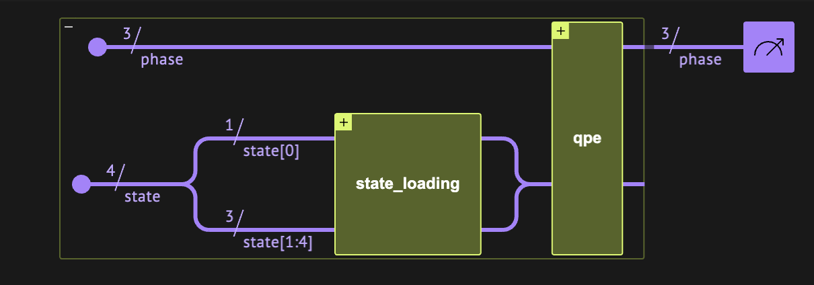
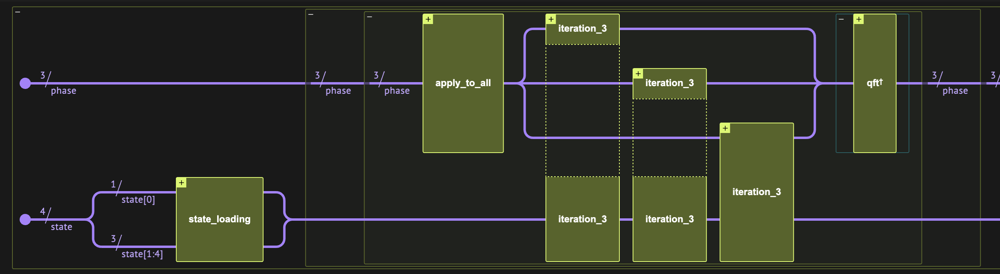
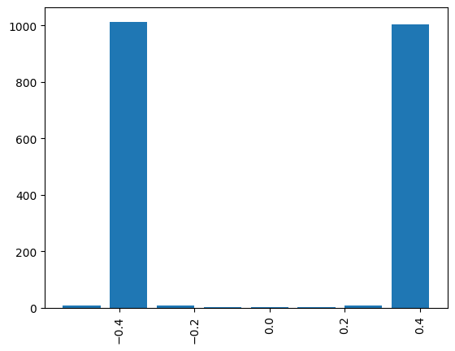

<Card title="View on GitHub" icon="github" href="https://github.com/Classiq/classiq-library/blob/main/algorithms/amplitude_amplification_and_estimation/qmc_user_defined/qmc_user_defined.ipynb">
  Open this notebook in GitHub to run it yourself
</Card>

Monte Carlo integration refers to estimating expectation values of a function $f(x)$, where $x$ is a random variable drawn from some known distribution $p$:

$$
\begin{equation}
\tag{1}
E_{p}(x) = \int f(x)p(x) dx.
\end{equation}
$$
Such evaluations appear in the context of option pricing or credit risk analysis.

The basic idea of QMCI assumes that we have a quantum function $A$, which, for a given $f$ and $p$, loads the following state of $n+1$ qubits:

$$
\begin{align}
\tag{2}
A|0\rangle_n|0\rangle = \sum^{2^n-1}_{i=0} \sqrt{f_i} \sqrt{p_i}|i\rangle_n|1\rangle + \sum^{2^n-1}_{i=0} \sqrt{1-f_i} \sqrt{p_i}|i\rangle_n|0\rangle = \sqrt{a}|\psi_1\rangle+\sqrt{1-a}|\psi_0\rangle,
\end{align}
$$
where it is understood that the first $2^n$ states represent a discretized space of $x$, and that $0\leq f(x)\leq 1$.
Then, by applying the amplitude estimation (AE) algorithm for the "good-state" $|\psi_1 \rangle$, we can estimate its amplitude:

$$
a = \sum^{2^n-1}_{i=0} f_i p_i.
$$
The QMCI algorithm can be separated into two parts:

1. Constructing a Grover operator for the specific problem.

This is done here almost from scratch.
1. Applying the AE algorithm based on the Grover operator \[[1](#ae)].

This is done by calling the Classiq Quantum Phase Estimation (QPE) function.

## Specific Use Case for the Tutorial

For simplicity we consider a simple use case. We take a probability distribution on the integers

$$
\tag{3}
p_i = \frac{i}{\mathcal{N}} \text{ for } i\in \{0,\dots 2^3-1\},
$$
where $\mathcal{N}$ is a normalization constant, and we would like to evaluate the expectation value of the function

$$
\tag{4}
f(x) = \sin^2(0.25x+0.2).
$$
Therefore, the value we want to evaluate is

$$
a= \frac{1}{\mathcal{N}} \sum^7_{k=0} \sin^2(0.25k+0.2) k \approx 0.834.
$$
***

*This tutorial illustrats how to construct a Quantum Monte Carlo Integration (QMCI), defining all its building blocks in Qmod (rather than using open-library functions).

The example below demonstrates how we can exploit various concepts of modeling quantum algorithms with Classiq when building our own functions*.

***

## 

1. Building the Corresponding Grover Operator

```python
import matplotlib.pyplot as plt

from classiq import *
```
#

## Grover Operator for QMCI

The Grover operator suitable for QMCI is defined as follows:

$$
Q\equiv - S_{\psi_1} A^{\dagger} S_0 A,
$$
with $S_0$ and $S_{\psi_1}$ being reflection operators around the zero state $|0\rangle_n|0\rangle$ and the good-state $|\psi_1\rangle$, respectively, and the function $A$ is defined in Eq. ([2](#mjx-eqn-2)).

In subsections (1.1)-(1.3) below we build each of the quantum sub-functions, and then in subsection (1.4) we combine them to define a complete Grover operator. On the way we introduce several concepts of functional modeling, which allow the Classiq synthesis engine to reach better optimized circuits.

#

### 1.1) The State Loading $A$ Function

We start with constructing the $A$ operator in Eq. ([2](#mjx-eqn-2)). We define a quantum function and give it the name `state_loading`.

The function's signature declares two arguments:

1. A quantum register `x` declared as `QArray` (an array of qubits with an unspecified size) that is used to represent the discretization of space.
1. A quantum register `ind` of size 1 declared as `QBit` to indicate the good state.

Next, we construct the logic flow of the `state_loading` function.

The function body consists of two quantum function calls:

1. As can be seen from Eq. ([2](#mjx-eqn-2)), the `load_probabilities` function is constructed using the Classiq `inplace_prepare_state` function call on $n=3$ qubits with probabilities $p_i$.
1. The `amplitude_loading` body calls the Classiq `linear_pauli_rotations` function.

The `linear_pauli_rotations` loads the amplitude of the function $f(x) = sin^2(0.25 x + 0.2)$.

   *Note: The amplitude should be $sin$ so the probability is $sin^2$.*

   The function uses an auxiliary qubit that is utilized so that the desired probability reflects on the auxiliary qubit if it is in the `|1>` state.

   We use the function with the Pauli Y matrix and enter the appropriate slope and offset to achieve the right parameters.

We define the probabilities according to the specific problem described by Eqs. ([3](#mjx-eqn-3)-[4](#mjx-eqn-4)).

```python
import numpy as np

sp_num_qubits = 3
probabilities = np.linspace(0, 1, 2**sp_num_qubits) / sum(
    np.linspace(0, 1, 2**sp_num_qubits)
)


slope = 0.5
offset = 0.4


@qfunc
def load_probabilities(state: QArray):
    inplace_prepare_state(probabilities.tolist(), 0, state)


@qfunc
def amplitude_loading(x: QArray, ind: QBit):
    linear_pauli_rotations(
        bases=[Pauli.Y.value], slopes=[slope], offsets=[offset], x=x, q=ind
    )


@qfunc
def state_loading(x: QArray, ind: QBit):
    load_probabilities(x)
    amplitude_loading(x=x, ind=ind)
```

To examine our function we define a quantum `main` function from which we can build a model, synthesize, and view the quantum program created:

```python
@qfunc
def main(res: Output[QArray[QBit, sp_num_qubits]], ind: Output[QBit]):
    allocate(res)
    allocate(ind)
    state_loading(res, ind)


model = create_model(main)
qprog = synthesize(model)
show(qprog)
```
<Info>
  **Output:**

  

```

Quantum program link: https://platform.classiq.io/circuit/3FmVHJIZID8qTQgNcvnJNRc0iL1
  

```
</Info>

#

### 1.2) $S_{\psi_1}$ Function 

- The Good State Oracle

The next quantum function we define is the one that reflects around the good state: any $n+1$ state in which the `ind` register is at state $|1\rangle$.

This function can be constructed with a ZGate on the `ind` register.

```python
@qfunc
def good_state_oracle(ind: QBit):
    Z(ind)
```
#

### 1.3) $S_{0}$ Function 

- The Grover Diffuser

To implement the Grover Diffuser we aim to perform a controlled-Z operation on the $|0>^n$ state.

We can define a `zero_oracle` quantum function with the `x` and `ind` registers as its arguments.

The `within_apply` operator takes two function arguments - compute and action - and invokes the sequence `compute()`, `action()`, and `invert(compute())`.

Quantum objects that are allocated and prepared by compute are subsequently uncomputed and released.

```python
@qfunc
def prepare_minus(q: QBit):
    X(q)
    H(q)


@qfunc
def zero_oracle(x: QNum, ind: QBit):
    within_apply(lambda: prepare_minus(ind), lambda: inplace_xor(x == 0, ind))
```

The inplace xor operation, `ind ^= x==0`, is equivalent to `control(x==0, X(ind))`.
We can verify that

$$
\begin{aligned}
|00\dots0\rangle \xrightarrow[{\rm ctrl(-Z)(target=q_0, ctrl=q_1\dots q_n)}]{} -|00\dots0\rangle, \\
|10\dots0\rangle \xrightarrow[{\rm ctrl(-Z)(target=q_0, ctrl=q_1\dots q_n)}]{} |10\dots0\rangle, \\
|11\dots0\rangle \xrightarrow[{\rm ctrl(-Z)(target=q_0, ctrl=q_1\dots q_n)}]{} |11\dots0\rangle,\\
|11\dots1\rangle \xrightarrow[{\rm ctrl(-Z)(target=q_0, ctrl=q_1\dots q_n)}]{} |11\dots1\rangle,
\end{aligned}
$$
which is exactly the functionality we want.

#

### 1.4) $Q$ Function 

- The Grover Operator

We can now define a complete Grover operator $Q\equiv -S_{\psi_1} A^{\dagger} S_0 A$. We do this in a single code block that calls the following:

1. The good state oracle (`good_state_oracle`)
1. THe inverse of the state preparation (`state_loading`)
1. The diffuser (`zero_oracle`)
1. The state preparation (`state_loading`)

*Note:*

- *Stages 2-4 are implemented by utilizing the `within_apply` operator*
- *We add a global phase of -1 to the full operator by using the atomic gate level function `U`*

```python
from classiq.qmod.symbolic import pi


@qfunc
def my_grover_operator(state: QArray):
    good_state_oracle(ind=state[0])
    within_apply(
        lambda: invert(lambda: state_loading(x=state[1 : state.len], ind=state[0])),
        lambda: zero_oracle(state[1 : state.len], state[0]),
    )
    phase(pi)
```
#

#### Let us look at the `my_grover_operator` function we created:

```python
@qfunc
def main(state: Output[QArray[QBit, sp_num_qubits + 1]]):
    allocate(state)
    my_grover_operator(state)


model_2 = create_model(main)
qprog_2 = synthesize(model_2)
show(qprog_2)
```
<Info>
  **Output:**

  

```

Quantum program link: https://platform.classiq.io/circuit/3FmVIQ01BmW45Xd5DGPZ5RlFz26
  

```
</Info>

## 

2. Applying Amplitude Estimation (AE) with Quantum Phase Estimation (QPE)

Here we apply a basic AE algorithm that is based on QPE.

The idea behind this algorithm is the following:

The state $A|0\rangle_n|0\rangle$ is spanned by two eigenvectors of our Grover operator $Q$, with the two corresponding eigenvalues

$$
\begin{equation}
\tag{5}
\lambda_{\pm}=\exp\left(\pm i2\pi \theta \right), \qquad \sin^2 \left(\pi \theta\right)\equiv a.
\end{equation}
$$
Therefore, if we apply a QPE on $A|0\rangle_n|0\rangle$, we have these two eigenvalues encoded in the QPE register. However, both give the value of $a$, so there is no ambiguity.

To find $a$ we build a simple quantum model, applying $A$ on a quantum register of size $n+1$ initialized to zero, and then applying the Classiq QPE with the `my_grover_operator` we defined.

Below is the `main` function from which we can build our model and synthesize it. In particular, we define the output register `phase` as `QNum` to hold the phase register output of the QPE. We choose a QPE with phase register of size 3, governing the accuracy of our phase-, and thus amplitude-, estimation.

```python
n_qpe = 3


@qfunc
def main(phase: Output[QNum[n_qpe, SIGNED, n_qpe]]):
    state = QArray()
    allocate(sp_num_qubits + 1, state)
    state_loading(state[1 : state.len], state[0])
    allocate(phase)
    qpe(unitary=lambda: my_grover_operator(state=state), phase=phase)
    drop(state)


model_3 = create_model(main)
model_3 = set_constraints(model_3, Constraints(max_width=n_qpe + sp_num_qubits + 1))
qprog_3 = synthesize(model_3)
show(qprog_3)
```
<Info>
  **Output:**

  

```

Quantum program link: https://platform.classiq.io/circuit/3FmVKNkbDC48tJKUIwwuznFFgJq
  

```
</Info>

We can export our model to a `.qmod` file:




#

## Executing the Circuit and Measuring the Approximated Amplitude

We execute on a simulator:

```python
result = execute(qprog_3).result_value()
```
```python

## mapping between register string to phases
phases_counts = dict(
    (sampled_state.state["phase"], sampled_state.shots)
    for sampled_state in result.parsed_counts
)
```

Upon plotting the resulting histogram we see two phase values with high probability (however, both correspond to the same amplitude $a$):

```python
plt.bar(phases_counts.keys(), phases_counts.values(), width=0.1)
plt.xticks(rotation=90)
print("phase with max probability: ", max(phases_counts, key=phases_counts.get))
```
<Info>
  **Output:**

  

```
phase with max probability:  -0.375
  

```
</Info>



Recalling the relation in Eq. ([5](#mjx-eqn-5)), we can read the amplitude $a$ from the phase with maximum probability and compare to the expected amplitude:

```python
measured_amplitude = np.sin(np.pi * max(phases_counts, key=phases_counts.get)) ** 2
exact_amplitude = sum(
    np.sin(0.5 * n / 2 + 0.4 / 2) ** 2 * probabilities[n] for n in range(2**3)
)
print(f"measured amplitude: {measured_amplitude}")
print(f"exact amplitude: {exact_amplitude}")
```
<Info>
  **Output:**

  

```
measured amplitude: 0.8535533905932737
  exact amplitude: 0.8338393824876795
  

```
</Info>

```python
assert np.abs(measured_amplitude - exact_amplitude) < 1e-1
```

## References

<a name="AE">\[1]</a>: [Brassard, G., Hoyer, P., Mosca, M., & Tapp, A. (2002). Quantum Amplitude Amplification and Estimation. Contemporary Mathematics, 305, 53-74.](https://arxiv.org/abs/quant-ph/0005055)