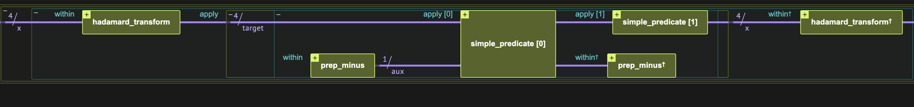
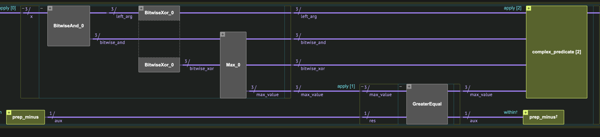

<Card title="View on GitHub" icon="github" href="https://github.com/Classiq/classiq-library/blob/main/algorithms/foundational/deutsch_jozsa/deutsch_jozsa.ipynb">
  Open this notebook in GitHub to run it yourself
</Card>

> **The Deutsch-Jozsa algorithm** [\[1\]](#original-paper), [\[2\]](#djwiki), named after David Deutsch and Richard Jozsa, is one of the first fundamental quantum algorithms showing exponential speedup over its classical counterpart$^*$. While it has no practical applicative use, it serves as a toy model for quantum computing, demonstrating how the concepts of superposition and interference enable quantum algorithms to outperform classical ones.
>
> The algorithm treats the following problem:
>
> - **Input:** A black box Boolean function $f(x)$ that acts on the integers in the range $[0, 2^{n}-1]$.
> - **Promise:** The function is either constant or balanced (for half of the values it is 1 and for the other half it is 0).
> - **Output:** Whether the function is constant or balanced.
>
> **Complexity:** The quantum approach requires a single query. If we require a deterministic answer to the problem, classically, we must inquire of the oracle $2^{n-1}+1$ times in the worst case. Therefore, the quantum algorithm exhibits a clear exponential speedup. However, without requiring deterministic determination - namely, allowing application of the classical probabilistic algorithm to get the result up to some error - then the exponential speedup is lost: taking $k$ classical evaluations of the function $f$ determines whether the function is constant or balanced, with a probability of $1 - 1/2^k$.
>
> $^*$ The exponential speedup is in the oracle complexity setting. It only refers to deterministic classical machines.
>
> ***
>
> **Keywords:** Foundational quantum algorithms, Phase oracle, Function evaluation, Oracle problem, Oracle/Query complexity.

We define the Deutsch-Jozsa algorithm, which has a [quantum part](#the-quantum-part) and a [classical postprocess part](#the-classical-postprocess). Then, we run the algorithm on two different examples, one with a [simple](#example-simple-arithmetic-oracle) $f(x)$ and another that is [more complex](#example-complex-arithmetic-oracle). A [mathematical explanation](#technical-notes) of the algorithm is provided at the end of this notebook.



<Frame caption="Figure 

1. The Deutsch-Jozsa algorithm" />

## How to Build the Algorithm with Classiq

We define a `deutsch_jozsa` quantum function whose arguments are a quantum function for the black box $f(x)$, and a quantum variable on which it acts, $x$.

The Deutsch-Jozsa algorithm is composed of three quantum blocks (see Figure 1): a Hadamard transform, an arithmetic oracle for the black box function, and another Hadamard transform.

#

## The Quantum Part

```python
from classiq import *


@qfunc
def deutsch_jozsa(predicate: QCallable[QNum, QBit], x: QNum) -> None:
    within_apply(
        lambda: hadamard_transform(x),
        lambda: phase_oracle(predicate=lambda x, y: predicate(x, y), target=x),
    )
```
#

## The Classical Postprocess

The classical part of the algorithm reads: The probability of measuring the $|0\rangle_n$ state is 1 if the function is constant and 0 if it is balanced.
We define a classical function that gets the execution results from running the quantum part and returns whether the function is constant or balanced:

```python
def post_process_deutsch_jozsa(parsed_results):
    if len(parsed_results) == 1:
        if 0 not in parsed_results:
            print("The function is balanced")
        else:
            print("The function is constant")
    else:
        print(
            "cannot decide as more than one output was measured, the distribution is:",
            parsed_results,
        )
```

## Example: Simple Arithmetic Oracle

We start with a simple example on $n=4$ qubits, and $f(x)= x >7$. Classically, in the worst case, the function should be evaluated $2^{n-1}+1=9$ times. However, with the Deutsch-Jozsa algorithm, this function is evaluated only once.

We build a predicate for this specific use case:

```python
@qperm
def simple_predicate(x: Const[QNum], res: QBit) -> None:
    res ^= x > 7
```

Next, we define a model by inserting the predicate into the `deutsch_jozsa` function:

```python
NUM_QUBITS = 4


@qfunc
def main(x: Output[QNum[NUM_QUBITS]]):
    allocate(x)
    deutsch_jozsa(lambda x, y: simple_predicate(x, y), x)


qprog_1 = synthesize(main)
```

Finally, we execute and call the classical postprocess:

```python
result_1 = execute(qprog_1).result_value()
results_list_1 = [sample.state["x"] for sample in result_1.parsed_counts]
post_process_deutsch_jozsa(results_list_1)
```
<Info>
  **Output:**

  

```

The function is balanced
  

```
</Info>

```python
show(qprog_1)
```
<Info>
  **Output:**

  

```

Quantum program link: https://platform.classiq.io/circuit/3G9AAyCGdMoNHKcC6gPWo0dhrov
  

```
</Info>

## Example: Complex Arithmetic Oracle

*Generalizing to more complex scenarios makes no difference for modeling*.

Let us take a complicated function, working with $n=3$: a function $f(x)$ that first takes the maximum between the input bitwise-xor with 4 and the input bitwise-and with 3, then checks whether the result is greater or equal to 

4. Can you tell whether the function is balanced or constant?

*This time we provide a width bound to the synthesis engine.*

We follow the three steps as before:

```python
from classiq.qmod.symbolic import max

NUM_QUBITS = 3
MAX_WIDTH = 11


@qperm
def complex_predicate(x: Const[QNum], res: QBit) -> None:
    res ^= max(x ^ 4, x & 3) >= 4


@qfunc
def main(x: Output[QNum[NUM_QUBITS]]):
    allocate(x)
    deutsch_jozsa(lambda x, y: complex_predicate(x, y), x)


qprog_2 = synthesize(
    model=main,
    constraints=Constraints(max_width=MAX_WIDTH),
)

result_2 = execute(qprog_2).result_value()
results_list_2 = [sample.state["x"] for sample in result_2.parsed_counts]
post_process_deutsch_jozsa(results_list_2)
```
<Info>
  **Output:**

  

```

The function is balanced
  

```
</Info>



<Frame caption="Figure 

2. The Deutsch-Jozsa algorithm for the complex example, focusing on oracle implementation (the last block performs uncomputation)." />

We can visualize the circuit obtained from the synthesis engine.

Figure 2 presents the complex structure of the oracle, generated automatically by the synthesis engine.

```python
show(qprog_2)
```
<Info>
  **Output:**

  

```

Quantum program link: https://platform.classiq.io/circuit/3G9AD6mwVpLv35cEFT485NAvloR
  

```
</Info>

## Technical Notes

A brief summary of the linear algebra behind the Deutsch-Jozsa algorithm.

The first Hadamard transformation generates an equal superposition over all the standard basis elements:

$$
|0\rangle_n \xrightarrow[H^{\otimes n}]{} \frac{1}{2^{n/2}}\sum^{2^n-1}_{j=0}|j\rangle_n.
$$
The arithmetic oracle gets a Boolean function and adds an $e^{\pi i}=-1$ phase to all states for which the function returns true:

$$
\frac{1}{2^{n/2}}\sum^{2^n-1}_{j=0}|j\rangle_n \xrightarrow[\text{Oracle}(f(j))]{}\frac{1}{2^{n/2}}\sum^{2^n-1}_{j=0}(-1)^{f(j)}|j\rangle_n.
$$
Finally, applying the Hadamard transform, which can be written as $H^{\otimes n}\equiv \frac{1}{2^{n/2}}\sum^{2^n-1}_{k,l=0}(-1)^{k\cdot l} |k\rangle \langle l| $, gives

$$
\frac{1}{2^{n/2}}\sum^{2^n-1}_{j=0}(-1)^{f(j)}|j\rangle  \xrightarrow[H^{\otimes n}]{} 
\sum^{2^n-1}_{k=0} \left(\frac{1}{2^{n}}\sum^{2^n-1}_{j=0}(-1)^{f(j)+j\cdot k} \right) |k\rangle.
$$
The probability of getting the state $|k\rangle = |0\rangle$ is

$$
P(0)=\left|\frac{1}{2^{n}}\sum^{2^n-1}_{j=0}(-1)^{f(j)} \right|^2 =
\left\{
\begin{array}{l l}
1 & \text{if } f(x) \text{ is constant} \\
0 & \text{if } f(x) \text{ is balanced.}
\end{array}
\right.
$$

## References

<a id="original-paper">\[1]</a>: [David Deutsch & Richard Jozsa. Rapid solutions of problems by quantum computation. Proceedings of the Royal Society of London A. 439 (1907): 553–558. (1992).](https://royalsocietypublishing.org/doi/10.1098/rspa.1992.0167)

<a id="djwiki">\[2]</a>: [Deutsch Jozsa (Wikipedia)](https://en.wikipedia.org/wiki/Deutsch%E2%80%93Jozsa_algorithm)