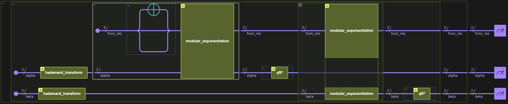
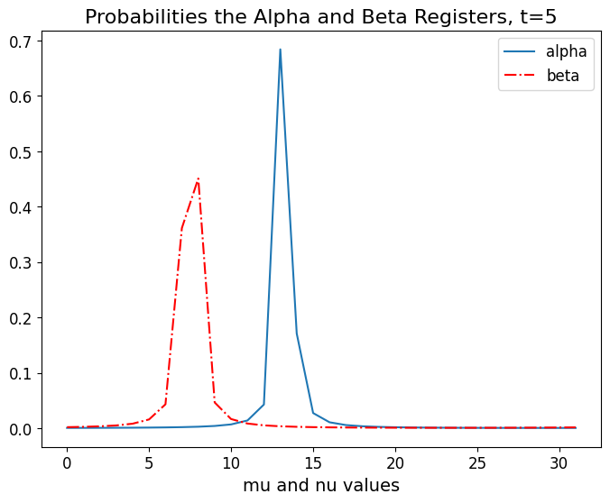
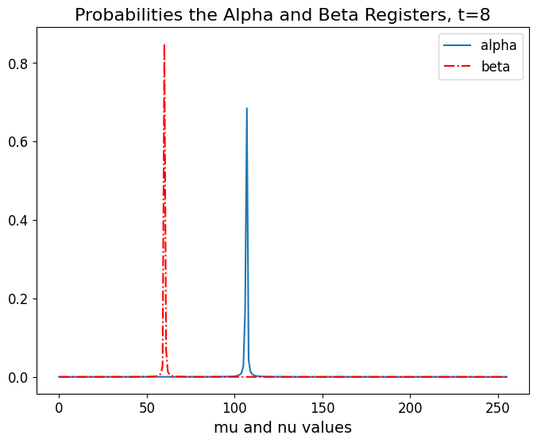

<Card title="View on GitHub" icon="github" href="https://github.com/Classiq/classiq-library/blob/main/algorithms/number_theory_and_cryptography/discrete_log/discrete_log.ipynb">
  Open this notebook in GitHub to run it yourself
</Card>

> The **Discrete Logarithm Problem** \[[1](#discretelog)] was shown by Shor \[[2](#shor)] to be solved in a polynomial time using quantum computers, while the fastest classical algorithms take a superpolynomial time. The problem is at least as hard as the factoring problem. In fact, the hardness of the problem is the basis for the Diffie-Hellman \[[3](#diffiehellman)] protocol for key exchange. The algorithm is a specific instance of the Abelian Hidden Subgroup Problem \[[4](#hsp)].
>
> The algorithm treats the following problem:
>
> - **Input:** A cyclic group $G = \langle g \rangle$ with a generator $g\in G$, an element $x\in G$ and the order of the group is known $r=|G|$. A quantum oracle $U_f$ applying the transformation

$$
U_f|\alpha\rangle |\beta\rangle |0\rangle = |\alpha\rangle |\beta\rangle |f(\alpha, \beta)\rangle~~,
$$
where $f(\alpha, \beta) = x^\alpha g^\beta$ with $\alpha, \beta \in \mathbb{Z}_r$.

> - **Promise:**  There is a positive integer $s\in \mathbb{N}$ such that $g^s = x$.
>
> - **Output:** The least positive integer $s = \log_g x$, i.e, the discrete logarithm.
>
> - **Complexity:** A single application of the algorithm succeeds with probability $O(\log \log r)$ and requires $O((\log t)^2)$ time, where $t = \lceil \log r +\log(1/\epsilon) \rceil$ and $1-\epsilon$ is success probability. Hence, boosting the success probability to a constant $O(1)$ via repetition yields a total expected runtime of

$$
O((\log t)^2 \log \log r)~.
$$
> ***
>
> **Keywords:** Abelain Hidden subgroup problem, quantum Fourier transform, period finding.


## Algorithm Steps

We first consider the case where $r=2^m$ and later generalize.
We begin by introducing an input state

$$
|\psi_0\rangle = |0^m\rangle|0^m\rangle|0^R\rangle~~,
$$
where $R$ is the number of bits required to represent $f$'s image. In addition, we note that $f(\alpha,\beta) = x^\alpha g^\beta = g^{\alpha\log_g x + \beta}$ is constant on lines satisfying

$$
\{(\alpha,\beta)\in \mathbb{Z}_r^2, \alpha\log_g x + \beta = \lambda \mod r\}~.
$$
The algorithm includes four main steps, and has a similar structure to the other quantum algorithms for the hidden subgroup problem.

1. We first prepare a uniform superposition over the input states of the first two registers:

$$
|0^m\rangle|0^m\rangle|0^m\rangle  \xrightarrow{H^{\otimes m}} \frac{1}{r}\sum_{\alpha,\beta \in \mathbb{Z}_r}|\alpha \rangle |\beta \rangle |0^m\rangle ~~.
$$
2. Perform a query to the oracle

$$
\xrightarrow{U_f} \frac{1}{r}\sum_{\alpha, \beta \in \mathbb{Z}_r}|\alpha \rangle |\beta \rangle |f(\alpha, \beta)\rangle~~.
$$
Utilizing the periodicity of $f$, we can express the state as

$$
= \frac{1}{r}\sum_{\alpha, \lambda \in \mathbb{Z}_r}|\alpha \rangle |\lambda -\alpha \log_g x \rangle |g^{\lambda}\rangle~~.
$$
3. Perform a double inverse Fourier transform over the group $\mathbb{Z}_r$

$$
\xrightarrow{\text{QFT}_{\mathbb{Z}_r}^\dagger \times \text{QFT}_{\mathbb{Z}_r}^\dagger } \frac{1}{r^2}\sum_{\lambda, \mu, \nu \in \mathbb{Z}_r}\left(\sum_\alpha e^{-i 2\pi \alpha(\mu - \nu \log_g x)/r}\right)e^{-i 2\pi \lambda \nu/r}|\mu \rangle |\nu \rangle |g^{\lambda}\rangle
$$
$$
= \frac{1}{r}\sum_{\lambda, \nu \in \mathbb{Z}_r}e^{i 2\pi \lambda \nu/r}|\nu \log_g x \rangle |\nu \rangle |g^{\lambda}\rangle~~,
$$
where the Fourier transform over $\mathbb{Z}_r$ is $\text{QFT}_{\mathbb{Z}_r} |\alpha \rangle = \frac{1}{\sqrt{r}}\sum_{\mu\in \mathbb{Z}_r} e^{i 2\pi \alpha \mu/r}|\mu \rangle$ and in the second line we utilized the identity $\sum_\alpha e^{i 2\pi \alpha \eta} = r \delta_{0\eta}$ (easily derived by use of a sum over a geometric series).
4\.

Measure the three quantum variables.

The measurement of the third variable collapses the quantum state to $|g^\lambda \rangle$ with a uniform distribution.

After the collapse, the resulting state is independent of $\lambda$, therefore, we can discard this measurement outcome.

From the measurement of the second quantum variable, we obtain with a uniform distribution over $\nu$ the outcome $\nu \log_g x$.

With a probablility of order $O(\log \log r)$, the obtained result $\nu$ is co-prime to $r$, and there exists a modular $r$ multiplicative inverse $\nu^{-1}$.

Under this condition, we can multiply the outcome of the second register to obtain the discrete log $s=\log_g x$. Hence, repeating the experiment $O(\log \log r)$ times leads to a success probability of order $O(1)$.

## Building the Algorithm with Classiq

We begin by importing software packages

```python
import matplotlib.pyplot as plt
import numpy as np

from classiq import *
from classiq.qmod.symbolic import ceiling, log
```

We consider two exemplary cases. First, we study the group $\mathbb{Z}_5^\times$, where the order is a power of $r=4=2^2$.

For this case, quantum variables with only $\log r = m$ qubits are required. Following, the group $\mathbb{Z}_{13}^\times$ exemplifies the alternative case where the order $ r\neq 2^m$ for an integer $m$.

For these examples, we denote the modulus by $N$. Since, these are cyclic groups, we have $N = r+1$, therefore $R = \lceil \log N\rceil$. In the following examples, the third register, containing the function $f(\alpha, \beta )$ after the second step, is represented by $\lceil \log N\rceil$.

The heart of the algorithm's logic is the implementation of the function

$$
|\alpha \rangle|\beta \rangle|0\rangle \rightarrow |\alpha \rangle|\beta \rangle|x^{\alpha } g^{\beta}\rangle~. 
$$
This is done using two applications of the modular exponentiation function, described in detail in the [Shor's Factoring Algorithm](https://short.classiq.io/shor) notebook. So here we import it from the Classiq library.

The `modular_exponentiation` function defined below accepts these arguments:

- `N: CInt` - modulo number
- `a: CInt` - base of the exponentiation
- `x: QArray[QBit]` - unsigned integer to multiply by the exponentiation
- `pw: QArray[QBit]`- power of the exponentiation

So the function implements
$|pw\rangle|x\rangle \rightarrow |pw\rangle|x \cdot a ^ {pw}\mod N\rangle$.

```python
from classiq import *


@qfunc
def modular_exponentiation(N: CInt, a: CInt, x: QArray, pw: QArray):
    repeat(
        count=pw.len,
        iteration=lambda index: control(
            pw[index],
            # lambda: inplace_modular_multiply(N, (a ** (2**index)) % N, x),  #modular_multiply_constant_inplace
            lambda: modular_multiply_constant_inplace(N, a ** (2**index), x),
        ),
    )


@qfunc
def discrete_log_oracle(
    g_generator: CInt,
    x_element: CInt,
    N_modulus: CInt,
    alpha: QArray,
    beta: QArray,
    func_res: Output[QNum],
) -> None:
    allocate(ceiling(log(N_modulus, 2)), func_res)

    func_res ^= 1
    modular_exponentiation(N_modulus, x_element, func_res, alpha)
    modular_exponentiation(N_modulus, g_generator, func_res, beta)
```
#

## Full Algorithm

1. Prepare a uniform superposition over the first two quantum variables `alpha`, `beta`.

Each variable has size $\lceil \log r\rceil + \log({1/{\epsilon}})$. In the special case where $r$ is a power of 2,  $\log r$ is enough.
1. Compute `discrete_log_oracle` on the `func_res` variable. `func_res` is of size $\lceil \log N\rceil$.
1. Apply the inverse Fourier transform `alpha`, `beta`.
1. Measure.

```python
@qfunc
def discrete_log(
    g: CInt,
    x: CInt,
    N: CInt,
    order: CInt,
    alpha: Output[QArray],
    beta: Output[QArray],
    func_res: Output[QArray],
) -> None:
    reg_len = ceiling(log(order, 2))
    allocate(reg_len, alpha)
    allocate(reg_len, beta)

    hadamard_transform(alpha)
    hadamard_transform(beta)

    discrete_log_oracle(g, x, N, alpha, beta, func_res)

    invert(lambda: qft(alpha))
    invert(lambda: qft(beta))
```

After the inverse QFTs (under the assumption of $r=2^m$ for some $m$, therefore $t=2^r$), the variables become

$$
|\psi\rangle = \frac{1}{r}\sum_{\lambda, \nu \in \mathbb{Z}_r}e^{i 2\pi \lambda \nu/r}|\nu \log_g x \rangle_{\alpha} |\nu \rangle_{\beta} |g^{\lambda}\rangle_{\text{res}}
$$
where we added a subscript to the quantum variables for clarity, and $| \rangle_{\text{res}}$ designates the `func_res` variable.

If $\nu\in \mathbb{Z}_r$ has an inverse, $\nu^{-1}\in\mathbb{Z}_r$ we can extract  $s=\log_x g$ from variable $\alpha$ by multiplying by $\nu^{-1}$.

See the second example for the general case, for which $r \neq 2^m$.



## Example:  $G = \mathbb{Z}_5^\times$

For this specific demonstration, we choose $G = \mathbb{Z}_5^\times$, with $g=3$ and $x=2$.

With this setting, $\log_gx=3$.

We choose this specific example because the order of the group $r=4$ is a power of $2$, so we can get the exact discrete logarithm without continued-fractions postprocessing. In other cases, we use a larger quantum variable for the exponents so the continued fractions postprocessing converges.

```python
MODULU_NUM = 5
G_GENERATOR = 3
X_LOG_ARG = 2
ORDER = MODULU_NUM - 1  # as 5 is prime


@qfunc
def main(
    alpha: Output[QNum],
    beta: Output[QNum],
    func_res: Output[QNum],
) -> None:
    discrete_log(G_GENERATOR, X_LOG_ARG, MODULU_NUM, ORDER, alpha, beta, func_res)
```
```python

qmod_Z5 = create_model(
    main,
    constraints=Constraints(max_width=13),
    preferences=Preferences(optimization_level=1),
    execution_preferences=ExecutionPreferences(num_shots=4000),
)

qprog_Z5 = synthesize(qmod_Z5)
show(qprog_Z5)
```
<Info>
  **Output:**

  

```

Quantum program link: https://platform.classiq.io/circuit/36zUExgS7ndoE6IUFudD7cLnNii
  

```
</Info>

```python
result_Z5 = execute(qprog_Z5).result_value()
result_Z5.dataframe
```
|    | alpha | beta | func\_res | count | probability | bitstring |
| -- | ----- | ---- | --------- | ----- | ----------- | --------- |
| 0  | 2     | 2    | 3         | 268   | 0.06700     | 0111010   |
| 1  | 2     | 2    | 2         | 266   | 0.06650     | 0101010   |
| 2  | 0     | 0    | 3         | 266   | 0.06650     | 0110000   |
| 3  | 0     | 0    | 1         | 264   | 0.06600     | 0010000   |
| 4  | 3     | 1    | 1         | 259   | 0.06475     | 0010111   |
| 5  | 2     | 2    | 1         | 258   | 0.06450     | 0011010   |
| 6  | 1     | 3    | 3         | 256   | 0.06400     | 0111101   |
| 7  | 1     | 3    | 1         | 250   | 0.06250     | 0011101   |
| 8  | 1     | 3    | 4         | 250   | 0.06250     | 1001101   |
| 9  | 3     | 1    | 3         | 246   | 0.06150     | 0110111   |
| 10 | 1     | 3    | 2         | 244   | 0.06100     | 0101101   |
| 11 | 0     | 0    | 4         | 240   | 0.06000     | 1000000   |
| 12 | 3     | 1    | 2         | 238   | 0.05950     | 0100111   |
| 13 | 0     | 0    | 2         | 236   | 0.05900     | 0100000   |
| 14 | 2     | 2    | 4         | 230   | 0.05750     | 1001010   |
| 15 | 3     | 1    | 4         | 229   | 0.05725     | 1000111   |

Note that `func_res` is uncorrelated to the other variables, and we get uniform distribution, as expected.

We take only the `beta` that are co-prime to $r=4$, so they have a multiplicative-inverse.

Hence `beta=1,3` are the relevant results.
So we get two relevant results (for all different $\lambda$s): $|1\rangle|3\rangle$, $|3\rangle|1\rangle$.

All that remains to get the logarithm is to multiply `alpha` by the inverse of `beta`:

```python
for res in result_Z5.parsed_counts:
    if res.state["beta"] in [1, 3]:
        logarithm = res.state["beta"] * pow(res.state["alpha"], -1, 4)
        assert logarithm == 3
```

Verify we received the correct discrete logarithm:

```python
log_arg = (G_GENERATOR**logarithm) % MODULU_NUM
print(log_arg)
assert log_arg == X_LOG_ARG
```
<Info>
  **Output:**

  

```
2
  

```
</Info>

And, indeed, both cases give the same result, which is exactly the discrete logarithm: $\log_32 \mod 5 = 3$.

## Generalization for the case where $r\neq 2^m$

For an arbitrary $r\in \mathbb{N}$, we employ two $t=\lceil \log r\rceil + \log (1/\epsilon)$ qubit quantum variables and a third $R$-qubit register, initialized to the state $|\psi_0\rangle = |0^t\rangle|0^t\rangle|0^R\rangle $, where $R = \lceil \log N\rceil$.

The derivation follows a similar structure, where the initial sums are now $\alpha, \beta \in \mathbb Z_T$, with $T=2^t$, while the period of $f$ remains $r$, i.e., $\lambda\in \mathbb{Z}_r$. Therefore, after the second step we obtain the state

$$
\frac{1}{T}\sum_{\alpha,\beta \in \mathbb{Z}_T}|\alpha\rangle|\beta\rangle|0^R\rangle\xrightarrow{U_f}  \frac{1}{T}\sum_{\alpha,\beta\in \mathbb{Z}_T}|\alpha \rangle |\beta\rangle |g^{\alpha \log_g x + \beta}\rangle~~.
$$
Next, we express the periodic state in an alternative form. We introduce the operator $U_g$, which satisfies $U_g |h\rangle= |h g\rangle$, where $e$ is the identity element of the group.

Therefore $|{g^\lambda}\rangle = U_g^\lambda |e \rangle$.

The state $|e\rangle$ can be expressed as a uniform superposition of  the eigenstates of $U_g$:

$$
|e \rangle = \frac{1}{\sqrt{r}}\sum_{k=0}^{r-1} |\Psi_k\rangle~~,
$$
where $| \Psi_k \rangle = \frac{1}{\sqrt{r}} \sum_{k=0}^{r-1} e^{i2\pi k k'/r}| g^{k'}\rangle$, which satisfy $U_g | \Psi_k \rangle = e^{i 2\pi k/r}| \Psi_k\rangle$.

These relations allow writing the state after the oracle operation as

$$
\frac{1}{T}\sum_{\alpha,\beta\in \mathbb{Z}_T}|\alpha \rangle |\beta\rangle \sum_{k=0}^{r-1}e^{i 2\pi (\alpha \log_g x + \beta) k/r }|\Psi_k\rangle~~.
$$
Applying the inverse quantum Fourier transform leads to the state

$$
\xrightarrow{\text{QFT}_T^\dagger \times \text{QFT}_T^\dagger}\frac{1}{T}\sum_{k=0}^{r-1}\sum_{\mu,\nu\in \mathbb{Z}_T}\left(\sum_{\alpha\in \mathbb{Z}_T} e^{i 2\pi \alpha (\log_g x k/r-\mu/T) }| \mu\rangle\right)\left( \sum_{\beta\in \mathbb{Z}_T} e^{i 2\pi \beta (k/r-\nu /T) }| \nu \rangle \right)|\Psi_k\rangle~~.
$$
Utilizing the geometric sum, one can show that the functions are peaked (with a width $O(1/T)$) around $\mu \approx T\log_g x k/r $ and $ \nu \approx T k / r$, correspondingly.
To evaluate the values of $k \log_g x$ and $k$ we measure `alpha` and `beta` registers, multiply by $r/N$ and round.

For sufficiently large $T$, we obtain the correct value for $s=\log_g x$ with high probability. Alternatively, one can apply the continued fraction algorithm \[[5](#continuedfraction)] to evaluate $s$, see \[[6](#discretelogellipticcurve)] for further details.

*Note: Alternatively, you could implement the $\text{QFT}_{\mathbb{Z}_r}$ over general $r$, and instead of the uniform superposition, prepare the states: $\frac{1}{\sqrt{r}}\sum_{x\in\mathbb{r}}|x\rangle$ in `alpha`, `beta`. Then, again, no continued fractions postprocessing is required.*

## Example:  $G = \mathbb{Z}_{13}^\times$

```python
MODULU_NUM = 13
G_GENERATOR = 7
X_LOG_ARG = 3
ORDER = 12


@qfunc
def discrete_log(
    g: CInt,
    x: CInt,
    N: CInt,
    order: CInt,
    alpha: Output[QNum],
    beta: Output[QNum],
    func_res: Output[QNum],
) -> None:
    reg_len = ceiling(log(order, 2)) + 1
    # we define the variables with fraction places to ease the postprocessing
    allocate(reg_len, False, reg_len, alpha)
    allocate(reg_len, False, reg_len, beta)

    hadamard_transform(alpha)
    hadamard_transform(beta)

    discrete_log_oracle(g, x, N, alpha, beta, func_res)

    invert(lambda: qft(alpha))
    invert(lambda: qft(beta))


@qfunc
def main(
    alpha: Output[QNum],
    beta: Output[QNum],
    func_res: Output[QNum],
) -> None:
    discrete_log(G_GENERATOR, X_LOG_ARG, MODULU_NUM, ORDER, alpha, beta, func_res)
```
```python

constraints = Constraints(max_width=23)
preferences = Preferences(optimization_level=1)
execution_preferences = ExecutionPreferences(num_shots=10000)
qmod_Z13 = create_model(
    main,
    constraints=constraints,
    preferences=preferences,
    execution_preferences=execution_preferences,
    out_file="discrete_log",
)

qprog_Z13 = synthesize(qmod_Z13)
show(qprog_Z13)
```
<Info>
  **Output:**

  

```

Quantum program link: https://platform.classiq.io/circuit/36zUYE60MCHFZsP62VSX5yE4xi8
  

```
</Info>

```python
result_Z13 = execute(qprog_Z13).result_value()
df = result_Z13.dataframe
df.head(10)
```
|   | alpha | beta | func\_res | count | probability | bitstring      |
| - | ----- | ---- | --------- | ----- | ----------- | -------------- |
| 0 | 0.0   | 0.25 | 5         | 91    | 0.0091      | 01010100000000 |
| 1 | 0.0   | 0.25 | 1         | 88    | 0.0088      | 00010100000000 |
| 2 | 0.0   | 0.50 | 10        | 87    | 0.0087      | 10101000000000 |
| 3 | 0.0   | 0.50 | 1         | 85    | 0.0085      | 00011000000000 |
| 4 | 0.0   | 0.50 | 4         | 85    | 0.0085      | 01001000000000 |
| 5 | 0.0   | 0.00 | 4         | 83    | 0.0083      | 01000000000000 |
| 6 | 0.0   | 0.75 | 4         | 83    | 0.0083      | 01001100000000 |
| 7 | 0.0   | 0.50 | 5         | 79    | 0.0079      | 01011000000000 |
| 8 | 0.0   | 0.00 | 12        | 79    | 0.0079      | 11000000000000 |
| 9 | 0.0   | 0.75 | 2         | 78    | 0.0078      | 00101100000000 |

#

## Postprocessing

We now have an additional step in postprocessing. We translate each result to the closest fraction with a denominator, which is the order:

```python
def closest_fraction(x, denominator):
    return round(x * denominator)


df["alpha_rounded"] = closest_fraction(df.alpha, ORDER)
df["beta_rounded"] = closest_fraction(df.beta, ORDER)
df.head(10)
```
|   | alpha | beta | func\_res | count | probability | bitstring      | alpha\_rounded | beta\_rounded |
| - | ----- | ---- | --------- | ----- | ----------- | -------------- | -------------- | ------------- |
| 0 | 0.0   | 0.25 | 5         | 91    | 0.0091      | 01010100000000 | 0.0            | 3.0           |
| 1 | 0.0   | 0.25 | 1         | 88    | 0.0088      | 00010100000000 | 0.0            | 3.0           |
| 2 | 0.0   | 0.50 | 10        | 87    | 0.0087      | 10101000000000 | 0.0            | 6.0           |
| 3 | 0.0   | 0.50 | 1         | 85    | 0.0085      | 00011000000000 | 0.0            | 6.0           |
| 4 | 0.0   | 0.50 | 4         | 85    | 0.0085      | 01001000000000 | 0.0            | 6.0           |
| 5 | 0.0   | 0.00 | 4         | 83    | 0.0083      | 01000000000000 | 0.0            | 0.0           |
| 6 | 0.0   | 0.75 | 4         | 83    | 0.0083      | 01001100000000 | 0.0            | 9.0           |
| 7 | 0.0   | 0.50 | 5         | 79    | 0.0079      | 01011000000000 | 0.0            | 6.0           |
| 8 | 0.0   | 0.00 | 12        | 79    | 0.0079      | 11000000000000 | 0.0            | 0.0           |
| 9 | 0.0   | 0.75 | 2         | 78    | 0.0078      | 00101100000000 | 0.0            | 9.0           |

Now, we take a sample where `beta` is co-prime to the order, such that we can get the logarithm by multiplying `alpha` by the modular inverse. If the `alpha`, `beta` registers are large enough, we are guaranteed to sample it with a good probability:

```python
import numpy as np


def modular_inverse(x):
    return [pow(a, -1, ORDER) for a in x]


df = df[np.gcd(df.beta_rounded.astype(int), ORDER) == 1].copy()
df["beta_inverse"] = modular_inverse(df.beta_rounded.astype("int"))
df["logarithm"] = df.alpha_rounded * df.beta_inverse % ORDER
df.head(10)
```
|    | alpha   | beta    | func\_res | count | probability | bitstring      | alpha\_rounded | beta\_rounded | beta\_inverse | logarithm |
| -- | ------- | ------- | --------- | ----- | ----------- | -------------- | -------------- | ------------- | ------------- | --------- |
| 48 | 0.65625 | 0.09375 | 9         | 49    | 0.0049      | 10010001110101 | 8.0            | 1.0           | 1             | 8.0       |
| 50 | 0.34375 | 0.90625 | 1         | 48    | 0.0048      | 00011110101011 | 4.0            | 11.0          | 11            | 8.0       |
| 54 | 0.65625 | 0.09375 | 7         | 42    | 0.0042      | 01110001110101 | 8.0            | 1.0           | 1             | 8.0       |
| 55 | 0.34375 | 0.90625 | 8         | 42    | 0.0042      | 10001110101011 | 4.0            | 11.0          | 11            | 8.0       |
| 58 | 0.65625 | 0.09375 | 10        | 41    | 0.0041      | 10100001110101 | 8.0            | 1.0           | 1             | 8.0       |
| 59 | 0.34375 | 0.90625 | 4         | 40    | 0.0040      | 01001110101011 | 4.0            | 11.0          | 11            | 8.0       |
| 61 | 0.34375 | 0.40625 | 12        | 40    | 0.0040      | 11000110101011 | 4.0            | 5.0           | 5             | 8.0       |
| 66 | 0.65625 | 0.59375 | 2         | 38    | 0.0038      | 00101001110101 | 8.0            | 7.0           | 7             | 8.0       |
| 67 | 0.65625 | 0.59375 | 4         | 38    | 0.0038      | 01001001110101 | 8.0            | 7.0           | 7             | 8.0       |
| 69 | 0.34375 | 0.40625 | 11        | 38    | 0.0038      | 10110110101011 | 4.0            | 5.0           | 5             | 8.0       |

```python
print(f"The descrite logarithm is: {df.logarithm[:1].iloc[0]}")
```
<Info>
  **Output:**

  

```

The descrite logarithm is: 8.0
  

```
</Info>

To verify the results, we check whether $g^s \mod N = g^{\log_g x}\mod N = x$.

```python
assert len(df.logarithm) > 0
assert np.allclose(G_GENERATOR ** df.logarithm[:10] % MODULU_NUM, X_LOG_ARG)
```
#

## Measurement Distribution Heuristic Plots

The expected measurement results are showcased by plotting the theoretical probability distributions of the $\alpha$ and $\beta$ quantum variables, for varying numbers of qubits $t=5$ and $t=8$ and the specific case of $k=5$.

Since $r = 12 \neq 2^m$ for some integer $m$, we obtain a probability distribution characterized by a narrow peak of width $\sim 1/T$.
As the number of qubits is increased, $T=2^t$ increases, the probability distribution becomes narrower. Therefore, improving the success probability.

```python
MODULU_NUM = 13
X_LOG_ARG = 3

t = np.ceil(np.log2(ORDER)) + 1
T = 2**t
k = 5
r = ORDER
x_data = np.arange(T)

x0_mu = k * T / r
amplitudes_mu = np.sin(np.pi * (x_data - x0_mu)) / (
    T * np.sin(np.pi * (x_data - x0_mu) / T)
)
probabilities_mu = np.abs(amplitudes_mu) ** 2
probabilities_mu /= np.sum(probabilities_mu)


s = np.log(X_LOG_ARG) / np.log(G_GENERATOR)  # same as log_{G_GENERATOR}(X_LOG_ARG)
x0_nu = s * k * T / r
amplitudes_nu = np.sin(np.pi * (x_data - x0_nu)) / (
    T * np.sin(np.pi * (x_data - x0_nu) / T)
)
probabilities_nu = np.abs(amplitudes_nu) ** 2
probabilities_nu /= np.sum(probabilities_nu)

# Create figure and axis with custom size
fig, ax = plt.subplots(figsize=(8, 6))

# Plot data
ax.plot(x_data, probabilities_mu, label="alpha")
ax.plot(x_data, probabilities_nu, "r-.", label="beta")


# Customize axis labels and title font sizes
ax.set_xlabel("mu and nu values", fontsize=14)
ax.set_ylabel("", fontsize=14)
ax.set_title("Probabilities the Alpha and Beta Registers, t=5", fontsize=16)

# Increase tick label (axis numbers) size
ax.tick_params(axis="both", labelsize=12)


# Show legend
ax.legend(fontsize=12, loc="best")

# Display the plot
plt.show()
```


```python
MODULU_NUM = 13
X_LOG_ARG = 3

t = np.ceil(np.log2(ORDER)) + 4
T = 2**t
k = 5
r = ORDER
x_data = np.arange(T)

x0_mu = k * T / r
amplitudes_mu = np.sin(np.pi * (x_data - x0_mu)) / (
    T * np.sin(np.pi * (x_data - x0_mu) / T)
)
probabilities_mu = np.abs(amplitudes_mu) ** 2
probabilities_mu /= np.sum(probabilities_mu)

s = np.log(X_LOG_ARG) / np.log(G_GENERATOR)  # same as log_{G_GENERATOR}(X_LOG_ARG)
x0_nu = s * k * T / r
amplitudes_nu = np.sin(np.pi * (x_data - x0_nu)) / (
    T * np.sin(np.pi * (x_data - x0_nu) / T)
)
probabilities_nu = np.abs(amplitudes_nu) ** 2
probabilities_nu /= np.sum(probabilities_nu)
# Create figure and axis with custom size
fig, ax = plt.subplots(figsize=(8, 6))

# Plot data
ax.plot(x_data, probabilities_mu, label="alpha")
ax.plot(x_data, probabilities_nu, "r-.", label="beta")


# Customize axis labels and title font sizes
ax.set_xlabel("mu and nu values", fontsize=14)
ax.set_ylabel("", fontsize=14)
ax.set_title("Probabilities the Alpha and Beta Registers, t=8", fontsize=16)

# Increase tick label (axis numbers) size
ax.tick_params(axis="both", labelsize=12)


# Show legend
ax.legend(fontsize=12, loc="best")

# Display the plot
plt.show()
```


## Technical notes

#

## Equivalence with the Abelian subgroup problem

The discrete logarithm is a specific case of the Hidden Subgroup Problem (HSP) \[[4](#hsp)].

The HSP can be stated as follows:

Let $G$ be a group and $H$ is subgroup of $G$. We are given an (oracle) function $f$ with the promise that:

1. $f$ is constant on the right cosets of $H$.
1. Elements of distinct cosets produce different oracle values.

That is for $g\in G$ if and only if $x,y\in g H$, $f(x) = f(y)$.

Goal: Identify a generating set for the subgroup $H$; that is, a collection of elements of $H$ whose products yield every element of the subgroup.

Note, that there is always a generating set of size $\Omega(\log(|H|))$.

The discrete logarithm problem is an instance of the Abelian HSP.

- $G$ is the additive group $\mathbb{Z}_N\times \mathbb{Z}_N$.
- The hidden subgroup is $ H = \{(0,0), (1,-\log_g x),(2,-2\log_g x,\dots, (r-1,-(r-1)\log_g x))\}$.
- The cosets are the of the form $\{(\alpha, \lambda + \alpha\log_x g)\}$, where $\lambda \in \mathbb{Z}_r$. It is straightforward to show that $f(\alpha,\beta) = g^\lambda$ for all elements of the coset.

Solution of the HSP provides a generator of $(\nu, -\nu\log_g x)$, for $\nu$ coprime to $r$, which allows evaluating the discrete logarithm by taking the modular inverse of $\nu$: $s=-\nu^{-1}\nu \log_g x$.

#

## Diffie-Hellman Secret Key Sharing Protocol

The Diffie-Hellman protocol enables two parties ("Alice" and "Bob") to establish a shared secret key, and its security against an eavesdropper ("Eve") relies on the computational hardness of the discrete logarithm problem.

The protocol for sharing a secret key includes the following steps:

1. A prime $p$ and a generator $g$ of a multiplicative group mod $p$, are published publicly.
1. Alice chooses a number $a\in \mathbb{Z}_p$ and computes $A = g^a$. $a$ is known only to Alice.
1. Bob chooses a number $b\in \mathbb{Z}_p$ and computes $B = g^a$. $b$ is known only to Bob.
1. Alice sends Bob a message over a public channel containing $A$, Bob sends Alice a message containing $B$.
1. Alice computes the secret key $ K = B^a = g^{ab}$, and similarly Bob computes the secret key $K=A^b = g^{ab}$.

If the eavesdropper, Eve, can implement the discrete logarithm algorithm, she can evaluate $a=\log_g(A)$ and $b = \log_g(B)$, by intercepting Alice's and Bob's messages, $A$ and $B$.

Knowledge of $a$, $b$ and $g$ allows her a straightforward calculation of $K=g^{ab}$.

a

## References

<a id="discretelog">\[1]</a>: [Discrete Logarithm (Wikipedia)](https://en.wikipedia.org/wiki/Discrete_logarithm)

<a id="shor94">\[2]</a>: [Shor, Peter W. "Algorithms for quantum computation: discrete logarithms and factoring." Proceedings 35th annual symposium on foundations of computer science. IEEE, 1994.](https://ieeexplore.ieee.org/abstract/document/365700)

<a id="diffiehellman">\[3]</a>: [Diffie-Hellman Key Exchange (Wikipedia)](https://en.wikipedia.org/wiki/Diffie%E2%80%93Hellman_key_exchange)

<a id="hsp">\[4]</a>: [Hidden Subgroup Problem (Wikipedia)](https://en.wikipedia.org/wiki/Hidden_subgroup_problem)

<a id="continuedfraction">\[5]</a>: [Continued Fraction (Wikipedia)](https://en.wikipedia.org/wiki/Continued_fraction)

<a id="discretelogellipticcurve">\[6]</a>: [Proos, J., & Zalka, C. (2003). Shor's discrete logarithm quantum algorithm for elliptic curves. arXiv preprint quant-ph/0301141](https://arxiv.org/pdf/quant-ph/0301141)