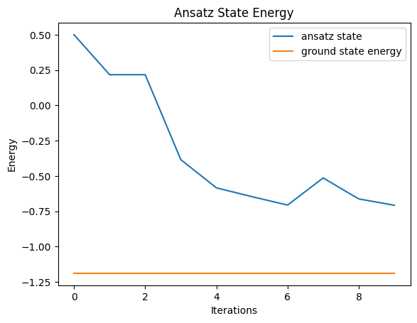
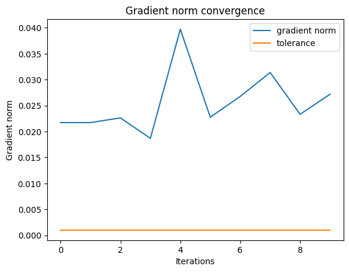
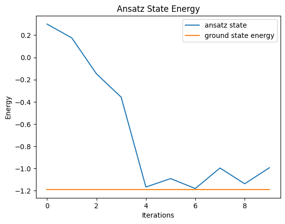
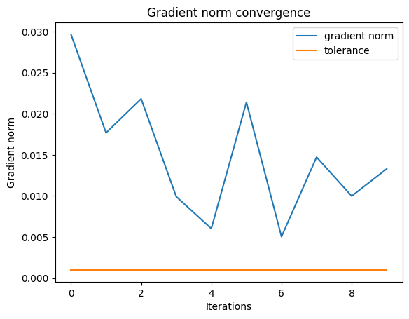

<Card title="View on GitHub" icon="github" href="https://github.com/Classiq/classiq-library/blob/main/algorithms/quantum_state_preparation/adapt_vqe/adapt_vqe.ipynb">
  Open this notebook in GitHub to run it yourself
</Card>

> The **Adaptive Derivative-Assembled Pseudo-Trotter Variational Quantum Eigensolver (ADAPT-VQE)** \[[1](#adapt-vqe)] is a variational hybrid algorithm, which constitutes an extension of the Variational Quantum Eigensolver (VQE) framework \[[2](#vqe)], that constructs problem-specific ansätze in a systematic and adaptive manner. Instead of relying on a fixed, heuristic circuit structure, ADAPT-VQE iteratively grows the state ansatz by selecting operators from a predefined pool based on their energy gradients with respect to the current variational state. At each iteration, the operator that yields the largest energy reduction is appended to the circuit and its parameters are reoptimized. This adaptive procedure significantly reduces the number of variational parameters and circuit depth, making ADAPT-VQE particularly well suited for near-term quantum hardware. Importantly, the algorithm is heuristic, leading to an approximate solution with no proven convergence guarantees.
>
> The algorithm treats the following problem:
>
> - **Input:** System Hamiltonian $H$, reference state $| \Psi_{\text{ref}}\rangle$ and an operator pool of anti-Hermitian operators ${\cal O} =\{O_1,\dots,O_M\}$.
> - **Output:** Approximation of the ground state and energy of $H$.
>
> **Complexity:** The major overhead generally comes from the evaluation of the elements of the energy gradient by repeated measurements of different observables. We therefore focus on the measurement complexity of the algorithm. The complexity depends on the chosen operator pool and classical optimization scheme. The total cost incorporates the two main components of the algorithm, (i) evaluating the energy gradient, and (ii) re-optimization of the current state-ansatz (corresponds to the standard VQE optimization). As a result, at each iteration step the cost is a sum of two terms, corresponding to the two algorithm components:

$$
\text{Cost}\approx \sum_{k = 1}^K (M \cdot C_G(n)+ N_{\text{opt}^{(k)}}\cdot C_E(n))~~,
$$
where $n$ is the number of qubits, $K$ is the total number of iterations, $C_G(n)$ is the measurement cost to estimate a single operator gradient, $N_{\text{opt}}^{(k)}$ is the number of optimizer steps at iteration $k$, and $C_E(n)$ is the measurement cost to estimate the energy once.

> ***
>
> **Keywords:**  Variational quantum algorithm, Chemistry, Optimization


## Overview

The following  notebook begins with a theoretical explanation of the algorithm. We then consider an explicit example, consisting of a system of four qubits.

The ADAPT-VQE algorithm is employed to evaluate the ground state energy and state. Following, we provide a modified version of the algorithm, and the results of both versions of the ADAPT-VQE algorithms are compared to the results obtained by the standard VQE algorithm.

The notebook concludes with a short summary and analysis of the algorithm and results.

## Algorithm steps

The algorithm builds and constructs the ansatz iteratively, one operator at a time, including only the most significant operators.

This approach builds a minimal, problem-specific ansatz, avoiding unnecessary parameters and allowing systematic improvement of the accuracy.

Similarly to VQE, the algorithms essentially reduce the circuit depth at the expense of measurements.

Initially, we define an operator pool ${\cal O}=\{O_1,O_2,\cdots,O_M\}$, containing a collection of anti-Hermitian operators that are employed in the ansatz construction.

We then follow the following procedure:

1. Initialize the qubits to the reference state, $| \Psi_{\text{ref}}\rangle$, and define the initial iterative state as $| \psi^{(0)}\rangle = | \Psi_{\text{ref}} \rangle$.
1. Prepare a trial quantum state with the current ansatz, denoted by $|\psi^{(k)}\rangle$, where $k=0,1,\dots$ corresponds to the iteration step number (initially set to zero).
1. Measure the commutator of the Hamiltonian with the operators of $\cal{O}$.

The expectation value corresponds to the partial derivative of the energy (in the $k$ iteration step) with respect to the coefficient of $O_j$:

$$
\frac{\partial E^{(k+1)}}{\partial \theta_j}\bigg |_{\theta_j=0} = \langle\psi^{(k)}|\partial_{\theta_i}e^{-\theta_i O_j} H e^{O_j \theta_j}|\psi^{(l)}\rangle {\bigg |}_{\theta_j = 0}+ \langle\psi^{(k)}|e^{-\theta_j O_j} H \partial_{\theta_j}e^{O_j \theta_j}|\psi^{(k)}\rangle {\bigg |}_{\theta_j = 0}
$$
$$
= {{\langle \psi^{(k)}|  [H, O_j] |\psi^{(k)}\rangle}}~.
$$
Hence, the measured commutation relations, provides the gradiant $\nabla_\vec{\theta} E$, where $\vec{\theta} = \{\theta_1,\dots,\theta_k\}^T~~.$
4\. If the magnitude of the gradient vector is below a certain threshold, stop. Otherwise, identify the operator with the largest gradient, and add it to the left end of the ansatz, with a new variational parameter. If $A_k\in \{O_i\}$ is an operator with the largest gradient on the step $k$, the update rule is given by

$$
|\psi^{(k+1)} \rangle = e^{\theta_k A_k} |\psi^{(k)}\rangle~~.
$$
Note, that the added operator still remains in the operator pool, therefore may be added again later on.
5\.

Conduct a VQE experiment to re-optimize all the ansatz parameters, $\{\theta_1,\dots,\theta_k\}$.
6\. Go back to step 3 and take $k\rightarrow k+1$.

The final optimized ansatz is of the form

$$
| \psi^{\text{ADAPT}}(\vec{\theta}) \rangle = \Pi_{n=1}^{K} e^{\theta_k A_k}|\psi_{\text{ref}}\rangle~~,
$$
where $K$ is the total number of iterations.

Note that when multiple quantum computers are available or sufficiently many qubits on a single computer, the preparation of the trial state and measurement of the commutation relations with the Hamiltonian can be performed in parallel, substantially reducing the runtime.

## Implementation of ADPT-VQE with Classiq

We consider a simple example, consisting of a four-qubit system.

The Hamiltonian and operator pool are defined in terms of the [SparsePauliOp](https://docs.classiq.io/latest/qmod-reference/api-reference/classical-types/?h=sparsepauliop#classiq.qmod.builtins.structs.SparsePauliOp) data structure, allowing for rapid and efficient algebraic computations.

For implementation convenience, we consider an operator pool of Hermitian operators (instead of anti-Hermitian as in the theoretical derivation). In this case, the ansatz stat is of the form

$$
| \psi^{\text{ADAPT}}(\vec{\theta}) \rangle = \Pi_{k=1}^{K} e^{-i\theta_k A_k}|\psi_{\text{ref}}\rangle~~,
$$
leading to the relation

$$
\frac{\partial E^{(k+1)}}{\partial \theta_j}\bigg |_{\theta_j=0} = -i{{\langle \psi^{(k)}|  [H, O_j] |\psi^{(k)}\rangle}}~~.
$$

We begin by uploading software packages and utility functions

```python
from functools import reduce
from operator import add, mul
from typing import Final, List, Tuple

import matplotlib.pyplot as plt
import numpy as np
import scipy

from classiq import *
```
#

## Utility functions

We employ utility functions form the [ADAPT-QAOA notebook](https://github.com/Classiq/classiq-library/blob/main/applications/optimization/adapt_qaoa/adapt_qaoa.ipynb), used to efficiently compute the commutation of Pauli strings with the `SparsePauilOp` data structure.

These are used in the computation of $\langle \psi^{(k)} | [H, O_j] | \psi^{(k)}\rangle$.

The functions perform the following tasks:

- `sorted_pauli_term` sorts Pauli terms according to the qubit's index.
- `commutator` receives two `SparsePauilOp`s and returns their commutator as a `SparsePauilOp`.
- `normalize_pauli_term` removes redundant Pauli identity operators, allowing for comparison and addition of two `SparsePauilOp`s.
- `collect_pauli_terms` adds up the coefficients of identical Pauli strings.

```python
# multiplication table of two Pauli matrices
# weight (imaginary), pauli_c = pauli_a * pauli_b
pauli_mult_table: list[list[Tuple[int, int]]] = [
    [(+0, Pauli.I), (+0, Pauli.X), (+0, Pauli.Y), (+0, Pauli.Z)],
    [(+0, Pauli.X), (+0, Pauli.I), (+1, Pauli.Z), (-1, Pauli.Y)],
    [(+0, Pauli.Y), (-1, Pauli.Z), (+0, Pauli.I), (+1, Pauli.X)],
    [(+0, Pauli.Z), (+1, Pauli.Y), (-1, Pauli.X), (+0, Pauli.I)],
]


def sorted_pauli_term(term: SparsePauliTerm) -> SparsePauliTerm:
    """
    Sort Pauli terms according to the qubit's index, e.g.,
    Pauli.X(2)*Pauli.Z(7)*Pauli.X(4) ==> Pauli.X(2)*Pauli.X(4)*Pauli.Z(7)
    """
    sorted_paulis = sorted(term.paulis, key=lambda p: p.index)
    return SparsePauliTerm(sorted_paulis, term.coefficient)


def commutator(ha: SparsePauliOp, hb: SparsePauliOp) -> SparsePauliOp:
    """
    Compute the commutator [ha, hb] = ha*hb - hb*ha, where ha and hb are SparsePauliOp objects.

Returns a SparsePauliOp representing the commutator.
    """
    n = max(ha.num_qubits, hb.num_qubits)
    commutation = SparsePauliOp([], n)

    for sp_term_a in ha.terms:
        for sp_term_b in hb.terms:
            parity = 1
            coefficient = 1.0
            msp = {p.index: p.pauli for p in sp_term_a.paulis}
            for p in sp_term_b.paulis:
                pauli_a = msp.get(p.index, Pauli.I)
                pauli_b = p.pauli
                weight, pauli = pauli_mult_table[pauli_a][pauli_b]
                if weight != 0:
                    parity = -parity
                    coefficient *= weight * 1j
                msp[p.index] = pauli
            # reconstruct pauli_string
            if parity != 1:
                # consider filtering identity terms, making sure the term is not empty
                pauli_term = (reduce(mul, (p(idx) for idx, p in msp.items()))).terms[0]
                pauli_term.coefficient = (
                    sp_term_a.coefficient * sp_term_b.coefficient * coefficient * 2
                )
                commutation.terms.append(pauli_term)
    return commutation


def normalize_pauli_term(spt: SparsePauliTerm, num_qubits=-1) -> SparsePauliTerm:
    """
    Remove redundant Pauli.I operators from a Pauli string
    making "normalized" strings comparable
    if num_qubits is set, an optional Pauli.I is added to ensure the length
    """
    if not spt.paulis:
        return spt

    npt = sorted_pauli_term(spt)

    paulis = []
    max_index = max_identity_index = -1
    if num_qubits > 0:
        max_identity_index = num_qubits - 1
    for ip in npt.paulis:
        if ip.pauli != Pauli.I:
            paulis.append(ip)
            max_index = max(max_index, int(ip.index))
        else:
            max_identity_index = max(max_identity_index, int(ip.index))

    if max_identity_index > max_index:
        paulis.append(IndexedPauli(Pauli.I, max_identity_index))

    npt.paulis = paulis
    return npt


def collect_pauli_terms(spo: SparsePauliOp) -> SparsePauliOp:
    """
    Collect the coefficient of identical Pauli strings
    for example: 1.5*"IXZI"-0.3*"IXXZ"+0.4*"IXZI", would result, in:
    1.9*"IXZI"-0.3*"IXXZ".

The function correctly ignores "I" when comparing strings, and sets the correct `num_qubits`
    terms with abs(coefficient)<TOLERANCE are dropped
    """
    TOLERANCE: Final[float] = 1e-10
    pauliterms = {}
    for term in spo.terms:
        npt = normalize_pauli_term(term, spo.num_qubits)
        key = tuple((ip.pauli, int(ip.index)) for ip in npt.paulis)
        pauliterms[key] = pauliterms.get(key, 0) + term.coefficient

    def single_qubit_op(pair: tuple[int, int]) -> SparsePauliOp:
        p_int, idx = pair
        term = SparsePauliTerm([IndexedPauli(Pauli(p_int), idx)], 1.0)
        return SparsePauliOp([term], num_qubits=idx + 1)

    paulistrings = []
    for key, coeff in pauliterms.items():
        if np.abs(coeff) < TOLERANCE:
            continue
        key_op = reduce(mul, (single_qubit_op(pair) for pair in key))
        paulistrings.append(coeff * key_op)

    if not paulistrings:
        return SparsePauliOp([], spo.num_qubits)

    # Sum all strings
    return reduce(add, paulistrings)
```

Next, we define the `grad_energy` function, which receives an operator, `op`, and Hamiltonian, `hamiltonian`, as `SpasePauilOp`s, and evaluates the absolute value of the expectation value of the commutation relation $\nabla_{\vec{\theta}} E_j=i\langle\psi^{(k)}|[H,O_j] |\psi^{(k)}\rangle~~,$ with respect to an execution session `es` and optimization parameters `params`.

```python
def grad_energy(
    op: SparsePauliOp,
    hamiltonian: SparsePauliOp,
    es: ExecutionSession,
    params: list[float],
    isFirstIteration: bool,
) -> float:
    h_op_comm = -1j * commutator(hamiltonian, op)
    if isFirstIteration:
        return es.estimate(h_op_comm).value
    return es.estimate(h_op_comm, {"params": params}).value
```
#

## Defining the Example System and Operator Pool

```python
# Hamiltonian
HAMILTONIAN = (
    -0.1 * Pauli.Z(0) * Pauli.Z(1)
    + 0.2 * Pauli.X(0)
    - 0.3 * Pauli.Z(1) * Pauli.Z(2)
    + 0.4 * Pauli.Z(1)
    - 0.1 * Pauli.Y(2) * Pauli.Z(3)
    + 0.2 * Pauli.Y(2)
    - 0.5 * Pauli.X(2) * Pauli.Z(3)
    + 0.2 * Pauli.Z(3)
    - 0.1 * Pauli.Y(1)
    + 0.3 * Pauli.I(0)
)

NUM_QUBITS = 4

# operators
single_x_ops = [Pauli.X(i) for i in range(4)]
single_y_ops = [Pauli.Y(i) for i in range(4)]
single_z_ops = [Pauli.Z(i) for i in range(4)]
xx_ops = [Pauli.X(i) * Pauli.X(j) for i in range(4) for j in range(4) if i != j]
yy_ops = [Pauli.Y(i) * Pauli.Y(j) for i in range(4) for j in range(4) if i != j]
zx_ops = [Pauli.Z(i) * Pauli.X(j) for i in range(4) for j in range(4) if i != j]
yx_ops = [Pauli.Y(i) * Pauli.X(j) for i in range(4) for j in range(4) if i != j]


# operator pool
op_pool = single_x_ops + single_y_ops + xx_ops + yy_ops + zx_ops + yx_ops

# Ground state energy
Hamiltonian_matrix = hamiltonian_to_matrix(HAMILTONIAN)
eigvals, eigvecs = np.linalg.eig(Hamiltonian_matrix)
ground_state_energy = np.real(np.min(eigvals))
```
```python

print(f"Ground state energy: {ground_state_energy}")
```
<Info>
  **Output:**

  

```

Ground state energy: -1.189380715792109
  

```
</Info>

#

## Main program

Before defining the ADAPT-VQE main function, we first define the `adapt_vqe_ansatz` function, which prepares the product state of phases, $|\psi^{\text{ADAPT}}(\vec{\theta})) \rangle = \Pi_{n=1}^{K} e^{-i\theta_k A_k}|\psi_{\text{ref}}\rangle$, defined by the optimization parameters, `thetas`, and the associated operators of the operator pool, $\cal O$.

The function builds the state, phase by phase, utilizing a helper function `adapt_layer`.

The reference state is taken to be

$$
|\psi_{\text{ref}}\rangle=|0^n \rangle~~,
$$
where $n=4$ is the number of qubits.

```python
@qfunc
def adapt_layer(idx: int, theta: CReal, qba: QArray):
    suzuki_trotter(op_pool[idx], theta, 1, 1, qba)


@qfunc
def adapt_vqe_ansatz(
    thetas: CArray[CReal],
    ansatz_ops: List[int],
    qba: QArray,
):
    n = thetas.len
    for i in range(n):
        adapt_layer(ansatz_ops_indicies[i], thetas[i], qba)
```

In order to obtain accurate evaluations of the observables and obtain deterministic results, we execute the quantum program on a state vector simulator.

```python
execution_preferences = ExecutionPreferences(
    backend_preferences=ClassiqBackendPreferences(
        backend_name=ClassiqSimulatorBackendNames.SIMULATOR_STATEVECTOR
    )
)
```

Following the algorithm steps, the main ADAPT-VQE performs an iterative calculation, each time adding another phase to the ansatz, thereby increasing the ansatz length, `k`, (starting from $k=1$) until the gradient converges and satisfies $|\nabla E|/k <$`tol`. If the procedure does not converge, we limit the number of iterations by `MAX_ITERATIONS`.

Each iteration begins with a preparation of the ansatz state $\Pi_{k=1}^{K} e^{-i\theta_k A_k}|\psi_{\text{ref}}\rangle$ for the current $K$.

The state preparation is performed by the first `main` quantum function, the quantum circuit is synthesized, and the optimization parameters are optimized by the `es` execution call and saved as a Python list in `params`.

The `params` parameters, along with the operators represented by the associated operator indices stored in the `ansatz_ops`, completely define the ansatz state.

Finally, the elements of the gradient, $\nabla_{\vec{\theta}}E$, are evaluated by the execution call using the `grad_energy` function. A convergence check is made; if the ansatz state converged or the number of iterations exceeds the limit, the iterative procedure is terminated; otherwise, the iteration cycle continues.

```python
# maximum number of iterations
MAX_ITERATIONS = 10

ansatz_ops_indicies: list[int] = []

# stores the gradient norms
gradient_norms = []

# stores the optimized parameters in each iteration
params_history = []

# ansatz state energy
energies = []

# circuit depths and widths
circuit_depths = []
circuit_widths = []

# gradient norm tolerance for stopping criterion
tol: Final[float] = 0.001

isFirstIteration = True
K = 0


for i in range(MAX_ITERATIONS):  # loop until gradient norm exceeds tolerance
    # (break-ing out of the loop) or the maximum number of iterations is reached
    # number of layers

    

## compute gradients of operator pool elements
    @qfunc
    def main(
        params: CArray[CReal, K],
        v: Output[QArray[QBit, NUM_QUBITS]],  # type: ignore
    ):
        allocate(v)
        # build the ansatz state only from the second iteration, otherwise return the reference state
        if i > 0:
            adapt_vqe_ansatz(params, ansatz_ops_indicies, v)

    if i == 0:
        params = 0

    qprog_grads = synthesize(main)

    with ExecutionSession(qprog_grads, execution_preferences) as es:
        gradients = np.array(
            [
                grad_energy(mp, HAMILTONIAN, es, params, isFirstIteration)
                for mp in op_pool
            ]
        )

    isFirstIteration = False

    # evaluate the scaled gradient norm
    scaled_gradient_norm = np.linalg.norm(gradients) / len(gradients)
    gradient_norms.append(scaled_gradient_norm)
    g_idx = np.argmin(gradients)
    ansatz_ops_indicies.append(g_idx)

    @qfunc
    def main(params: CArray[CReal, K], v: Output[QArray[QBit, NUM_QUBITS]]):
        allocate(v)
        adapt_vqe_ansatz(params, ansatz_ops_indicies, v)

    qprog = synthesize(main)

    circuit_widths.append(qprog.data.width)
    circuit_depths.append(qprog.transpiled_circuit.depth)

    K = len(ansatz_ops_indicies)
    # initial optimization parameters for the VQE re-optimization
    initial_params = np.linspace(0, 1, K).tolist()
    with ExecutionSession(qprog, execution_preferences) as es:
        optimization_results = es.minimize(
            cost_function=HAMILTONIAN,  # Hamiltonian problem
            initial_params={"params": initial_params},
            max_iteration=100,
        )
    params = optimization_results[-1][1]["params"]
    params_history.append(params)

    energy = optimization_results[-1][0]
    energies.append(energy)

    print(
        f"Iteration {i+1} completed; selected operator index: {g_idx}; partial derivative: {np.real(gradients[g_idx])};  current energy: {energy}"
    )

    # convergence check
    positive_gradient = np.all(gradients >= 0)
    if scaled_gradient_norm < tol:
        print(f"Gradient converged")
        break
    elif i == MAX_ITERATIONS - 1:
        print(f"Reached maximum number of iterations")
        break
    elif positive_gradient:
        print(f"Optimization reached a minima")
        break
```
<Info>
  **Output:**

  

```

Iteration 1 completed; selected operator index: 6; partial derivative: -1.0;  current energy: 0.5
  Iteration 2 completed; selected operator index: 6; partial derivative: -0.9999399950001001;  current energy: 0.21690481532906059
  Iteration 3 completed; selected operator index: 39; partial derivative: -0.1987502812343046;  current energy: 0.21690482371265463
  Iteration 4 completed; selected operator index: 20; partial derivative: -0.18783601422763072;  current energy: -0.38461421370076104
  Iteration 5 completed; selected operator index: 45; partial derivative: -0.1488457198127166;  current energy: -0.584353693801049
  Iteration 6 completed; selected operator index: 6; partial derivative: -0.7058905898639278;  current energy: -0.6468182838487597
  Iteration 7 completed; selected operator index: 50; partial derivative: -0.7628700586126583;  current energy: -0.7064952091448862
  Iteration 8 completed; selected operator index: 6; partial derivative: -1.0591603104849427;  current energy: -0.5143836023499864
  Iteration 9 completed; selected operator index: 50; partial derivative: -0.46278789280498533;  current energy: -0.6629077394236031
  Iteration 10 completed; selected operator index: 6; partial derivative: -0.5210529087183913;  current energy: -0.707848681231239
  Reached maximum number of iterations
  

```
</Info>

## Results and Discussion

Optimized ansatz summary

```python
min_energy_idx = np.argmin(np.array(energies))
optimal_energy_adapt_vqe = energies[min_energy_idx]
optimized_parameters_adapt_vqe = params_history[min_energy_idx]
optimized_op_idxs = ansatz_ops_indicies[: (min_energy_idx + 1)]
print(f"Optimized parameters: {np.round(optimized_parameters_adapt_vqe,4)}")
print(f"Optimized energy: {energies[min_energy_idx]}")
error_adapt_vqe = abs(
    100 * (optimal_energy_adapt_vqe - ground_state_energy) / ground_state_energy
)
print(f"Error: {np.round(error_adapt_vqe,1)}%")
```
<Info>
  **Output:**

  

```

Optimized parameters: [ 0.5848  0.4323  1.5439 -0.0094  0.8553  0.5134  1.7361  0.6801  0.7741
    0.9886]
  Optimized energy: -0.707848681231239
  Error: 40.5%
  

```
</Info>

#

## Energy graph

```python
plt.plot(energies, label="ansatz state")
plt.plot(np.array(len(energies) * [ground_state_energy]), label="ground state energy")
plt.xlabel("Iterations")
plt.ylabel("Energy")
plt.title("Ansatz State Energy")
plt.legend()
plt.show()
```


#

## Convergence graph

```python
plt.plot(gradient_norms, label="gradient norm")
plt.plot(np.array(len(gradient_norms) * [tol]), label="tolerance")
plt.xlabel("Iterations")
plt.ylabel("Gradient norm")
plt.title("Gradient norm convergence")
plt.legend()
plt.show()
```


#

## Circuit Information

The circuit width and depth are:

```python
# circuit width
print(f"circuit width: {circuit_widths[min_energy_idx]}")
# circuit depth
print(f"circuit depth: {circuit_widths[min_energy_idx]}")
```
<Info>
  **Output:**

  

```
circuit width: 4
  circuit depth: 4
  

```
</Info>

#

## Summary ADAPT-VQE Ansatz

For the chosen operator pool and classical optimization algorithm, the optimal ansatz state has $10$ parameters converged to a result $E_{\text{min}}= -0.707848681231239 $ The ansatz operators, indexed by their associated index in the operator pool: $[6,6,39,20,45,6,50,6,50,6]$.

The optimization parameters are:

$$
\vec{\theta} = [0.5848,  0.4323,  1.5439, -0.0094,  0.8553,  0.5134,  1.7361,  0.6801,  0.7741,
  0.9886]^T~~,

$$
The ansatz state can be constructed with a quantum circuit with a circuit width of $4$ and circuit depth of $4$.

## Modified ADAPT-VQE Ansatz

We provide a modified version of the algorithm, where the algorithm starts with a pre-optimization with respect to a chosen operator.

The algorithm showed improved results for the considered Hamiltonian and operator pool.

```python
# maximum number of iterations
MAX_ITERATIONS = 10

ansatz_ops_indicies: list[int] = []
# start with default parameter
ansatz_ops_indicies.append(10)
# stores the gradient norms
gradient_norms = []

# stores the minimal gradient element in each step
picked_derivatives = []

# ansatz state energy
energies = []

# parameter history
params_history = []

# circuit depths and widths
circuit_depths = []
circuit_widths = []

# gradient norm tolerance for stopping criterion
tol: Final[float] = 0.001

# in this variation of the algorithm, there is no need for a special treatment of the first iteration
isFirstIteration = False
for i in range(
    MAX_ITERATIONS
):  # loop until gradient norm exceeds tolerance (break-ing out of the loop)

    # number of layers (initially=1)
    K = len(ansatz_ops_indicies)

    # trace and history for analysis and plotting
    @qfunc
    def main(params: CArray[CReal, K], v: Output[QArray[QBit, NUM_QUBITS]]):
        allocate(v)
        adapt_vqe_ansatz(params, ansatz_ops_indicies, v)

    qprog = synthesize(main)
    circuit_widths.append(qprog.data.width)
    circuit_depths.append(qprog.transpiled_circuit.depth)

    # initial optimization parameters for the VQE re-optimization

    initial_params = np.linspace(0, 1, K).tolist()
    with ExecutionSession(qprog, execution_preferences) as es:
        optimization_results = es.minimize(
            cost_function=HAMILTONIAN,  # Hamiltonian problem
            initial_params={"params": initial_params},
            max_iteration=100,
        )

    params = optimization_results[-1][1]["params"]
    params_history.append(params)
    energy = optimization_results[-1][0]
    energies.append(energy)

    

## Compute gradients of operator pool elements
    @qfunc
    def main(
        params: CArray[CReal, K],
        v: Output[QArray[QBit, NUM_QUBITS]],  # type: ignore
    ):
        allocate(v)
        adapt_vqe_ansatz(params, ansatz_ops_indicies, v)

    qprog_grads = synthesize(main)

    with ExecutionSession(qprog_grads, execution_preferences) as es:
        gradients = np.array(
            [
                grad_energy(mp, HAMILTONIAN, es, params, isFirstIteration)
                for mp in op_pool
            ]
        )

    # evaluate the scaled gradient norm
    scaled_gradient_norm = np.linalg.norm(gradients) / len(gradients)
    gradient_norms.append(scaled_gradient_norm)

    # convergence check
    if scaled_gradient_norm < tol:
        print(f"Gradient converged")
        break
    elif i == MAX_ITERATIONS - 1:
        print(
            f"Iteration {i+1} completed; selected operator index: {g_idx}; partial derivative: {np.real(gradients[g_idx])}; current energy: {energy}"
        )
        print(f"Reacheck maximum number of iterations")
        break

    positive_gradient = np.all(gradients >= 0)
    if positive_gradient:
        print(f"Optimization reached a minima")
        break

    g_idx = np.argmin(gradients)
    picked_derivatives.append(gradients[g_idx])
    print(
        f"Iteration {i+1} completed; selected operator index: {g_idx}; partial derivative: {np.real(gradients[g_idx])};  current energy: {energy}"
    )

    ansatz_ops_indicies.append(g_idx)
```
<Info>
  **Output:**

  

```

Iteration 1 completed; selected operator index: 2; partial derivative: -0.5999999962884589;  current energy: 0.3000000018557699
  Iteration 2 completed; selected operator index: 4; partial derivative: -0.3999999999998979;  current energy: 0.17573593351317066
  Iteration 3 completed; selected operator index: 50; partial derivative: -0.6325932167777434;  current energy: -0.14787085528494587
  Iteration 4 completed; selected operator index: 42; partial derivative: -0.19999999893498477;  current energy: -0.3580880911310245
  Iteration 5 completed; selected operator index: 45; partial derivative: -0.19352465309641967;  current energy: -1.1671907029792876
  Iteration 6 completed; selected operator index: 39; partial derivative: -0.4118947318009357;  current energy: -1.091179784345635
  Iteration 7 completed; selected operator index: 21; partial derivative: -0.17398470514855552;  current energy: -1.1804771751890988
  Iteration 8 completed; selected operator index: 51; partial derivative: -0.36752952620020923;  current energy: -0.9960267166185478
  Iteration 9 completed; selected operator index: 4; partial derivative: -0.2149596926385491;  current energy: -1.1377253083959993
  Iteration 10 completed; selected operator index: 4; partial derivative: 0.0101716932596762; current energy: -0.993454636616868
  Reacheck maximum number of iterations
  

```
</Info>

## Results and Discussion

Ansatz state summary

```python
min_energy_idx = np.argmin(np.array(energies))
optimal_energy_modified_adapt_vqe = energies[min_energy_idx]
optimized_parameters_modified_adapt_vqe = params_history[min_energy_idx]
optimized_op_idxs = ansatz_ops_indicies[: (min_energy_idx + 1)]
print(f"Optimized parameters: {np.round(optimized_parameters_modified_adapt_vqe,4)}")
print(f"Optimized energy: {optimal_energy_modified_adapt_vqe}")
error_modified_adapt_vqe = abs(
    100
    * (optimal_energy_modified_adapt_vqe - ground_state_energy)
    / ground_state_energy
)
print(f"Error: {error_modified_adapt_vqe}%")
```
<Info>
  **Output:**

  

```

Optimized parameters: [ 1.5757  1.8084  0.7077  0.5244 -0.1062 -0.1099  1.5939]
  Optimized energy: -1.1804771751890988
  Error: 0.7485862587809506%
  

```
</Info>

#

## Energy graph

```python
plt.plot(energies, label="ansatz state")
plt.plot(np.array(len(energies) * [ground_state_energy]), label="ground state energy")
plt.xlabel("Iterations")
plt.ylabel("Energy")
plt.title("Ansatz State Energy")
plt.legend()
plt.show()
```


#

## Convergence graph

```python
plt.plot(gradient_norms, label="gradient norm")
plt.plot(np.array(len(gradient_norms) * [tol]), label="tolerance")
plt.xlabel("Iterations")
plt.ylabel("Gradient norm")
plt.title("Gradient norm convergence")
plt.legend()
plt.show()
```


#

## Circuit Information

The circuit width and depth are:

```python
# circuit width
print(f"circuit width: {circuit_widths[min_energy_idx]}")
# circuit depth
print(f"circuit depth: {circuit_depths[min_energy_idx]}")
```
<Info>
  **Output:**

  

```
circuit width: 4
  circuit depth: 19
  

```
</Info>

#

## Summary Modified ADAPT-VQE Ansatz

For the chosen operator pool and classical optimization algorithm, the optimal ansatz state has $7$ parameters converged to a result $E_{\text{min}}=-1.1804771$ The ansatz operators, indexed by their associated index in the operator pool:
$[2,4,50,42,45,39,21]$.

The optimization parameters are:

$$
\vec{\theta} = [1.5757,  1.8084,  0.7077, 0.5244, -0.1062, -0.1099,  1.5939]^T~~,
$$
The ansatz state can be constructed with a quantum circuit with a circuit width of $4$ and circuit depth of $19$.

## Comparison to the VQE algorithm

We now validate the results of the ADAPT-VQE by comparing them to the outcome of the standard VQE algorithm with ten optimization parameters ($K=10$), and picking the operator pool as the first ten even indices (the choice is arbitrary and independent of the Hamiltonian). We fix the ansatz state by considering a product form of phases,

$$
|\psi_{\text{VQE}}\rangle = \Pi_{k=1}^{K} e^{-i \theta_k O_k}|0^n\rangle~~,
$$
where $n=4$, for the presented test case.

The operators $\{O_k\}$ are determined by their operator pool indices in `vqe_ansatz_ops_indicies` and the associated parameters $\{\theta_k\}$ are optimized by applying the VQE algorithm.

```python
K = 10
modular_range = [i * 2 % len(op_pool) for i in range(K)]
modular_range = [0] + modular_range
vqe_ansatz_ops_indicies = modular_range


@qfunc
def main(params: CArray[CReal, K], v: Output[QArray[QBit, NUM_QUBITS]]):
    allocate(v)
    n = params.len
    adapt_vqe_ansatz(params, vqe_ansatz_ops_indicies, v)


qprog_vqe = synthesize(main)


with ExecutionSession(qprog_vqe) as es:
    vqe_optimization_results = es.minimize(
        cost_function=HAMILTONIAN,  # Hamiltonian problem
        initial_params={"params": [0] * K},
        max_iteration=100,
    )

vqe_minimal_energy = vqe_optimization_results[-1][0]
print(f"VQE minimal energy: {vqe_minimal_energy}")

# optimized thetas (rounded)
vqe_optimized_thetas = [vqe_optimization_results[-1][1]["params"]][0]
vqe_rounded_thetas = [
    round(vqe_optimized_thetas[i], 3) for i in range(len(vqe_optimized_thetas))
]
print(f"VQE optimized thetas: {vqe_rounded_thetas}")
print(
    f"error: {abs(100*(vqe_minimal_energy-ground_state_energy)/ground_state_energy)}%"
)
```
<Info>
  **Output:**

  

```

VQE minimal energy: -1.16826171875
  VQE optimized thetas: [1.676, -0.304, 0.885, 0.535, 1.502, 1.376, 0.022, -0.1, -0.008, 1.004]
  error: 1.7756296837252943%
  

```
</Info>

#

## Circuit Information

```python
# circuit width
print(f"circuit width: {qprog_vqe.data.width}")
# circuit depth
print(f"circuit depth: {qprog_vqe.transpiled_circuit.depth}")
```
<Info>
  **Output:**

  

```
circuit width: 4
  circuit depth: 26
  

```
</Info>

#

## Summary VQE Ansatz

The VQE ansatz is characterized by:

Optimized optimization parameters:

$$
\vec{\theta} = [1.536, -0.564, 1.271, 0.144, 1.94, 1.511, -0.215, -0.062, -0.391, 0.855]^T
$$
The ansatz operators are originally set (an arbitrary choice):  $[0,2,4,6,8,10,12,14,16,18]$.

and minimal energy $\langle\psi^{\text{VQE}}|H |\psi^{\text{VQE}}\rangle$: $-0.96816$.

The ansatz state can be constructed with a quantum circuit with a circuit width of $4$ and circuit depth of $26$.

## Analysis and Summary

By comparing the results obtained with ADAPT-VQE, modified ADAPT-VQE and standard VQE, and exact diagonalization, we observe that for an equal number of variational parameters, modified ADAPT-VQE converges to an ansatz that yields a more accurate estimate of the ground-state energy,
$E_{\text{g.s}}=  -1.189380715792109$. Specifically, modified ADAPT-VQE achieves an energy within approximately
$~0.7$% of the exact value. In contrast, the original ADAPT-VQE achieves a minimal energy which is $40$% above the true ground state energy.

The VQE ansatz - whose operator structure is chosen independently of the Hamiltonian - converges to an optimal energy that remains $18.6$% above the true ground-state energy.

The result highlights the potential of an ADAPT-VQE type ansatz, which is constructed iteratively based on the energy gradient, that is directly determined by the Hamiltonian under consideration.  As a consequence, only operators that most effectively lower the energy are included in the ansatz, leading to faster and more accurate convergence.

The ADAPT-VQE achieves a better accuracy, with a smaller circuit depth ($4$ and $19$ compared to $26$ for the VQE).

This contrasts with a general, Hamiltonian-independent ansatz, which lacks such targeted optimization and therefore exhibits inferior convergence performance and tends to require larger circuit depths to achieve the same accuracy.
Importantly, the large difference between the two variations of ADAPT-VQE proposed showcases that the algorithm doesn't guarantee better results. A clever choice of the operator pool and the initial state can potentially greatly improve the algorithm's performance.

## References

<a id="adapt-vqe">\[1]</a>: [Grimsley, H. R., Economou, S. E., Barnes, E., & Mayhall, N. J. (2019). An adaptive variational algorithm for exact molecular simulations on a quantum computer. Nature communications, 10(1), 3007.](https://arxiv.org/abs/1812.11173)

<a id="vqe">\[2]</a>: [Tilly, J., Chen, H., Cao, S., Picozzi, D., Setia, K., Li, Y., ... & Tennyson, J. (2022). The variational quantum eigensolver: a review of methods and best practices. Physics Reports, 986, 1-128.](https://arxiv.org/abs/2111.05176)