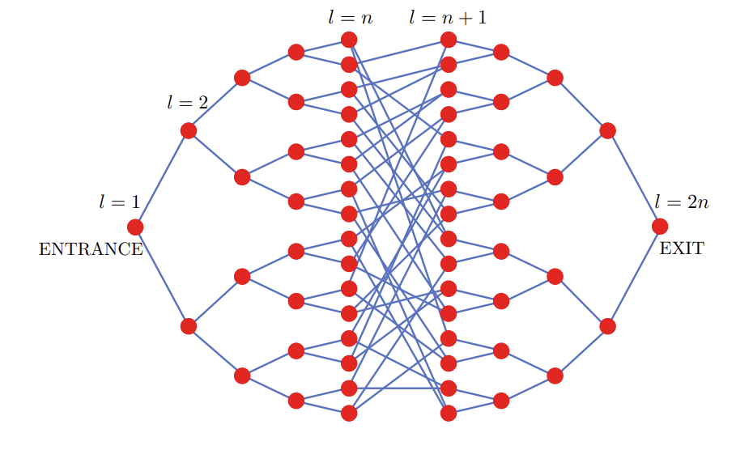
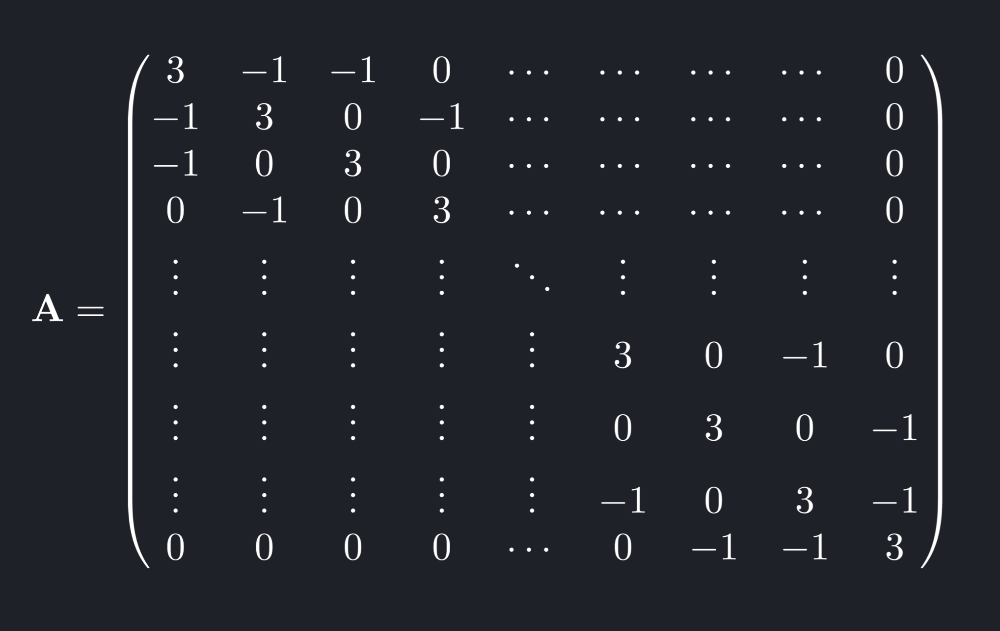
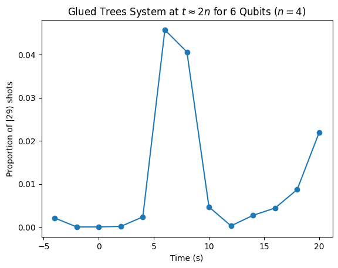
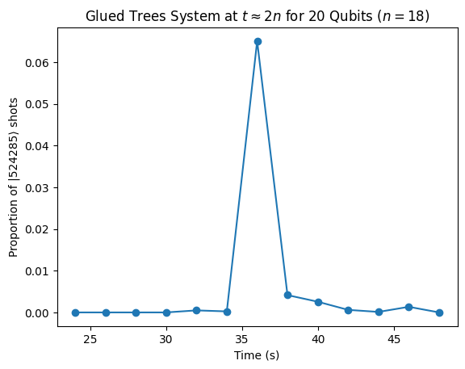

<Card title="View on GitHub" icon="github" href="https://github.com/Classiq/classiq-library/blob/main/algorithms/quantum_walks/glued_trees/glued_trees.ipynb">
  Open this notebook in GitHub to run it yourself
</Card>

Consider a network of two mirrored binary trees connected to each other, where the outermost nodes of each tree are connected to two random nodes in the other tree.

This structure has $2n$ columns and $2^{n+1}-2$ nodes in total, as shown in the diagram below.

Each node in the structure has a secret key in the form of a random bit string of size $2n$, and you are given oracular access to the network such that you can query a node using its key to get the keys of its neighbors.

Given the key of the entrance node, your goal is to find the key of the exit node as efficiently as possible.



If you play this game yourself or program an algorithm to do so, you quickly run into a major problem: since you don't know the specific nodes on the tree corresponding to the interior keys, you get lost in the structure once you reach the area between the two trees.

There is no way to guarantee a solution to this problem - using a classical computer - that doesn't require you to check every node in the worst case.

There is a way to solve this problem efficiently, however, on the order of the total number of *columns* of the structure instead of the nodes, using a quantum computer! This paper \[[1](#gluedtrees)] published in December 2023 describes a quantum approach to solving this algorithm by considering the structure as a system of coupled harmonic oscillators attached by springs. A quantum computer can use Hamiltonian simulation to simulate this classical system efficiently. If you apply a push to the oscillator representing the entrance node and treat the interactions between nodes as queries, you can "reach" the exit node (trigger a spike in its oscillatory movement) in time $2n$, offering linear efficiency as opposed to exponential efficiency.

While this notebook follows the algorithm described by the 2023 paper, it should be noted that this problem was first set out in this paper from October 2002 \[[2](#quantumwalk)].

```python
import json
import random

import matplotlib.pyplot as plt
import networkx as nx
import numpy as np

from classiq import *
```

## Quantum Algorithm

To model the columns of the glued trees structure as a system of coupled harmonic oscillators, we consider a matrix $\mathbf{A}$ of size $N \times N$ corresponding to the nodes of the glued trees structure, such that $N=2^{n+1}-2$ and $n$ is the number of columns of one of the two glued trees.

This matrix is defined as $\mathbf{A}:=3(\mathbf{1}_N)-A$, where $A$ is the adjacency matrix of the glued trees system using any ordering.

For demonstration purposes, we use a simple linear ordering of this adjacency matrix such that the entrance node is first and the exit node is last.

This matrix is symmetrical and takes the following shape:



As shown in further detail in the paper, we can define a block Hamiltonian $\mathbf{H}$ such that

$$
\mathbf{H} := -\begin{pmatrix}
\mathbf{0} & \mathbf{B} \\
\mathbf{B}^\dagger & \mathbf{0}
\end{pmatrix}
$$
where $\mathbf{B}$ is any $N \times M$ matrix such that $\mathbf{B}\mathbf{B}^\dagger=\mathbf{A}$. However, to use this matrix $\mathbf{H}$ for Hamiltonian simulation, it must have a size corresponding to a power of two, while $\mathbf{A}$ is size $N \times N$. We can deal with this by ensuring that $\mathbf{B}$ is size $N \times (N+4)$, so the resulting Hamiltonian $\mathbf{H}$ is a square matrix with side length $2N+4 = 2(2^{n+1}-2)+4 = 2^{n+2}$.

This means that a glued trees system with $n$ columns for one tree can be simulated using $n+2$ qubits.

In this notebook, we generate the matrix $\mathbf{A}$ by building the glued trees structure using the NetworkX library such that the nodes are labeled in order from the entrance to exit node and using the `nx.adjacency_matrix` function to generate an adjacency matrix using that ordering. We decompose $\mathbf{A}$ using [Cholesky decomposition](https://en.wikipedia.org/wiki/Cholesky_decomposition) to get a square matrix where its product with its conjugate transpose is equal to $\mathbf{A}$.

This matrix is the same size as $\mathbf{A}$, however, so we must pad it with four columns of zeroes to get our matrix $\mathbf{B}$ of size $N 	\times (N+4)$ so $\mathbf{H}$ has a size corresponding to a power of two. We can then create the block Hamiltonian with the proper size using $\mathbf{B}$ and $\mathbf{B}^\dagger$, and decompose it into a sum of Pauli strings using the Classiq built-in `matrix_to_pauli_operator` function.

The number of terms in the decomposition grows quickly with system size, and including all of them may produce circuits too deep for current quantum hardware. We therefore use two strategies depending on the system size.

For a 6-qubit example ($n=4, N=30$), the full Pauli decomposition yields only \~1088 terms, which is small enough to include all of them without truncation.

This gives a faithful Trotter approximation of the exact Hamiltonian.

For larger systems where truncation is necessary, the `crop_pauli_list` function selects the most representative terms using a diversity-weighted algorithm: 60% of the budget is filled by scanning qubit positions and selecting the largest-coefficient term for each Pauli type ($I$, $X$, $Y$, $Z$) at each position; the remaining 40% are the highest-magnitude unused terms.

This balances broad structural coverage of the Hamiltonian with its most energetically significant contributions.

For the 20-qubit example ($n=18, N=524286$), the full Pauli decomposition is computationally infeasible. Instead, the Hamiltonian is approximated by a structured extension of the 12-qubit Pauli list: each term is padded to 20 qubits by replicating the second-highest-qubit Pauli operator across the inserted qubit positions, reflecting a pattern observed in the dominant Pauli strings of larger systems.

```python
def _deserialize_sparse_op(data):
    return SparsePauliOp(
        terms=[
            SparsePauliTerm(
                paulis=[
                    IndexedPauli(pauli=Pauli[p["pauli"]], index=p["index"])
                    for p in t["paulis"]
                ],
                coefficient=t["coefficient"],
            )
            for t in data["terms"]
        ],
        num_qubits=data["num_qubits"],
    )


def crop_pauli_list(op, size):
    if size is None:
        return op
    terms = op.terms
    n = op.num_qubits
    if len(terms) <= size:
        return op

    def pauli_at(term, qubit):
        for ip in term.paulis:
            if ip.index == qubit:
                return ip.pauli
        return Pauli.I

    result = []
    idx = 0
    while len(result) < round(size * 0.6):
        for qubit in range(n):
            for k in terms:
                if (
                    pauli_at(k, qubit) == [Pauli.I, Pauli.X, Pauli.Y, Pauli.Z][idx % 4]
                    and k not in result
                ):
                    result.append(k)
                    break
            idx += 1
    for t in terms:
        if len(result) >= size:
            break
        if t not in result:
            result.append(t)
    return SparsePauliOp(terms=result, num_qubits=n)


def generate_pauli_list(qubits, rng=None, max_terms=200):
    rng = rng or random.Random()
    dim = qubits - 2
    T1 = nx.balanced_tree(2, dim - 1)
    T2 = nx.relabel_nodes(T1, lambda x: 2 ** (dim + 1) - 3 - x)
    T = nx.union(T1, T2)
    edges = {i: 0 for i in range(2**dim - 1, 2 ** (dim - 1) + 2**dim - 1)}
    for i in range(2 ** (dim - 1) - 1, 2**dim - 1):
        nums = [
            j for j in range(2**dim - 1, 2 ** (dim - 1) + 2**dim - 1) if edges[j] < 1
        ]
        if not nums:
            nums = [
                j
                for j in range(2**dim - 1, 2 ** (dim - 1) + 2**dim - 1)
                if edges[j] < 2
            ]
        vals = rng.sample(nums, k=2)
        for j in vals:
            edges[j] += 1
        T.add_edges_from([(i, vals[0]), (i, vals[1])])
    A = 3 * np.identity(2 ** (dim + 1) - 2) - np.array(
        nx.adjacency_matrix(T, nodelist=sorted(T.nodes())).todense()
    )
    B = np.hstack((np.linalg.cholesky(A), np.zeros((2 ** (dim + 1) - 2, 4))))
    H = -np.block(
        [
            [np.zeros((B.shape[0], B.shape[0])), B],
            [B.conj().T, np.zeros((B.shape[1], B.shape[1]))],
        ]
    )
    op = matrix_to_pauli_operator(H)
    return crop_pauli_list(
        SparsePauliOp(
            terms=sorted(op.terms, key=lambda t: abs(t.coefficient), reverse=True),
            num_qubits=op.num_qubits,
        ),
        max_terms,
    )


def pauli_str(qubits, recalculate=False, rng=None, max_terms=200):
    with open("glued_trees_cache.json", "r") as f:
        cache = json.load(f)
    if not recalculate and str(qubits) in cache:
        return _deserialize_sparse_op(cache[str(qubits)])
    if qubits > 12:
        base = generate_pauli_list(12, rng=rng, max_terms=max_terms)
        extra = qubits - base.num_qubits
        base_top = base.num_qubits - 1
        base_second = base.num_qubits - 2
        new_terms = []
        for term in base.terms:
            new_paulis = []
            for ip in term.paulis:
                if ip.index == base_top:
                    new_paulis.append(IndexedPauli(pauli=ip.pauli, index=qubits - 1))
                elif ip.index == base_second:
                    for q in range(base_second, base_second + extra + 1):
                        new_paulis.append(IndexedPauli(pauli=ip.pauli, index=q))
                else:
                    new_paulis.append(ip)
            new_terms.append(
                SparsePauliTerm(paulis=new_paulis, coefficient=term.coefficient)
            )
        return SparsePauliOp(terms=new_terms, num_qubits=qubits)
    return generate_pauli_list(qubits, rng=rng, max_terms=max_terms)
```

We are now ready to run our main execution function, `run_range`.

This function takes the number of qubits and synthesizes a single parametric circuit that performs Hamiltonian simulation $e^{-it\mathbf{H}}$ using the `suzuki_trotter` function.

The evolution time `t` is declared as a classical execution parameter (`CReal`), so the circuit is synthesized only once and then sampled at 13 different time values spanning $t \in [2n-12,\, 2n+12]$ in two-second intervals using `sample`.

The `num_shots` parameter is set to 8192 to give enough room for significant spikes in a state to be apparent, given the high number of total possible states.

The resulting quantum state can be written as follows:

$$
\begin{aligned}
|\psi(t)\rangle &\propto \begin{pmatrix}
\dot{\vec{x}}(t) \\
i\mathbf{B}^{\dagger} \vec{x}(t) 
\end{pmatrix} \\
\begin{pmatrix}
\dot{\vec{x}}(t) \\
i\mathbf{B}^{\dagger} \vec{x}(t) 
\end{pmatrix} &= e^{-it\mathbf{H}} \begin{pmatrix}
\dot{\vec{x}}(0) \\
i\mathbf{B}^{\dagger} \vec{x}(0) 
\end{pmatrix}
\end{aligned}
$$
where $\vec{x}(0)=(0,0,\dots,0)^T$ and $\dot{\vec{x}}(0)=(1,0,\dots,0)^T$ using a linear ordering of nodes.

Since the speed of the entrance node oscillator $|\dot{x}_1(t)|$ is represented by the quantum state $|0\rangle$ and should have probability 1 at $t=0$, there is no specific state preparation necessary for this system. It should also be noted that since our matrix $\mathbf{B}^\dagger$ is padded with four rows of zeroes, the highest four quantum states do not correspond to the displacement or speed of any oscillator.

This means that the quantum state representing the speed of the exit node oscillator $|\dot{x}_N(t)|$, which is what we are most interested in, corresponds to $|N-1\rangle=|2^{n+1}-3\rangle$. We track this particular quantum state around $t \approx 2n$, expecting a spike that represents the system of oscillators "reaching" the exit node from the initial push to the entrance node.

```python
# set global list for testing all qprogs in notebook
qprogs = []


def run_range(
    qubits, recalculate=False, rng=None, max_terms=200, order=1, repetitions=10
):
    pauli_op = pauli_str(qubits, recalculate, rng=rng, max_terms=max_terms)
    n = qubits - 2

    @qfunc
    def main(t: CReal, state: Output[QNum]) -> None:
        allocate(pauli_op.num_qubits, state)
        suzuki_trotter(
            pauli_op,
            evolution_coefficient=t,
            order=order,
            repetitions=repetitions,
            qbv=state,
        )

    qprog = synthesize(main)
    show(qprog)
    qprogs.append(qprog)

    time_points = [2 * n + i for i in range(-12, 13, 2)]
    results = sample(
        qprog, parameters=[{"t": float(t)} for t in time_points], num_shots=8192
    )
    return results, time_points
```

The following code segment runs `run_range` for 6 qubits ($n=4, N=30$), a small qubit size where the full Pauli decomposition has only \~1088 terms, making it feasible to include all of them without truncation (`max_terms=None`).

This gives a faithful Trotter simulation of the exact Hamiltonian.

The Pauli list is recalculated from scratch using a fixed random seed for reproducibility.

```python
results_6, times_6 = run_range(
    6, recalculate=True, rng=random.Random(0), max_terms=None
)
```
<Info>
  **Output:**

  

```

Quantum program link: https://platform.classiq.io/circuit/3EYCSfVF4fK9MU7zmWbIkDFJF5K
  

```
</Info>

<Info>
  **Output:**

  

```

Submitting job to simulator
  Job: https://platform.classiq.io/jobs/3fe33c93-8558-4822-94c0-5a11db42fa7c
  

```
</Info>

The following code segment runs `run_range` for 20 qubits ($n=18, N=524286$), a qubit size that is still simulatable but whose Pauli list cannot be generated in reasonable time and is therefore approximated by padding the 12-qubit Pauli list.

This instance of the function takes a few minutes to run if the cached Pauli list is used.

```python
results_20, times_20 = run_range(20)
```
<Info>
  **Output:**

  

```

Quantum program link: https://platform.classiq.io/circuit/3EYCchCF1VAmwe2t1mxfEZti0W7
  

```
</Info>

<Info>
  **Output:**

  

```

Submitting job to simulator
  Job: https://platform.classiq.io/jobs/0e55d061-f271-4958-9e9d-b0aab1d491ba
  

```
</Info>

We can now graph the results.

The `graph_results` function plots the proportion of shots for the qubit state $|N-1\rangle$ corresponding to $|\dot{x}_N(t)|$ for a given qubit size from $t=2n-12$ to $t=2n+12$:

```python
def graph_results(qubits, results, time_points):
    n = qubits - 2
    exit_state = 2 ** (n + 1) - 3
    data = [
        (
            df.loc[df["state"] == exit_state, "probability"].values[0]
            if (df["state"] == exit_state).any()
            else 0.0
        )
        for df in results
    ]
    plt.plot(time_points, data, "o-")
    plt.xlabel("Time (s)")
    plt.ylabel(f"Proportion of |{exit_state}⟩ shots")
    plt.title(
        r"Glued Trees System at $t \approx 2n$ for "
        + str(qubits)
        + r" Qubits ($n="
        + str(n)
        + r"$)"
    )
    plt.show()
```

The following code segment displays the graph for 6 qubits, using all Pauli terms with 10 Trotter repetitions.

The spike near $t \approx 2n = 8$ is indicative of the initial push to the entrance node "reaching" the exit node:

```python
graph_results(6, results_6, times_6)
```


The following code segment displays the graph for 20 qubits, a qubit size with an approximated Pauli list.

There is a clear spike at $t \approx 2n$ caused by the propagation from the entrance node:

```python
graph_results(20, results_20, times_20)
```


Because of the Pauli list cropping, you can also run the algorithm with reasonable accuracy on actual quantum hardware by specifying a backend in `sample`.

Perhaps the most interesting thing about the glued trees algorithm is that it is a relatively heavy case of using a quantum computer to gain an exponential advantage, usually requiring several executions at different time points to observe the intended result, but it can still execute effectively on present-day quantum hardware due to the Pauli list cropping. Suggestion: Try out the algorithm on both a simulator and quantum hardware for various qubit sizes.

## References

<a id="gluedtrees">\[1]</a> [Babbush, R., Berry, D. W., Kothari, R., Somma, R. D., and Wiebe, N. "Exponential quantum speedup in simulating coupled classical oscillators." Phys. Rev. X 13, 041041 (2023)](https://journals.aps.org/prx/pdf/10.1103/PhysRevX.13.041041).

<a id="quantumwalk">\[2]</a> [Childs, A. M., Cleve, R., Deotto, E., Farhi, E., Gutmann, S., and Spielman, D. A. "Exponential algorithmic speedup by a quantum walk." Proc. 35th ACM Symposium on Theory of Computing (STOC 2003), pp. 59-68](https://arxiv.org/pdf/quant-ph/0209131).