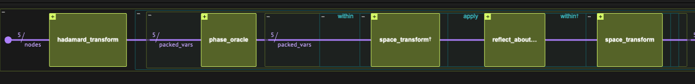
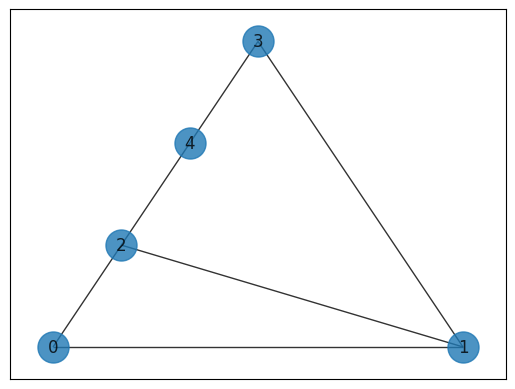
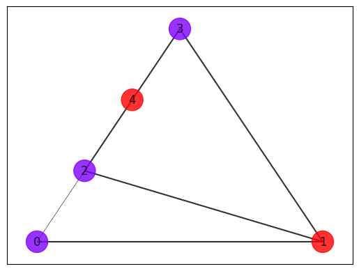

<Card title="View on GitHub" icon="github" href="https://github.com/Classiq/classiq-library/blob/main/algorithms/search_and_optimization/grover/grover.ipynb">
  Open this notebook in GitHub to run it yourself
</Card>

> **Grover's Search Algorithm**, introduced by Lov Grover in 1996 [\[1\]](#ref-gro96), is one of the canonical quantum algorithms. It provides a quadratic speedup for searching an unstructured database and is often considered alongside Shor's algorithm as a cornerstone of quantum computing. The search algorithm has applications in various fields, such as in [cybersecurity](https://github.com/Classiq/classiq-library/blob/main/applications/cybersecurity/whitebox_fuzzing/whitebox_fuzzing.ipynb).
>
> - **Input:** A Boolean function (oracle) $f: \{0,1\}^n \rightarrow \{0,1\}$ marking "solutions" among $N = 2^n$ possible items.
> - **Promise:** At least one marked element exists in the search space.
> - **Output:** With high probability, the algorithm outputs a marked element $x$ (i.e., $f(x) = 1$).
>
> **Complexity:** The algorithm requires $O(\sqrt{N})$ oracle queries to obtain the result, while the query complexity for classical search is $O(N)$.
>
> ***
>
> **Keywords:** Search and optimization, Unstructured search, Quadratic speedup, Amplitude amplification, Graph problems, SAT problems, Oracle/Query complexity.

Grover's Search algorithm starts with preparing the search space $|s\rangle$, and then repeats over a combination of two reflection operations:

$$
U_f|x\rangle = (-1)^{f(x)}|x\rangle \qquad \text{usually called an "Oracle", adds a minus phase to marked states, and}
$$
$$
U_s = 2|s\rangle\langle s|-1 \qquad \text{usually called a "Diffuser", reflects around the full search space.}
$$
The number of times we need to repeat the combination of these two reflections (sometimes called a "Grover Operator") depends on the number of solutions: for $k$ solutions in a search space of size $N$, we shall perform $r\sim \pi \sqrt{N/k}$ iterations. In practice, however, the number of solutions is often unknown. In that case, one can perform a [quantum counting algorithm](https://github.com/Classiq/classiq-library/blob/main/algorithms/amplitude_amplification_and_estimation/quantum_counting/quantum_counting.ipynb) prior to the search, or run the search algorithm repeatedly, with an increasing number of repetitions $r_i\sim \frac{\pi}{4} \sqrt{2^i}$  for $i=0,1,\dots$.

Both approaches do not affect the complexity of the search algorithm. In this notebook we take the second approach.

For a given problem, Grover's algorithm depends on  two functions, one for preparing the search space and another for applying the oracle, as well as on the number of repetitions.

Below we address two canonical search problems, a 3-SAT problem and a Max-Cut problem on a graph.  In this notebook we work with the `grover_operator` function, and define a classical postprocess function for iterating over different $r$ values and obtianing the marked states.

*Using the `phase_oracle` quantum function from the Classiq open-library together with the Qmod language for high-level problem definitions helps avoid low-level implementation details that are typically required on other platforms.*

***

***



<center>Layout of the Grover's Search Algorithm. The first block prepares the initial search space. Then, the Grover operator, comprised by four functions, is repeated $r$ times. The four functions are: the Oracle function, and additional three functions that implements the Diffuser.</center>

## Classical postprocess function

Below we define a function that runs a quantum program of the Grover's search algorithm, for an increasing number of repetitions, until a marked state is found.

```python
import numpy as np

from classiq import *
from classiq.qmod.symbolic import pi


def repeat_grover_until_success(
    grover_search_qprog, classical_formula, num_shots=1000, threshold=0.45, max_iter=4
):
    """
    Runs a grover_search_qprog with different powers, given by a CInt parameter `r`.
    """
    i = 0
    r_previous = None
    with ExecutionSession(
        grover_search_qprog, ExecutionPreferences(num_shots=num_shots)
    ) as es:
        while i < max_iter:
            r = int(np.ceil(np.pi / 4 * np.sqrt(2**i)))
            if r == r_previous:
                # skip duplicate r
                i += 1
                continue

            print(f"running Grover with {r} repetitions")
            res = es.sample({"r": r})

            for sample in res.parsed_counts:
                if (
                    classical_formula(**sample.state)
                    and sample.shots / num_shots > threshold
                ):
                    print(
                        f"Success! a solution was found with probability larger than {threshold}, using {r} repetitions"
                    )
                    return res, r

            r_previous = r
            i += 1
    print(
        f"Could not find a solution, try to in increase max_iter or decrease the threshold, returning last run."
    )
    return res, r
```

## Example: 3-SAT problem

The 3-SAT problem  \[<a href="#ref-3SAT">2</a>] is a famous $\text{NP-Complete}$ problem, a solution of which allows solving any problem in the complexity class $\text{NP}$. We treat two different 3-SAT problems, a small one and a larger one.

For illustration, we define a function for printing the truth table of SAT problems.

```python
import itertools


def print_truth_table(num_variables, boolean_func):
    variables = [f"x{i}" for i in range(num_variables)]
    combinations = list(itertools.product([0, 1], repeat=num_variables))

    header = "  ".join([f"{var:<5}" for var in variables]) + " | Result"
    print(header)
    print("-" * len(header))

    for combination in combinations:
        result = boolean_func(list(combination)) != 0  # pass as array
        values_str = "  ".join([f"{val:<5}" for val in combination])
        print(f"{values_str} | {result:<5}")
```

We start with a small problem:

#

## Small 3-SAT formula

We specify a 3-SAT formula in the so-called Conjunctive Normal Form (CNF), that requires a solution:

$$
(x_1 \lor x_2 \lor x_3) \land (\neg x_1 \lor x_2 \lor x_3) \land (\neg x_1 \lor \neg x_2 \lor \neg x_3) \land (\neg x_1 \lor \neg x_2 \lor x_3) \land (x_1 \lor x_2 \lor \neg x_3) \land (\neg x_1 \lor x_2 \lor \neg x_3)
$$

```python
NUM_VARIABLES = 3


def small_3sat_formula(x):
    return (
        (x[0] | x[1] | x[2])
        & (~x[0] | x[1] | x[2])
        & (~x[0] | ~x[1] | ~x[2])
        & (~x[0] | ~x[1] | x[2])
        & (x[0] | x[1] | ~x[2])
        & (~x[0] | x[1] | ~x[2])
    )
```

We can see that the formula has two possible solutions:

```python
print_truth_table(NUM_VARIABLES, small_3sat_formula)
```
<Info>
  **Output:**

  

```
x0     x1     x2    | Result
  ----------------------------
  0      0      0     | 0    
  0      0      1     | 0    
  0      1      0     | 1    
  0      1      1     | 1    
  1      0      0     | 0    
  1      0      1     | 0    
  1      1      0     | 0    
  1      1      1     | 0
  

```
</Info>

We define the Grover search model for finding the solution. To specify the model, we use the standard `phase_oracle` that transforms 'digital' oracle; i.e., $|x\rangle|0\rangle \rightarrow |x\rangle|f(x)\rangle$ to a phase oracle $|x\rangle \rightarrow (-1)^{f(x)}|x\rangle$.

The predicate that we pass to the phase oracle is simply given by the 3-CNF formula defined above.

```python
@qperm
def sat_oracle(x: Const[QArray], res: QBit):
    res ^= small_3sat_formula(x)


@qfunc
def main(r: CInt, x: Output[QArray[NUM_VARIABLES]]):
    allocate(x)
    hadamard_transform(x)

    power(
        r,
        lambda: grover_operator(
            lambda vars: phase_oracle(sat_oracle, vars), hadamard_transform, x
        ),
    )


qprog_small_3sat = synthesize(
    main, constraints=Constraints(optimization_parameter="width")
)
```
```python

show(qprog_small_3sat)
```
<Info>
  **Output:**

  

```

Quantum program link: https://platform.classiq.io/circuit/3FmT12Bt2vVDXbH5aXfVMN8YCz5
  

```
</Info>

We execute our repeat until success function:

```python
res_3_sat_small, r = repeat_grover_until_success(qprog_small_3sat, small_3sat_formula)
```
<Info>
  **Output:**

  

```
running Grover with 1 repetitions
  Success! a solution was found with probability larger than 0.45, using 1 repetitions
  

```
</Info>

We can see that a single iteration was needed to find solutions with high probability:

```python
n_solutions = 3
df = res_3_sat_small.dataframe
df_new = df.head(n_solutions).copy()
first_col = df.columns[0]
df_new["f(x)"] = df_new[first_col].apply(small_3sat_formula)
print("The quantum search result:")
df_new
```
<Info>
  **Output:**

  

```

The quantum search result:
  

```
</Info>

|   | x          | counts | probability | bitstring | f(x) |
| - | ---------- | ------ | ----------- | --------- | ---- |
| 0 | \[0, 1, 1] | 510    | 0.51        | 110       | 1    |
| 1 | \[0, 1, 0] | 490    | 0.49        | 010       | 1    |

#

## Large 3-SAT formula

We continue with a larger example:

```python
def large_3sat_formula(x):
    return (
        (x[1] | x[2] | x[3])
        & (~x[0] | x[1] | x[2])
        & (~x[0] | x[1] | ~x[2])
        & (~x[0] | ~x[1] | x[2])
        & (x[0] | ~x[1] | ~x[2])
        & (x[0] | ~x[1] | x[2])
        & (~x[0] | ~x[1] | ~x[3])
        & (~x[0] | ~x[1] | x[3])
        & (~x[1] | ~x[2] | ~x[3])
        & (x[1] | ~x[2] | x[3])
        & (x[0] | ~x[2] | x[3])
        & (x[0] | ~x[1] | ~x[3])
        & (~x[0] | ~x[1] | ~x[2])
    )


NUM_VARIABLES_LARGE = 4
print_truth_table(NUM_VARIABLES_LARGE, large_3sat_formula)
```
<Info>
  **Output:**

  

```
x0     x1     x2     x3    | Result
  -----------------------------------
  0      0      0      0     | 0    
  0      0      0      1     | 1    
  0      0      1      0     | 0    
  0      0      1      1     | 1    
  0      1      0      0     | 0    
  0      1      0      1     | 0    
  0      1      1      0     | 0    
  0      1      1      1     | 0    
  1      0      0      0     | 0    
  1      0      0      1     | 0    
  1      0      1      0     | 0    
  1      0      1      1     | 0    
  1      1      0      0     | 0    
  1      1      0      1     | 0    
  1      1      1      0     | 0    
  1      1      1      1     | 0
  

```
</Info>

The procedure is identical to the small use-case, just changing `small_3sat_formula` to `large_3sat_formula`.

```python
@qperm
def sat_oracle(x: Const[QArray], res: QBit):
    res ^= large_3sat_formula(x)


@qfunc
def main(r: CInt, x: Output[QArray[NUM_VARIABLES_LARGE]]):
    allocate(x)
    hadamard_transform(x)

    power(
        r,
        lambda: grover_operator(
            lambda vars: phase_oracle(sat_oracle, vars), hadamard_transform, x
        ),
    )


qprog_large_3sat = synthesize(
    main, constraints=Constraints(optimization_parameter="width")
)
show(qprog_large_3sat)
res_3_sat_large, r = repeat_grover_until_success(qprog_large_3sat, large_3sat_formula)
```
<Info>
  **Output:**

  

```

Quantum program link: https://platform.classiq.io/circuit/3FmT2Y3O7HtbYvfoHLxPyITUsa4
  running Grover with 1 repetitions
  running Grover with 2 repetitions
  Success! a solution was found with probability larger than 0.45, using 2 repetitions
  

```
</Info>

We can print the five most probable solutions:

```python
n_solutions = 5
df = res_3_sat_large.dataframe
df_new = df.head(n_solutions).copy()
first_col = df.columns[0]
df_new["f(x)"] = df_new[first_col].apply(large_3sat_formula)
df_new
```
|   | x             | counts | probability | bitstring | f(x) |
| - | ------------- | ------ | ----------- | --------- | ---- |
| 0 | \[0, 0, 0, 1] | 491    | 0.491       | 1000      | 1    |
| 1 | \[0, 0, 1, 1] | 445    | 0.445       | 1100      | 1    |
| 2 | \[0, 1, 0, 0] | 7      | 0.007       | 0010      | 0    |
| 3 | \[1, 0, 0, 0] | 6      | 0.006       | 0001      | 0    |
| 4 | \[1, 0, 1, 0] | 6      | 0.006       | 0101      | 0    |

We can see that the amplitude of the two "marked" solutions is amplified.

## Example: Graph Cut Search Problem

The "Maximum Cut Problem" (MaxCut)  \[<a href="#ref-MaxCatWiki">3</a>] is an example of a combinatorial optimization problem. It refers to finding a partition of a graph into two sets, such that the number of edges between the two sets is the maximum.

The MaxCut problem is defined as follows:
Given a graph $G=(V,E)$ with $|V|=n$ nodes and $E$ edges, a cut is defined as a partition of the graph into two complementary subsets of nodes.

The gaol is to find a cut where the number of edges between the two subsets is the maximum. We can represent a cut, and the number of its connecting edges as follows:

- $x\in \{0,1\}^n$ is a binary vector of size $n$ that represents a cut: assigning 0 and 1 to nodes in the first and second subsets, respectively.
- $C(x)=\sum_{(i,j)}x_i (1-x_j)+x_j (1-x_i)=\sum_{(i,j)}x_i \oplus x_j$ gives the number of connecting edges for a given cut.

The MaxCut problem cannot be cast directly into a Grover's search algorithm, as we task to find the maximum of a function, rather than some "marked" solutions.

One approach is to apply Grover's algorithms for formulas of the form $C(x)\geq T$, for some fixed value of $T$: We initialize a threshold
$T$, then run Grover's algorithm with an oracle that marks cuts with $C(x)\geq T$ to amplify promising candidates. If a better cut is found, we update
$T$ and repeat until no improvement is likely (or a preset budget is reached).

In this notebook we show a solution for a single instance of this procedure, i.e., taking one example with some value for $T$.

We initiate a specific graph whose maximum cut is 5:

```python
import networkx as nx

# Create graph
G = nx.Graph()
G.add_nodes_from([0, 1, 2, 3, 4])
G.add_edges_from([(0, 1), (0, 2), (1, 2), (1, 3), (2, 4), (3, 4)])
pos = nx.planar_layout(G)
nx.draw_networkx(G, pos=pos, with_labels=True, alpha=0.8, node_size=500)
```


Constructing a Grover's search algorithm is done in similar to the 3-SAT examples, we only require to define a predicate formula. In this example we set the cut size (the value of $T$) to 

4.

```python
CUT_SIZE = 4


# cut formulas
def is_cross_cut_edge(x1: int, x2: int) -> int:
    return x1 ^ x2


def cut(x):
    return sum(is_cross_cut_edge(x[node1], x[node2]) for (node1, node2) in G.edges)


def cut_predicate(cut_size, x):
    return cut(x) >= cut_size
```
```python

@qperm
def cut_oracle(cut_size: CInt, nodes: Const[QArray], res: QBit):
    res ^= cut_predicate(cut_size, nodes)


@qfunc
def main(r: CInt, nodes: Output[QArray[len(G.nodes)]]):
    allocate(nodes)
    hadamard_transform(nodes)

    power(
        r,
        lambda: grover_operator(
            lambda vars: phase_oracle(
                lambda vars, res: cut_oracle(CUT_SIZE, vars, res), vars
            ),
            hadamard_transform,
            nodes,
        ),
    )


qprog_max_cut = synthesize(
    main, constraints=Constraints(optimization_parameter="width")
)
show(qprog_max_cut)
```
<Info>
  **Output:**

  

```

Quantum program link: https://platform.classiq.io/circuit/3FmTDk5ei57GiYWKoUwNtUX3ZyI
  

```
</Info>

```python
# In this example we reduce the threshold, since typically, more than one solution is expected
res_max_cut, r = repeat_grover_until_success(
    qprog_max_cut, lambda nodes: cut_predicate(CUT_SIZE, nodes), threshold=0.1
)
```
<Info>
  **Output:**

  

```
running Grover with 1 repetitions
  Success! a solution was found with probability larger than 0.1, using 1 repetitions
  

```
</Info>

Upon printing the result, we see that our execution of Grover's algorithm successfully found the satisfying assignments for the input formula:

```python
n_solutions = 32
df = res_max_cut.dataframe
df_new = df.head(n_solutions).copy()
first_col = df.columns[0]
df_new["f(x)"] = df_new[first_col].apply(lambda x: cut_predicate(CUT_SIZE, x))
df_new
```
|    | nodes            | counts | probability | bitstring | f(x)  |
| -- | ---------------- | ------ | ----------- | --------- | ----- |
| 0  | \[0, 1, 0, 0, 1] | 105    | 0.105       | 10010     | True  |
| 1  | \[1, 0, 0, 1, 1] | 103    | 0.103       | 11001     | True  |
| 2  | \[1, 0, 0, 1, 0] | 101    | 0.101       | 01001     | True  |
| 3  | \[0, 1, 1, 1, 0] | 98     | 0.098       | 01110     | True  |
| 4  | \[0, 1, 1, 0, 1] | 98     | 0.098       | 10110     | True  |
| 5  | \[1, 0, 1, 1, 0] | 95     | 0.095       | 01101     | True  |
| 6  | \[0, 1, 1, 0, 0] | 94     | 0.094       | 00110     | True  |
| 7  | \[1, 1, 0, 0, 1] | 87     | 0.087       | 10011     | True  |
| 8  | \[1, 0, 0, 0, 1] | 86     | 0.086       | 10001     | True  |
| 9  | \[0, 0, 1, 1, 0] | 84     | 0.084       | 01100     | True  |
| 10 | \[0, 0, 1, 1, 1] | 5      | 0.005       | 11100     | False |
| 11 | \[1, 1, 0, 0, 0] | 4      | 0.004       | 00011     | False |
| 12 | \[0, 0, 0, 0, 1] | 4      | 0.004       | 10000     | False |
| 13 | \[1, 0, 0, 0, 0] | 3      | 0.003       | 00001     | False |
| 14 | \[1, 0, 1, 0, 0] | 3      | 0.003       | 00101     | False |
| 15 | \[0, 0, 0, 1, 0] | 3      | 0.003       | 01000     | False |
| 16 | \[0, 1, 0, 1, 0] | 3      | 0.003       | 01010     | False |
| 17 | \[1, 1, 0, 1, 0] | 3      | 0.003       | 01011     | False |
| 18 | \[0, 0, 0, 1, 1] | 3      | 0.003       | 11000     | False |
| 19 | \[0, 1, 0, 1, 1] | 3      | 0.003       | 11010     | False |
| 20 | \[0, 0, 0, 0, 0] | 2      | 0.002       | 00000     | False |
| 21 | \[0, 1, 0, 0, 0] | 2      | 0.002       | 00010     | False |
| 22 | \[1, 1, 1, 1, 0] | 2      | 0.002       | 01111     | False |
| 23 | \[0, 1, 1, 1, 1] | 2      | 0.002       | 11110     | False |
| 24 | \[0, 0, 1, 0, 0] | 1      | 0.001       | 00100     | False |
| 25 | \[1, 1, 1, 0, 0] | 1      | 0.001       | 00111     | False |
| 26 | \[1, 0, 1, 0, 1] | 1      | 0.001       | 10101     | False |
| 27 | \[1, 1, 1, 0, 1] | 1      | 0.001       | 10111     | False |
| 28 | \[1, 1, 0, 1, 1] | 1      | 0.001       | 11011     | False |
| 29 | \[1, 0, 1, 1, 1] | 1      | 0.001       | 11101     | False |
| 30 | \[1, 1, 1, 1, 1] | 1      | 0.001       | 11111     | False |

The satisfying assignments are \~100 times more probable than the unsatisfying assignments. We print the corresponding graph for one of them:

```python
result_parsed = df_new["nodes"][0]
```
```python

import matplotlib.pyplot as plt

edge_widths = [
    is_cross_cut_edge(
        int(result_parsed[i]),
        int(result_parsed[j]),
    )
    + 0.5
    for i, j in G.edges
]
node_colors = [int(c) for c in result_parsed]
nx.draw_networkx(
    G,
    pos=pos,
    with_labels=True,
    alpha=0.8,
    node_size=500,
    node_color=node_colors,
    width=edge_widths,
    cmap=plt.cm.rainbow,
)
```


## References

<a id="ref-gro96">\[1]</a>: [L. K. Grover, “A fast quantum mechanical algorithm for database search”, Proceedings of the 28th Annual ACM Symposium on Theory of Computing (STOC ’96), pp. 212–219, 1996.](https://dl.acm.org/doi/10.1145/237814.237866)

<a id="ref-3sat">\[2]</a>: [The 3-SAT problem](https://en.wikipedia.org/wiki/Boolean_satisfiability_problem#3-satisfiability)

<a id="ref-maxcutwiki">\[3]</a>: [The Maximum Cut problem](https://en.wikipedia.org/wiki/Maximum_cut)