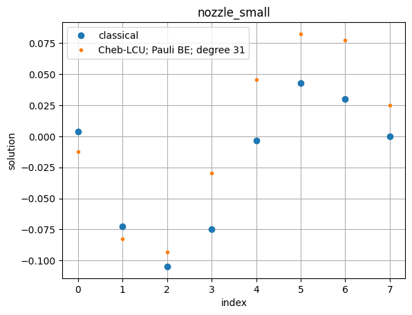
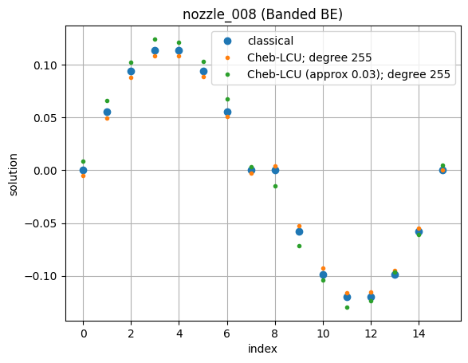

<Card title="View on GitHub" icon="github" href="https://github.com/Classiq/classiq-library/blob/main/applications/CFD/QLS_for_hybrid_solvers/qls_chebyshev_lcu.ipynb">
  Open this notebook in GitHub to run it yourself
</Card>

The code here can be integrated as part of a larger CFD solver, e.g., as in [qc-cfd repository](https://github.com/rolls-royce/qc-cfd/tree/main/1D-Nozzle).
In particular, instead of calling a classical solver, e.g., `x = sparse.linalg.spsolve(mat_raw_scr, b_raw)`, one can call the quantum solver `cheb_lcu_approx_solver(mat_raw_scr, b_raw,...)`.

We implemented two versions for block-encoding, one based on Pauli decomposition of the matrix, and another one based on decomposing the matrix to a finite set of diagonals.

```python
!pip install -qq "classiq[qsp]"
!pip install -qq "classiq[chemistry]"
```

We start with defining the functions.

First we define the quantum function `lcu_cheb_approx` that implements an approximated Chebyshev LCU quantum linear solver.

```python
import time

import matplotlib.pyplot as plt
import numpy as np
from banded_be import get_banded_diags_be
from cheb_utils import *
from classical_functions_be import get_svd_range
from pauli_be import get_pauli_be
from scipy import sparse

from classiq import *
from classiq.applications.qsp.qsp import poly_inversion

np.random.seed(53)

PAULI_TRIM_REL_TOL = 0.1
```
```python

from classiq.qmod.symbolic import pi


@qfunc
def my_reflect_about_zero(qba: QNum):
    reflect_about_zero(qba)
    phase(pi)


@qfunc
def walk_operator(
    block_enc: QCallable[QArray, QArray], block: QArray, data: QArray
) -> None:
    block_enc(block, data)
    my_reflect_about_zero(block)


@qfunc
def symmetrize_walk_operator(
    block_enc: QCallable[QNum, QArray], block: QNum, data: QArray
):
    my_reflect_about_zero(block)
    within_apply(
        lambda: block_enc(block, data),
        lambda: my_reflect_about_zero(block),
    )


@qfunc
def lcu_cheb_approx(
    powers: CArray[CInt],
    inv_coeffs: CArray[CReal],
    sp_error: CReal,
    block_enc: QCallable[QNum, QArray],
    mat_block: QNum,
    data: QArray,
    cheb_block: QArray,
) -> None:

    within_apply(
        lambda: inplace_prepare_state(inv_coeffs, sp_error, cheb_block),
        lambda: (
            Z(cheb_block[0]),
            repeat(
                powers.len,
                lambda i: control(
                    cheb_block[i],
                    lambda: power(
                        powers[i],
                        lambda: symmetrize_walk_operator(block_enc, mat_block, data),
                    ),
                ),
            ),
            my_reflect_about_zero(mat_block),
            walk_operator(block_enc, mat_block, data),
        ),
    )
```

Next, we define the `cheb_lcu_approx_solver` function, which gets the matrix and right-hand-side vector, applies the quantum solver, and returns the linear equation solution using a statevector simulator.

The solvers in this directory were developed in the framework of exploring their performance in hybrid CFD schemes.

For simplicity, it is assumed that all the properties of the matrices are known explicitly. In particular, we calculate its singular values for identifying the range in which we apply the inversion polynomial.

```python
def cheb_lcu_approx_solver(
    mat_raw_scr,
    b_raw,
    log_poly_degree,
    be_method="banded",
    approximation=0,
    preferences=Preferences(),
    constraints=Constraints(),
):

    scale = 0.5
    b_norm = np.linalg.norm(b_raw)
    b_normalized = b_raw / b_norm
    data_size = max(1, (len(b_raw) - 1).bit_length())

    if be_method == "pauli":
        data_size, block_size, be_scaling_factor, be_qfunc = get_pauli_be(mat_raw_scr)
    if be_method == "banded":
        data_size, block_size, be_scaling_factor, be_qfunc = get_banded_diags_be(
            mat_raw_scr
        )

    w_min, w_max = get_svd_range(mat_raw_scr / be_scaling_factor)
    poly_degree = 2 * (2**log_poly_degree - 1) + 1
    c, m = poly_inversion(poly_degree, 1 / w_min, "relative")
    pcoefs, poly_scale = scale * c / m, scale / m

    odd_coef = pcoefs[1::2]
    if approximation > 0:
        odd_coef = fit_linear_coeffs_for_cheb(pcoefs)

    lcu_size_inv = len(odd_coef).bit_length() - 1
    print(f"Chebyshev LCU size: {lcu_size_inv} qubits.")
    odd_coeffs_signs = np.sign(odd_coef)
    assert np.all(
        odd_coeffs_signs == np.where(np.arange(len(odd_coeffs_signs)) % 2 == 0, 1, -1)
    ), "Non alternating signs for odd coefficients"
    normalization_inv = sum(np.abs(odd_coef))
    print(f"Normalization factor for inversion: {normalization_inv}")
    prepare_probs_inv = (np.abs(odd_coef) / normalization_inv).tolist()

    @qfunc
    def main(
        matrix_block: Output[QNum[block_size]],
        data: Output[QNum[data_size]],
        inv_block: Output[QNum[lcu_size_inv]],
    ):
        allocate(inv_block)
        allocate(matrix_block)
        prepare_amplitudes(b_normalized.tolist(), 0, data)
        lcu_cheb_approx(
            powers=[2**i for i in range(lcu_size_inv)],
            inv_coeffs=prepare_probs_inv,
            sp_error=approximation,
            block_enc=lambda b, d: invert(lambda: be_qfunc(b, d)),
            mat_block=matrix_block,
            data=data,
            cheb_block=inv_block,
        )

    start_time_syn = time.time()
    qprog = synthesize(main, preferences=preferences, constraints=constraints)
    print("time to syn:", time.time() - start_time_syn)

    start_time_exe = time.time()
    sv = calculate_state_vector(qprog, filters={"matrix_block": 0, "inv_block": 0})
    proj_statevector = np.zeros(2**data_size, dtype=complex)
    proj_statevector[sv["data"].to_numpy()] = sv["amplitude"].to_numpy()
    indices = np.where(np.abs(proj_statevector) > 1e-13)[0]
    if len(indices) > 0:
        global_phase = np.angle(proj_statevector[indices[0]])
        resulting_state = np.real(proj_statevector / np.exp(1j * global_phase))
    else:
        resulting_state = np.zeros(2**data_size)
    print("time to exe:", time.time() - start_time_exe)

    normalization_factor = (be_scaling_factor * poly_scale) / b_norm / normalization_inv
    return resulting_state / normalization_factor, qprog
```
```python

import pathlib

path = (
    pathlib.Path(__file__).parent.resolve()
    if "__file__" in locals()
    else pathlib.Path(".")
)
```

We examine two usecases, starting with a small one, and applying a Pauli-LCU block encoding.

```python
mat_small_scr = sparse.load_npz(path / "matrices/nozzle_small_scr.npz")
b_small = np.load(path / "matrices/b_nozzle_small.npy")
print(f"nozzle_small: {mat_small_scr.shape[0]}x{mat_small_scr.shape[1]}")
```
<Info>
  **Output:**

  

```
nozzle_small: 8x8
  

```
</Info>

```python
prefs = Preferences()
```
```python

qsol_small_pauli, qprog_small_pauli = cheb_lcu_approx_solver(
    mat_small_scr,
    b_small,
    log_poly_degree=4,
    be_method="pauli",
    preferences=prefs,
    constraints=Constraints(optimization_parameter="width"),
)
show(qprog_small_pauli)
```
<Info>
  **Output:**

  

```
number of Paulis before/after trimming 24/20
  Chebyshev LCU size: 4 qubits.

Normalization factor for inversion: 0.7082716135217179
  

```
</Info>

<Info>
  **Output:**

  

```

Submitting job to simulator
  

```
</Info>

<Info>
  **Output:**

  

```
time to syn: 73.70448398590088
  

```
</Info>

<Info>
  **Output:**

  

```

Job: https://platform.classiq.io/jobs/b5381f72-ce8a-470c-b42e-220fb2bfcb12
  

```
</Info>

<Info>
  **Output:**

  

```
time to exe: 17.767388105392456
  Quantum program link: https://platform.classiq.io/circuit/3Dt1koIunNqabP53yYwcvdon8Cn
  

```
</Info>

We plot the solution vector, and compare to the expected classical result:

```python
expected_small = np.linalg.solve(mat_small_scr.toarray(), b_small)
ext_idx = np.argmax(np.abs(expected_small))
correct_sign = np.sign(expected_small[ext_idx]) / np.sign(qsol_small_pauli[ext_idx])
qsol_small_pauli *= correct_sign
plt.plot(expected_small, "o", label="classical")
plt.plot(qsol_small_pauli, ".", label=f"Cheb-LCU; Pauli BE; degree {2*2**4-1}")
plt.title("nozzle_small")
plt.xlabel("index")
plt.ylabel("solution")
plt.legend()
plt.grid(True)
plt.show()
```


```python
assert np.linalg.norm(qsol_small_pauli - expected_small) < 0.2
```

Next, we move to a larger problem. In a hybrid algorithm, we can relax some of the synthesis preferences to obtain the result a faster (for example, we can set `debug_mode=False` as we can skip the visualization of the quantum program).

For the larger usecase we work with the Banded Diagonals block-encoding. We compare the approximated version of the solver to the exact one.

```python
mat_008_scr = sparse.load_npz(path / "matrices/nozzle_008_mat.npz")
b_008 = np.load(path / "matrices/nozzle_008_b.npy")
print(f"nozzle_008:   {mat_008_scr.shape[0]}x{mat_008_scr.shape[1]}")
```
<Info>
  **Output:**

  

```
nozzle_008:   16x16
  

```
</Info>

```python
prefs = Preferences(
    transpilation_option="none",
    optimization_level=0,
    debug_mode=False,
    qasm3=True,
)
```
```python

qsol_008_banded, qprog_008_banded = cheb_lcu_approx_solver(
    mat_008_scr,
    b_008,
    log_poly_degree=7,
    be_method="banded",
    preferences=prefs,
    constraints=Constraints(optimization_parameter="width"),
)
```
<Info>
  **Output:**

  

```

Chebyshev LCU size: 7 qubits.

Normalization factor for inversion: 0.8180186976736218
  

```
</Info>

<Info>
  **Output:**

  

```

Submitting job to simulator
  

```
</Info>

<Info>
  **Output:**

  

```
time to syn: 48.63558340072632
  

```
</Info>

<Info>
  **Output:**

  

```

Job: https://platform.classiq.io/jobs/3a7ef91e-b24f-4f49-bebb-b7e9fecf2d8e
  

```
</Info>

<Info>
  **Output:**

  

```
time to exe: 70.26255297660828
  

```
</Info>

```python
SP_APPROX_BOUND = 0.03
qsol_008_banded_approx, qprog_008_banded_approx = cheb_lcu_approx_solver(
    mat_008_scr,
    b_008,
    log_poly_degree=7,
    be_method="banded",
    approximation=SP_APPROX_BOUND,
    preferences=prefs,
    constraints=Constraints(optimization_parameter="width"),
)
```
<Info>
  **Output:**

  

```
linear fit parameters: slope = -0.00010397734302726349, b= 0.014094618961514994
  Chebyshev LCU size: 7 qubits.

Normalization factor for inversion: 0.9589833829483215
  

```
</Info>

<Info>
  **Output:**

  

```

Submitting job to simulator
  

```
</Info>

<Info>
  **Output:**

  

```
time to syn: 48.173218727111816
  

```
</Info>

<Info>
  **Output:**

  

```

Job: https://platform.classiq.io/jobs/9ab42c87-977a-4d4f-a5c8-e5841d5c9eaa
  

```
</Info>

<Info>
  **Output:**

  

```
time to exe: 71.8209617137909
  

```
</Info>

```python
expected_008 = np.linalg.solve(mat_008_scr.toarray(), b_008)
ext_idx = np.argmax(np.abs(expected_008))
correct_sign = np.sign(expected_008[ext_idx]) / np.sign(qsol_008_banded[ext_idx])
qsol_008_banded *= correct_sign
plt.plot(expected_008, "o", label="classical")
plt.plot(qsol_008_banded, ".", label=f"Cheb-LCU; degree {2*2**7-1}")
correct_sign = np.sign(expected_008[ext_idx]) / np.sign(qsol_008_banded_approx[ext_idx])
qsol_008_banded_approx *= correct_sign
plt.plot(
    qsol_008_banded_approx,
    ".",
    label=f"Cheb-LCU (approx {SP_APPROX_BOUND}); degree {2*2**7-1}",
)
plt.title("nozzle_008 (Banded BE)")
plt.xlabel("index")
plt.ylabel("solution")
plt.legend()
plt.grid(True)
plt.show()
```


```python
assert np.linalg.norm(qsol_008_banded - expected_008) < 0.1
assert np.linalg.norm(qsol_008_banded_approx - expected_008) < 0.1
```