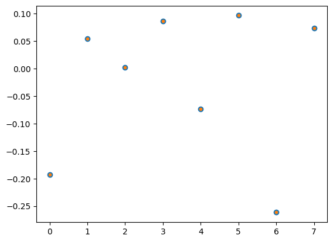
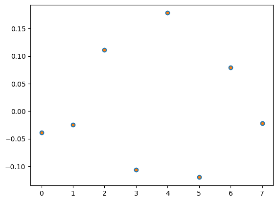
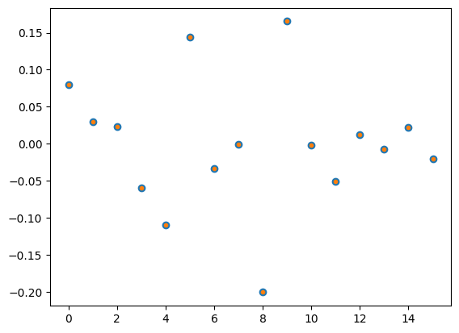
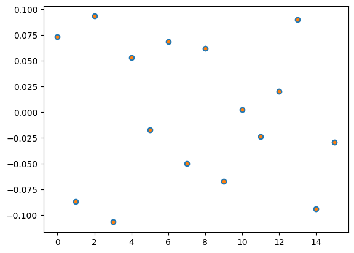

<Card title="View on GitHub" icon="github" href="https://github.com/Classiq/classiq-library/blob/main/applications/CFD/QLS_for_hybrid_solvers/verify_block_encoding.ipynb">
  Open this notebook in GitHub to run it yourself
</Card>

This notebook verifies the various block encoding, whose code are given in this directory.

The matrix input is assumed to be a sparse matrix. We verify the following quantum functions for block encoding:

1. Prepare and Select for Pauli decomposition of the matrix.

The Select block is implemented with Gray code technique.
1. Banded diagonal block encoding, according to Ref.

For both block encoding we construct a symmetric and non-symmetric versions.

```python
!pip install -qq -U "classiq[qsp]"
!pip install -qq "classiq[chemistry]"
```
```python

import matplotlib.pyplot as plt
import numpy as np
from banded_be import *
from classical_functions_be import get_projected_state_vector
from pauli_be import *
from scipy import sparse

from classiq import *

np.random.seed(53)
```

We define a generic function for verifying block-encoding qfuncs:

```python
def get_be_state(rhs_vec, be_qfunc, block_size, data_size):
    """
    Apply a block-encoding qfunc to an initial state and return the post-selected output.

Parameters
    ----------
    rhs_vec : list[real]
        Amplitudes of the initial data state |\psi>.

Length must be 2**data_size.
    be_qfunc : qfunc
        A Qmod qfunc with signature be_qfunc(block: QNum, data: QNum) that applies
        the block-encoding for the matrix A/s.
    block_size : int
        Number of qubits in the block variable.
    data_size : int
        Number of qubits in the data variable.

Returns
    -------
    array
        The post-selected data variable state equal to (A/s)|\psi>, obtained
        by projecting the block register onto 0 after applying the block encoding.
    qprog
        Thr resulting quantum program
    """

    @qfunc
    def main(
        data: Output[QNum[data_size]],
        block: Output[QNum[block_size]],
    ):

        allocate(block)
        prepare_amplitudes(rhs_vec, 0.0, data)
        be_qfunc(block, data)

    qprog = synthesize(main, preferences=Preferences(timeout_seconds=2000))
    # Post-select block == 0 on the statevector simulator.
    results = calculate_state_vector(qprog, filters={"block": 0})
    resulting_state = get_projected_state_vector(results, "data", data_size)
    return resulting_state, qprog
```
```python

def verify_by_plot(mat, rhs, be_factor, qsol):
    # Plot quantum solution vs expected ine
    expected_sol = (mat @ rhs) / be_factor
    plt.plot(expected_sol, "o")
    ext_idx = np.argmax(np.abs(expected_sol))
    correct_sign = np.sign(expected_sol[ext_idx]) / np.sign(qsol[ext_idx])
    qsol *= correct_sign
    plt.plot(qsol, ".")

    return expected_sol
```

Test a specific matrix

```python
import pathlib

path = (
    pathlib.Path(__file__).parent.resolve()
    if "__file__" in locals()
    else pathlib.Path(".")
)
```
```python

mat_name = "nozzle_small_scr"
matfile = "matrices/" + mat_name + ".npz"
mat_raw_scr = sparse.load_npz(path / matfile)
```

## Block encoding of non-Hermitiam matrices (for QSVT solver)

#

## Pauli block-encoding

```python
rval = mat_raw_scr.data
col = mat_raw_scr.indices
rowstt = mat_raw_scr.indptr
nr = mat_raw_scr.shape[0]

data_size = int(np.log2(nr))

# decompose to Paulis
paulis_list, transform_matrix = initialize_paulis_from_csr(
    rowstt, col, data_size, to_symmetrize=False
)
qubit_op = eval_pauli_op(paulis_list, transform_matrix, rval)
qubit_op.compress(1e-12)
hamiltonian = of_op_to_cl_op(qubit_op)

# Calculate scaling factor and block size
be_scaling_factor = sum([np.abs(term.coefficient) for term in hamiltonian.terms])
block_size = max(1, (len(hamiltonian.terms) - 1).bit_length())

rand_bvec = 1 - 2 * np.random.rand(2**data_size)
rand_bvec = (rand_bvec / np.linalg.norm(rand_bvec)).tolist()
hamiltonian = hamiltonian * (1 / be_scaling_factor)


# Define block encoding function
@qfunc
def block_encode_pauli(block: QNum, data: QNum):
    lcu_paulis_graycode(hamiltonian.terms, data, block)


qsol, qprog_pauli_be = get_be_state(
    rand_bvec, block_encode_pauli, block_size, data_size
)
show(qprog_pauli_be)
```
<Info>
  **Output:**

  

```

Quantum program link: https://platform.classiq.io/circuit/37T194tII0d7o0gv7lmtvsIhT81
  

```
</Info>

```python
expected_sol = verify_by_plot(mat_raw_scr, rand_bvec, be_scaling_factor, qsol)
assert np.linalg.norm(qsol - expected_sol) < 1e-10
```


#

## Banded diagonals block-encoding

```python
# Get diagonal properties
offsets, diags, diags_maxima, prepare_norm = get_be_banded_data(mat_raw_scr)

data_size = int(np.ceil(np.log2(len(diags[0]))))
s_size = int(np.ceil(np.log2(len(offsets))))

# Calculate scaling factor and block size
block_size = s_size + 1
be_scaling_factor = prepare_norm


# Define block encoding function
@qfunc
def block_encode_banded_matrix(block: QNum, data: QNum):
    block_encode_banded(
        offsets=offsets, diags=diags, prep_diag=diags_maxima, block=block, data=data
    )


rand_bvec = 1 - 2 * np.random.rand(2**data_size)
rand_bvec = (rand_bvec / np.linalg.norm(rand_bvec)).tolist()


qsol, qprog_banded_be = get_be_state(
    rand_bvec, block_encode_banded_matrix, block_size, data_size
)
show(qprog_banded_be)
```
<Info>
  **Output:**

  

```

Quantum program link: https://platform.classiq.io/circuit/37T1AUJg5LXloVGSyrzhGapt3AC
  

```
</Info>

```python
expected_sol = verify_by_plot(mat_raw_scr, rand_bvec, be_scaling_factor, qsol)
assert np.linalg.norm(qsol - expected_sol) < 1e-10
```


## Block encoding of Hermitia matrices (for LCU Chebyshev solver)

#

## Pauli block-encoding

```python
rval = mat_raw_scr.data
col = mat_raw_scr.indices
rowstt = mat_raw_scr.indptr
nr = mat_raw_scr.shape[0]

data_size = int(np.log2(nr))

# decompose to Paulis
paulis_list, transform_matrix = initialize_paulis_from_csr(
    rowstt, col, data_size, to_symmetrize=True
)
data_size += 1  # in the symmetric case the data size is increased by 1

qubit_op = eval_pauli_op(paulis_list, transform_matrix, rval)
qubit_op.compress(1e-12)
hamiltonian = of_op_to_cl_op(qubit_op)

# Calculate scaling factor and block size
be_scaling_factor = sum([np.abs(term.coefficient) for term in hamiltonian.terms])
block_size = max(1, (len(hamiltonian.terms) - 1).bit_length())

rand_bvec = 1 - 2 * np.random.rand(2**data_size)
rand_bvec = (rand_bvec / np.linalg.norm(rand_bvec)).tolist()
hamiltonian = hamiltonian * (1 / be_scaling_factor)


# Define block encoding function
@qfunc
def block_encode_pauli(block: QNum, data: QNum):
    lcu_paulis_graycode(hamiltonian.terms, data, block)


qsol, qprog_pauli_sym_be = get_be_state(
    rand_bvec, block_encode_pauli, block_size, data_size
)
show(qprog_pauli_sym_be)
```
<Info>
  **Output:**

  

```

Quantum program link: https://platform.classiq.io/circuit/37T1ClQiOA8YDfpBcdJe8Wyq4cY
  

```
</Info>

```python
mat_raw = mat_raw_scr.toarray()
mat_sym = np.block(
    [
        [np.zeros([nr, nr]), np.transpose(mat_raw)],
        [mat_raw, np.zeros([nr, nr])],
    ]
)
expected_sol = verify_by_plot(mat_sym, rand_bvec, be_scaling_factor, qsol)
assert np.linalg.norm(qsol - expected_sol) < 1e-10
```


#

## Banded diagonal block-encoding

```python
offsets, diags, diags_maxima, prepare_norm = get_be_banded_data(mat_raw_scr)

data_size = int(np.ceil(np.log2(len(diags[0])))) + 1
s_size = int(np.ceil(np.log2(len(offsets))))

# Calculate scaling factor and block size
block_size = s_size + 3
be_scaling_factor = 2 * prepare_norm


# Define block encoding function
@qfunc
def block_encode_banded_matrix(block: QNum, data: QNum):
    block_encode_banded_sym(
        offsets=offsets, diags=diags, prep_diag=diags_maxima, block=block, data=data
    )


rand_bvec = 1 - 2 * np.random.rand(2**data_size)
rand_bvec = (rand_bvec / np.linalg.norm(rand_bvec)).tolist()


qsol, qprog_banded_sym_be = get_be_state(
    rand_bvec, block_encode_banded_matrix, block_size, data_size
)
show(qprog_banded_sym_be)
```
<Info>
  **Output:**

  

```

Quantum program link: https://platform.classiq.io/circuit/37T1F9ZCWg4Jvvd8k9exfSZJv7p
  

```
</Info>

```python
mat_raw = mat_raw_scr.toarray()
raw_size = 2 ** (data_size - 1)
mat_sym = np.block(
    [
        [np.zeros([raw_size, raw_size]), np.transpose(mat_raw)],
        [mat_raw, np.zeros([raw_size, raw_size])],
    ]
)
expected_sol = verify_by_plot(mat_sym, rand_bvec, be_scaling_factor, qsol)
assert np.linalg.norm(qsol - expected_sol) < 1e-10
```
