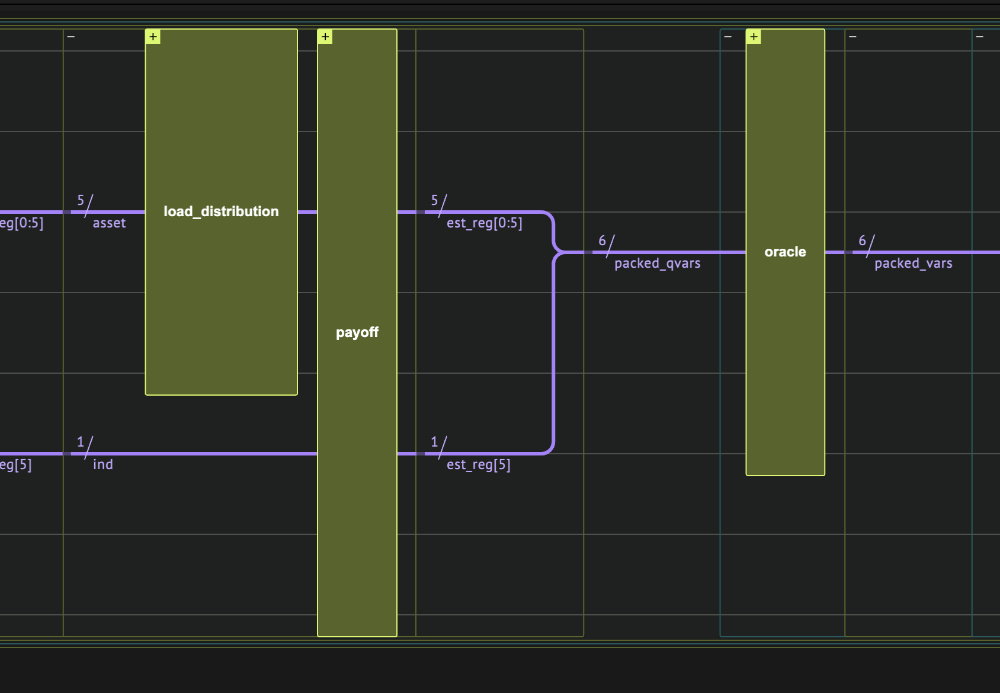
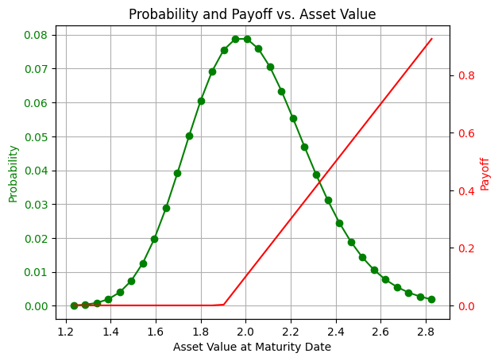

<Card title="View on GitHub" icon="github" href="https://github.com/Classiq/classiq-library/blob/main/applications/finance/option_pricing/option_pricing.ipynb">
  Open this notebook in GitHub to run it yourself
</Card>

In finance models it is often interesting to calculate the average of a function of a given probability distribution ($E[f(x)]$).

The most popular method to estimate the average is Monte Carlo \[[1](#mcmf)] due to its flexibility and ability to generically handle stochastic parameters.

Classical Monte Carlo methods, however, generally require extensive computational resources to provide an accurate estimation.
By leveraging the laws of quantum mechanics, a quantum computer may provide novel ways to solve computationally intensive financial problems, such as risk management, portfolio optimization, and option pricing.

The core quantum advantage of several of these applications is the Amplitude Estimation algorithm \[[2](#aea)], which can estimate a parameter with a
convergence rate of $\Omega(1/M^{1/2})$, compared to $\Omega(1/M)$ in the classical case, where $M$ is the number of Grover iterations in the quantum case and the number of the Monte Carlo samples in the classical case.

This represents a theoretical quadratic speed-up of the quantum method over classical Monte Carlo methods.

## Option Pricing

An option is the possibility to buy (call) or sell (put) an item (or share) at a known price (the strike price, K), where the option has a maturity price (S).

For example, this is the payoff function to describe a European call option:

$f(S)=\
\Bigg\{\begin\{array\}\{lr\}
    0, & \text\{when \} K\geq S\\
    S 

- K, & \text\{when \} K < S\end\{array\}
$

The maturity price is unknown. Therefore, it is expressed by a price distribution function, which may be any type of a distribution function.

For example, a log-normal distribution: $\mathcal{ln}(S)\sim~\mathcal{N}(\mu,\sigma)$,
where $\mathcal{N}(\mu,\sigma)$ is the standard normal distribution with mean equal to $\mu$ and standard deviation equal to $\sigma$.

To estimate the average option price using a quantum computer:

- Load the distribution, i.e., discretize the distribution using $2^n$ points (where n is the number of qubits) and truncate it.

- Implement the payoff function that is equal to zero if $S\leq{K}$ and increases linearly otherwise.

The linear part is approximated to load it properly using $R_y$ rotations \[[3](#qar)].

- Evaluate the expected payoff using amplitude estimation.

The algorithmic framework is called Quantum Monte Carlo Integration.

For a basic example, see [QMCI](https://github.com/Classiq/classiq-library/blob/main/algorithms/amplitude_amplification_and_estimation/qmc_user_defined/qmc_user_defined.ipynb]).

This demonstration uses the same framework to estimate the European call option, where the underlying asset distribution at the maturity data is modeled as log-normal distribution.

## Designing The Quantum Algorithm



## Probability Distribution

The distribution describes the option underlying asset price at maturity date.

Load a discrete version of the log normal probability with $2^n$ points, when $\mu$ is equal to `mu`, $\sigma$ is equal to `sigma`, and $n$ is equal to `num_qubits`.

In addition, choose `K`, the strike price:

```python
num_qubits = 5
mu = 0.7
sigma = 0.13

K = 1.9
```
```python

import matplotlib.pyplot as plt
import numpy as np
import scipy


def get_log_normal_probabilities(mu, sigma, num_points):
    mean = np.exp(mu + sigma**2 / 2)
    variance = (np.exp(sigma**2) - 1) * np.exp(2 * mu + sigma**2)
    stddev = np.sqrt(variance)

    # cut the distribution 3 sigmas from the mean
    low = np.maximum(0, mean - 3 * stddev)
    high = mean + 3 * stddev
    print(mean, variance, stddev, low, high)
    x = np.linspace(low, high, num_points)
    return x, scipy.stats.lognorm.pdf(x, s=sigma, scale=np.exp(mu))
```
```python

grid_points, probs = get_log_normal_probabilities(mu, sigma, 2**num_qubits)
# normalize the probabilities
probs = probs / np.sum(probs)

fig, ax1 = plt.subplots()

# Plot the probabilities
ax1.plot(grid_points, probs, "go-", label="Probability")  # Green line with circles
ax1.tick_params(axis="y", labelcolor="g")
ax1.set_xlabel("Asset Value at Maturity Date")
ax1.set_ylabel("Probability", color="g")

# Create a second y-axis for the payoff
ax2 = ax1.twinx()
ax2.plot(grid_points, np.maximum(grid_points 

- K, 0), "r-", label="Payoff")  # Red line
ax2.set_ylabel("Payoff", color="r")
ax2.tick_params(axis="y", labelcolor="r")

# Add grid and title
ax1.grid(True)
plt.title("Probability and Payoff vs.

Asset Value")
```
<Info>
  **Output:**

  

```
2.030841014265948 0.07029323208790372 0.26512870853210846 1.2354548886696226 2.8262271398622736
  

```
</Info>

<Info>
  **Output:**

  

```

Text(0.5, 1.0, 'Probability and Payoff vs.

Asset Value')
  

```
</Info>



#

## Quantum Function for the Distribution Loading

The general `inplace_prepare_state` function is needed as it is repeatedly applied on the same quantum variable.

For simplicity, use the general purpose state preparation.

There are more efficient and scalable methods for preparing the required distribution; for example, see \[[4](#gs)].

```python
from classiq import *


@qfunc
def load_distribution(asset: QNum):
    inplace_prepare_state(probabilities=probs.tolist(), bound=0, target=asset)
```
#

## Payoff Function

Create the payoff function by loading $U_{payoff}|S\rangle|0\rangle = \sqrt{f_{payoff}(S)}|S\rangle|1\rangle + \sqrt{1-f_{payoff}(S)}|S\rangle|0\rangle$.

When building the European call option function, do nothing if the strike price is smaller than $K$; otherwise, apply a linear amplitude loading.

**NOTE**: To save qubits and depth, the register $|S\rangle_n$ holds a value in the range $[0, 2^{n-1}]$, "labeling" the asset value.

The mapping to the asset value space occurs in the comparator and amplitude loading, using this (classical) `scale` function:

```python
from classiq.qmod.symbolic import ceiling

grid_step = (max(grid_points) - min(grid_points)) / (len(grid_points) - 1)


# translate from qubit space to price space
def scale(val):
    return val * grid_step + min(grid_points)


# translate from price space to qubit space
def descale(val: int):
    return (val - min(grid_points)) / grid_step


@qfunc
def payoff(asset: Const[QNum], ind: QBit):
    # check if asset price is 'in the money' - crossed the strike price
    control(asset >= ceiling(descale(K)), lambda: payoff_linear(asset, ind))
```

For simplicity, use a general purpose amplitude loading method with the `assign_amplitude_table` function.

The calculation is exact, however it is not scalable for large variable sizes.

More scalable methods are mentioned in \[[4](#gs)] and \[[6](#rainbow)].

**Important**: So that all loaded amplitudes are not greater than 1, normalize the payoff by a `scaling_factor`, later multiplied in the post-process stage:

```python
scaling_factor = max(grid_points) 

- K


@qfunc
def payoff_linear(asset: Const[QNum], ind: QBit):
    assign_amplitude_table(
        lookup_table(lambda n: np.sqrt(abs((scale(n) 

- K) / scaling_factor)), asset),
        asset,
        ind,
    )


@qfunc
def european_call_state_preparation(asset: QNum, ind: QBit):
    load_distribution(asset)
    payoff(asset, ind)
```
#

## Wrapping to an Amplitude Estimation Model

After defining the probability distribution and the payoff function, pack them together as a state preparation in the [Iterative Quantum Amplitude Estimation algorithm](https://github.com/Classiq/classiq-library/blob/main/algorithms/amplitude_amplification_and_estimation/quantum_counting/quantum_counting.ipynb) \[[5](#iqae)].

The oracle is very simple and only needs to recognize whether the indicator qubit is in the $|1\rangle$ state.

The returned amplitude from the algorithm is according to the formula:

$$
|\Psi\rangle = \sum_x|x\rangle[\sqrt{p(x)f(x)}|1\rangle_{ind} + \sqrt{p(x)(1-f(x))}|0\rangle_{ind}] = a|\Psi_1\rangle + \sqrt{1-a^2}|\Psi_0\rangle
$$
which approximates the expectation value of the payoff:

$$
a^2 = \sum_xp(x)f(x) \approx E[f]_p
$$
The built-in `IQAE` application expects a state preparation operand, and builds a model for the iterative amplitude estimation algorithm:

```python
from classiq.applications.iqae.iqae import IQAE

iqae = IQAE(
    state_prep_op=european_call_state_preparation,
    problem_vars_size=num_qubits,
    constraints=Constraints(max_width=20),
    preferences=Preferences(optimization_level=1),
)
```

## Quantum Program Synthesis

Synthesize the model to a quantum program:

```python
qmod = iqae.get_model()
```
```python

qprog = iqae.get_qprog()
show(qprog)
```
<Info>
  **Output:**

  

```

Quantum program link: https://platform.classiq.io/circuit/344PyaTPK47pmHGQgBazHsKUgEN
  

```
</Info>

## Quantum Program Execution

Define the parameters for the accuracy of the amplitude estimation.

This affects the expected number of Grover of repetitions within the execution:

```python
result_iqae = iqae.run(
    epsilon=0.05, alpha=0.01  # desired error  # desired probability for error
)
```

Post-processing: to get the expected payoff, descale the measured amplitude by a `scaling_factor`:

```python
measured_payoff = result_iqae.estimation * scaling_factor
confidence_interval = np.array(result_iqae.confidence_interval) * scaling_factor

print("Measured Payoff:", measured_payoff)
print("Confidence Interval:", confidence_interval)
```
<Info>
  **Output:**

  

```

Measured Payoff: 0.17682654151421245
  Confidence Interval: [0.17349158 0.1801615 ]
  

```
</Info>

Compare to the expected payoff calculation:

```python
expected_payoff = sum((grid_points 

- K) * (grid_points >= K) * probs)
print("Expected Payoff:", expected_payoff)
```
<Info>
  **Output:**

  

```

Expected Payoff: 0.17680663493930157
  

```
</Info>

```python
assert np.isclose(
    measured_payoff,
    expected_payoff,
    atol=5 * (confidence_interval[1] - confidence_interval[0]),
)
```

## References

<a name="MCMF">\[1]</a> [Paul Glasserman. (2003). Monte Carlo Methods in Financial Engineering. Springer-Verlag New York, p. 596.](https://link.springer.com/book/10.1007/978-0-387-21617-1)

<a name="AEA">\[2]</a> [Gilles Brassard, Peter Hoyer, Michele Mosca, and Alain Tapp. (2002). Quantum amplitude amplification and estimation. Contemporary Mathematics 305.](https://arxiv.org/abs/quant-ph/0005055)

<a name="QAR">\[3]</a> [ Nikitas Stamatopoulos, Daniel J. Egger, Yue Sun, Christa Zoufal, Raban Iten, Ning Shen, and Stefan Woerner. (2020). Option pricing using quantum computers, Quantum 4, 291.](https://arxiv.org/abs/1905.02666v5)

<a name="GS">\[4]</a> [ Chakrabarti, Shouvanik, et al. (2021). A threshold for quantum advantage in derivative pricing. Quantum 5: 463.](https://quantum-journal.org/papers/q-2021-06-01-463/)

<a name="IQAE">\[5]</a> [Grinko, D., Gacon, J., Zoufal, C. et al. (2021). Iterative quantum amplitude estimation. npj Quantum Inf 7, 52.](https://doi.org/10.1038/s41534-021-00379-1)

<a name="RAINBOW">\[6]</a> [Francesca Cibrario et al., Quantum amplitude loading for rainbow options pricing. (2024). Preprint](https://arxiv.org/abs/2402.05574v2)