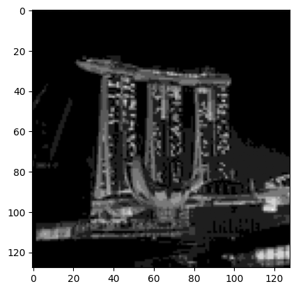
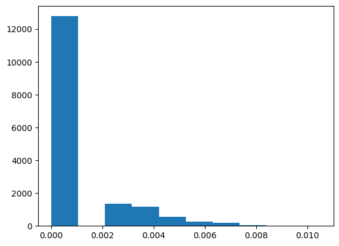
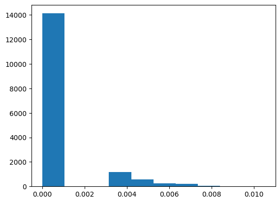
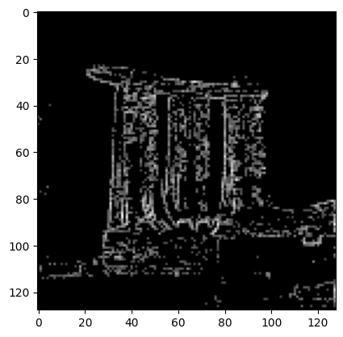
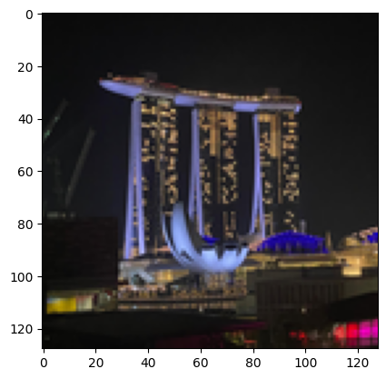

<Card title="View on GitHub" icon="github" href="https://github.com/Classiq/classiq-library/blob/main/applications/image_processing/quantum_hadamard_edge_detection/quantum_image_edge_detection.ipynb">
  Open this notebook in GitHub to run it yourself
</Card>

Based on the paper: "Edge Detection Quantumized: A Novel Quantum Algorithm for Image Processing" [https://arxiv.org/html/2404.06889v1 ](https://arxiv.org/html/2404.06889v1)

This notebook demonstrates:

1. **QPIE (Quantum Probability Image Encoding)** encoding
1. **QHED (Quantum Hadamard Edge Detection)** algorithm

The encoding was implemented based on this paper: [https://arxiv.org/pdf/1801.01465](https://arxiv.org/pdf/1801.01465)

```python
import math
from typing import List

import matplotlib.pyplot as plt
import numpy as np

from classiq import *
```
```python

# original
photo = []
photo = plt.imread("Marina Bay Sands 128.png")

plt.imshow(photo)
```
<Info>
  **Output:**

  

```
<matplotlib.image.AxesImage at 0x168cc3e90>
  

```
</Info>


```python
segments = [i / 255 for i in [0, 30, 60, 90, 120, 150, 180, 210, 255]]
image = np.array(photo)
# print(segments)
# print(image)
for i in range(1, len(image)):
    for j in range(len(image[i])):
        pixel = image[i][j][0]
        for s in segments:
            if pixel >= s:
                image[i][j][0] = s
                image[i][j][1] = s
                image[i][j][2] = s
# print("AFTER THE UPDATE")
# print(image)
plt.imshow(image)
image = np.array(photo)
```


## QPIE Encoding Implementation

Convert an image into valid QPIE probability amplitudes.

The image is converted to grayscale if needed, made non-negative, and L2-normalized so the sum of squared values equals 

1. The result is stored as an $n \times n$ array `IMAGE_DATA`.

```python
def image_to_qpie_amplitudes(image: np.ndarray) -> np.ndarray:
    """
    Convert an image to QPIE probability amplitudes as an n×n array.
    |img⟩ = Σ(x,y) (I_xy / √(Σ I_xy²)) |xy⟩
    """
    if len(image.shape) == 3:
        image = np.mean(image, axis=2)

    n = image.shape[0]
    assert image.shape == (n, n), "Image must be square"

    image = np.abs(image)
    norm = np.sqrt(np.sum(image**2))
    if norm == 0:
        return np.ones((n, n)) / n
    return (image / norm).T
```
```python

IMAGE_DATA = image_to_qpie_amplitudes(image)
n = IMAGE_DATA.shape[0]
N_PIXEL_QUBITS = math.ceil(math.log2(n))
print(f"Image: {n}x{n}, pixel qubits per axis: {N_PIXEL_QUBITS}")
```
<Info>
  **Output:**

  

```

Image: 128x128, pixel qubits per axis: 7
  

```
</Info>

```python
print(f"Total pixels: {n*n}")
```
<Info>
  **Output:**

  

```

Total pixels: 16384
  

```
</Info>

## Modified QHED Algorithm

We define an `ImagePixel` QStruct with separate `x` and `y` registers, and load the image via `lookup_table` - the amplitudes are computed classically from the pixel coordinates and loaded with `prepare_amplitudes`.

The QHED algorithm detects edges by:

1. Adding auxiliary qubits in $|+\rangle$ state
1. Controlled shifts of $x$ (horizontal) and $y$ (vertical) by $-1$
1. Applying Hadamard to compute differences
1. Measuring to get edge information

```python
from classiq.qmod.symbolic import logical_or


class ImagePixel(QStruct):
    x: QNum[N_PIXEL_QUBITS]
    y: QNum[N_PIXEL_QUBITS]


def image_amplitude(x: float, y: float) -> float:
    ix, iy = int(x), int(y)
    if 0 <= ix < n and 0 <= iy < n:
        return float(IMAGE_DATA[ix, iy])
    return 0.0


@qfunc
def qpie_encoding(pixel: Output[ImagePixel]):
    amps = lookup_table(image_amplitude, [pixel.x, pixel.y])
    prepare_amplitudes(amps, 0, pixel)


@qfunc
def quantum_edge_detection_scalable(
    edge_aux: Output[QBit],
    pixel: Output[ImagePixel],
):
    qpie_encoding(pixel=pixel)

    horizontal_edge = QBit()
    vertical_edge = QBit()
    allocate(horizontal_edge)
    allocate(vertical_edge)

    within_apply(
        within=lambda: H(horizontal_edge),
        apply=lambda: control(horizontal_edge, lambda: inplace_add(-1, pixel.x)),
    )
    within_apply(
        within=lambda: H(vertical_edge),
        apply=lambda: control(vertical_edge, lambda: inplace_add(-1, pixel.y)),
    )

    edge_aux |= logical_or(horizontal_edge, vertical_edge)
    drop(horizontal_edge)
    drop(vertical_edge)


print(f"Creating {n}x{n} image edge detection model...")
```
<Info>
  **Output:**

  

```

Creating 128x128 image edge detection model...
  

```
</Info>

## Synthesize and Analyze the Quantum Circuit

The model is synthesized with a 20-qubit width limit and a long timeout, and finally exported as quantum\_image\_edge\_detection with 15-digit numeric precision.

```python
@qfunc
def main(
    pixel: Output[ImagePixel],
    edge_aux: Output[QBit],
):
    quantum_edge_detection_scalable(edge_aux=edge_aux, pixel=pixel)
```
```python

qprog = synthesize(
    main,
    constraints=Constraints(max_width=20),
    preferences=Preferences(timeout_seconds=14400),
)
```
```python

print(f"\n{n}x{n} Image Circuit Statistics:")
print(f"  

- Number of qubits: {qprog.data.width}")
print(f"  

- Circuit depth: {qprog.transpiled_circuit.depth}")
print(
    f"  

- Number of gates: {qprog.transpiled_circuit.count_ops if hasattr(qprog.transpiled_circuit, 'count_ops') else 'N/A'}"
)
```
<Info>
  **Output:**

  

```
128x128 Image Circuit Statistics:
    

- Number of qubits: 17
    

- Circuit depth: 32813
    

- Number of gates: {'u': 16617, 'cx': 16584}
  

```
</Info>

```python
show(qprog)
```
<Info>
  **Output:**

  

```

Quantum program link: https://platform.classiq.io/circuit/3AlGcDNufmf2h6AwpUBoej5fGk8
  

```
</Info>

```python
qprog = set_quantum_program_execution_preferences(
    qprog, preferences=ExecutionPreferences(num_shots=200000)
)
res = execute(qprog).result_value()
res.dataframe
```
<div><style scoped> .dataframe tbody tr th:only-of-type \{ vertical-align: middle; } .dataframe tbody tr th \{ vertical-align: top; } .dataframe thead th \{ text-align: right; } </style> <table border="1" className="dataframe"> <thead> <tr style={{textAlign: "right"}}> <th /> <th>pixel.x</th> <th>pixel.y</th> <th>edge\_aux</th> <th>counts</th> <th>probability</th> <th>bitstring</th> </tr> </thead> <tbody> <tr> <th>0</th> <td>64</td> <td>92</td> <td>0</td> <td>167</td> <td>0.000835</td> <td>010111001000000</td> </tr> <tr> <th>1</th> <td>37</td> <td>89</td> <td>0</td> <td>165</td> <td>0.000825</td> <td>010110010100101</td> </tr> <tr> <th>2</th> <td>64</td> <td>91</td> <td>0</td> <td>163</td> <td>0.000815</td> <td>010110111000000</td> </tr> <tr> <th>3</th> <td>62</td> <td>91</td> <td>0</td> <td>161</td> <td>0.000805</td> <td>010110110111110</td> </tr> <tr> <th>4</th> <td>70</td> <td>95</td> <td>0</td> <td>158</td> <td>0.000790</td> <td>010111111000110</td> </tr> <tr> <th>...</th> <td>...</td> <td>...</td> <td>...</td> <td>...</td> <td>...</td> <td>...</td> </tr> <tr> <th>17277</th> <td>115</td> <td>127</td> <td>1</td> <td>1</td> <td>0.000005</td> <td>111111111110011</td> </tr> <tr> <th>17278</th> <td>118</td> <td>127</td> <td>1</td> <td>1</td> <td>0.000005</td> <td>111111111110110</td> </tr> <tr> <th>17279</th> <td>119</td> <td>127</td> <td>1</td> <td>1</td> <td>0.000005</td> <td>111111111110111</td> </tr> <tr> <th>17280</th> <td>120</td> <td>127</td> <td>1</td> <td>1</td> <td>0.000005</td> <td>111111111111000</td> </tr> <tr> <th>17281</th> <td>122</td> <td>127</td> <td>1</td> <td>1</td> <td>0.000005</td> <td>111111111111010</td> </tr> </tbody> </table> <p>17282 rows × 6 columns</p></div>

## Create Edge Image From Measurement Results

If `edge_aux == 1` then it is marked as an edge pixel.

The new amplitude is calculated based on the number of shots measured for that pixel, normalized by the total number of shots.

```python
df = res.dataframe
edge_df = df[df["edge_aux"] == 1]

edge_image = np.zeros((n, n))
for _, row in edge_df.iterrows():
    edge_image[int(row["pixel.x"]), int(row["pixel.y"])] = np.sqrt(row["probability"])
```

Analyze amplitude distributions

```python
plt.hist(edge_image.flatten())
```
<Info>
  **Output:**

  

```
(array([1.2776e+04, 0.0000e+00, 1.3470e+03, 1.1560e+03, 5.5400e+02,
          2.6500e+02, 2.0400e+02, 6.4000e+01, 9.0000e+00, 9.0000e+00]),
   array([

0.        , 0.00104881, 0.00209762, 0.00314643, 0.00419524,
          0.00524404, 0.00629285, 0.00734166, 0.00839047, 0.00943928,
          0.01048809]),
   <BarContainer object of 10 artists>)
  

```
</Info>



Some amplitudes are extremely small and can be treated as noise; discarding them yields a cleaner edge image.

```python
edge_image = np.where(edge_image > 0.003, edge_image, 0)
plt.hist(edge_image.flatten())
```
<Info>
  **Output:**

  

```
(array([1.4123e+04, 0.0000e+00, 0.0000e+00, 1.1560e+03, 5.5400e+02,
          2.6500e+02, 2.0400e+02, 6.4000e+01, 9.0000e+00, 9.0000e+00]),
   array([

0.        , 0.00104881, 0.00209762, 0.00314643, 0.00419524,
          0.00524404, 0.00629285, 0.00734166, 0.00839047, 0.00943928,
          0.01048809]),
   <BarContainer object of 10 artists>)
  

```
</Info>



The resulting edge-detected image

```python
plt.imshow(edge_image.T, cmap="gray")
```
<Info>
  **Output:**

  

```
<matplotlib.image.AxesImage at 0x179311590>
  

```
</Info>



In comparison, the original image is:

```python
plt.imshow(image)
```
<Info>
  **Output:**

  

```
<matplotlib.image.AxesImage at 0x179377290>
  

```
</Info>

