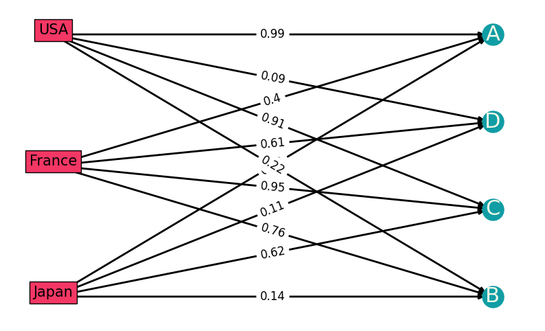
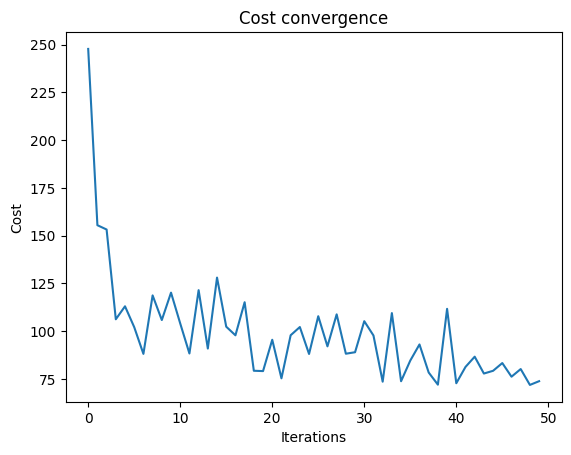
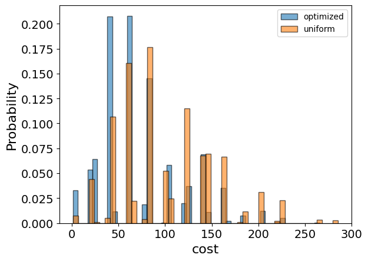
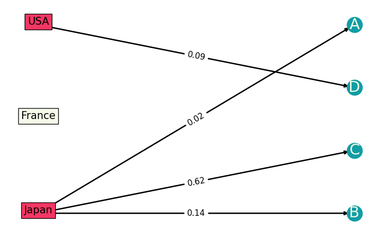
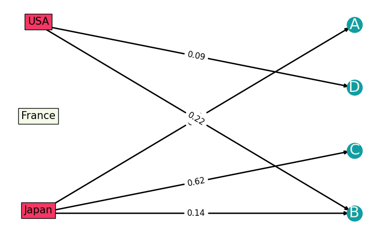

<Card title="View on GitHub" icon="github" href="https://github.com/Classiq/classiq-library/blob/main/applications/logistics/facility_location/facility_location.ipynb">
  Open this notebook in GitHub to run it yourself
</Card>

Consider the optimization problem where you have a set of $M$ customers and a set of $N$ potential locations for opening a facility.

Given transportation costs between facilities and customers and the number of facilities you would like to open ($P$), determine which facilities to open such that the total transportation cost between facilities and customers is minimal, under the constraint that each customer is allocated to only one facility.

Possible extensions:

- Add a different demand for each customer.
- Add the cost for opening a facility at each location.
- Consider different categories of facilities and that customers can have multiple allocations for different facilities.

## Mathematical Modeling

The input of the model is a set of $M$ customers $\{1,\dots,M\}$, a set of $N$ potential locations for facilities $\{1,\dots,N\}$, an $N\times M$ matrix $d$ where $d_{nm}$ is the cost of customer $m$ buying from facility $n$, and the total number of facilities we want to open is $P$.

Define a binary variable for the optimization problem: an $N\times M$ matrix $x$ such that $x_{nm}=1$ if the customer $m$ is allocated to facility $n$.

The objective function to minimize is the total cost function:

$$
\min_{x} \sum_{n,m} d_{nm}x_{nm}
$$
Constraints:

(1) Each customer is supplied: $\forall m\in[0,M] \,\,\, \sum_n x_{nm}=1$.

(2) Total number of open facilities is $P$: $\sum_n\Pi_m (1-x_{nm})=N-P$ (the inner product is zero if the $n-$th facility is not open).

#

## Alternative Modeling

There is an alternative modeling for adding another variable to the model: a binary vector $y$ of size $N$, which indicates which facilities are open. In this formulation the second constraint can be written as $\sum_n y_n=P$ together with an inequality constraint $\forall n,m:\, x_{nm} \leq y_n$. A model that combines equality and inequality constraints may become available in the future.

Note that this alternative modeling has a quadratic unconstrained binary optimization (QUBO) problem (compared to the formulation above where constraint (2) is a polynomial of degree $m$). However, the alternative modeling has more variables to minimize on, and thus refers to more qubits.

#

## Example

If you can open facilities in Japan, USA, and France, and you have four customers whose costs for buying from these three locations are given. To open in total $P=2$ facilities, the optimization problem is to find where to open the facilities and which customer is allocated to which facility.

Draw this specific example on a graph.

There are $N=3$ locations and $M=4$ customers, where the weights of the edges between them signify the costs:

Suggestions:

- Give a general problem description and then givens, or provide givens after each mention.
- Standardize writing numbers appearing in sentences when less than 10: "4" vs. "four".

```python
# Import relevant packages

from itertools import product

import matplotlib.pyplot as plt
import networkx as nx  # noqa
import numpy as np
import pandas as pd

# Declare givens from problem statement

Facilities = ["Japan", "USA", "France"]
Customers = ["A", "B", "C", "D"]

N = len(Facilities)  # potential facility count
M = len(Customers)  # customer count
P = 2  # allocated facility count

# costs of customers using facilities
d = np.array(
    [[0.02, 0.14, 0.62, 0.11], [0.99, 0.22, 0.91, 0.09], [0.4, 0.76, 0.95, 0.61]]
)


graph = nx.DiGraph()
graph.add_nodes_from(Facilities + Customers)
for n, m in product(range(N), range(M)):
    graph.add_edges_from([(Facilities[n], Customers[m])], weight=d[n, m])


# Plot the graph
plt.figure(figsize=(10, 6))
left = nx.bipartite.sets(graph)[0]
pos = nx.bipartite_layout(graph, left)

nx.draw_networkx(graph, pos=pos, nodelist=Customers, font_size=22, font_color="None")
nx.draw_networkx_nodes(
    graph, pos, nodelist=Customers, node_color="#119DA4", node_size=500
)
for fa in Facilities:
    x, y = pos[fa]
    plt.text(
        x,
        y,
        s=fa,
        bbox=dict(facecolor="#F43764", alpha=1),
        horizontalalignment="center",
        fontsize=15,
    )

nx.draw_networkx_edges(graph, pos, width=2)
labels = nx.get_edge_attributes(graph, "weight")
nx.draw_networkx_edge_labels(graph, pos, edge_labels=labels, font_size=12)
nx.draw_networkx_labels(
    graph,
    pos,
    labels={co: co for co in Customers},
    font_size=22,
    font_color="#F4F9E9",
)

plt.axis("off")
plt.show()
```


## Building the Pyomo Model from a Matrix of Distances

```python
from typing import List, Tuple, cast  # noqa

import pyomo.environ as pyo
from IPython.display import Markdown, display
```
```python

## Define a function that gets a matrix of costs between customers and potential facilities

## and the number of facilities to open.


def pmedian(cost_mat: np.ndarray, P: int) -> pyo.ConcreteModel:
    model = pyo.ConcreteModel("pmedian")

    N = cost_mat.shape[0]  # potential facility amount
    M = cost_mat.shape[1]  # customer count
    Locations = range(N)
    Customers = range(M)

    model.x = pyo.Var(Locations, Customers, domain=pyo.Binary)

    @model.Constraint(Customers)
    def each_customer_is_supplied_rule(model, m):  # constraint (1)
        return sum(model.x[n, m] for n in Locations) == 1

    def is_location_alocated(n):  # constraint (2)
        return np.prod([(1 - model.x[n, m]) for m in Customers])

    model.num_facilities = pyo.Constraint(
        expr=sum(is_location_alocated(n) for n in Locations) == N 

- P
    )

    model.cost = pyo.Objective(
        expr=sum(cost_mat[n, m] * model.x[n, m] for n in Locations for m in Customers),
        sense=pyo.minimize,
    )

    return model
```
#

## Solving with Classiq

Take the specific example outlined above:

```python
pmedian_model = pmedian(d, P)
```

To solve the Pyomo model,  use the `CombinatorialProblem` Python class.

Under the hood it translates the Pyomo model to a quantum model of the QAOA algorithm \[[1](#qaoa)], with the cost Hamiltonian translated from the Pyomo model.

Choose the number of layers for the QAOA ansatz using the `num_layers` argument:

```python
from classiq import *
from classiq.applications.combinatorial_optimization import CombinatorialProblem

combi = CombinatorialProblem(pyo_model=pmedian_model, num_layers=5, penalty_factor=10)

qmod = combi.get_model()
```
#

## Synthesizing the QAOA Circuit and Solving the Problem

Synthesize and view the QAOA circuit (ansatz) used to solve the optimization problem:

```python
qprog = combi.get_qprog()
show(qprog)
```
<Info>
  **Output:**

  

```

Quantum program link: https://platform.classiq.io/circuit/2zJEZtDZDBqSpw793eHKnq7THbP
  

```
</Info>

Now, solve the problem by calling the `optimize` method of the `CombinatorialProblem` object.

For the classical optimization part of the QAOA algorithm, define the maximum number of classical iterations (`maxiter`) and the $\alpha$-parameter (`quantile`) for running CVaR-QAOA, an improved variation of the QAOA algorithm \[[2](#cvar)]:

```python
optimized_params = combi.optimize(maxiter=50)
```
<Info>
  **Output:**

  

```

Optimization Progress: 51it [03:35,  4.23s/it]
  

```
</Info>

Check the convergence of the run:

```python
import matplotlib.pyplot as plt

plt.plot(combi.cost_trace)
plt.xlabel("Iterations")
plt.ylabel("Cost")
plt.title("Cost convergence")
```
<Info>
  **Output:**

  

```

Text(0.5, 1.0, 'Cost convergence')
  

```
</Info>



## Optimization Results

Examine the statistics of the algorithm. To get samples with the optimized parameters, call the `sample` method:

```python
optimization_result = combi.sample(optimized_params)
optimization_result.sort_values(by="cost").head(5)
```
|      | solution                                               | probability | cost |
| ---- | ------------------------------------------------------ | ----------- | ---- |
| 1035 | \{'x': \[\[1, 1, 1, 0], \[0, 0, 0, 1], \[0, 0, 0, 0]]} | 0.000488    | 0.87 |
| 756  | \{'x': \[\[1, 0, 1, 0], \[0, 1, 0, 1], \[0, 0, 0, 0]]} | 0.000488    | 0.95 |
| 230  | \{'x': \[\[1, 0, 0, 0], \[0, 1, 1, 1], \[0, 0, 0, 0]]} | 0.000977    | 1.24 |
| 766  | \{'x': \[\[0, 1, 1, 1], \[0, 0, 0, 0], \[1, 0, 0, 0]]} | 0.000488    | 1.27 |
| 329  | \{'x': \[\[1, 1, 1, 0], \[0, 0, 0, 0], \[0, 0, 0, 1]]} | 0.000977    | 1.39 |

Compare the optimized results to uniformly sampled results:

```python
uniform_result = combi.sample_uniform()
```

And compare the histograms:

```python
optimization_result["cost"].plot(
    kind="hist",
    bins=50,
    edgecolor="black",
    weights=optimization_result["probability"],
    alpha=0.6,
    label="optimized",
)
uniform_result["cost"].plot(
    kind="hist",
    bins=50,
    edgecolor="black",
    weights=uniform_result["probability"],
    alpha=0.6,
    label="uniform",
)
plt.legend()
plt.ylabel("Probability", fontsize=16)
plt.xlabel("cost", fontsize=16)
plt.tick_params(axis="both", labelsize=14)
```


Plot the solution:

```python
best_solution = optimization_result.solution[optimization_result.cost.idxmin()]
best_solution
```
<Info>
  **Output:**

  

```
{'x': [[1, 1, 1, 0], [0, 0, 0, 1], [0, 0, 0, 0]]}
  

```
</Info>

Define a function that plots solutions:

```python
# This function plots the solution in a table and a graph


def plotting_sol(x_sol, cost, is_classic: bool):
    x_sol_to_mat = np.reshape(np.array(x_sol), [N, M])  # vector to matrix
    # opened facilities will be marked in red
    opened_fac_dict = {}
    for fa in range(N):
        if sum(x_sol_to_mat[fa, m] for m in range(M)) > 0:
            opened_fac_dict.update({Facilities[fa]: "background-color: #F43764"})

    # classical or quantum
    if is_classic == True:
        display(Markdown("**CLASSICAL SOLUTION**"))
        print("total cost= ", cost)
    else:
        display(Markdown("**QAOA SOLUTION**"))
        print("total cost= ", cost)

    # plotting in a table
    df = pd.DataFrame(x_sol_to_mat)
    df.columns = Customers
    df.index = Facilities
    plotable = df.style.apply(lambda x: x.index.map(opened_fac_dict))
    display(plotable)

    # plotting in a graph
    graph_sol = nx.DiGraph()
    graph_sol.add_nodes_from(Facilities + Customers)
    for n, m in product(range(N), range(M)):
        if x_sol_to_mat[n, m] > 0:
            graph_sol.add_edges_from([(Facilities[n], Customers[m])], weight=d[n, m])

    plt.figure(figsize=(10, 6))
    left = nx.bipartite.sets(graph_sol, top_nodes=Facilities)[0]
    pos = nx.bipartite_layout(graph_sol, left)

    nx.draw_networkx(
        graph_sol, pos=pos, nodelist=Customers, font_size=22, font_color="None"
    )
    nx.draw_networkx_nodes(
        graph_sol, pos, nodelist=Customers, node_color="#119DA4", node_size=500
    )
    for fa in Facilities:
        x, y = pos[fa]
        if fa in opened_fac_dict.keys():
            plt.text(
                x,
                y,
                s=fa,
                bbox=dict(facecolor="#F43764", alpha=1),
                horizontalalignment="center",
                fontsize=15,
            )
        else:
            plt.text(
                x,
                y,
                s=fa,
                bbox=dict(facecolor="#F4F9E9", alpha=1),
                horizontalalignment="center",
                fontsize=15,
            )

    nx.draw_networkx_edges(graph_sol, pos, width=2)
    labels = nx.get_edge_attributes(graph_sol, "weight")
    nx.draw_networkx_edge_labels(graph, pos, edge_labels=labels, font_size=12)
    nx.draw_networkx_labels(
        graph_sol,
        pos,
        labels={co: co for co in Customers},
        font_size=22,
        font_color="#F4F9E9",
    )

    plt.axis("off")
    plt.show()
```
#

## Best Solution

Plot the quantum result only if you get the right solution (to avoid problems with printing the table and graph):

```python
best_solution
```
<Info>
  **Output:**

  

```
solution       {'x': [[1, 1, 1, 0], [0, 0, 0, 1], [0, 0, 0, 0]]}
  probability                                             0.000488
  cost                                                        0.87
  Name: 1035, dtype: object
  

```
</Info>

```python
best_solution = optimization_result.loc[optimization_result.cost.idxmin()]

plotting_sol(best_solution.solution["x"], best_solution.cost, is_classic=False)
```
<Info>
  **Output:**

  

```
<IPython.core.display.

Markdown object>
  

```
</Info>

<Info>
  **Output:**

  

```
total cost=  0.87
  

```
</Info>

<style type="text/css"> #T\_25941\_row0\_col0, #T\_25941\_row0\_col1, #T\_25941\_row0\_col2, #T\_25941\_row0\_col3, #T\_25941\_row1\_col0, #T\_25941\_row1\_col1, #T\_25941\_row1\_col2, #T\_25941\_row1\_col3 \{ background-color: #F43764;
} </style>

<table id="T_25941">
  <thead>
    <tr>
      <th className="blank level0" />

      <th id="T_25941_level0_col0" className="col_heading level0 col0">A</th>
      <th id="T_25941_level0_col1" className="col_heading level0 col1">B</th>
      <th id="T_25941_level0_col2" className="col_heading level0 col2">C</th>
      <th id="T_25941_level0_col3" className="col_heading level0 col3">D</th>
    </tr>
  </thead>

  <tbody>
    <tr>
      <th id="T_25941_level0_row0" className="row_heading level0 row0">Japan</th>
      <td id="T_25941_row0_col0" className="data row0 col0">1</td>
      <td id="T_25941_row0_col1" className="data row0 col1">1</td>
      <td id="T_25941_row0_col2" className="data row0 col2">1</td>
      <td id="T_25941_row0_col3" className="data row0 col3">0</td>
    </tr>

    <tr>
      <th id="T_25941_level0_row1" className="row_heading level0 row1">USA</th>
      <td id="T_25941_row1_col0" className="data row1 col0">0</td>
      <td id="T_25941_row1_col1" className="data row1 col1">0</td>
      <td id="T_25941_row1_col2" className="data row1 col2">0</td>
      <td id="T_25941_row1_col3" className="data row1 col3">1</td>
    </tr>

    <tr>
      <th id="T_25941_level0_row2" className="row_heading level0 row2">France</th>
      <td id="T_25941_row2_col0" className="data row2 col0">0</td>
      <td id="T_25941_row2_col1" className="data row2 col1">0</td>
      <td id="T_25941_row2_col2" className="data row2 col2">0</td>
      <td id="T_25941_row2_col3" className="data row2 col3">0</td>
    </tr>
  </tbody>
</table>



#

## Compare to a Classical Solver

```python
from pyomo.opt import SolverFactory

solver = SolverFactory("couenne")
solver.solve(pmedian_model)

pmedian_model.display()
```
<Info>
  **Output:**

  

```

Model pmedian

    Variables:
      x : Size=12, Index=x_index
          Key    : Lower : Value                  : Upper : Fixed : Stale : Domain
          (0, 0) :     0 :                    1.0 :     1 : False : False : Binary
          (0, 1) :     0 :                    1.0 :     1 : False : False : Binary
          (0, 2) :     0 :                    1.0 :     1 : False : False : Binary
          (0, 3) :     0 :                    0.0 :     1 : False : False : Binary
          (1, 0) :     0 :                    0.0 :     1 : False : False : Binary
          (1, 1) :     0 :  6.846989283059948e-10 :     1 : False : False : Binary
          (1, 2) :     0 :                    0.0 :     1 : False : False : Binary
          (1, 3) :     0 :                    1.0 :     1 : False : False : Binary
          (2, 0) :     0 :                    0.0 :     1 : False : False : Binary
          (2, 1) :     0 : -6.846989283059948e-10 :     1 : False : False : Binary
          (2, 2) :     0 :                    0.0 :     1 : False : False : Binary
          (2, 3) :     0 :                    0.0 :     1 : False : False : Binary

    Objectives:
      cost : Size=1, Index=None, Active=True
          Key  : Active : Value
          None :   True : 0.8699999996302625

    Constraints:
      each_customer_is_supplied_rule : Size=4
          Key : Lower : Body : Upper
            0 :   1.0 :  1.0 :   1.0
            1 :   1.0 :  1.0 :   1.0
            2 :   1.0 :  1.0 :   1.0
            3 :   1.0 :  1.0 :   1.0
      num_facilities : Size=1
          Key  : Lower : Body              : Upper
          None :   1.0 : 1.000000000684699 :   1.0
  

```
</Info>

```python
best_classical_solution = np.array(
    [pyo.value(pmedian_model.x[idx]) for idx in np.ndindex(d.shape)]
).reshape(d.shape)

plotting_sol(best_classical_solution, pyo.value(pmedian_model.cost), is_classic=True)
```
<Info>
  **Output:**

  

```
<IPython.core.display.

Markdown object>
  

```
</Info>

<Info>
  **Output:**

  

```
total cost=  0.8699999996302625
  

```
</Info>

<style type="text/css"> #T\_bfe75\_row0\_col0, #T\_bfe75\_row0\_col1, #T\_bfe75\_row0\_col2, #T\_bfe75\_row0\_col3, #T\_bfe75\_row1\_col0, #T\_bfe75\_row1\_col1, #T\_bfe75\_row1\_col2, #T\_bfe75\_row1\_col3 \{ background-color: #F43764;
} </style>

<table id="T_bfe75">
  <thead>
    <tr>
      <th className="blank level0" />

      <th id="T_bfe75_level0_col0" className="col_heading level0 col0">A</th>
      <th id="T_bfe75_level0_col1" className="col_heading level0 col1">B</th>
      <th id="T_bfe75_level0_col2" className="col_heading level0 col2">C</th>
      <th id="T_bfe75_level0_col3" className="col_heading level0 col3">D</th>
    </tr>
  </thead>

  <tbody>
    <tr>
      <th id="T_bfe75_level0_row0" className="row_heading level0 row0">Japan</th>
      <td id="T_bfe75_row0_col0" className="data row0 col0">1.000000</td>
      <td id="T_bfe75_row0_col1" className="data row0 col1">1.000000</td>
      <td id="T_bfe75_row0_col2" className="data row0 col2">1.000000</td>
      <td id="T_bfe75_row0_col3" className="data row0 col3">0.000000</td>
    </tr>

    <tr>
      <th id="T_bfe75_level0_row1" className="row_heading level0 row1">USA</th>
      <td id="T_bfe75_row1_col0" className="data row1 col0">0.000000</td>
      <td id="T_bfe75_row1_col1" className="data row1 col1">0.000000</td>
      <td id="T_bfe75_row1_col2" className="data row1 col2">0.000000</td>
      <td id="T_bfe75_row1_col3" className="data row1 col3">1.000000</td>
    </tr>

    <tr>
      <th id="T_bfe75_level0_row2" className="row_heading level0 row2">France</th>
      <td id="T_bfe75_row2_col0" className="data row2 col0">0.000000</td>
      <td id="T_bfe75_row2_col1" className="data row2 col1">-0.000000</td>
      <td id="T_bfe75_row2_col2" className="data row2 col2">0.000000</td>
      <td id="T_bfe75_row2_col3" className="data row2 col3">0.000000</td>
    </tr>
  </tbody>
</table>

