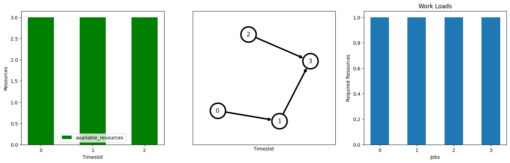
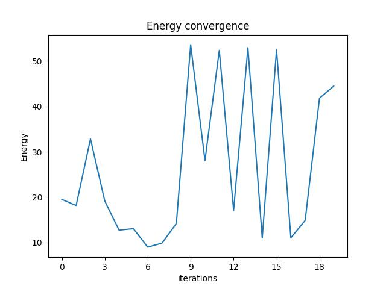
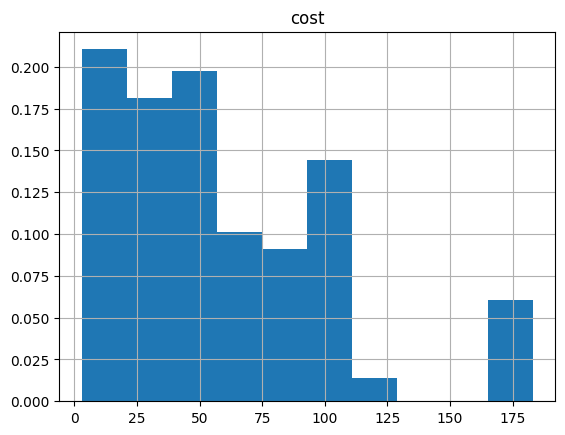
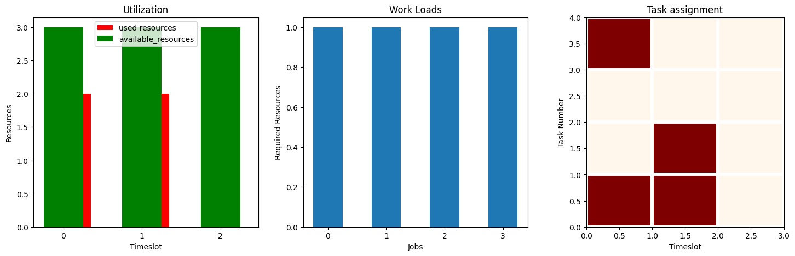
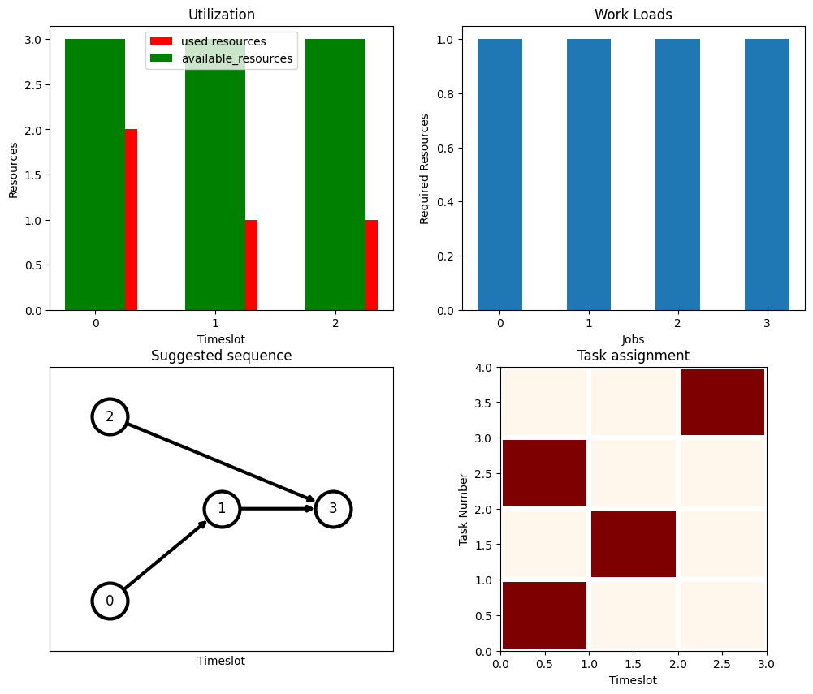
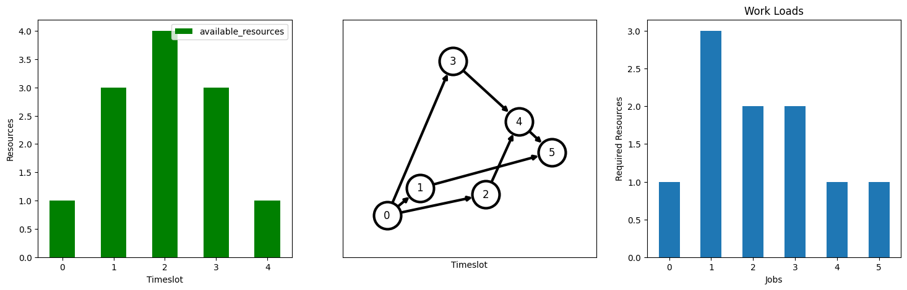
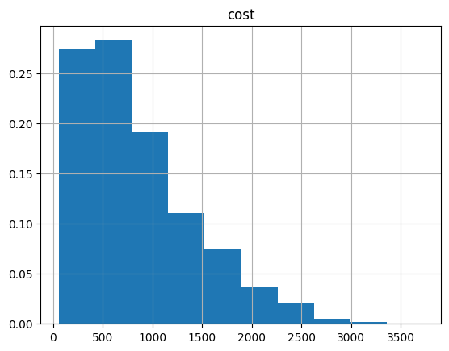
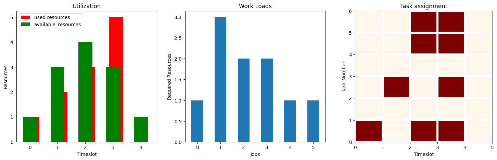
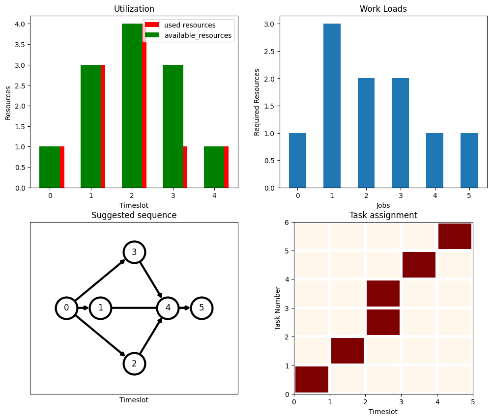

<Card title="View on GitHub" icon="github" href="https://github.com/Classiq/classiq-library/blob/main/applications/logistics/task_scheduling_problem/task_scheduling_problem.ipynb">
  Open this notebook in GitHub to run it yourself
</Card>

Consider an optimization problem (based on the formulation in \[[1](#taskworkflow)]): there are $W(t)$ available workers or resources and $N$ jobs, where each job $j$ requires $T(j)$ time and takes $r(j)$ resources to be completed.

Given a set of dependencies for each job and that you know which job depends on the completion of others before starting, determine the order of job completion that minimizes the total execution time.

Assumptions:

- A job may occupy only a single timeslot at most: $\forall j \,\,\, T(j) = 1$
- Given sufficient resources, jobs can start in the same timeslot
- All resources are identical and the amount of available resources at a current time step is given by the number $W(t)$
- Jobs can only start if all parent jobs are complete

Possible extensions:

- Separate resources into multiple categories with jobs requiring different types
- Jobs that take more than one operation

## Mathematical Modeling

The input of the model is as follows:

Define a binary variable for the optimization problem: an $t_{max}\times N$ matrix $x$ such that

$$
\begin{aligned}
x_{tj} =
\begin{cases}
      1 & \text{job } j \text{ is done on the } t_\text{th} \text{ time slot} \\
      0 & \text{else}
\end{cases}\\
\end{aligned}
$$
Constraints:

- All jobs must complete exactly once: $\forall j\in[1,N] \,\,\, \sum_t x_{tj}=1$

- All jobs may use no more than the available resources: $\forall t\in[0,t_{max}] \,\,\, \sum_j x_{tj} r_j \leq W_t$

- Parent jobs must be complete before dependent jobs start: $x_{t_1j_1} x_{t_2j_2} = 0 \,\,\, \forall j_1, t_1\leq t_2, j_2 \text{ depends on } j_1$

The objective function to minimize is the total cost function:

$$
\min_{x} \sum_{t} x_{tN}\cdot t
$$
which favors schedules that are done early.

## Defining the Optimization Model

```python
from typing import List, Tuple, cast  # noqa

import matplotlib.pyplot as plt
import networkx as nx
import numpy as np  # noqa
import pandas as pd
import pyomo.environ as pyo
from IPython.display import Markdown, display
```
```python

def define_workflow_problem(
    G, num_timeslots, available_capacities, work_loads
) -> pyo.ConcreteModel:
    model = pyo.ConcreteModel("task_scheduling")

    timeslots = range(num_timeslots)
    assert len(timeslots) == len(available_capacities)
    works = range(len(G.nodes))
    assert len(works) == len(work_loads)

    last_works = [node for node in G.nodes if G.out_degree(node) == 0]
    assert len(last_works) == 1
    last_work = last_works[0]
    # works with no dependancies
    root_works = [node for node in G.nodes if G.in_degree(node) == 0]

    model.x = pyo.Var(timeslots, works, domain=pyo.Binary)

    @model.Constraint(works)
    def all_works_are_done(model, i):  # constraint (1)
        return sum(model.x[t, i] for t in timeslots) == 1

    @model.Constraint(timeslots)
    def capacity_is_valid(model, t):  # constraint(2)
        return (
            sum(model.x[t, i] * work_loads[i] for i in works) <= available_capacities[t]
        )

    @model.Constraint(works, works, timeslots, timeslots)
    def works_done_by_their_order(model, i, j, t1, t2):  # constraint (3)
        if G.has_edge(i, j) and t1 >= t2:
            return model.x[t1, i] * model.x[t2, j] == 0
        return pyo.Constraint.Feasible

    # eliminate all timeslots that are not possible for the task in order to save qubits
    distances_from_ends = nx.floyd_warshall_numpy(G)
    distances_from_roots = nx.floyd_warshall_numpy(G.reverse())

    @model.Constraint(works, timeslots)
    def eliminating_rule(model, i, t):
        end_distance = int(np.min(distances_from_ends[i, last_works]))
        start_distance = int(np.min(distances_from_roots[i, root_works]))
        if (t < start_distance) or (t >= len(timeslots) - end_distance):
            return model.x[t, i] == 0
        return pyo.Constraint.Feasible

    # minimize the end time of the last work
    model.cost = pyo.Objective(
        expr=sum(model.x[t, last_work] * (t + 1) for t in timeslots), sense=pyo.minimize
    )

    return model
```

Visualization helper functions:

```python
import random


def plot_graph(solution=None, ax=None):
    if solution is not None:
        # determine how many tasks start in each timeslot
        num_tasks = [sum(solution[t]) for t in range(num_timeslots)]
        max_tasks = max(num_tasks)

        pos = {}

        # find all the tasks that start in particular start time
        for start in np.nonzero(solution.sum(axis=1))[0]:
            locations = solution[start].nonzero()[0]
            pos.update(
                {
                    n: (start, i + (max_tasks - num_tasks[start]) / 2)
                    for i, n in enumerate(locations)
                }
            )
    else:
        pos = {
            node: (order, random.random())
            for order, node in enumerate((nx.topological_sort(G)))
        }

    options = {
        "font_size": 12,
        "node_size": 1000,
        "node_color": "white",
        "edgecolors": "black",
        "linewidths": 3,
        "width": 3,
    }
    # G = nx.DiGraph(edges)
    nx.draw_networkx(G, pos, ax=ax, **options)

    # Set margins for the axes so that nodes aren't clipped
    if ax is None:
        ax = plt.subplot()
    ax.margins(0.20)
    if solution is not None:
        ax.set_title("Suggested sequence")
    ax.set_xlabel("Timeslot")


def plot_assignments(solution, ax=None):
    if ax is None:
        ax = plt.subplot()
    ax.pcolormesh(solution.T, edgecolors="w", linewidth=4, cmap="OrRd")
    ax.set_aspect(0.8)
    ax.set_xlabel("Timeslot")
    ax.set_ylabel("Task Number")
    ax.set_title("Task assignment")


def plot_resource_graph(solution=None, ax=None):
    if ax is None:
        fig, ax = plt.subplots()

    x_pos = np.arange(len(capacities))
    if solution is not None:
        ax.set_title("Utilization")
        num_resources = [np.dot(solution[t], workloads) for t in range(num_timeslots)]
        ax.bar(x_pos + 0.1, num_resources, label="used resources", color="r", width=0.5)
    ax.bar(x_pos, capacities, label="available_resources", color="g", width=0.5)
    ax.set_xticks(x_pos)
    ax.legend()
    ax.set_xlabel("Timeslot")
    ax.set_ylabel("Resources")


def plot_workloads(ax=None):
    if ax is None:
        fig, ax = plt.subplots()
    ax.set_title("Work Loads")
    x_pos = np.arange(len(workloads))
    ax.bar(x_pos, workloads, width=0.5)
    ax.set_xticks(x_pos)
    ax.set_xlabel("Jobs")
    ax.set_ylabel("Required Resources")


def is_printable_solution(solution):
    return np.array_equal(solution.sum(axis=0), np.ones(solution.shape[1]))


def plot_workflow(solution=None):
    if solution is None:
        fig, axes = plt.subplots(1, 3, figsize=(18, 5))
        plot_resource_graph(ax=axes[0])
        plot_graph(ax=axes[1])
        plot_workloads(ax=axes[2])

    else:
        if is_printable_solution(solution):
            fig, axes = plt.subplots(2, 2, figsize=(12, 10))
            plot_resource_graph(solution, axes[0, 0])
            plot_workloads(axes[0, 1])
            plot_assignments(solution, axes[1, 1])
            plot_graph(solution, axes[1, 0])
        else:
            # illegal solution
            fig, axes = plt.subplots(1, 3, figsize=(18, 5))
            plot_resource_graph(solution, axes[0])
            plot_workloads(axes[1])
            plot_assignments(solution, axes[2])
```

## Initializing a Specific Problem Instance

Create a workflow dependencies graph.

For the small instance, all timeslot capacities and workloads are equal to each other:

```python
def small_example():
    G = nx.DiGraph()

    nodes = range(4)
    edges = [(0, 1), (1, 3), (2, 3)]
    G.add_nodes_from(nodes)
    G.add_edges_from(edges)
    num_timeslots = len(G.nodes) - 1
    capacities = 3 * np.ones(num_timeslots)
    workloads = np.ones(len(nodes))

    return (
        define_workflow_problem(
            G, num_timeslots, available_capacities=capacities, work_loads=workloads
        ),
        G,
        num_timeslots,
        capacities,
        workloads,
    )


def large_example():
    G = nx.DiGraph()

    nodes = range(6)
    edges = [(0, 1), (0, 3), (0, 2), (2, 4), (3, 4), (1, 5), (4, 5)]
    workloads = [1, 3, 2, 2, 1, 1]
    capacities = [1, 3, 4, 3, 1]
    G.add_nodes_from(nodes)
    G.add_edges_from(edges)

    num_timeslots = len(capacities)

    return (
        define_workflow_problem(
            G, num_timeslots, available_capacities=capacities, work_loads=workloads
        ),
        G,
        num_timeslots,
        capacities,
        workloads,
    )
```
```python

tasks_model, G, num_timeslots, capacities, workloads = small_example()
plot_workflow()
```


This is the resulting Pyomo model:

```python
tasks_model.pprint()
```
<Info>
  **Output:**

  

```
1 Var Declarations
      x : Size=12, Index={0, 1, 2}*{0, 1, 2, 3}
          Key    : Lower : Value : Upper : Fixed : Stale : Domain
          (0, 0) :     0 :  None :     1 : False :  True : Binary
          (0, 1) :     0 :  None :     1 : False :  True : Binary
          (0, 2) :     0 :  None :     1 : False :  True : Binary
          (0, 3) :     0 :  None :     1 : False :  True : Binary
          (1, 0) :     0 :  None :     1 : False :  True : Binary
          (1, 1) :     0 :  None :     1 : False :  True : Binary
          (1, 2) :     0 :  None :     1 : False :  True : Binary
          (1, 3) :     0 :  None :     1 : False :  True : Binary
          (2, 0) :     0 :  None :     1 : False :  True : Binary
          (2, 1) :     0 :  None :     1 : False :  True : Binary
          (2, 2) :     0 :  None :     1 : False :  True : Binary
          (2, 3) :     0 :  None :     1 : False :  True : Binary

  1 Objective Declarations
      cost : Size=1, Index=None, Active=True
          Key  : Active : Sense    : Expression
          None :   True : minimize : x[0,3] + 2*x[1,3] + 3*x[2,3]

  4 Constraint Declarations
      all_works_are_done : Size=4, Index={0, 1, 2, 3}, Active=True
          Key : Lower : Body                     : Upper : Active
            0 :   1.0 : x[0,0] + x[1,0] + x[2,0] :   1.0 :   True
            1 :   1.0 : x[0,1] + x[1,1] + x[2,1] :   1.0 :   True
            2 :   1.0 : x[0,2] + x[1,2] + x[2,2] :   1.0 :   True
            3 :   1.0 : x[0,3] + x[1,3] + x[2,3] :   1.0 :   True
      capacity_is_valid : Size=3, Index={0, 1, 2}, Active=True
          Key : Lower : Body                              : Upper : Active
            0 :  -Inf : x[0,0] + x[0,1] + x[0,2] + x[0,3] :   3.0 :   True
            1 :  -Inf : x[1,0] + x[1,1] + x[1,2] + x[1,3] :   3.0 :   True
            2 :  -Inf : x[2,0] + x[2,1] + x[2,2] + x[2,3] :   3.0 :   True
      eliminating_rule : Size=12, Index={0, 1, 2, 3}*{0, 1, 2}, Active=True
          Key    : Lower : Body   : Upper : Active
          (0, 0) :  -Inf :    0.0 :   0.0 :   True
          (0, 1) :   0.0 : x[1,0] :   0.0 :   True
          (0, 2) :   0.0 : x[2,0] :   0.0 :   True
          (1, 0) :   0.0 : x[0,1] :   0.0 :   True
          (1, 1) :  -Inf :    0.0 :   0.0 :   True
          (1, 2) :   0.0 : x[2,1] :   0.0 :   True
          (2, 0) :  -Inf :    0.0 :   0.0 :   True
          (2, 1) :  -Inf :    0.0 :   0.0 :   True
          (2, 2) :   0.0 : x[2,2] :   0.0 :   True
          (3, 0) :   0.0 : x[0,3] :   0.0 :   True
          (3, 1) :  -Inf :    0.0 :   0.0 :   True
          (3, 2) :  -Inf :    0.0 :   0.0 :   True
      works_done_by_their_order : Size=144, Index={0, 1, 2, 3}*{0, 1, 2, 3}*{0, 1, 2}*{0, 1, 2}, Active=True
          Key          : Lower : Body          : Upper : Active
          (0, 0, 0, 0) :  -Inf :           0.0 :   0.0 :   True
          (0, 0, 0, 1) :  -Inf :           0.0 :   0.0 :   True
          (0, 0, 0, 2) :  -Inf :           0.0 :   0.0 :   True
          (0, 0, 1, 0) :  -Inf :           0.0 :   0.0 :   True
          (0, 0, 1, 1) :  -Inf :           0.0 :   0.0 :   True
          (0, 0, 1, 2) :  -Inf :           0.0 :   0.0 :   True
          (0, 0, 2, 0) :  -Inf :           0.0 :   0.0 :   True
          (0, 0, 2, 1) :  -Inf :           0.0 :   0.0 :   True
          (0, 0, 2, 2) :  -Inf :           0.0 :   0.0 :   True
          (0, 1, 0, 0) :   0.0 : x[0,0]*x[0,1] :   0.0 :   True
          (0, 1, 0, 1) :  -Inf :           0.0 :   0.0 :   True
          (0, 1, 0, 2) :  -Inf :           0.0 :   0.0 :   True
          (0, 1, 1, 0) :   0.0 : x[1,0]*x[0,1] :   0.0 :   True
          (0, 1, 1, 1) :   0.0 : x[1,0]*x[1,1] :   0.0 :   True
          (0, 1, 1, 2) :  -Inf :           0.0 :   0.0 :   True
          (0, 1, 2, 0) :   0.0 : x[2,0]*x[0,1] :   0.0 :   True
          (0, 1, 2, 1) :   0.0 : x[2,0]*x[1,1] :   0.0 :   True
          (0, 1, 2, 2) :   0.0 : x[2,0]*x[2,1] :   0.0 :   True
          (0, 2, 0, 0) :  -Inf :           0.0 :   0.0 :   True
          (0, 2, 0, 1) :  -Inf :           0.0 :   0.0 :   True
          (0, 2, 0, 2) :  -Inf :           0.0 :   0.0 :   True
          (0, 2, 1, 0) :  -Inf :           0.0 :   0.0 :   True
          (0, 2, 1, 1) :  -Inf :           0.0 :   0.0 :   True
          (0, 2, 1, 2) :  -Inf :           0.0 :   0.0 :   True
          (0, 2, 2, 0) :  -Inf :           0.0 :   0.0 :   True
          (0, 2, 2, 1) :  -Inf :           0.0 :   0.0 :   True
          (0, 2, 2, 2) :  -Inf :           0.0 :   0.0 :   True
          (0, 3, 0, 0) :  -Inf :           0.0 :   0.0 :   True
          (0, 3, 0, 1) :  -Inf :           0.0 :   0.0 :   True
          (0, 3, 0, 2) :  -Inf :           0.0 :   0.0 :   True
          (0, 3, 1, 0) :  -Inf :           0.0 :   0.0 :   True
          (0, 3, 1, 1) :  -Inf :           0.0 :   0.0 :   True
          (0, 3, 1, 2) :  -Inf :           0.0 :   0.0 :   True
          (0, 3, 2, 0) :  -Inf :           0.0 :   0.0 :   True
          (0, 3, 2, 1) :  -Inf :           0.0 :   0.0 :   True
          (0, 3, 2, 2) :  -Inf :           0.0 :   0.0 :   True
          (1, 0, 0, 0) :  -Inf :           0.0 :   0.0 :   True
          (1, 0, 0, 1) :  -Inf :           0.0 :   0.0 :   True
          (1, 0, 0, 2) :  -Inf :           0.0 :   0.0 :   True
          (1, 0, 1, 0) :  -Inf :           0.0 :   0.0 :   True
          (1, 0, 1, 1) :  -Inf :           0.0 :   0.0 :   True
          (1, 0, 1, 2) :  -Inf :           0.0 :   0.0 :   True
          (1, 0, 2, 0) :  -Inf :           0.0 :   0.0 :   True
          (1, 0, 2, 1) :  -Inf :           0.0 :   0.0 :   True
          (1, 0, 2, 2) :  -Inf :           0.0 :   0.0 :   True
          (1, 1, 0, 0) :  -Inf :           0.0 :   0.0 :   True
          (1, 1, 0, 1) :  -Inf :           0.0 :   0.0 :   True
          (1, 1, 0, 2) :  -Inf :           0.0 :   0.0 :   True
          (1, 1, 1, 0) :  -Inf :           0.0 :   0.0 :   True
          (1, 1, 1, 1) :  -Inf :           0.0 :   0.0 :   True
          (1, 1, 1, 2) :  -Inf :           0.0 :   0.0 :   True
          (1, 1, 2, 0) :  -Inf :           0.0 :   0.0 :   True
          (1, 1, 2, 1) :  -Inf :           0.0 :   0.0 :   True
          (1, 1, 2, 2) :  -Inf :           0.0 :   0.0 :   True
          (1, 2, 0, 0) :  -Inf :           0.0 :   0.0 :   True
          (1, 2, 0, 1) :  -Inf :           0.0 :   0.0 :   True
          (1, 2, 0, 2) :  -Inf :           0.0 :   0.0 :   True
          (1, 2, 1, 0) :  -Inf :           0.0 :   0.0 :   True
          (1, 2, 1, 1) :  -Inf :           0.0 :   0.0 :   True
          (1, 2, 1, 2) :  -Inf :           0.0 :   0.0 :   True
          (1, 2, 2, 0) :  -Inf :           0.0 :   0.0 :   True
          (1, 2, 2, 1) :  -Inf :           0.0 :   0.0 :   True
          (1, 2, 2, 2) :  -Inf :           0.0 :   0.0 :   True
          (1, 3, 0, 0) :   0.0 : x[0,1]*x[0,3] :   0.0 :   True
          (1, 3, 0, 1) :  -Inf :           0.0 :   0.0 :   True
          (1, 3, 0, 2) :  -Inf :           0.0 :   0.0 :   True
          (1, 3, 1, 0) :   0.0 : x[1,1]*x[0,3] :   0.0 :   True
          (1, 3, 1, 1) :   0.0 : x[1,1]*x[1,3] :   0.0 :   True
          (1, 3, 1, 2) :  -Inf :           0.0 :   0.0 :   True
          (1, 3, 2, 0) :   0.0 : x[2,1]*x[0,3] :   0.0 :   True
          (1, 3, 2, 1) :   0.0 : x[2,1]*x[1,3] :   0.0 :   True
          (1, 3, 2, 2) :   0.0 : x[2,1]*x[2,3] :   0.0 :   True
          (2, 0, 0, 0) :  -Inf :           0.0 :   0.0 :   True
          (2, 0, 0, 1) :  -Inf :           0.0 :   0.0 :   True
          (2, 0, 0, 2) :  -Inf :           0.0 :   0.0 :   True
          (2, 0, 1, 0) :  -Inf :           0.0 :   0.0 :   True
          (2, 0, 1, 1) :  -Inf :           0.0 :   0.0 :   True
          (2, 0, 1, 2) :  -Inf :           0.0 :   0.0 :   True
          (2, 0, 2, 0) :  -Inf :           0.0 :   0.0 :   True
          (2, 0, 2, 1) :  -Inf :           0.0 :   0.0 :   True
          (2, 0, 2, 2) :  -Inf :           0.0 :   0.0 :   True
          (2, 1, 0, 0) :  -Inf :           0.0 :   0.0 :   True
          (2, 1, 0, 1) :  -Inf :           0.0 :   0.0 :   True
          (2, 1, 0, 2) :  -Inf :           0.0 :   0.0 :   True
          (2, 1, 1, 0) :  -Inf :           0.0 :   0.0 :   True
          (2, 1, 1, 1) :  -Inf :           0.0 :   0.0 :   True
          (2, 1, 1, 2) :  -Inf :           0.0 :   0.0 :   True
          (2, 1, 2, 0) :  -Inf :           0.0 :   0.0 :   True
          (2, 1, 2, 1) :  -Inf :           0.0 :   0.0 :   True
          (2, 1, 2, 2) :  -Inf :           0.0 :   0.0 :   True
          (2, 2, 0, 0) :  -Inf :           0.0 :   0.0 :   True
          (2, 2, 0, 1) :  -Inf :           0.0 :   0.0 :   True
          (2, 2, 0, 2) :  -Inf :           0.0 :   0.0 :   True
          (2, 2, 1, 0) :  -Inf :           0.0 :   0.0 :   True
          (2, 2, 1, 1) :  -Inf :           0.0 :   0.0 :   True
          (2, 2, 1, 2) :  -Inf :           0.0 :   0.0 :   True
          (2, 2, 2, 0) :  -Inf :           0.0 :   0.0 :   True
          (2, 2, 2, 1) :  -Inf :           0.0 :   0.0 :   True
          (2, 2, 2, 2) :  -Inf :           0.0 :   0.0 :   True
          (2, 3, 0, 0) :   0.0 : x[0,2]*x[0,3] :   0.0 :   True
          (2, 3, 0, 1) :  -Inf :           0.0 :   0.0 :   True
          (2, 3, 0, 2) :  -Inf :           0.0 :   0.0 :   True
          (2, 3, 1, 0) :   0.0 : x[1,2]*x[0,3] :   0.0 :   True
          (2, 3, 1, 1) :   0.0 : x[1,2]*x[1,3] :   0.0 :   True
          (2, 3, 1, 2) :  -Inf :           0.0 :   0.0 :   True
          (2, 3, 2, 0) :   0.0 : x[2,2]*x[0,3] :   0.0 :   True
          (2, 3, 2, 1) :   0.0 : x[2,2]*x[1,3] :   0.0 :   True
          (2, 3, 2, 2) :   0.0 : x[2,2]*x[2,3] :   0.0 :   True
          (3, 0, 0, 0) :  -Inf :           0.0 :   0.0 :   True
          (3, 0, 0, 1) :  -Inf :           0.0 :   0.0 :   True
          (3, 0, 0, 2) :  -Inf :           0.0 :   0.0 :   True
          (3, 0, 1, 0) :  -Inf :           0.0 :   0.0 :   True
          (3, 0, 1, 1) :  -Inf :           0.0 :   0.0 :   True
          (3, 0, 1, 2) :  -Inf :           0.0 :   0.0 :   True
          (3, 0, 2, 0) :  -Inf :           0.0 :   0.0 :   True
          (3, 0, 2, 1) :  -Inf :           0.0 :   0.0 :   True
          (3, 0, 2, 2) :  -Inf :           0.0 :   0.0 :   True
          (3, 1, 0, 0) :  -Inf :           0.0 :   0.0 :   True
          (3, 1, 0, 1) :  -Inf :           0.0 :   0.0 :   True
          (3, 1, 0, 2) :  -Inf :           0.0 :   0.0 :   True
          (3, 1, 1, 0) :  -Inf :           0.0 :   0.0 :   True
          (3, 1, 1, 1) :  -Inf :           0.0 :   0.0 :   True
          (3, 1, 1, 2) :  -Inf :           0.0 :   0.0 :   True
          (3, 1, 2, 0) :  -Inf :           0.0 :   0.0 :   True
          (3, 1, 2, 1) :  -Inf :           0.0 :   0.0 :   True
          (3, 1, 2, 2) :  -Inf :           0.0 :   0.0 :   True
          (3, 2, 0, 0) :  -Inf :           0.0 :   0.0 :   True
          (3, 2, 0, 1) :  -Inf :           0.0 :   0.0 :   True
          (3, 2, 0, 2) :  -Inf :           0.0 :   0.0 :   True
          (3, 2, 1, 0) :  -Inf :           0.0 :   0.0 :   True
          (3, 2, 1, 1) :  -Inf :           0.0 :   0.0 :   True
          (3, 2, 1, 2) :  -Inf :           0.0 :   0.0 :   True
          (3, 2, 2, 0) :  -Inf :           0.0 :   0.0 :   True
          (3, 2, 2, 1) :  -Inf :           0.0 :   0.0 :   True
          (3, 2, 2, 2) :  -Inf :           0.0 :   0.0 :   True
          (3, 3, 0, 0) :  -Inf :           0.0 :   0.0 :   True
          (3, 3, 0, 1) :  -Inf :           0.0 :   0.0 :   True
          (3, 3, 0, 2) :  -Inf :           0.0 :   0.0 :   True
          (3, 3, 1, 0) :  -Inf :           0.0 :   0.0 :   True
          (3, 3, 1, 1) :  -Inf :           0.0 :   0.0 :   True
          (3, 3, 1, 2) :  -Inf :           0.0 :   0.0 :   True
          (3, 3, 2, 0) :  -Inf :           0.0 :   0.0 :   True
          (3, 3, 2, 1) :  -Inf :           0.0 :   0.0 :   True
          (3, 3, 2, 2) :  -Inf :           0.0 :   0.0 :   True

  6 Declarations: x all_works_are_done capacity_is_valid works_done_by_their_order eliminating_rule cost
  

```
</Info>

## Optimization Model with Hybrid Classical/Quantum QAOA

#

## Setting Up the Classiq Problem Instance

To solve the Pyomo model defined above, use the Classiq combinatorial optimization engine.

For the quantum part of the Quantum Approximate Optimization Algorithm (QAOA) algorithm (`QAOAConfig`), define the number of repetitions (`num_layers`):

```python
from classiq import *
from classiq.applications.combinatorial_optimization import OptimizerConfig, QAOAConfig

qaoa_config = QAOAConfig(num_layers=8, penalty_energy=20)
```

For the classical optimization part of the QAOA algorithm, define the maximum number of classical iterations (`max_iteration`) and the $\alpha$-parameter (`alpha_cvar`) for running CVaR-QAOA, an improved variation of the QAOA algorithm \[[3](#cvar)]:

```python
optimizer_config = OptimizerConfig(max_iteration=20, alpha_cvar=0.3)
```

Load the model based on the problem and algorithm parameters, which you can use to solve the problem:

```python
qmod = construct_combinatorial_optimization_model(
    pyo_model=tasks_model,
    qaoa_config=qaoa_config,
    optimizer_config=optimizer_config,
)
```
#

## Synthesizing the QAOA Circuit and Solving the Problem

Synthesize and view the QAOA circuit (ansatz) used to solve the optimization problem:

```python
qprog = synthesize(qmod)
show(qprog)
```
<Info>
  **Output:**

  

```

Quantum program link: https://platform.classiq.io/circuit/39FfbEQz0qOc4MaJlwPJ5w3xgbp
  

```
</Info>

<Info>
  **Output:**

  

```
https://platform.classiq.io/circuit/39FfbEQz0qOc4MaJlwPJ5w3xgbp?login=True&version=17
  

```
</Info>

Solve the problem by calling the `execute` function on the quantum program you generated:

```python
result = execute(qprog).result_value()
```
#

## Analyzing the Results

Check the convergence of the run:

```python
result.convergence_graph
```


Print the optimization results:

```python
import pandas as pd

from classiq.applications.combinatorial_optimization import (
    get_optimization_solution_from_pyo,
)

solution = get_optimization_solution_from_pyo(
    tasks_model, vqe_result=result, penalty_energy=qaoa_config.penalty_energy
)
optimization_result = pd.DataFrame.from_records(solution)
optimization_result.sort_values(by="cost", ascending=True).head(5)
```
|   | probability | cost | solution                              | count |
| - | ----------- | ---- | ------------------------------------- | ----- |
| 3 | 0.055176    | 3.0  | \[1, 0, 0, 1, 1, 1, 0, 0, 0, 0, 0, 0] | 113   |
| 6 | 0.048828    | 3.0  | \[0, 1, 1, 1, 0, 1, 0, 0, 0, 0, 0, 0] | 100   |
| 5 | 0.053223    | 3.0  | \[1, 0, 1, 0, 1, 1, 0, 0, 0, 0, 0, 0] | 109   |
| 4 | 0.053223    | 3.0  | \[0, 1, 1, 1, 1, 0, 0, 0, 0, 0, 0, 0] | 109   |
| 7 | 0.035645    | 23.0 | \[0, 0, 1, 1, 1, 1, 0, 0, 0, 0, 0, 0] | 73    |

```python
idx = optimization_result.cost.idxmin()
print(
    "x =", optimization_result.solution[idx], ", cost =", optimization_result.cost[idx]
)
```
<Info>
  **Output:**

  

```
x = [1, 0, 0, 1, 1, 1, 0, 0, 0, 0, 0, 0] , cost = 3.0
  

```
</Info>

And the histogram:

```python
optimization_result.hist("cost", weights=optimization_result["probability"])
```
<Info>
  **Output:**

  

```
array([[<Axes: title={'center': 'cost'}>]], dtype=object)
  

```
</Info>



This is the best solution:

```python
qaoa_solution = np.array(
    optimization_result.solution[optimization_result.cost.idxmin()]
).reshape(num_timeslots, len(G.nodes))
plot_workflow(qaoa_solution)
```


#

## Comparing to a Classical Optimizer Result

```python
from pyomo.opt import SolverFactory

solver = SolverFactory("couenne")
solver.solve(tasks_model)

tasks_model.display()
```
<Info>
  **Output:**

  

```

Model task_scheduling

    Variables:
      x : Size=12, Index={0, 1, 2}*{0, 1, 2, 3}
          Key    : Lower : Value : Upper : Fixed : Stale : Domain
          (0, 0) :     0 :   1.0 :     1 : False : False : Binary
          (0, 1) :     0 :   0.0 :     1 : False : False : Binary
          (0, 2) :     0 :   1.0 :     1 : False : False : Binary
          (0, 3) :     0 :   0.0 :     1 : False : False : Binary
          (1, 0) :     0 :   0.0 :     1 : False : False : Binary
          (1, 1) :     0 :   1.0 :     1 : False : False : Binary
          (1, 2) :     0 :   0.0 :     1 : False : False : Binary
          (1, 3) :     0 :   0.0 :     1 : False : False : Binary
          (2, 0) :     0 :   0.0 :     1 : False : False : Binary
          (2, 1) :     0 :   0.0 :     1 : False : False : Binary
          (2, 2) :     0 :   0.0 :     1 : False : False : Binary
          (2, 3) :     0 :   1.0 :     1 : False : False : Binary

    Objectives:
      cost : Size=1, Index=None, Active=True
          Key  : Active : Value
          None :   True :   3.0

    Constraints:
      all_works_are_done : Size=4
          Key : Lower : Body : Upper
            0 :   1.0 :  1.0 :   1.0
            1 :   1.0 :  1.0 :   1.0
            2 :   1.0 :  1.0 :   1.0
            3 :   1.0 :  1.0 :   1.0
      capacity_is_valid : Size=3
          Key : Lower : Body : Upper
            0 :  None :  2.0 :   3.0
            1 :  None :  1.0 :   3.0
            2 :  None :  1.0 :   3.0
      works_done_by_their_order : Size=144
          Key          : Lower : Body : Upper
          (0, 0, 0, 0) :  None :  0.0 :   0.0
          (0, 0, 0, 1) :  None :  0.0 :   0.0
          (0, 0, 0, 2) :  None :  0.0 :   0.0
          (0, 0, 1, 0) :  None :  0.0 :   0.0
          (0, 0, 1, 1) :  None :  0.0 :   0.0
          (0, 0, 1, 2) :  None :  0.0 :   0.0
          (0, 0, 2, 0) :  None :  0.0 :   0.0
          (0, 0, 2, 1) :  None :  0.0 :   0.0
          (0, 0, 2, 2) :  None :  0.0 :   0.0
          (0, 1, 0, 0) :   0.0 :  0.0 :   0.0
          (0, 1, 0, 1) :  None :  0.0 :   0.0
          (0, 1, 0, 2) :  None :  0.0 :   0.0
          (0, 1, 1, 0) :   0.0 :  0.0 :   0.0
          (0, 1, 1, 1) :   0.0 :  0.0 :   0.0
          (0, 1, 1, 2) :  None :  0.0 :   0.0
          (0, 1, 2, 0) :   0.0 :  0.0 :   0.0
          (0, 1, 2, 1) :   0.0 :  0.0 :   0.0
          (0, 1, 2, 2) :   0.0 :  0.0 :   0.0
          (0, 2, 0, 0) :  None :  0.0 :   0.0
          (0, 2, 0, 1) :  None :  0.0 :   0.0
          (0, 2, 0, 2) :  None :  0.0 :   0.0
          (0, 2, 1, 0) :  None :  0.0 :   0.0
          (0, 2, 1, 1) :  None :  0.0 :   0.0
          (0, 2, 1, 2) :  None :  0.0 :   0.0
          (0, 2, 2, 0) :  None :  0.0 :   0.0
          (0, 2, 2, 1) :  None :  0.0 :   0.0
          (0, 2, 2, 2) :  None :  0.0 :   0.0
          (0, 3, 0, 0) :  None :  0.0 :   0.0
          (0, 3, 0, 1) :  None :  0.0 :   0.0
          (0, 3, 0, 2) :  None :  0.0 :   0.0
          (0, 3, 1, 0) :  None :  0.0 :   0.0
          (0, 3, 1, 1) :  None :  0.0 :   0.0
          (0, 3, 1, 2) :  None :  0.0 :   0.0
          (0, 3, 2, 0) :  None :  0.0 :   0.0
          (0, 3, 2, 1) :  None :  0.0 :   0.0
          (0, 3, 2, 2) :  None :  0.0 :   0.0
          (1, 0, 0, 0) :  None :  0.0 :   0.0
          (1, 0, 0, 1) :  None :  0.0 :   0.0
          (1, 0, 0, 2) :  None :  0.0 :   0.0
          (1, 0, 1, 0) :  None :  0.0 :   0.0
          (1, 0, 1, 1) :  None :  0.0 :   0.0
          (1, 0, 1, 2) :  None :  0.0 :   0.0
          (1, 0, 2, 0) :  None :  0.0 :   0.0
          (1, 0, 2, 1) :  None :  0.0 :   0.0
          (1, 0, 2, 2) :  None :  0.0 :   0.0
          (1, 1, 0, 0) :  None :  0.0 :   0.0
          (1, 1, 0, 1) :  None :  0.0 :   0.0
          (1, 1, 0, 2) :  None :  0.0 :   0.0
          (1, 1, 1, 0) :  None :  0.0 :   0.0
          (1, 1, 1, 1) :  None :  0.0 :   0.0
          (1, 1, 1, 2) :  None :  0.0 :   0.0
          (1, 1, 2, 0) :  None :  0.0 :   0.0
          (1, 1, 2, 1) :  None :  0.0 :   0.0
          (1, 1, 2, 2) :  None :  0.0 :   0.0
          (1, 2, 0, 0) :  None :  0.0 :   0.0
          (1, 2, 0, 1) :  None :  0.0 :   0.0
          (1, 2, 0, 2) :  None :  0.0 :   0.0
          (1, 2, 1, 0) :  None :  0.0 :   0.0
          (1, 2, 1, 1) :  None :  0.0 :   0.0
          (1, 2, 1, 2) :  None :  0.0 :   0.0
          (1, 2, 2, 0) :  None :  0.0 :   0.0
          (1, 2, 2, 1) :  None :  0.0 :   0.0
          (1, 2, 2, 2) :  None :  0.0 :   0.0
          (1, 3, 0, 0) :   0.0 :  0.0 :   0.0
          (1, 3, 0, 1) :  None :  0.0 :   0.0
          (1, 3, 0, 2) :  None :  0.0 :   0.0
          (1, 3, 1, 0) :   0.0 :  0.0 :   0.0
          (1, 3, 1, 1) :   0.0 :  0.0 :   0.0
          (1, 3, 1, 2) :  None :  0.0 :   0.0
          (1, 3, 2, 0) :   0.0 :  0.0 :   0.0
          (1, 3, 2, 1) :   0.0 :  0.0 :   0.0
          (1, 3, 2, 2) :   0.0 :  0.0 :   0.0
          (2, 0, 0, 0) :  None :  0.0 :   0.0
          (2, 0, 0, 1) :  None :  0.0 :   0.0
          (2, 0, 0, 2) :  None :  0.0 :   0.0
          (2, 0, 1, 0) :  None :  0.0 :   0.0
          (2, 0, 1, 1) :  None :  0.0 :   0.0
          (2, 0, 1, 2) :  None :  0.0 :   0.0
          (2, 0, 2, 0) :  None :  0.0 :   0.0
          (2, 0, 2, 1) :  None :  0.0 :   0.0
          (2, 0, 2, 2) :  None :  0.0 :   0.0
          (2, 1, 0, 0) :  None :  0.0 :   0.0
          (2, 1, 0, 1) :  None :  0.0 :   0.0
          (2, 1, 0, 2) :  None :  0.0 :   0.0
          (2, 1, 1, 0) :  None :  0.0 :   0.0
          (2, 1, 1, 1) :  None :  0.0 :   0.0
          (2, 1, 1, 2) :  None :  0.0 :   0.0
          (2, 1, 2, 0) :  None :  0.0 :   0.0
          (2, 1, 2, 1) :  None :  0.0 :   0.0
          (2, 1, 2, 2) :  None :  0.0 :   0.0
          (2, 2, 0, 0) :  None :  0.0 :   0.0
          (2, 2, 0, 1) :  None :  0.0 :   0.0
          (2, 2, 0, 2) :  None :  0.0 :   0.0
          (2, 2, 1, 0) :  None :  0.0 :   0.0
          (2, 2, 1, 1) :  None :  0.0 :   0.0
          (2, 2, 1, 2) :  None :  0.0 :   0.0
          (2, 2, 2, 0) :  None :  0.0 :   0.0
          (2, 2, 2, 1) :  None :  0.0 :   0.0
          (2, 2, 2, 2) :  None :  0.0 :   0.0
          (2, 3, 0, 0) :   0.0 :  0.0 :   0.0
          (2, 3, 0, 1) :  None :  0.0 :   0.0
          (2, 3, 0, 2) :  None :  0.0 :   0.0
          (2, 3, 1, 0) :   0.0 :  0.0 :   0.0
          (2, 3, 1, 1) :   0.0 :  0.0 :   0.0
          (2, 3, 1, 2) :  None :  0.0 :   0.0
          (2, 3, 2, 0) :   0.0 :  0.0 :   0.0
          (2, 3, 2, 1) :   0.0 :  0.0 :   0.0
          (2, 3, 2, 2) :   0.0 :  0.0 :   0.0
          (3, 0, 0, 0) :  None :  0.0 :   0.0
          (3, 0, 0, 1) :  None :  0.0 :   0.0
          (3, 0, 0, 2) :  None :  0.0 :   0.0
          (3, 0, 1, 0) :  None :  0.0 :   0.0
          (3, 0, 1, 1) :  None :  0.0 :   0.0
          (3, 0, 1, 2) :  None :  0.0 :   0.0
          (3, 0, 2, 0) :  None :  0.0 :   0.0
          (3, 0, 2, 1) :  None :  0.0 :   0.0
          (3, 0, 2, 2) :  None :  0.0 :   0.0
          (3, 1, 0, 0) :  None :  0.0 :   0.0
          (3, 1, 0, 1) :  None :  0.0 :   0.0
          (3, 1, 0, 2) :  None :  0.0 :   0.0
          (3, 1, 1, 0) :  None :  0.0 :   0.0
          (3, 1, 1, 1) :  None :  0.0 :   0.0
          (3, 1, 1, 2) :  None :  0.0 :   0.0
          (3, 1, 2, 0) :  None :  0.0 :   0.0
          (3, 1, 2, 1) :  None :  0.0 :   0.0
          (3, 1, 2, 2) :  None :  0.0 :   0.0
          (3, 2, 0, 0) :  None :  0.0 :   0.0
          (3, 2, 0, 1) :  None :  0.0 :   0.0
          (3, 2, 0, 2) :  None :  0.0 :   0.0
          (3, 2, 1, 0) :  None :  0.0 :   0.0
          (3, 2, 1, 1) :  None :  0.0 :   0.0
          (3, 2, 1, 2) :  None :  0.0 :   0.0
          (3, 2, 2, 0) :  None :  0.0 :   0.0
          (3, 2, 2, 1) :  None :  0.0 :   0.0
          (3, 2, 2, 2) :  None :  0.0 :   0.0
          (3, 3, 0, 0) :  None :  0.0 :   0.0
          (3, 3, 0, 1) :  None :  0.0 :   0.0
          (3, 3, 0, 2) :  None :  0.0 :   0.0
          (3, 3, 1, 0) :  None :  0.0 :   0.0
          (3, 3, 1, 1) :  None :  0.0 :   0.0
          (3, 3, 1, 2) :  None :  0.0 :   0.0
          (3, 3, 2, 0) :  None :  0.0 :   0.0
          (3, 3, 2, 1) :  None :  0.0 :   0.0
          (3, 3, 2, 2) :  None :  0.0 :   0.0
      eliminating_rule : Size=12
          Key    : Lower : Body : Upper
          (0, 0) :  None :  0.0 :   0.0
          (0, 1) :   0.0 :  0.0 :   0.0
          (0, 2) :   0.0 :  0.0 :   0.0
          (1, 0) :   0.0 :  0.0 :   0.0
          (1, 1) :  None :  0.0 :   0.0
          (1, 2) :   0.0 :  0.0 :   0.0
          (2, 0) :  None :  0.0 :   0.0
          (2, 1) :  None :  0.0 :   0.0
          (2, 2) :   0.0 :  0.0 :   0.0
          (3, 0) :   0.0 :  0.0 :   0.0
          (3, 1) :  None :  0.0 :   0.0
          (3, 2) :  None :  0.0 :   0.0
  

```
</Info>

```python
classical_solution = np.array(
    [
        int(pyo.value(tasks_model.x[idx]))
        for idx in np.ndindex(num_timeslots, len(G.nodes))
    ]
).reshape(num_timeslots, len(G.nodes))
plot_workflow(classical_solution)
```


## Large Example

Consider a more elaborate example, involving work with non-uniform workloads and resources:

```python
tasks_model_large, G, num_timeslots, capacities, workloads = large_example()
plot_workflow()
```


```python
tasks_model_large.pprint()
```
<Info>
  **Output:**

  

```
1 Var Declarations
      x : Size=30, Index={0, 1, 2, 3, 4}*{0, 1, 2, 3, 4, 5}
          Key    : Lower : Value : Upper : Fixed : Stale : Domain
          (0, 0) :     0 :  None :     1 : False :  True : Binary
          (0, 1) :     0 :  None :     1 : False :  True : Binary
          (0, 2) :     0 :  None :     1 : False :  True : Binary
          (0, 3) :     0 :  None :     1 : False :  True : Binary
          (0, 4) :     0 :  None :     1 : False :  True : Binary
          (0, 5) :     0 :  None :     1 : False :  True : Binary
          (1, 0) :     0 :  None :     1 : False :  True : Binary
          (1, 1) :     0 :  None :     1 : False :  True : Binary
          (1, 2) :     0 :  None :     1 : False :  True : Binary
          (1, 3) :     0 :  None :     1 : False :  True : Binary
          (1, 4) :     0 :  None :     1 : False :  True : Binary
          (1, 5) :     0 :  None :     1 : False :  True : Binary
          (2, 0) :     0 :  None :     1 : False :  True : Binary
          (2, 1) :     0 :  None :     1 : False :  True : Binary
          (2, 2) :     0 :  None :     1 : False :  True : Binary
          (2, 3) :     0 :  None :     1 : False :  True : Binary
          (2, 4) :     0 :  None :     1 : False :  True : Binary
          (2, 5) :     0 :  None :     1 : False :  True : Binary
          (3, 0) :     0 :  None :     1 : False :  True : Binary
          (3, 1) :     0 :  None :     1 : False :  True : Binary
          (3, 2) :     0 :  None :     1 : False :  True : Binary
          (3, 3) :     0 :  None :     1 : False :  True : Binary
          (3, 4) :     0 :  None :     1 : False :  True : Binary
          (3, 5) :     0 :  None :     1 : False :  True : Binary
          (4, 0) :     0 :  None :     1 : False :  True : Binary
          (4, 1) :     0 :  None :     1 : False :  True : Binary
          (4, 2) :     0 :  None :     1 : False :  True : Binary
          (4, 3) :     0 :  None :     1 : False :  True : Binary
          (4, 4) :     0 :  None :     1 : False :  True : Binary
          (4, 5) :     0 :  None :     1 : False :  True : Binary

  1 Objective Declarations
      cost : Size=1, Index=None, Active=True
          Key  : Active : Sense    : Expression
          None :   True : minimize : x[0,5] + 2*x[1,5] + 3*x[2,5] + 4*x[3,5] + 5*x[4,5]

  4 Constraint Declarations
      all_works_are_done : Size=6, Index={0, 1, 2, 3, 4, 5}, Active=True
          Key : Lower : Body                                       : Upper : Active
            0 :   1.0 : x[0,0] + x[1,0] + x[2,0] + x[3,0] + x[4,0] :   1.0 :   True
            1 :   1.0 : x[0,1] + x[1,1] + x[2,1] + x[3,1] + x[4,1] :   1.0 :   True
            2 :   1.0 : x[0,2] + x[1,2] + x[2,2] + x[3,2] + x[4,2] :   1.0 :   True
            3 :   1.0 : x[0,3] + x[1,3] + x[2,3] + x[3,3] + x[4,3] :   1.0 :   True
            4 :   1.0 : x[0,4] + x[1,4] + x[2,4] + x[3,4] + x[4,4] :   1.0 :   True
            5 :   1.0 : x[0,5] + x[1,5] + x[2,5] + x[3,5] + x[4,5] :   1.0 :   True
      capacity_is_valid : Size=5, Index={0, 1, 2, 3, 4}, Active=True
          Key : Lower : Body                                                      : Upper : Active
            0 :  -Inf : x[0,0] + 3*x[0,1] + 2*x[0,2] + 2*x[0,3] + x[0,4] + x[0,5] :   1.0 :   True
            1 :  -Inf : x[1,0] + 3*x[1,1] + 2*x[1,2] + 2*x[1,3] + x[1,4] + x[1,5] :   3.0 :   True
            2 :  -Inf : x[2,0] + 3*x[2,1] + 2*x[2,2] + 2*x[2,3] + x[2,4] + x[2,5] :   4.0 :   True
            3 :  -Inf : x[3,0] + 3*x[3,1] + 2*x[3,2] + 2*x[3,3] + x[3,4] + x[3,5] :   3.0 :   True
            4 :  -Inf : x[4,0] + 3*x[4,1] + 2*x[4,2] + 2*x[4,3] + x[4,4] + x[4,5] :   1.0 :   True
      eliminating_rule : Size=30, Index={0, 1, 2, 3, 4, 5}*{0, 1, 2, 3, 4}, Active=True
          Key    : Lower : Body   : Upper : Active
          (0, 0) :  -Inf :    0.0 :   0.0 :   True
          (0, 1) :  -Inf :    0.0 :   0.0 :   True
          (0, 2) :  -Inf :    0.0 :   0.0 :   True
          (0, 3) :   0.0 : x[3,0] :   0.0 :   True
          (0, 4) :   0.0 : x[4,0] :   0.0 :   True
          (1, 0) :   0.0 : x[0,1] :   0.0 :   True
          (1, 1) :  -Inf :    0.0 :   0.0 :   True
          (1, 2) :  -Inf :    0.0 :   0.0 :   True
          (1, 3) :  -Inf :    0.0 :   0.0 :   True
          (1, 4) :   0.0 : x[4,1] :   0.0 :   True
          (2, 0) :   0.0 : x[0,2] :   0.0 :   True
          (2, 1) :  -Inf :    0.0 :   0.0 :   True
          (2, 2) :  -Inf :    0.0 :   0.0 :   True
          (2, 3) :   0.0 : x[3,2] :   0.0 :   True
          (2, 4) :   0.0 : x[4,2] :   0.0 :   True
          (3, 0) :   0.0 : x[0,3] :   0.0 :   True
          (3, 1) :  -Inf :    0.0 :   0.0 :   True
          (3, 2) :  -Inf :    0.0 :   0.0 :   True
          (3, 3) :   0.0 : x[3,3] :   0.0 :   True
          (3, 4) :   0.0 : x[4,3] :   0.0 :   True
          (4, 0) :   0.0 : x[0,4] :   0.0 :   True
          (4, 1) :   0.0 : x[1,4] :   0.0 :   True
          (4, 2) :  -Inf :    0.0 :   0.0 :   True
          (4, 3) :  -Inf :    0.0 :   0.0 :   True
          (4, 4) :   0.0 : x[4,4] :   0.0 :   True
          (5, 0) :   0.0 : x[0,5] :   0.0 :   True
          (5, 1) :   0.0 : x[1,5] :   0.0 :   True
          (5, 2) :  -Inf :    0.0 :   0.0 :   True
          (5, 3) :  -Inf :    0.0 :   0.0 :   True
          (5, 4) :  -Inf :    0.0 :   0.0 :   True
      works_done_by_their_order : Size=900, Index={0, 1, 2, 3, 4, 5}*{0, 1, 2, 3, 4, 5}*{0, 1, 2, 3, 4}*{0, 1, 2, 3, 4}, Active=True
          Key          : Lower : Body          : Upper : Active
          (0, 0, 0, 0) :  -Inf :           0.0 :   0.0 :   True
          (0, 0, 0, 1) :  -Inf :           0.0 :   0.0 :   True
          (0, 0, 0, 2) :  -Inf :           0.0 :   0.0 :   True
          (0, 0, 0, 3) :  -Inf :           0.0 :   0.0 :   True
          (0, 0, 0, 4) :  -Inf :           0.0 :   0.0 :   True
          (0, 0, 1, 0) :  -Inf :           0.0 :   0.0 :   True
          (0, 0, 1, 1) :  -Inf :           0.0 :   0.0 :   True
          (0, 0, 1, 2) :  -Inf :           0.0 :   0.0 :   True
          (0, 0, 1, 3) :  -Inf :           0.0 :   0.0 :   True
          (0, 0, 1, 4) :  -Inf :           0.0 :   0.0 :   True
          (0, 0, 2, 0) :  -Inf :           0.0 :   0.0 :   True
          (0, 0, 2, 1) :  -Inf :           0.0 :   0.0 :   True
          (0, 0, 2, 2) :  -Inf :           0.0 :   0.0 :   True
          (0, 0, 2, 3) :  -Inf :           0.0 :   0.0 :   True
          (0, 0, 2, 4) :  -Inf :           0.0 :   0.0 :   True
          (0, 0, 3, 0) :  -Inf :           0.0 :   0.0 :   True
          (0, 0, 3, 1) :  -Inf :           0.0 :   0.0 :   True
          (0, 0, 3, 2) :  -Inf :           0.0 :   0.0 :   True
          (0, 0, 3, 3) :  -Inf :           0.0 :   0.0 :   True
          (0, 0, 3, 4) :  -Inf :           0.0 :   0.0 :   True
          (0, 0, 4, 0) :  -Inf :           0.0 :   0.0 :   True
          (0, 0, 4, 1) :  -Inf :           0.0 :   0.0 :   True
          (0, 0, 4, 2) :  -Inf :           0.0 :   0.0 :   True
          (0, 0, 4, 3) :  -Inf :           0.0 :   0.0 :   True
          (0, 0, 4, 4) :  -Inf :           0.0 :   0.0 :   True
          (0, 1, 0, 0) :   0.0 : x[0,0]*x[0,1] :   0.0 :   True
          (0, 1, 0, 1) :  -Inf :           0.0 :   0.0 :   True
          (0, 1, 0, 2) :  -Inf :           0.0 :   0.0 :   True
          (0, 1, 0, 3) :  -Inf :           0.0 :   0.0 :   True
          (0, 1, 0, 4) :  -Inf :           0.0 :   0.0 :   True
          (0, 1, 1, 0) :   0.0 : x[1,0]*x[0,1] :   0.0 :   True
          (0, 1, 1, 1) :   0.0 : x[1,0]*x[1,1] :   0.0 :   True
          (0, 1, 1, 2) :  -Inf :           0.0 :   0.0 :   True
          (0, 1, 1, 3) :  -Inf :           0.0 :   0.0 :   True
          (0, 1, 1, 4) :  -Inf :           0.0 :   0.0 :   True
          (0, 1, 2, 0) :   0.0 : x[2,0]*x[0,1] :   0.0 :   True
          (0, 1, 2, 1) :   0.0 : x[2,0]*x[1,1] :   0.0 :   True
          (0, 1, 2, 2) :   0.0 : x[2,0]*x[2,1] :   0.0 :   True
          (0, 1, 2, 3) :  -Inf :           0.0 :   0.0 :   True
          (0, 1, 2, 4) :  -Inf :           0.0 :   0.0 :   True
          (0, 1, 3, 0) :   0.0 : x[3,0]*x[0,1] :   0.0 :   True
          (0, 1, 3, 1) :   0.0 : x[3,0]*x[1,1] :   0.0 :   True
          (0, 1, 3, 2) :   0.0 : x[3,0]*x[2,1] :   0.0 :   True
          (0, 1, 3, 3) :   0.0 : x[3,0]*x[3,1] :   0.0 :   True
          (0, 1, 3, 4) :  -Inf :           0.0 :   0.0 :   True
          (0, 1, 4, 0) :   0.0 : x[4,0]*x[0,1] :   0.0 :   True
          (0, 1, 4, 1) :   0.0 : x[4,0]*x[1,1] :   0.0 :   True
          (0, 1, 4, 2) :   0.0 : x[4,0]*x[2,1] :   0.0 :   True
          (0, 1, 4, 3) :   0.0 : x[4,0]*x[3,1] :   0.0 :   True
          (0, 1, 4, 4) :   0.0 : x[4,0]*x[4,1] :   0.0 :   True
          (0, 2, 0, 0) :   0.0 : x[0,0]*x[0,2] :   0.0 :   True
          (0, 2, 0, 1) :  -Inf :           0.0 :   0.0 :   True
          (0, 2, 0, 2) :  -Inf :           0.0 :   0.0 :   True
          (0, 2, 0, 3) :  -Inf :           0.0 :   0.0 :   True
          (0, 2, 0, 4) :  -Inf :           0.0 :   0.0 :   True
          (0, 2, 1, 0) :   0.0 : x[1,0]*x[0,2] :   0.0 :   True
          (0, 2, 1, 1) :   0.0 : x[1,0]*x[1,2] :   0.0 :   True
          (0, 2, 1, 2) :  -Inf :           0.0 :   0.0 :   True
          (0, 2, 1, 3) :  -Inf :           0.0 :   0.0 :   True
          (0, 2, 1, 4) :  -Inf :           0.0 :   0.0 :   True
          (0, 2, 2, 0) :   0.0 : x[2,0]*x[0,2] :   0.0 :   True
          (0, 2, 2, 1) :   0.0 : x[2,0]*x[1,2] :   0.0 :   True
          (0, 2, 2, 2) :   0.0 : x[2,0]*x[2,2] :   0.0 :   True
          (0, 2, 2, 3) :  -Inf :           0.0 :   0.0 :   True
          (0, 2, 2, 4) :  -Inf :           0.0 :   0.0 :   True
          (0, 2, 3, 0) :   0.0 : x[3,0]*x[0,2] :   0.0 :   True
          (0, 2, 3, 1) :   0.0 : x[3,0]*x[1,2] :   0.0 :   True
          (0, 2, 3, 2) :   0.0 : x[3,0]*x[2,2] :   0.0 :   True
          (0, 2, 3, 3) :   0.0 : x[3,0]*x[3,2] :   0.0 :   True
          (0, 2, 3, 4) :  -Inf :           0.0 :   0.0 :   True
          (0, 2, 4, 0) :   0.0 : x[4,0]*x[0,2] :   0.0 :   True
          (0, 2, 4, 1) :   0.0 : x[4,0]*x[1,2] :   0.0 :   True
          (0, 2, 4, 2) :   0.0 : x[4,0]*x[2,2] :   0.0 :   True
          (0, 2, 4, 3) :   0.0 : x[4,0]*x[3,2] :   0.0 :   True
          (0, 2, 4, 4) :   0.0 : x[4,0]*x[4,2] :   0.0 :   True
          (0, 3, 0, 0) :   0.0 : x[0,0]*x[0,3] :   0.0 :   True
          (0, 3, 0, 1) :  -Inf :           0.0 :   0.0 :   True
          (0, 3, 0, 2) :  -Inf :           0.0 :   0.0 :   True
          (0, 3, 0, 3) :  -Inf :           0.0 :   0.0 :   True
          (0, 3, 0, 4) :  -Inf :           0.0 :   0.0 :   True
          (0, 3, 1, 0) :   0.0 : x[1,0]*x[0,3] :   0.0 :   True
          (0, 3, 1, 1) :   0.0 : x[1,0]*x[1,3] :   0.0 :   True
          (0, 3, 1, 2) :  -Inf :           0.0 :   0.0 :   True
          (0, 3, 1, 3) :  -Inf :           0.0 :   0.0 :   True
          (0, 3, 1, 4) :  -Inf :           0.0 :   0.0 :   True
          (0, 3, 2, 0) :   0.0 : x[2,0]*x[0,3] :   0.0 :   True
          (0, 3, 2, 1) :   0.0 : x[2,0]*x[1,3] :   0.0 :   True
          (0, 3, 2, 2) :   0.0 : x[2,0]*x[2,3] :   0.0 :   True
          (0, 3, 2, 3) :  -Inf :           0.0 :   0.0 :   True
          (0, 3, 2, 4) :  -Inf :           0.0 :   0.0 :   True
          (0, 3, 3, 0) :   0.0 : x[3,0]*x[0,3] :   0.0 :   True
          (0, 3, 3, 1) :   0.0 : x[3,0]*x[1,3] :   0.0 :   True
          (0, 3, 3, 2) :   0.0 : x[3,0]*x[2,3] :   0.0 :   True
          (0, 3, 3, 3) :   0.0 : x[3,0]*x[3,3] :   0.0 :   True
          (0, 3, 3, 4) :  -Inf :           0.0 :   0.0 :   True
          (0, 3, 4, 0) :   0.0 : x[4,0]*x[0,3] :   0.0 :   True
          (0, 3, 4, 1) :   0.0 : x[4,0]*x[1,3] :   0.0 :   True
          (0, 3, 4, 2) :   0.0 : x[4,0]*x[2,3] :   0.0 :   True
          (0, 3, 4, 3) :   0.0 : x[4,0]*x[3,3] :   0.0 :   True
          (0, 3, 4, 4) :   0.0 : x[4,0]*x[4,3] :   0.0 :   True
          (0, 4, 0, 0) :  -Inf :           0.0 :   0.0 :   True
          (0, 4, 0, 1) :  -Inf :           0.0 :   0.0 :   True
          (0, 4, 0, 2) :  -Inf :           0.0 :   0.0 :   True
          (0, 4, 0, 3) :  -Inf :           0.0 :   0.0 :   True
          (0, 4, 0, 4) :  -Inf :           0.0 :   0.0 :   True
          (0, 4, 1, 0) :  -Inf :           0.0 :   0.0 :   True
          (0, 4, 1, 1) :  -Inf :           0.0 :   0.0 :   True
          (0, 4, 1, 2) :  -Inf :           0.0 :   0.0 :   True
          (0, 4, 1, 3) :  -Inf :           0.0 :   0.0 :   True
          (0, 4, 1, 4) :  -Inf :           0.0 :   0.0 :   True
          (0, 4, 2, 0) :  -Inf :           0.0 :   0.0 :   True
          (0, 4, 2, 1) :  -Inf :           0.0 :   0.0 :   True
          (0, 4, 2, 2) :  -Inf :           0.0 :   0.0 :   True
          (0, 4, 2, 3) :  -Inf :           0.0 :   0.0 :   True
          (0, 4, 2, 4) :  -Inf :           0.0 :   0.0 :   True
          (0, 4, 3, 0) :  -Inf :           0.0 :   0.0 :   True
          (0, 4, 3, 1) :  -Inf :           0.0 :   0.0 :   True
          (0, 4, 3, 2) :  -Inf :           0.0 :   0.0 :   True
          (0, 4, 3, 3) :  -Inf :           0.0 :   0.0 :   True
          (0, 4, 3, 4) :  -Inf :           0.0 :   0.0 :   True
          (0, 4, 4, 0) :  -Inf :           0.0 :   0.0 :   True
          (0, 4, 4, 1) :  -Inf :           0.0 :   0.0 :   True
          (0, 4, 4, 2) :  -Inf :           0.0 :   0.0 :   True
          (0, 4, 4, 3) :  -Inf :           0.0 :   0.0 :   True
          (0, 4, 4, 4) :  -Inf :           0.0 :   0.0 :   True
          (0, 5, 0, 0) :  -Inf :           0.0 :   0.0 :   True
          (0, 5, 0, 1) :  -Inf :           0.0 :   0.0 :   True
          (0, 5, 0, 2) :  -Inf :           0.0 :   0.0 :   True
          (0, 5, 0, 3) :  -Inf :           0.0 :   0.0 :   True
          (0, 5, 0, 4) :  -Inf :           0.0 :   0.0 :   True
          (0, 5, 1, 0) :  -Inf :           0.0 :   0.0 :   True
          (0, 5, 1, 1) :  -Inf :           0.0 :   0.0 :   True
          (0, 5, 1, 2) :  -Inf :           0.0 :   0.0 :   True
          (0, 5, 1, 3) :  -Inf :           0.0 :   0.0 :   True
          (0, 5, 1, 4) :  -Inf :           0.0 :   0.0 :   True
          (0, 5, 2, 0) :  -Inf :           0.0 :   0.0 :   True
          (0, 5, 2, 1) :  -Inf :           0.0 :   0.0 :   True
          (0, 5, 2, 2) :  -Inf :           0.0 :   0.0 :   True
          (0, 5, 2, 3) :  -Inf :           0.0 :   0.0 :   True
          (0, 5, 2, 4) :  -Inf :           0.0 :   0.0 :   True
          (0, 5, 3, 0) :  -Inf :           0.0 :   0.0 :   True
          (0, 5, 3, 1) :  -Inf :           0.0 :   0.0 :   True
          (0, 5, 3, 2) :  -Inf :           0.0 :   0.0 :   True
          (0, 5, 3, 3) :  -Inf :           0.0 :   0.0 :   True
          (0, 5, 3, 4) :  -Inf :           0.0 :   0.0 :   True
          (0, 5, 4, 0) :  -Inf :           0.0 :   0.0 :   True
          (0, 5, 4, 1) :  -Inf :           0.0 :   0.0 :   True
          (0, 5, 4, 2) :  -Inf :           0.0 :   0.0 :   True
          (0, 5, 4, 3) :  -Inf :           0.0 :   0.0 :   True
          (0, 5, 4, 4) :  -Inf :           0.0 :   0.0 :   True
          (1, 0, 0, 0) :  -Inf :           0.0 :   0.0 :   True
          (1, 0, 0, 1) :  -Inf :           0.0 :   0.0 :   True
          (1, 0, 0, 2) :  -Inf :           0.0 :   0.0 :   True
          (1, 0, 0, 3) :  -Inf :           0.0 :   0.0 :   True
          (1, 0, 0, 4) :  -Inf :           0.0 :   0.0 :   True
          (1, 0, 1, 0) :  -Inf :           0.0 :   0.0 :   True
          (1, 0, 1, 1) :  -Inf :           0.0 :   0.0 :   True
          (1, 0, 1, 2) :  -Inf :           0.0 :   0.0 :   True
          (1, 0, 1, 3) :  -Inf :           0.0 :   0.0 :   True
          (1, 0, 1, 4) :  -Inf :           0.0 :   0.0 :   True
          (1, 0, 2, 0) :  -Inf :           0.0 :   0.0 :   True
          (1, 0, 2, 1) :  -Inf :           0.0 :   0.0 :   True
          (1, 0, 2, 2) :  -Inf :           0.0 :   0.0 :   True
          (1, 0, 2, 3) :  -Inf :           0.0 :   0.0 :   True
          (1, 0, 2, 4) :  -Inf :           0.0 :   0.0 :   True
          (1, 0, 3, 0) :  -Inf :           0.0 :   0.0 :   True
          (1, 0, 3, 1) :  -Inf :           0.0 :   0.0 :   True
          (1, 0, 3, 2) :  -Inf :           0.0 :   0.0 :   True
          (1, 0, 3, 3) :  -Inf :           0.0 :   0.0 :   True
          (1, 0, 3, 4) :  -Inf :           0.0 :   0.0 :   True
          (1, 0, 4, 0) :  -Inf :           0.0 :   0.0 :   True
          (1, 0, 4, 1) :  -Inf :           0.0 :   0.0 :   True
          (1, 0, 4, 2) :  -Inf :           0.0 :   0.0 :   True
          (1, 0, 4, 3) :  -Inf :           0.0 :   0.0 :   True
          (1, 0, 4, 4) :  -Inf :           0.0 :   0.0 :   True
          (1, 1, 0, 0) :  -Inf :           0.0 :   0.0 :   True
          (1, 1, 0, 1) :  -Inf :           0.0 :   0.0 :   True
          (1, 1, 0, 2) :  -Inf :           0.0 :   0.0 :   True
          (1, 1, 0, 3) :  -Inf :           0.0 :   0.0 :   True
          (1, 1, 0, 4) :  -Inf :           0.0 :   0.0 :   True
          (1, 1, 1, 0) :  -Inf :           0.0 :   0.0 :   True
          (1, 1, 1, 1) :  -Inf :           0.0 :   0.0 :   True
          (1, 1, 1, 2) :  -Inf :           0.0 :   0.0 :   True
          (1, 1, 1, 3) :  -Inf :           0.0 :   0.0 :   True
          (1, 1, 1, 4) :  -Inf :           0.0 :   0.0 :   True
          (1, 1, 2, 0) :  -Inf :           0.0 :   0.0 :   True
          (1, 1, 2, 1) :  -Inf :           0.0 :   0.0 :   True
          (1, 1, 2, 2) :  -Inf :           0.0 :   0.0 :   True
          (1, 1, 2, 3) :  -Inf :           0.0 :   0.0 :   True
          (1, 1, 2, 4) :  -Inf :           0.0 :   0.0 :   True
          (1, 1, 3, 0) :  -Inf :           0.0 :   0.0 :   True
          (1, 1, 3, 1) :  -Inf :           0.0 :   0.0 :   True
          (1, 1, 3, 2) :  -Inf :           0.0 :   0.0 :   True
          (1, 1, 3, 3) :  -Inf :           0.0 :   0.0 :   True
          (1, 1, 3, 4) :  -Inf :           0.0 :   0.0 :   True
          (1, 1, 4, 0) :  -Inf :           0.0 :   0.0 :   True
          (1, 1, 4, 1) :  -Inf :           0.0 :   0.0 :   True
          (1, 1, 4, 2) :  -Inf :           0.0 :   0.0 :   True
          (1, 1, 4, 3) :  -Inf :           0.0 :   0.0 :   True
          (1, 1, 4, 4) :  -Inf :           0.0 :   0.0 :   True
          (1, 2, 0, 0) :  -Inf :           0.0 :   0.0 :   True
          (1, 2, 0, 1) :  -Inf :           0.0 :   0.0 :   True
          (1, 2, 0, 2) :  -Inf :           0.0 :   0.0 :   True
          (1, 2, 0, 3) :  -Inf :           0.0 :   0.0 :   True
          (1, 2, 0, 4) :  -Inf :           0.0 :   0.0 :   True
          (1, 2, 1, 0) :  -Inf :           0.0 :   0.0 :   True
          (1, 2, 1, 1) :  -Inf :           0.0 :   0.0 :   True
          (1, 2, 1, 2) :  -Inf :           0.0 :   0.0 :   True
          (1, 2, 1, 3) :  -Inf :           0.0 :   0.0 :   True
          (1, 2, 1, 4) :  -Inf :           0.0 :   0.0 :   True
          (1, 2, 2, 0) :  -Inf :           0.0 :   0.0 :   True
          (1, 2, 2, 1) :  -Inf :           0.0 :   0.0 :   True
          (1, 2, 2, 2) :  -Inf :           0.0 :   0.0 :   True
          (1, 2, 2, 3) :  -Inf :           0.0 :   0.0 :   True
          (1, 2, 2, 4) :  -Inf :           0.0 :   0.0 :   True
          (1, 2, 3, 0) :  -Inf :           0.0 :   0.0 :   True
          (1, 2, 3, 1) :  -Inf :           0.0 :   0.0 :   True
          (1, 2, 3, 2) :  -Inf :           0.0 :   0.0 :   True
          (1, 2, 3, 3) :  -Inf :           0.0 :   0.0 :   True
          (1, 2, 3, 4) :  -Inf :           0.0 :   0.0 :   True
          (1, 2, 4, 0) :  -Inf :           0.0 :   0.0 :   True
          (1, 2, 4, 1) :  -Inf :           0.0 :   0.0 :   True
          (1, 2, 4, 2) :  -Inf :           0.0 :   0.0 :   True
          (1, 2, 4, 3) :  -Inf :           0.0 :   0.0 :   True
          (1, 2, 4, 4) :  -Inf :           0.0 :   0.0 :   True
          (1, 3, 0, 0) :  -Inf :           0.0 :   0.0 :   True
          (1, 3, 0, 1) :  -Inf :           0.0 :   0.0 :   True
          (1, 3, 0, 2) :  -Inf :           0.0 :   0.0 :   True
          (1, 3, 0, 3) :  -Inf :           0.0 :   0.0 :   True
          (1, 3, 0, 4) :  -Inf :           0.0 :   0.0 :   True
          (1, 3, 1, 0) :  -Inf :           0.0 :   0.0 :   True
          (1, 3, 1, 1) :  -Inf :           0.0 :   0.0 :   True
          (1, 3, 1, 2) :  -Inf :           0.0 :   0.0 :   True
          (1, 3, 1, 3) :  -Inf :           0.0 :   0.0 :   True
          (1, 3, 1, 4) :  -Inf :           0.0 :   0.0 :   True
          (1, 3, 2, 0) :  -Inf :           0.0 :   0.0 :   True
          (1, 3, 2, 1) :  -Inf :           0.0 :   0.0 :   True
          (1, 3, 2, 2) :  -Inf :           0.0 :   0.0 :   True
          (1, 3, 2, 3) :  -Inf :           0.0 :   0.0 :   True
          (1, 3, 2, 4) :  -Inf :           0.0 :   0.0 :   True
          (1, 3, 3, 0) :  -Inf :           0.0 :   0.0 :   True
          (1, 3, 3, 1) :  -Inf :           0.0 :   0.0 :   True
          (1, 3, 3, 2) :  -Inf :           0.0 :   0.0 :   True
          (1, 3, 3, 3) :  -Inf :           0.0 :   0.0 :   True
          (1, 3, 3, 4) :  -Inf :           0.0 :   0.0 :   True
          (1, 3, 4, 0) :  -Inf :           0.0 :   0.0 :   True
          (1, 3, 4, 1) :  -Inf :           0.0 :   0.0 :   True
          (1, 3, 4, 2) :  -Inf :           0.0 :   0.0 :   True
          (1, 3, 4, 3) :  -Inf :           0.0 :   0.0 :   True
          (1, 3, 4, 4) :  -Inf :           0.0 :   0.0 :   True
          (1, 4, 0, 0) :  -Inf :           0.0 :   0.0 :   True
          (1, 4, 0, 1) :  -Inf :           0.0 :   0.0 :   True
          (1, 4, 0, 2) :  -Inf :           0.0 :   0.0 :   True
          (1, 4, 0, 3) :  -Inf :           0.0 :   0.0 :   True
          (1, 4, 0, 4) :  -Inf :           0.0 :   0.0 :   True
          (1, 4, 1, 0) :  -Inf :           0.0 :   0.0 :   True
          (1, 4, 1, 1) :  -Inf :           0.0 :   0.0 :   True
          (1, 4, 1, 2) :  -Inf :           0.0 :   0.0 :   True
          (1, 4, 1, 3) :  -Inf :           0.0 :   0.0 :   True
          (1, 4, 1, 4) :  -Inf :           0.0 :   0.0 :   True
          (1, 4, 2, 0) :  -Inf :           0.0 :   0.0 :   True
          (1, 4, 2, 1) :  -Inf :           0.0 :   0.0 :   True
          (1, 4, 2, 2) :  -Inf :           0.0 :   0.0 :   True
          (1, 4, 2, 3) :  -Inf :           0.0 :   0.0 :   True
          (1, 4, 2, 4) :  -Inf :           0.0 :   0.0 :   True
          (1, 4, 3, 0) :  -Inf :           0.0 :   0.0 :   True
          (1, 4, 3, 1) :  -Inf :           0.0 :   0.0 :   True
          (1, 4, 3, 2) :  -Inf :           0.0 :   0.0 :   True
          (1, 4, 3, 3) :  -Inf :           0.0 :   0.0 :   True
          (1, 4, 3, 4) :  -Inf :           0.0 :   0.0 :   True
          (1, 4, 4, 0) :  -Inf :           0.0 :   0.0 :   True
          (1, 4, 4, 1) :  -Inf :           0.0 :   0.0 :   True
          (1, 4, 4, 2) :  -Inf :           0.0 :   0.0 :   True
          (1, 4, 4, 3) :  -Inf :           0.0 :   0.0 :   True
          (1, 4, 4, 4) :  -Inf :           0.0 :   0.0 :   True
          (1, 5, 0, 0) :   0.0 : x[0,1]*x[0,5] :   0.0 :   True
          (1, 5, 0, 1) :  -Inf :           0.0 :   0.0 :   True
          (1, 5, 0, 2) :  -Inf :           0.0 :   0.0 :   True
          (1, 5, 0, 3) :  -Inf :           0.0 :   0.0 :   True
          (1, 5, 0, 4) :  -Inf :           0.0 :   0.0 :   True
          (1, 5, 1, 0) :   0.0 : x[1,1]*x[0,5] :   0.0 :   True
          (1, 5, 1, 1) :   0.0 : x[1,1]*x[1,5] :   0.0 :   True
          (1, 5, 1, 2) :  -Inf :           0.0 :   0.0 :   True
          (1, 5, 1, 3) :  -Inf :           0.0 :   0.0 :   True
          (1, 5, 1, 4) :  -Inf :           0.0 :   0.0 :   True
          (1, 5, 2, 0) :   0.0 : x[2,1]*x[0,5] :   0.0 :   True
          (1, 5, 2, 1) :   0.0 : x[2,1]*x[1,5] :   0.0 :   True
          (1, 5, 2, 2) :   0.0 : x[2,1]*x[2,5] :   0.0 :   True
          (1, 5, 2, 3) :  -Inf :           0.0 :   0.0 :   True
          (1, 5, 2, 4) :  -Inf :           0.0 :   0.0 :   True
          (1, 5, 3, 0) :   0.0 : x[3,1]*x[0,5] :   0.0 :   True
          (1, 5, 3, 1) :   0.0 : x[3,1]*x[1,5] :   0.0 :   True
          (1, 5, 3, 2) :   0.0 : x[3,1]*x[2,5] :   0.0 :   True
          (1, 5, 3, 3) :   0.0 : x[3,1]*x[3,5] :   0.0 :   True
          (1, 5, 3, 4) :  -Inf :           0.0 :   0.0 :   True
          (1, 5, 4, 0) :   0.0 : x[4,1]*x[0,5] :   0.0 :   True
          (1, 5, 4, 1) :   0.0 : x[4,1]*x[1,5] :   0.0 :   True
          (1, 5, 4, 2) :   0.0 : x[4,1]*x[2,5] :   0.0 :   True
          (1, 5, 4, 3) :   0.0 : x[4,1]*x[3,5] :   0.0 :   True
          (1, 5, 4, 4) :   0.0 : x[4,1]*x[4,5] :   0.0 :   True
          (2, 0, 0, 0) :  -Inf :           0.0 :   0.0 :   True
          (2, 0, 0, 1) :  -Inf :           0.0 :   0.0 :   True
          (2, 0, 0, 2) :  -Inf :           0.0 :   0.0 :   True
          (2, 0, 0, 3) :  -Inf :           0.0 :   0.0 :   True
          (2, 0, 0, 4) :  -Inf :           0.0 :   0.0 :   True
          (2, 0, 1, 0) :  -Inf :           0.0 :   0.0 :   True
          (2, 0, 1, 1) :  -Inf :           0.0 :   0.0 :   True
          (2, 0, 1, 2) :  -Inf :           0.0 :   0.0 :   True
          (2, 0, 1, 3) :  -Inf :           0.0 :   0.0 :   True
          (2, 0, 1, 4) :  -Inf :           0.0 :   0.0 :   True
          (2, 0, 2, 0) :  -Inf :           0.0 :   0.0 :   True
          (2, 0, 2, 1) :  -Inf :           0.0 :   0.0 :   True
          (2, 0, 2, 2) :  -Inf :           0.0 :   0.0 :   True
          (2, 0, 2, 3) :  -Inf :           0.0 :   0.0 :   True
          (2, 0, 2, 4) :  -Inf :           0.0 :   0.0 :   True
          (2, 0, 3, 0) :  -Inf :           0.0 :   0.0 :   True
          (2, 0, 3, 1) :  -Inf :           0.0 :   0.0 :   True
          (2, 0, 3, 2) :  -Inf :           0.0 :   0.0 :   True
          (2, 0, 3, 3) :  -Inf :           0.0 :   0.0 :   True
          (2, 0, 3, 4) :  -Inf :           0.0 :   0.0 :   True
          (2, 0, 4, 0) :  -Inf :           0.0 :   0.0 :   True
          (2, 0, 4, 1) :  -Inf :           0.0 :   0.0 :   True
          (2, 0, 4, 2) :  -Inf :           0.0 :   0.0 :   True
          (2, 0, 4, 3) :  -Inf :           0.0 :   0.0 :   True
          (2, 0, 4, 4) :  -Inf :           0.0 :   0.0 :   True
          (2, 1, 0, 0) :  -Inf :           0.0 :   0.0 :   True
          (2, 1, 0, 1) :  -Inf :           0.0 :   0.0 :   True
          (2, 1, 0, 2) :  -Inf :           0.0 :   0.0 :   True
          (2, 1, 0, 3) :  -Inf :           0.0 :   0.0 :   True
          (2, 1, 0, 4) :  -Inf :           0.0 :   0.0 :   True
          (2, 1, 1, 0) :  -Inf :           0.0 :   0.0 :   True
          (2, 1, 1, 1) :  -Inf :           0.0 :   0.0 :   True
          (2, 1, 1, 2) :  -Inf :           0.0 :   0.0 :   True
          (2, 1, 1, 3) :  -Inf :           0.0 :   0.0 :   True
          (2, 1, 1, 4) :  -Inf :           0.0 :   0.0 :   True
          (2, 1, 2, 0) :  -Inf :           0.0 :   0.0 :   True
          (2, 1, 2, 1) :  -Inf :           0.0 :   0.0 :   True
          (2, 1, 2, 2) :  -Inf :           0.0 :   0.0 :   True
          (2, 1, 2, 3) :  -Inf :           0.0 :   0.0 :   True
          (2, 1, 2, 4) :  -Inf :           0.0 :   0.0 :   True
          (2, 1, 3, 0) :  -Inf :           0.0 :   0.0 :   True
          (2, 1, 3, 1) :  -Inf :           0.0 :   0.0 :   True
          (2, 1, 3, 2) :  -Inf :           0.0 :   0.0 :   True
          (2, 1, 3, 3) :  -Inf :           0.0 :   0.0 :   True
          (2, 1, 3, 4) :  -Inf :           0.0 :   0.0 :   True
          (2, 1, 4, 0) :  -Inf :           0.0 :   0.0 :   True
          (2, 1, 4, 1) :  -Inf :           0.0 :   0.0 :   True
          (2, 1, 4, 2) :  -Inf :           0.0 :   0.0 :   True
          (2, 1, 4, 3) :  -Inf :           0.0 :   0.0 :   True
          (2, 1, 4, 4) :  -Inf :           0.0 :   0.0 :   True
          (2, 2, 0, 0) :  -Inf :           0.0 :   0.0 :   True
          (2, 2, 0, 1) :  -Inf :           0.0 :   0.0 :   True
          (2, 2, 0, 2) :  -Inf :           0.0 :   0.0 :   True
          (2, 2, 0, 3) :  -Inf :           0.0 :   0.0 :   True
          (2, 2, 0, 4) :  -Inf :           0.0 :   0.0 :   True
          (2, 2, 1, 0) :  -Inf :           0.0 :   0.0 :   True
          (2, 2, 1, 1) :  -Inf :           0.0 :   0.0 :   True
          (2, 2, 1, 2) :  -Inf :           0.0 :   0.0 :   True
          (2, 2, 1, 3) :  -Inf :           0.0 :   0.0 :   True
          (2, 2, 1, 4) :  -Inf :           0.0 :   0.0 :   True
          (2, 2, 2, 0) :  -Inf :           0.0 :   0.0 :   True
          (2, 2, 2, 1) :  -Inf :           0.0 :   0.0 :   True
          (2, 2, 2, 2) :  -Inf :           0.0 :   0.0 :   True
          (2, 2, 2, 3) :  -Inf :           0.0 :   0.0 :   True
          (2, 2, 2, 4) :  -Inf :           0.0 :   0.0 :   True
          (2, 2, 3, 0) :  -Inf :           0.0 :   0.0 :   True
          (2, 2, 3, 1) :  -Inf :           0.0 :   0.0 :   True
          (2, 2, 3, 2) :  -Inf :           0.0 :   0.0 :   True
          (2, 2, 3, 3) :  -Inf :           0.0 :   0.0 :   True
          (2, 2, 3, 4) :  -Inf :           0.0 :   0.0 :   True
          (2, 2, 4, 0) :  -Inf :           0.0 :   0.0 :   True
          (2, 2, 4, 1) :  -Inf :           0.0 :   0.0 :   True
          (2, 2, 4, 2) :  -Inf :           0.0 :   0.0 :   True
          (2, 2, 4, 3) :  -Inf :           0.0 :   0.0 :   True
          (2, 2, 4, 4) :  -Inf :           0.0 :   0.0 :   True
          (2, 3, 0, 0) :  -Inf :           0.0 :   0.0 :   True
          (2, 3, 0, 1) :  -Inf :           0.0 :   0.0 :   True
          (2, 3, 0, 2) :  -Inf :           0.0 :   0.0 :   True
          (2, 3, 0, 3) :  -Inf :           0.0 :   0.0 :   True
          (2, 3, 0, 4) :  -Inf :           0.0 :   0.0 :   True
          (2, 3, 1, 0) :  -Inf :           0.0 :   0.0 :   True
          (2, 3, 1, 1) :  -Inf :           0.0 :   0.0 :   True
          (2, 3, 1, 2) :  -Inf :           0.0 :   0.0 :   True
          (2, 3, 1, 3) :  -Inf :           0.0 :   0.0 :   True
          (2, 3, 1, 4) :  -Inf :           0.0 :   0.0 :   True
          (2, 3, 2, 0) :  -Inf :           0.0 :   0.0 :   True
          (2, 3, 2, 1) :  -Inf :           0.0 :   0.0 :   True
          (2, 3, 2, 2) :  -Inf :           0.0 :   0.0 :   True
          (2, 3, 2, 3) :  -Inf :           0.0 :   0.0 :   True
          (2, 3, 2, 4) :  -Inf :           0.0 :   0.0 :   True
          (2, 3, 3, 0) :  -Inf :           0.0 :   0.0 :   True
          (2, 3, 3, 1) :  -Inf :           0.0 :   0.0 :   True
          (2, 3, 3, 2) :  -Inf :           0.0 :   0.0 :   True
          (2, 3, 3, 3) :  -Inf :           0.0 :   0.0 :   True
          (2, 3, 3, 4) :  -Inf :           0.0 :   0.0 :   True
          (2, 3, 4, 0) :  -Inf :           0.0 :   0.0 :   True
          (2, 3, 4, 1) :  -Inf :           0.0 :   0.0 :   True
          (2, 3, 4, 2) :  -Inf :           0.0 :   0.0 :   True
          (2, 3, 4, 3) :  -Inf :           0.0 :   0.0 :   True
          (2, 3, 4, 4) :  -Inf :           0.0 :   0.0 :   True
          (2, 4, 0, 0) :   0.0 : x[0,2]*x[0,4] :   0.0 :   True
          (2, 4, 0, 1) :  -Inf :           0.0 :   0.0 :   True
          (2, 4, 0, 2) :  -Inf :           0.0 :   0.0 :   True
          (2, 4, 0, 3) :  -Inf :           0.0 :   0.0 :   True
          (2, 4, 0, 4) :  -Inf :           0.0 :   0.0 :   True
          (2, 4, 1, 0) :   0.0 : x[1,2]*x[0,4] :   0.0 :   True
          (2, 4, 1, 1) :   0.0 : x[1,2]*x[1,4] :   0.0 :   True
          (2, 4, 1, 2) :  -Inf :           0.0 :   0.0 :   True
          (2, 4, 1, 3) :  -Inf :           0.0 :   0.0 :   True
          (2, 4, 1, 4) :  -Inf :           0.0 :   0.0 :   True
          (2, 4, 2, 0) :   0.0 : x[2,2]*x[0,4] :   0.0 :   True
          (2, 4, 2, 1) :   0.0 : x[2,2]*x[1,4] :   0.0 :   True
          (2, 4, 2, 2) :   0.0 : x[2,2]*x[2,4] :   0.0 :   True
          (2, 4, 2, 3) :  -Inf :           0.0 :   0.0 :   True
          (2, 4, 2, 4) :  -Inf :           0.0 :   0.0 :   True
          (2, 4, 3, 0) :   0.0 : x[3,2]*x[0,4] :   0.0 :   True
          (2, 4, 3, 1) :   0.0 : x[3,2]*x[1,4] :   0.0 :   True
          (2, 4, 3, 2) :   0.0 : x[3,2]*x[2,4] :   0.0 :   True
          (2, 4, 3, 3) :   0.0 : x[3,2]*x[3,4] :   0.0 :   True
          (2, 4, 3, 4) :  -Inf :           0.0 :   0.0 :   True
          (2, 4, 4, 0) :   0.0 : x[4,2]*x[0,4] :   0.0 :   True
          (2, 4, 4, 1) :   0.0 : x[4,2]*x[1,4] :   0.0 :   True
          (2, 4, 4, 2) :   0.0 : x[4,2]*x[2,4] :   0.0 :   True
          (2, 4, 4, 3) :   0.0 : x[4,2]*x[3,4] :   0.0 :   True
          (2, 4, 4, 4) :   0.0 : x[4,2]*x[4,4] :   0.0 :   True
          (2, 5, 0, 0) :  -Inf :           0.0 :   0.0 :   True
          (2, 5, 0, 1) :  -Inf :           0.0 :   0.0 :   True
          (2, 5, 0, 2) :  -Inf :           0.0 :   0.0 :   True
          (2, 5, 0, 3) :  -Inf :           0.0 :   0.0 :   True
          (2, 5, 0, 4) :  -Inf :           0.0 :   0.0 :   True
          (2, 5, 1, 0) :  -Inf :           0.0 :   0.0 :   True
          (2, 5, 1, 1) :  -Inf :           0.0 :   0.0 :   True
          (2, 5, 1, 2) :  -Inf :           0.0 :   0.0 :   True
          (2, 5, 1, 3) :  -Inf :           0.0 :   0.0 :   True
          (2, 5, 1, 4) :  -Inf :           0.0 :   0.0 :   True
          (2, 5, 2, 0) :  -Inf :           0.0 :   0.0 :   True
          (2, 5, 2, 1) :  -Inf :           0.0 :   0.0 :   True
          (2, 5, 2, 2) :  -Inf :           0.0 :   0.0 :   True
          (2, 5, 2, 3) :  -Inf :           0.0 :   0.0 :   True
          (2, 5, 2, 4) :  -Inf :           0.0 :   0.0 :   True
          (2, 5, 3, 0) :  -Inf :           0.0 :   0.0 :   True
          (2, 5, 3, 1) :  -Inf :           0.0 :   0.0 :   True
          (2, 5, 3, 2) :  -Inf :           0.0 :   0.0 :   True
          (2, 5, 3, 3) :  -Inf :           0.0 :   0.0 :   True
          (2, 5, 3, 4) :  -Inf :           0.0 :   0.0 :   True
          (2, 5, 4, 0) :  -Inf :           0.0 :   0.0 :   True
          (2, 5, 4, 1) :  -Inf :           0.0 :   0.0 :   True
          (2, 5, 4, 2) :  -Inf :           0.0 :   0.0 :   True
          (2, 5, 4, 3) :  -Inf :           0.0 :   0.0 :   True
          (2, 5, 4, 4) :  -Inf :           0.0 :   0.0 :   True
          (3, 0, 0, 0) :  -Inf :           0.0 :   0.0 :   True
          (3, 0, 0, 1) :  -Inf :           0.0 :   0.0 :   True
          (3, 0, 0, 2) :  -Inf :           0.0 :   0.0 :   True
          (3, 0, 0, 3) :  -Inf :           0.0 :   0.0 :   True
          (3, 0, 0, 4) :  -Inf :           0.0 :   0.0 :   True
          (3, 0, 1, 0) :  -Inf :           0.0 :   0.0 :   True
          (3, 0, 1, 1) :  -Inf :           0.0 :   0.0 :   True
          (3, 0, 1, 2) :  -Inf :           0.0 :   0.0 :   True
          (3, 0, 1, 3) :  -Inf :           0.0 :   0.0 :   True
          (3, 0, 1, 4) :  -Inf :           0.0 :   0.0 :   True
          (3, 0, 2, 0) :  -Inf :           0.0 :   0.0 :   True
          (3, 0, 2, 1) :  -Inf :           0.0 :   0.0 :   True
          (3, 0, 2, 2) :  -Inf :           0.0 :   0.0 :   True
          (3, 0, 2, 3) :  -Inf :           0.0 :   0.0 :   True
          (3, 0, 2, 4) :  -Inf :           0.0 :   0.0 :   True
          (3, 0, 3, 0) :  -Inf :           0.0 :   0.0 :   True
          (3, 0, 3, 1) :  -Inf :           0.0 :   0.0 :   True
          (3, 0, 3, 2) :  -Inf :           0.0 :   0.0 :   True
          (3, 0, 3, 3) :  -Inf :           0.0 :   0.0 :   True
          (3, 0, 3, 4) :  -Inf :           0.0 :   0.0 :   True
          (3, 0, 4, 0) :  -Inf :           0.0 :   0.0 :   True
          (3, 0, 4, 1) :  -Inf :           0.0 :   0.0 :   True
          (3, 0, 4, 2) :  -Inf :           0.0 :   0.0 :   True
          (3, 0, 4, 3) :  -Inf :           0.0 :   0.0 :   True
          (3, 0, 4, 4) :  -Inf :           0.0 :   0.0 :   True
          (3, 1, 0, 0) :  -Inf :           0.0 :   0.0 :   True
          (3, 1, 0, 1) :  -Inf :           0.0 :   0.0 :   True
          (3, 1, 0, 2) :  -Inf :           0.0 :   0.0 :   True
          (3, 1, 0, 3) :  -Inf :           0.0 :   0.0 :   True
          (3, 1, 0, 4) :  -Inf :           0.0 :   0.0 :   True
          (3, 1, 1, 0) :  -Inf :           0.0 :   0.0 :   True
          (3, 1, 1, 1) :  -Inf :           0.0 :   0.0 :   True
          (3, 1, 1, 2) :  -Inf :           0.0 :   0.0 :   True
          (3, 1, 1, 3) :  -Inf :           0.0 :   0.0 :   True
          (3, 1, 1, 4) :  -Inf :           0.0 :   0.0 :   True
          (3, 1, 2, 0) :  -Inf :           0.0 :   0.0 :   True
          (3, 1, 2, 1) :  -Inf :           0.0 :   0.0 :   True
          (3, 1, 2, 2) :  -Inf :           0.0 :   0.0 :   True
          (3, 1, 2, 3) :  -Inf :           0.0 :   0.0 :   True
          (3, 1, 2, 4) :  -Inf :           0.0 :   0.0 :   True
          (3, 1, 3, 0) :  -Inf :           0.0 :   0.0 :   True
          (3, 1, 3, 1) :  -Inf :           0.0 :   0.0 :   True
          (3, 1, 3, 2) :  -Inf :           0.0 :   0.0 :   True
          (3, 1, 3, 3) :  -Inf :           0.0 :   0.0 :   True
          (3, 1, 3, 4) :  -Inf :           0.0 :   0.0 :   True
          (3, 1, 4, 0) :  -Inf :           0.0 :   0.0 :   True
          (3, 1, 4, 1) :  -Inf :           0.0 :   0.0 :   True
          (3, 1, 4, 2) :  -Inf :           0.0 :   0.0 :   True
          (3, 1, 4, 3) :  -Inf :           0.0 :   0.0 :   True
          (3, 1, 4, 4) :  -Inf :           0.0 :   0.0 :   True
          (3, 2, 0, 0) :  -Inf :           0.0 :   0.0 :   True
          (3, 2, 0, 1) :  -Inf :           0.0 :   0.0 :   True
          (3, 2, 0, 2) :  -Inf :           0.0 :   0.0 :   True
          (3, 2, 0, 3) :  -Inf :           0.0 :   0.0 :   True
          (3, 2, 0, 4) :  -Inf :           0.0 :   0.0 :   True
          (3, 2, 1, 0) :  -Inf :           0.0 :   0.0 :   True
          (3, 2, 1, 1) :  -Inf :           0.0 :   0.0 :   True
          (3, 2, 1, 2) :  -Inf :           0.0 :   0.0 :   True
          (3, 2, 1, 3) :  -Inf :           0.0 :   0.0 :   True
          (3, 2, 1, 4) :  -Inf :           0.0 :   0.0 :   True
          (3, 2, 2, 0) :  -Inf :           0.0 :   0.0 :   True
          (3, 2, 2, 1) :  -Inf :           0.0 :   0.0 :   True
          (3, 2, 2, 2) :  -Inf :           0.0 :   0.0 :   True
          (3, 2, 2, 3) :  -Inf :           0.0 :   0.0 :   True
          (3, 2, 2, 4) :  -Inf :           0.0 :   0.0 :   True
          (3, 2, 3, 0) :  -Inf :           0.0 :   0.0 :   True
          (3, 2, 3, 1) :  -Inf :           0.0 :   0.0 :   True
          (3, 2, 3, 2) :  -Inf :           0.0 :   0.0 :   True
          (3, 2, 3, 3) :  -Inf :           0.0 :   0.0 :   True
          (3, 2, 3, 4) :  -Inf :           0.0 :   0.0 :   True
          (3, 2, 4, 0) :  -Inf :           0.0 :   0.0 :   True
          (3, 2, 4, 1) :  -Inf :           0.0 :   0.0 :   True
          (3, 2, 4, 2) :  -Inf :           0.0 :   0.0 :   True
          (3, 2, 4, 3) :  -Inf :           0.0 :   0.0 :   True
          (3, 2, 4, 4) :  -Inf :           0.0 :   0.0 :   True
          (3, 3, 0, 0) :  -Inf :           0.0 :   0.0 :   True
          (3, 3, 0, 1) :  -Inf :           0.0 :   0.0 :   True
          (3, 3, 0, 2) :  -Inf :           0.0 :   0.0 :   True
          (3, 3, 0, 3) :  -Inf :           0.0 :   0.0 :   True
          (3, 3, 0, 4) :  -Inf :           0.0 :   0.0 :   True
          (3, 3, 1, 0) :  -Inf :           0.0 :   0.0 :   True
          (3, 3, 1, 1) :  -Inf :           0.0 :   0.0 :   True
          (3, 3, 1, 2) :  -Inf :           0.0 :   0.0 :   True
          (3, 3, 1, 3) :  -Inf :           0.0 :   0.0 :   True
          (3, 3, 1, 4) :  -Inf :           0.0 :   0.0 :   True
          (3, 3, 2, 0) :  -Inf :           0.0 :   0.0 :   True
          (3, 3, 2, 1) :  -Inf :           0.0 :   0.0 :   True
          (3, 3, 2, 2) :  -Inf :           0.0 :   0.0 :   True
          (3, 3, 2, 3) :  -Inf :           0.0 :   0.0 :   True
          (3, 3, 2, 4) :  -Inf :           0.0 :   0.0 :   True
          (3, 3, 3, 0) :  -Inf :           0.0 :   0.0 :   True
          (3, 3, 3, 1) :  -Inf :           0.0 :   0.0 :   True
          (3, 3, 3, 2) :  -Inf :           0.0 :   0.0 :   True
          (3, 3, 3, 3) :  -Inf :           0.0 :   0.0 :   True
          (3, 3, 3, 4) :  -Inf :           0.0 :   0.0 :   True
          (3, 3, 4, 0) :  -Inf :           0.0 :   0.0 :   True
          (3, 3, 4, 1) :  -Inf :           0.0 :   0.0 :   True
          (3, 3, 4, 2) :  -Inf :           0.0 :   0.0 :   True
          (3, 3, 4, 3) :  -Inf :           0.0 :   0.0 :   True
          (3, 3, 4, 4) :  -Inf :           0.0 :   0.0 :   True
          (3, 4, 0, 0) :   0.0 : x[0,3]*x[0,4] :   0.0 :   True
          (3, 4, 0, 1) :  -Inf :           0.0 :   0.0 :   True
          (3, 4, 0, 2) :  -Inf :           0.0 :   0.0 :   True
          (3, 4, 0, 3) :  -Inf :           0.0 :   0.0 :   True
          (3, 4, 0, 4) :  -Inf :           0.0 :   0.0 :   True
          (3, 4, 1, 0) :   0.0 : x[1,3]*x[0,4] :   0.0 :   True
          (3, 4, 1, 1) :   0.0 : x[1,3]*x[1,4] :   0.0 :   True
          (3, 4, 1, 2) :  -Inf :           0.0 :   0.0 :   True
          (3, 4, 1, 3) :  -Inf :           0.0 :   0.0 :   True
          (3, 4, 1, 4) :  -Inf :           0.0 :   0.0 :   True
          (3, 4, 2, 0) :   0.0 : x[2,3]*x[0,4] :   0.0 :   True
          (3, 4, 2, 1) :   0.0 : x[2,3]*x[1,4] :   0.0 :   True
          (3, 4, 2, 2) :   0.0 : x[2,3]*x[2,4] :   0.0 :   True
          (3, 4, 2, 3) :  -Inf :           0.0 :   0.0 :   True
          (3, 4, 2, 4) :  -Inf :           0.0 :   0.0 :   True
          (3, 4, 3, 0) :   0.0 : x[3,3]*x[0,4] :   0.0 :   True
          (3, 4, 3, 1) :   0.0 : x[3,3]*x[1,4] :   0.0 :   True
          (3, 4, 3, 2) :   0.0 : x[3,3]*x[2,4] :   0.0 :   True
          (3, 4, 3, 3) :   0.0 : x[3,3]*x[3,4] :   0.0 :   True
          (3, 4, 3, 4) :  -Inf :           0.0 :   0.0 :   True
          (3, 4, 4, 0) :   0.0 : x[4,3]*x[0,4] :   0.0 :   True
          (3, 4, 4, 1) :   0.0 : x[4,3]*x[1,4] :   0.0 :   True
          (3, 4, 4, 2) :   0.0 : x[4,3]*x[2,4] :   0.0 :   True
          (3, 4, 4, 3) :   0.0 : x[4,3]*x[3,4] :   0.0 :   True
          (3, 4, 4, 4) :   0.0 : x[4,3]*x[4,4] :   0.0 :   True
          (3, 5, 0, 0) :  -Inf :           0.0 :   0.0 :   True
          (3, 5, 0, 1) :  -Inf :           0.0 :   0.0 :   True
          (3, 5, 0, 2) :  -Inf :           0.0 :   0.0 :   True
          (3, 5, 0, 3) :  -Inf :           0.0 :   0.0 :   True
          (3, 5, 0, 4) :  -Inf :           0.0 :   0.0 :   True
          (3, 5, 1, 0) :  -Inf :           0.0 :   0.0 :   True
          (3, 5, 1, 1) :  -Inf :           0.0 :   0.0 :   True
          (3, 5, 1, 2) :  -Inf :           0.0 :   0.0 :   True
          (3, 5, 1, 3) :  -Inf :           0.0 :   0.0 :   True
          (3, 5, 1, 4) :  -Inf :           0.0 :   0.0 :   True
          (3, 5, 2, 0) :  -Inf :           0.0 :   0.0 :   True
          (3, 5, 2, 1) :  -Inf :           0.0 :   0.0 :   True
          (3, 5, 2, 2) :  -Inf :           0.0 :   0.0 :   True
          (3, 5, 2, 3) :  -Inf :           0.0 :   0.0 :   True
          (3, 5, 2, 4) :  -Inf :           0.0 :   0.0 :   True
          (3, 5, 3, 0) :  -Inf :           0.0 :   0.0 :   True
          (3, 5, 3, 1) :  -Inf :           0.0 :   0.0 :   True
          (3, 5, 3, 2) :  -Inf :           0.0 :   0.0 :   True
          (3, 5, 3, 3) :  -Inf :           0.0 :   0.0 :   True
          (3, 5, 3, 4) :  -Inf :           0.0 :   0.0 :   True
          (3, 5, 4, 0) :  -Inf :           0.0 :   0.0 :   True
          (3, 5, 4, 1) :  -Inf :           0.0 :   0.0 :   True
          (3, 5, 4, 2) :  -Inf :           0.0 :   0.0 :   True
          (3, 5, 4, 3) :  -Inf :           0.0 :   0.0 :   True
          (3, 5, 4, 4) :  -Inf :           0.0 :   0.0 :   True
          (4, 0, 0, 0) :  -Inf :           0.0 :   0.0 :   True
          (4, 0, 0, 1) :  -Inf :           0.0 :   0.0 :   True
          (4, 0, 0, 2) :  -Inf :           0.0 :   0.0 :   True
          (4, 0, 0, 3) :  -Inf :           0.0 :   0.0 :   True
          (4, 0, 0, 4) :  -Inf :           0.0 :   0.0 :   True
          (4, 0, 1, 0) :  -Inf :           0.0 :   0.0 :   True
          (4, 0, 1, 1) :  -Inf :           0.0 :   0.0 :   True
          (4, 0, 1, 2) :  -Inf :           0.0 :   0.0 :   True
          (4, 0, 1, 3) :  -Inf :           0.0 :   0.0 :   True
          (4, 0, 1, 4) :  -Inf :           0.0 :   0.0 :   True
          (4, 0, 2, 0) :  -Inf :           0.0 :   0.0 :   True
          (4, 0, 2, 1) :  -Inf :           0.0 :   0.0 :   True
          (4, 0, 2, 2) :  -Inf :           0.0 :   0.0 :   True
          (4, 0, 2, 3) :  -Inf :           0.0 :   0.0 :   True
          (4, 0, 2, 4) :  -Inf :           0.0 :   0.0 :   True
          (4, 0, 3, 0) :  -Inf :           0.0 :   0.0 :   True
          (4, 0, 3, 1) :  -Inf :           0.0 :   0.0 :   True
          (4, 0, 3, 2) :  -Inf :           0.0 :   0.0 :   True
          (4, 0, 3, 3) :  -Inf :           0.0 :   0.0 :   True
          (4, 0, 3, 4) :  -Inf :           0.0 :   0.0 :   True
          (4, 0, 4, 0) :  -Inf :           0.0 :   0.0 :   True
          (4, 0, 4, 1) :  -Inf :           0.0 :   0.0 :   True
          (4, 0, 4, 2) :  -Inf :           0.0 :   0.0 :   True
          (4, 0, 4, 3) :  -Inf :           0.0 :   0.0 :   True
          (4, 0, 4, 4) :  -Inf :           0.0 :   0.0 :   True
          (4, 1, 0, 0) :  -Inf :           0.0 :   0.0 :   True
          (4, 1, 0, 1) :  -Inf :           0.0 :   0.0 :   True
          (4, 1, 0, 2) :  -Inf :           0.0 :   0.0 :   True
          (4, 1, 0, 3) :  -Inf :           0.0 :   0.0 :   True
          (4, 1, 0, 4) :  -Inf :           0.0 :   0.0 :   True
          (4, 1, 1, 0) :  -Inf :           0.0 :   0.0 :   True
          (4, 1, 1, 1) :  -Inf :           0.0 :   0.0 :   True
          (4, 1, 1, 2) :  -Inf :           0.0 :   0.0 :   True
          (4, 1, 1, 3) :  -Inf :           0.0 :   0.0 :   True
          (4, 1, 1, 4) :  -Inf :           0.0 :   0.0 :   True
          (4, 1, 2, 0) :  -Inf :           0.0 :   0.0 :   True
          (4, 1, 2, 1) :  -Inf :           0.0 :   0.0 :   True
          (4, 1, 2, 2) :  -Inf :           0.0 :   0.0 :   True
          (4, 1, 2, 3) :  -Inf :           0.0 :   0.0 :   True
          (4, 1, 2, 4) :  -Inf :           0.0 :   0.0 :   True
          (4, 1, 3, 0) :  -Inf :           0.0 :   0.0 :   True
          (4, 1, 3, 1) :  -Inf :           0.0 :   0.0 :   True
          (4, 1, 3, 2) :  -Inf :           0.0 :   0.0 :   True
          (4, 1, 3, 3) :  -Inf :           0.0 :   0.0 :   True
          (4, 1, 3, 4) :  -Inf :           0.0 :   0.0 :   True
          (4, 1, 4, 0) :  -Inf :           0.0 :   0.0 :   True
          (4, 1, 4, 1) :  -Inf :           0.0 :   0.0 :   True
          (4, 1, 4, 2) :  -Inf :           0.0 :   0.0 :   True
          (4, 1, 4, 3) :  -Inf :           0.0 :   0.0 :   True
          (4, 1, 4, 4) :  -Inf :           0.0 :   0.0 :   True
          (4, 2, 0, 0) :  -Inf :           0.0 :   0.0 :   True
          (4, 2, 0, 1) :  -Inf :           0.0 :   0.0 :   True
          (4, 2, 0, 2) :  -Inf :           0.0 :   0.0 :   True
          (4, 2, 0, 3) :  -Inf :           0.0 :   0.0 :   True
          (4, 2, 0, 4) :  -Inf :           0.0 :   0.0 :   True
          (4, 2, 1, 0) :  -Inf :           0.0 :   0.0 :   True
          (4, 2, 1, 1) :  -Inf :           0.0 :   0.0 :   True
          (4, 2, 1, 2) :  -Inf :           0.0 :   0.0 :   True
          (4, 2, 1, 3) :  -Inf :           0.0 :   0.0 :   True
          (4, 2, 1, 4) :  -Inf :           0.0 :   0.0 :   True
          (4, 2, 2, 0) :  -Inf :           0.0 :   0.0 :   True
          (4, 2, 2, 1) :  -Inf :           0.0 :   0.0 :   True
          (4, 2, 2, 2) :  -Inf :           0.0 :   0.0 :   True
          (4, 2, 2, 3) :  -Inf :           0.0 :   0.0 :   True
          (4, 2, 2, 4) :  -Inf :           0.0 :   0.0 :   True
          (4, 2, 3, 0) :  -Inf :           0.0 :   0.0 :   True
          (4, 2, 3, 1) :  -Inf :           0.0 :   0.0 :   True
          (4, 2, 3, 2) :  -Inf :           0.0 :   0.0 :   True
          (4, 2, 3, 3) :  -Inf :           0.0 :   0.0 :   True
          (4, 2, 3, 4) :  -Inf :           0.0 :   0.0 :   True
          (4, 2, 4, 0) :  -Inf :           0.0 :   0.0 :   True
          (4, 2, 4, 1) :  -Inf :           0.0 :   0.0 :   True
          (4, 2, 4, 2) :  -Inf :           0.0 :   0.0 :   True
          (4, 2, 4, 3) :  -Inf :           0.0 :   0.0 :   True
          (4, 2, 4, 4) :  -Inf :           0.0 :   0.0 :   True
          (4, 3, 0, 0) :  -Inf :           0.0 :   0.0 :   True
          (4, 3, 0, 1) :  -Inf :           0.0 :   0.0 :   True
          (4, 3, 0, 2) :  -Inf :           0.0 :   0.0 :   True
          (4, 3, 0, 3) :  -Inf :           0.0 :   0.0 :   True
          (4, 3, 0, 4) :  -Inf :           0.0 :   0.0 :   True
          (4, 3, 1, 0) :  -Inf :           0.0 :   0.0 :   True
          (4, 3, 1, 1) :  -Inf :           0.0 :   0.0 :   True
          (4, 3, 1, 2) :  -Inf :           0.0 :   0.0 :   True
          (4, 3, 1, 3) :  -Inf :           0.0 :   0.0 :   True
          (4, 3, 1, 4) :  -Inf :           0.0 :   0.0 :   True
          (4, 3, 2, 0) :  -Inf :           0.0 :   0.0 :   True
          (4, 3, 2, 1) :  -Inf :           0.0 :   0.0 :   True
          (4, 3, 2, 2) :  -Inf :           0.0 :   0.0 :   True
          (4, 3, 2, 3) :  -Inf :           0.0 :   0.0 :   True
          (4, 3, 2, 4) :  -Inf :           0.0 :   0.0 :   True
          (4, 3, 3, 0) :  -Inf :           0.0 :   0.0 :   True
          (4, 3, 3, 1) :  -Inf :           0.0 :   0.0 :   True
          (4, 3, 3, 2) :  -Inf :           0.0 :   0.0 :   True
          (4, 3, 3, 3) :  -Inf :           0.0 :   0.0 :   True
          (4, 3, 3, 4) :  -Inf :           0.0 :   0.0 :   True
          (4, 3, 4, 0) :  -Inf :           0.0 :   0.0 :   True
          (4, 3, 4, 1) :  -Inf :           0.0 :   0.0 :   True
          (4, 3, 4, 2) :  -Inf :           0.0 :   0.0 :   True
          (4, 3, 4, 3) :  -Inf :           0.0 :   0.0 :   True
          (4, 3, 4, 4) :  -Inf :           0.0 :   0.0 :   True
          (4, 4, 0, 0) :  -Inf :           0.0 :   0.0 :   True
          (4, 4, 0, 1) :  -Inf :           0.0 :   0.0 :   True
          (4, 4, 0, 2) :  -Inf :           0.0 :   0.0 :   True
          (4, 4, 0, 3) :  -Inf :           0.0 :   0.0 :   True
          (4, 4, 0, 4) :  -Inf :           0.0 :   0.0 :   True
          (4, 4, 1, 0) :  -Inf :           0.0 :   0.0 :   True
          (4, 4, 1, 1) :  -Inf :           0.0 :   0.0 :   True
          (4, 4, 1, 2) :  -Inf :           0.0 :   0.0 :   True
          (4, 4, 1, 3) :  -Inf :           0.0 :   0.0 :   True
          (4, 4, 1, 4) :  -Inf :           0.0 :   0.0 :   True
          (4, 4, 2, 0) :  -Inf :           0.0 :   0.0 :   True
          (4, 4, 2, 1) :  -Inf :           0.0 :   0.0 :   True
          (4, 4, 2, 2) :  -Inf :           0.0 :   0.0 :   True
          (4, 4, 2, 3) :  -Inf :           0.0 :   0.0 :   True
          (4, 4, 2, 4) :  -Inf :           0.0 :   0.0 :   True
          (4, 4, 3, 0) :  -Inf :           0.0 :   0.0 :   True
          (4, 4, 3, 1) :  -Inf :           0.0 :   0.0 :   True
          (4, 4, 3, 2) :  -Inf :           0.0 :   0.0 :   True
          (4, 4, 3, 3) :  -Inf :           0.0 :   0.0 :   True
          (4, 4, 3, 4) :  -Inf :           0.0 :   0.0 :   True
          (4, 4, 4, 0) :  -Inf :           0.0 :   0.0 :   True
          (4, 4, 4, 1) :  -Inf :           0.0 :   0.0 :   True
          (4, 4, 4, 2) :  -Inf :           0.0 :   0.0 :   True
          (4, 4, 4, 3) :  -Inf :           0.0 :   0.0 :   True
          (4, 4, 4, 4) :  -Inf :           0.0 :   0.0 :   True
          (4, 5, 0, 0) :   0.0 : x[0,4]*x[0,5] :   0.0 :   True
          (4, 5, 0, 1) :  -Inf :           0.0 :   0.0 :   True
          (4, 5, 0, 2) :  -Inf :           0.0 :   0.0 :   True
          (4, 5, 0, 3) :  -Inf :           0.0 :   0.0 :   True
          (4, 5, 0, 4) :  -Inf :           0.0 :   0.0 :   True
          (4, 5, 1, 0) :   0.0 : x[1,4]*x[0,5] :   0.0 :   True
          (4, 5, 1, 1) :   0.0 : x[1,4]*x[1,5] :   0.0 :   True
          (4, 5, 1, 2) :  -Inf :           0.0 :   0.0 :   True
          (4, 5, 1, 3) :  -Inf :           0.0 :   0.0 :   True
          (4, 5, 1, 4) :  -Inf :           0.0 :   0.0 :   True
          (4, 5, 2, 0) :   0.0 : x[2,4]*x[0,5] :   0.0 :   True
          (4, 5, 2, 1) :   0.0 : x[2,4]*x[1,5] :   0.0 :   True
          (4, 5, 2, 2) :   0.0 : x[2,4]*x[2,5] :   0.0 :   True
          (4, 5, 2, 3) :  -Inf :           0.0 :   0.0 :   True
          (4, 5, 2, 4) :  -Inf :           0.0 :   0.0 :   True
          (4, 5, 3, 0) :   0.0 : x[3,4]*x[0,5] :   0.0 :   True
          (4, 5, 3, 1) :   0.0 : x[3,4]*x[1,5] :   0.0 :   True
          (4, 5, 3, 2) :   0.0 : x[3,4]*x[2,5] :   0.0 :   True
          (4, 5, 3, 3) :   0.0 : x[3,4]*x[3,5] :   0.0 :   True
          (4, 5, 3, 4) :  -Inf :           0.0 :   0.0 :   True
          (4, 5, 4, 0) :   0.0 : x[4,4]*x[0,5] :   0.0 :   True
          (4, 5, 4, 1) :   0.0 : x[4,4]*x[1,5] :   0.0 :   True
          (4, 5, 4, 2) :   0.0 : x[4,4]*x[2,5] :   0.0 :   True
          (4, 5, 4, 3) :   0.0 : x[4,4]*x[3,5] :   0.0 :   True
          (4, 5, 4, 4) :   0.0 : x[4,4]*x[4,5] :   0.0 :   True
          (5, 0, 0, 0) :  -Inf :           0.0 :   0.0 :   True
          (5, 0, 0, 1) :  -Inf :           0.0 :   0.0 :   True
          (5, 0, 0, 2) :  -Inf :           0.0 :   0.0 :   True
          (5, 0, 0, 3) :  -Inf :           0.0 :   0.0 :   True
          (5, 0, 0, 4) :  -Inf :           0.0 :   0.0 :   True
          (5, 0, 1, 0) :  -Inf :           0.0 :   0.0 :   True
          (5, 0, 1, 1) :  -Inf :           0.0 :   0.0 :   True
          (5, 0, 1, 2) :  -Inf :           0.0 :   0.0 :   True
          (5, 0, 1, 3) :  -Inf :           0.0 :   0.0 :   True
          (5, 0, 1, 4) :  -Inf :           0.0 :   0.0 :   True
          (5, 0, 2, 0) :  -Inf :           0.0 :   0.0 :   True
          (5, 0, 2, 1) :  -Inf :           0.0 :   0.0 :   True
          (5, 0, 2, 2) :  -Inf :           0.0 :   0.0 :   True
          (5, 0, 2, 3) :  -Inf :           0.0 :   0.0 :   True
          (5, 0, 2, 4) :  -Inf :           0.0 :   0.0 :   True
          (5, 0, 3, 0) :  -Inf :           0.0 :   0.0 :   True
          (5, 0, 3, 1) :  -Inf :           0.0 :   0.0 :   True
          (5, 0, 3, 2) :  -Inf :           0.0 :   0.0 :   True
          (5, 0, 3, 3) :  -Inf :           0.0 :   0.0 :   True
          (5, 0, 3, 4) :  -Inf :           0.0 :   0.0 :   True
          (5, 0, 4, 0) :  -Inf :           0.0 :   0.0 :   True
          (5, 0, 4, 1) :  -Inf :           0.0 :   0.0 :   True
          (5, 0, 4, 2) :  -Inf :           0.0 :   0.0 :   True
          (5, 0, 4, 3) :  -Inf :           0.0 :   0.0 :   True
          (5, 0, 4, 4) :  -Inf :           0.0 :   0.0 :   True
          (5, 1, 0, 0) :  -Inf :           0.0 :   0.0 :   True
          (5, 1, 0, 1) :  -Inf :           0.0 :   0.0 :   True
          (5, 1, 0, 2) :  -Inf :           0.0 :   0.0 :   True
          (5, 1, 0, 3) :  -Inf :           0.0 :   0.0 :   True
          (5, 1, 0, 4) :  -Inf :           0.0 :   0.0 :   True
          (5, 1, 1, 0) :  -Inf :           0.0 :   0.0 :   True
          (5, 1, 1, 1) :  -Inf :           0.0 :   0.0 :   True
          (5, 1, 1, 2) :  -Inf :           0.0 :   0.0 :   True
          (5, 1, 1, 3) :  -Inf :           0.0 :   0.0 :   True
          (5, 1, 1, 4) :  -Inf :           0.0 :   0.0 :   True
          (5, 1, 2, 0) :  -Inf :           0.0 :   0.0 :   True
          (5, 1, 2, 1) :  -Inf :           0.0 :   0.0 :   True
          (5, 1, 2, 2) :  -Inf :           0.0 :   0.0 :   True
          (5, 1, 2, 3) :  -Inf :           0.0 :   0.0 :   True
          (5, 1, 2, 4) :  -Inf :           0.0 :   0.0 :   True
          (5, 1, 3, 0) :  -Inf :           0.0 :   0.0 :   True
          (5, 1, 3, 1) :  -Inf :           0.0 :   0.0 :   True
          (5, 1, 3, 2) :  -Inf :           0.0 :   0.0 :   True
          (5, 1, 3, 3) :  -Inf :           0.0 :   0.0 :   True
          (5, 1, 3, 4) :  -Inf :           0.0 :   0.0 :   True
          (5, 1, 4, 0) :  -Inf :           0.0 :   0.0 :   True
          (5, 1, 4, 1) :  -Inf :           0.0 :   0.0 :   True
          (5, 1, 4, 2) :  -Inf :           0.0 :   0.0 :   True
          (5, 1, 4, 3) :  -Inf :           0.0 :   0.0 :   True
          (5, 1, 4, 4) :  -Inf :           0.0 :   0.0 :   True
          (5, 2, 0, 0) :  -Inf :           0.0 :   0.0 :   True
          (5, 2, 0, 1) :  -Inf :           0.0 :   0.0 :   True
          (5, 2, 0, 2) :  -Inf :           0.0 :   0.0 :   True
          (5, 2, 0, 3) :  -Inf :           0.0 :   0.0 :   True
          (5, 2, 0, 4) :  -Inf :           0.0 :   0.0 :   True
          (5, 2, 1, 0) :  -Inf :           0.0 :   0.0 :   True
          (5, 2, 1, 1) :  -Inf :           0.0 :   0.0 :   True
          (5, 2, 1, 2) :  -Inf :           0.0 :   0.0 :   True
          (5, 2, 1, 3) :  -Inf :           0.0 :   0.0 :   True
          (5, 2, 1, 4) :  -Inf :           0.0 :   0.0 :   True
          (5, 2, 2, 0) :  -Inf :           0.0 :   0.0 :   True
          (5, 2, 2, 1) :  -Inf :           0.0 :   0.0 :   True
          (5, 2, 2, 2) :  -Inf :           0.0 :   0.0 :   True
          (5, 2, 2, 3) :  -Inf :           0.0 :   0.0 :   True
          (5, 2, 2, 4) :  -Inf :           0.0 :   0.0 :   True
          (5, 2, 3, 0) :  -Inf :           0.0 :   0.0 :   True
          (5, 2, 3, 1) :  -Inf :           0.0 :   0.0 :   True
          (5, 2, 3, 2) :  -Inf :           0.0 :   0.0 :   True
          (5, 2, 3, 3) :  -Inf :           0.0 :   0.0 :   True
          (5, 2, 3, 4) :  -Inf :           0.0 :   0.0 :   True
          (5, 2, 4, 0) :  -Inf :           0.0 :   0.0 :   True
          (5, 2, 4, 1) :  -Inf :           0.0 :   0.0 :   True
          (5, 2, 4, 2) :  -Inf :           0.0 :   0.0 :   True
          (5, 2, 4, 3) :  -Inf :           0.0 :   0.0 :   True
          (5, 2, 4, 4) :  -Inf :           0.0 :   0.0 :   True
          (5, 3, 0, 0) :  -Inf :           0.0 :   0.0 :   True
          (5, 3, 0, 1) :  -Inf :           0.0 :   0.0 :   True
          (5, 3, 0, 2) :  -Inf :           0.0 :   0.0 :   True
          (5, 3, 0, 3) :  -Inf :           0.0 :   0.0 :   True
          (5, 3, 0, 4) :  -Inf :           0.0 :   0.0 :   True
          (5, 3, 1, 0) :  -Inf :           0.0 :   0.0 :   True
          (5, 3, 1, 1) :  -Inf :           0.0 :   0.0 :   True
          (5, 3, 1, 2) :  -Inf :           0.0 :   0.0 :   True
          (5, 3, 1, 3) :  -Inf :           0.0 :   0.0 :   True
          (5, 3, 1, 4) :  -Inf :           0.0 :   0.0 :   True
          (5, 3, 2, 0) :  -Inf :           0.0 :   0.0 :   True
          (5, 3, 2, 1) :  -Inf :           0.0 :   0.0 :   True
          (5, 3, 2, 2) :  -Inf :           0.0 :   0.0 :   True
          (5, 3, 2, 3) :  -Inf :           0.0 :   0.0 :   True
          (5, 3, 2, 4) :  -Inf :           0.0 :   0.0 :   True
          (5, 3, 3, 0) :  -Inf :           0.0 :   0.0 :   True
          (5, 3, 3, 1) :  -Inf :           0.0 :   0.0 :   True
          (5, 3, 3, 2) :  -Inf :           0.0 :   0.0 :   True
          (5, 3, 3, 3) :  -Inf :           0.0 :   0.0 :   True
          (5, 3, 3, 4) :  -Inf :           0.0 :   0.0 :   True
          (5, 3, 4, 0) :  -Inf :           0.0 :   0.0 :   True
          (5, 3, 4, 1) :  -Inf :           0.0 :   0.0 :   True
          (5, 3, 4, 2) :  -Inf :           0.0 :   0.0 :   True
          (5, 3, 4, 3) :  -Inf :           0.0 :   0.0 :   True
          (5, 3, 4, 4) :  -Inf :           0.0 :   0.0 :   True
          (5, 4, 0, 0) :  -Inf :           0.0 :   0.0 :   True
          (5, 4, 0, 1) :  -Inf :           0.0 :   0.0 :   True
          (5, 4, 0, 2) :  -Inf :           0.0 :   0.0 :   True
          (5, 4, 0, 3) :  -Inf :           0.0 :   0.0 :   True
          (5, 4, 0, 4) :  -Inf :           0.0 :   0.0 :   True
          (5, 4, 1, 0) :  -Inf :           0.0 :   0.0 :   True
          (5, 4, 1, 1) :  -Inf :           0.0 :   0.0 :   True
          (5, 4, 1, 2) :  -Inf :           0.0 :   0.0 :   True
          (5, 4, 1, 3) :  -Inf :           0.0 :   0.0 :   True
          (5, 4, 1, 4) :  -Inf :           0.0 :   0.0 :   True
          (5, 4, 2, 0) :  -Inf :           0.0 :   0.0 :   True
          (5, 4, 2, 1) :  -Inf :           0.0 :   0.0 :   True
          (5, 4, 2, 2) :  -Inf :           0.0 :   0.0 :   True
          (5, 4, 2, 3) :  -Inf :           0.0 :   0.0 :   True
          (5, 4, 2, 4) :  -Inf :           0.0 :   0.0 :   True
          (5, 4, 3, 0) :  -Inf :           0.0 :   0.0 :   True
          (5, 4, 3, 1) :  -Inf :           0.0 :   0.0 :   True
          (5, 4, 3, 2) :  -Inf :           0.0 :   0.0 :   True
          (5, 4, 3, 3) :  -Inf :           0.0 :   0.0 :   True
          (5, 4, 3, 4) :  -Inf :           0.0 :   0.0 :   True
          (5, 4, 4, 0) :  -Inf :           0.0 :   0.0 :   True
          (5, 4, 4, 1) :  -Inf :           0.0 :   0.0 :   True
          (5, 4, 4, 2) :  -Inf :           0.0 :   0.0 :   True
          (5, 4, 4, 3) :  -Inf :           0.0 :   0.0 :   True
          (5, 4, 4, 4) :  -Inf :           0.0 :   0.0 :   True
          (5, 5, 0, 0) :  -Inf :           0.0 :   0.0 :   True
          (5, 5, 0, 1) :  -Inf :           0.0 :   0.0 :   True
          (5, 5, 0, 2) :  -Inf :           0.0 :   0.0 :   True
          (5, 5, 0, 3) :  -Inf :           0.0 :   0.0 :   True
          (5, 5, 0, 4) :  -Inf :           0.0 :   0.0 :   True
          (5, 5, 1, 0) :  -Inf :           0.0 :   0.0 :   True
          (5, 5, 1, 1) :  -Inf :           0.0 :   0.0 :   True
          (5, 5, 1, 2) :  -Inf :           0.0 :   0.0 :   True
          (5, 5, 1, 3) :  -Inf :           0.0 :   0.0 :   True
          (5, 5, 1, 4) :  -Inf :           0.0 :   0.0 :   True
          (5, 5, 2, 0) :  -Inf :           0.0 :   0.0 :   True
          (5, 5, 2, 1) :  -Inf :           0.0 :   0.0 :   True
          (5, 5, 2, 2) :  -Inf :           0.0 :   0.0 :   True
          (5, 5, 2, 3) :  -Inf :           0.0 :   0.0 :   True
          (5, 5, 2, 4) :  -Inf :           0.0 :   0.0 :   True
          (5, 5, 3, 0) :  -Inf :           0.0 :   0.0 :   True
          (5, 5, 3, 1) :  -Inf :           0.0 :   0.0 :   True
          (5, 5, 3, 2) :  -Inf :           0.0 :   0.0 :   True
          (5, 5, 3, 3) :  -Inf :           0.0 :   0.0 :   True
          (5, 5, 3, 4) :  -Inf :           0.0 :   0.0 :   True
          (5, 5, 4, 0) :  -Inf :           0.0 :   0.0 :   True
          (5, 5, 4, 1) :  -Inf :           0.0 :   0.0 :   True
          (5, 5, 4, 2) :  -Inf :           0.0 :   0.0 :   True
          (5, 5, 4, 3) :  -Inf :           0.0 :   0.0 :   True
          (5, 5, 4, 4) :  -Inf :           0.0 :   0.0 :   True

  6 Declarations: x all_works_are_done capacity_is_valid works_done_by_their_order eliminating_rule cost
  

```
</Info>

```python
from classiq.applications.combinatorial_optimization import OptimizerConfig, QAOAConfig

qaoa_config = QAOAConfig(num_layers=8, penalty_energy=20.0)

optimizer_config = OptimizerConfig(max_iteration=1, alpha_cvar=0.6)

qmod_large = construct_combinatorial_optimization_model(
    pyo_model=tasks_model_large,
    qaoa_config=qaoa_config,
    optimizer_config=optimizer_config,
)
```
```python

qprog_large = synthesize(qmod_large)
show(qprog_large)
```
<Info>
  **Output:**

  

```

Quantum program link: https://platform.classiq.io/circuit/39FfeKokUbzIq6HFfGFArUCVNsL
  

```
</Info>

<Info>
  **Output:**

  

```
https://platform.classiq.io/circuit/39FfeKokUbzIq6HFfGFArUCVNsL?login=True&version=17
  

```
</Info>

```python
result_large = execute(qprog_large).result_value()
```

As the search space here is much larger and involves many qubits, the optimizer takes much more time and might not converge to a legal solution.

Print the optimization results:

```python
import pandas as pd

from classiq.applications.combinatorial_optimization import (
    get_optimization_solution_from_pyo,
)

solution = get_optimization_solution_from_pyo(
    tasks_model_large,
    vqe_result=result_large,
    penalty_energy=qaoa_config.penalty_energy,
)
optimization_result = pd.DataFrame.from_records(solution)
optimization_result.sort_values(by="cost", ascending=True).head(5)
```
|      | probability | cost  | solution                                           | count |
| ---- | ----------- | ----- | -------------------------------------------------- | ----- |
| 217  | 0.000488    | 60.0  | \[1, 0, 0, 0, 0, 0, 0, 0, 1, 0, 0, 0, 1, 0, 0, ... | 1     |
| 1009 | 0.000488    | 80.0  | \[1, 0, 0, 1, 1, 0, 0, 0, 0, 1, 0, 1, 0, 0, 0, ... | 1     |
| 265  | 0.000488    | 83.0  | \[1, 0, 0, 0, 1, 0, 0, 0, 0, 0, 1, 0, 1, 0, 0, ... | 1     |
| 934  | 0.000488    | 100.0 | \[1, 0, 0, 0, 1, 0, 0, 0, 0, 1, 0, 0, 1, 0, 0, ... | 1     |
| 1265 | 0.000488    | 104.0 | \[0, 0, 0, 0, 0, 1, 0, 0, 0, 1, 0, 0, 0, 1, 0, ... | 1     |

```python
idx = optimization_result.cost.idxmin()
print(
    "x =", optimization_result.solution[idx], ", cost =", optimization_result.cost[idx]
)
```
<Info>
  **Output:**

  

```
x = [1, 0, 0, 0, 0, 0, 0, 0, 1, 0, 0, 0, 1, 0, 0, 0, 1, 1, 1, 0, 1, 0, 1, 1, 0, 0, 0, 0, 0, 0] , cost = 60.0
  

```
</Info>

And the histogram:

```python
optimization_result.hist("cost", weights=optimization_result["probability"])
```
<Info>
  **Output:**

  

```
array([[<Axes: title={'center': 'cost'}>]], dtype=object)
  

```
</Info>



This is the best solution:

```python
qaoa_solution_large = np.array(
    optimization_result.solution[optimization_result.cost.idxmin()]
).reshape(num_timeslots, len(G.nodes))
plot_workflow(qaoa_solution_large)
```


#

## Classical Solution for the Large Problem

```python
from pyomo.opt import SolverFactory

solver = SolverFactory("couenne")
solver.solve(tasks_model_large)

tasks_model_large.display()
```
<Info>
  **Output:**

  

```

Model task_scheduling

    Variables:
      x : Size=30, Index={0, 1, 2, 3, 4}*{0, 1, 2, 3, 4, 5}
          Key    : Lower : Value                  : Upper : Fixed : Stale : Domain
          (0, 0) :     0 :                    1.0 :     1 : False : False : Binary
          (0, 1) :     0 :                    0.0 :     1 : False : False : Binary
          (0, 2) :     0 :                    0.0 :     1 : False : False : Binary
          (0, 3) :     0 :                    0.0 :     1 : False : False : Binary
          (0, 4) :     0 :                    0.0 :     1 : False : False : Binary
          (0, 5) :     0 :                    0.0 :     1 : False : False : Binary
          (1, 0) :     0 :                    0.0 :     1 : False : False : Binary
          (1, 1) :     0 :                    1.0 :     1 : False : False : Binary
          (1, 2) :     0 :                    0.0 :     1 : False : False : Binary
          (1, 3) :     0 :                    0.0 :     1 : False : False : Binary
          (1, 4) :     0 :                    0.0 :     1 : False : False : Binary
          (1, 5) :     0 :                    0.0 :     1 : False : False : Binary
          (2, 0) :     0 :                    0.0 :     1 : False : False : Binary
          (2, 1) :     0 : -8.876268172259907e-17 :     1 : False : False : Binary
          (2, 2) :     0 :                    1.0 :     1 : False : False : Binary
          (2, 3) :     0 :                    1.0 :     1 : False : False : Binary
          (2, 4) :     0 : -1.000088900582341e-12 :     1 : False : False : Binary
          (2, 5) :     0 :                    0.0 :     1 : False : False : Binary
          (3, 0) :     0 :                    0.0 :     1 : False : False : Binary
          (3, 1) :     0 :                    0.0 :     1 : False : False : Binary
          (3, 2) :     0 :                    0.0 :     1 : False : False : Binary
          (3, 3) :     0 :                    0.0 :     1 : False : False : Binary
          (3, 4) :     0 :         1.000000000001 :     1 : False : False : Binary
          (3, 5) :     0 :                    0.0 :     1 : False : False : Binary
          (4, 0) :     0 :                    0.0 :     1 : False : False : Binary
          (4, 1) :     0 :  8.876268172259907e-17 :     1 : False : False : Binary
          (4, 2) :     0 :                    0.0 :     1 : False : False : Binary
          (4, 3) :     0 :                    0.0 :     1 : False : False : Binary
          (4, 4) :     0 :                    0.0 :     1 : False : False : Binary
          (4, 5) :     0 :                    1.0 :     1 : False : False : Binary

    Objectives:
      cost : Size=1, Index=None, Active=True
          Key  : Active : Value
          None :   True :   5.0

    Constraints:
      all_works_are_done : Size=6
          Key : Lower : Body : Upper
            0 :   1.0 :  1.0 :   1.0
            1 :   1.0 :  1.0 :   1.0
            2 :   1.0 :  1.0 :   1.0
            3 :   1.0 :  1.0 :   1.0
            4 :   1.0 :  1.0 :   1.0
            5 :   1.0 :  1.0 :   1.0
      capacity_is_valid : Size=5
          Key : Lower : Body               : Upper
            0 :  None :                1.0 :   1.0
            1 :  None :                3.0 :   3.0
            2 :  None :     3.999999999999 :   4.0
            3 :  None :     1.000000000001 :   3.0
            4 :  None : 1.0000000000000002 :   1.0
      works_done_by_their_order : Size=900
          Key          : Lower : Body                   : Upper
          (0, 0, 0, 0) :  None :                    0.0 :   0.0
          (0, 0, 0, 1) :  None :                    0.0 :   0.0
          (0, 0, 0, 2) :  None :                    0.0 :   0.0
          (0, 0, 0, 3) :  None :                    0.0 :   0.0
          (0, 0, 0, 4) :  None :                    0.0 :   0.0
          (0, 0, 1, 0) :  None :                    0.0 :   0.0
          (0, 0, 1, 1) :  None :                    0.0 :   0.0
          (0, 0, 1, 2) :  None :                    0.0 :   0.0
          (0, 0, 1, 3) :  None :                    0.0 :   0.0
          (0, 0, 1, 4) :  None :                    0.0 :   0.0
          (0, 0, 2, 0) :  None :                    0.0 :   0.0
          (0, 0, 2, 1) :  None :                    0.0 :   0.0
          (0, 0, 2, 2) :  None :                    0.0 :   0.0
          (0, 0, 2, 3) :  None :                    0.0 :   0.0
          (0, 0, 2, 4) :  None :                    0.0 :   0.0
          (0, 0, 3, 0) :  None :                    0.0 :   0.0
          (0, 0, 3, 1) :  None :                    0.0 :   0.0
          (0, 0, 3, 2) :  None :                    0.0 :   0.0
          (0, 0, 3, 3) :  None :                    0.0 :   0.0
          (0, 0, 3, 4) :  None :                    0.0 :   0.0
          (0, 0, 4, 0) :  None :                    0.0 :   0.0
          (0, 0, 4, 1) :  None :                    0.0 :   0.0
          (0, 0, 4, 2) :  None :                    0.0 :   0.0
          (0, 0, 4, 3) :  None :                    0.0 :   0.0
          (0, 0, 4, 4) :  None :                    0.0 :   0.0
          (0, 1, 0, 0) :   0.0 :                    0.0 :   0.0
          (0, 1, 0, 1) :  None :                    0.0 :   0.0
          (0, 1, 0, 2) :  None :                    0.0 :   0.0
          (0, 1, 0, 3) :  None :                    0.0 :   0.0
          (0, 1, 0, 4) :  None :                    0.0 :   0.0
          (0, 1, 1, 0) :   0.0 :                    0.0 :   0.0
          (0, 1, 1, 1) :   0.0 :                    0.0 :   0.0
          (0, 1, 1, 2) :  None :                    0.0 :   0.0
          (0, 1, 1, 3) :  None :                    0.0 :   0.0
          (0, 1, 1, 4) :  None :                    0.0 :   0.0
          (0, 1, 2, 0) :   0.0 :                    0.0 :   0.0
          (0, 1, 2, 1) :   0.0 :                    0.0 :   0.0
          (0, 1, 2, 2) :   0.0 :                   -0.0 :   0.0
          (0, 1, 2, 3) :  None :                    0.0 :   0.0
          (0, 1, 2, 4) :  None :                    0.0 :   0.0
          (0, 1, 3, 0) :   0.0 :                    0.0 :   0.0
          (0, 1, 3, 1) :   0.0 :                    0.0 :   0.0
          (0, 1, 3, 2) :   0.0 :                   -0.0 :   0.0
          (0, 1, 3, 3) :   0.0 :                    0.0 :   0.0
          (0, 1, 3, 4) :  None :                    0.0 :   0.0
          (0, 1, 4, 0) :   0.0 :                    0.0 :   0.0
          (0, 1, 4, 1) :   0.0 :                    0.0 :   0.0
          (0, 1, 4, 2) :   0.0 :                   -0.0 :   0.0
          (0, 1, 4, 3) :   0.0 :                    0.0 :   0.0
          (0, 1, 4, 4) :   0.0 :                    0.0 :   0.0
          (0, 2, 0, 0) :   0.0 :                    0.0 :   0.0
          (0, 2, 0, 1) :  None :                    0.0 :   0.0
          (0, 2, 0, 2) :  None :                    0.0 :   0.0
          (0, 2, 0, 3) :  None :                    0.0 :   0.0
          (0, 2, 0, 4) :  None :                    0.0 :   0.0
          (0, 2, 1, 0) :   0.0 :                    0.0 :   0.0
          (0, 2, 1, 1) :   0.0 :                    0.0 :   0.0
          (0, 2, 1, 2) :  None :                    0.0 :   0.0
          (0, 2, 1, 3) :  None :                    0.0 :   0.0
          (0, 2, 1, 4) :  None :                    0.0 :   0.0
          (0, 2, 2, 0) :   0.0 :                    0.0 :   0.0
          (0, 2, 2, 1) :   0.0 :                    0.0 :   0.0
          (0, 2, 2, 2) :   0.0 :                    0.0 :   0.0
          (0, 2, 2, 3) :  None :                    0.0 :   0.0
          (0, 2, 2, 4) :  None :                    0.0 :   0.0
          (0, 2, 3, 0) :   0.0 :                    0.0 :   0.0
          (0, 2, 3, 1) :   0.0 :                    0.0 :   0.0
          (0, 2, 3, 2) :   0.0 :                    0.0 :   0.0
          (0, 2, 3, 3) :   0.0 :                    0.0 :   0.0
          (0, 2, 3, 4) :  None :                    0.0 :   0.0
          (0, 2, 4, 0) :   0.0 :                    0.0 :   0.0
          (0, 2, 4, 1) :   0.0 :                    0.0 :   0.0
          (0, 2, 4, 2) :   0.0 :                    0.0 :   0.0
          (0, 2, 4, 3) :   0.0 :                    0.0 :   0.0
          (0, 2, 4, 4) :   0.0 :                    0.0 :   0.0
          (0, 3, 0, 0) :   0.0 :                    0.0 :   0.0
          (0, 3, 0, 1) :  None :                    0.0 :   0.0
          (0, 3, 0, 2) :  None :                    0.0 :   0.0
          (0, 3, 0, 3) :  None :                    0.0 :   0.0
          (0, 3, 0, 4) :  None :                    0.0 :   0.0
          (0, 3, 1, 0) :   0.0 :                    0.0 :   0.0
          (0, 3, 1, 1) :   0.0 :                    0.0 :   0.0
          (0, 3, 1, 2) :  None :                    0.0 :   0.0
          (0, 3, 1, 3) :  None :                    0.0 :   0.0
          (0, 3, 1, 4) :  None :                    0.0 :   0.0
          (0, 3, 2, 0) :   0.0 :                    0.0 :   0.0
          (0, 3, 2, 1) :   0.0 :                    0.0 :   0.0
          (0, 3, 2, 2) :   0.0 :                    0.0 :   0.0
          (0, 3, 2, 3) :  None :                    0.0 :   0.0
          (0, 3, 2, 4) :  None :                    0.0 :   0.0
          (0, 3, 3, 0) :   0.0 :                    0.0 :   0.0
          (0, 3, 3, 1) :   0.0 :                    0.0 :   0.0
          (0, 3, 3, 2) :   0.0 :                    0.0 :   0.0
          (0, 3, 3, 3) :   0.0 :                    0.0 :   0.0
          (0, 3, 3, 4) :  None :                    0.0 :   0.0
          (0, 3, 4, 0) :   0.0 :                    0.0 :   0.0
          (0, 3, 4, 1) :   0.0 :                    0.0 :   0.0
          (0, 3, 4, 2) :   0.0 :                    0.0 :   0.0
          (0, 3, 4, 3) :   0.0 :                    0.0 :   0.0
          (0, 3, 4, 4) :   0.0 :                    0.0 :   0.0
          (0, 4, 0, 0) :  None :                    0.0 :   0.0
          (0, 4, 0, 1) :  None :                    0.0 :   0.0
          (0, 4, 0, 2) :  None :                    0.0 :   0.0
          (0, 4, 0, 3) :  None :                    0.0 :   0.0
          (0, 4, 0, 4) :  None :                    0.0 :   0.0
          (0, 4, 1, 0) :  None :                    0.0 :   0.0
          (0, 4, 1, 1) :  None :                    0.0 :   0.0
          (0, 4, 1, 2) :  None :                    0.0 :   0.0
          (0, 4, 1, 3) :  None :                    0.0 :   0.0
          (0, 4, 1, 4) :  None :                    0.0 :   0.0
          (0, 4, 2, 0) :  None :                    0.0 :   0.0
          (0, 4, 2, 1) :  None :                    0.0 :   0.0
          (0, 4, 2, 2) :  None :                    0.0 :   0.0
          (0, 4, 2, 3) :  None :                    0.0 :   0.0
          (0, 4, 2, 4) :  None :                    0.0 :   0.0
          (0, 4, 3, 0) :  None :                    0.0 :   0.0
          (0, 4, 3, 1) :  None :                    0.0 :   0.0
          (0, 4, 3, 2) :  None :                    0.0 :   0.0
          (0, 4, 3, 3) :  None :                    0.0 :   0.0
          (0, 4, 3, 4) :  None :                    0.0 :   0.0
          (0, 4, 4, 0) :  None :                    0.0 :   0.0
          (0, 4, 4, 1) :  None :                    0.0 :   0.0
          (0, 4, 4, 2) :  None :                    0.0 :   0.0
          (0, 4, 4, 3) :  None :                    0.0 :   0.0
          (0, 4, 4, 4) :  None :                    0.0 :   0.0
          (0, 5, 0, 0) :  None :                    0.0 :   0.0
          (0, 5, 0, 1) :  None :                    0.0 :   0.0
          (0, 5, 0, 2) :  None :                    0.0 :   0.0
          (0, 5, 0, 3) :  None :                    0.0 :   0.0
          (0, 5, 0, 4) :  None :                    0.0 :   0.0
          (0, 5, 1, 0) :  None :                    0.0 :   0.0
          (0, 5, 1, 1) :  None :                    0.0 :   0.0
          (0, 5, 1, 2) :  None :                    0.0 :   0.0
          (0, 5, 1, 3) :  None :                    0.0 :   0.0
          (0, 5, 1, 4) :  None :                    0.0 :   0.0
          (0, 5, 2, 0) :  None :                    0.0 :   0.0
          (0, 5, 2, 1) :  None :                    0.0 :   0.0
          (0, 5, 2, 2) :  None :                    0.0 :   0.0
          (0, 5, 2, 3) :  None :                    0.0 :   0.0
          (0, 5, 2, 4) :  None :                    0.0 :   0.0
          (0, 5, 3, 0) :  None :                    0.0 :   0.0
          (0, 5, 3, 1) :  None :                    0.0 :   0.0
          (0, 5, 3, 2) :  None :                    0.0 :   0.0
          (0, 5, 3, 3) :  None :                    0.0 :   0.0
          (0, 5, 3, 4) :  None :                    0.0 :   0.0
          (0, 5, 4, 0) :  None :                    0.0 :   0.0
          (0, 5, 4, 1) :  None :                    0.0 :   0.0
          (0, 5, 4, 2) :  None :                    0.0 :   0.0
          (0, 5, 4, 3) :  None :                    0.0 :   0.0
          (0, 5, 4, 4) :  None :                    0.0 :   0.0
          (1, 0, 0, 0) :  None :                    0.0 :   0.0
          (1, 0, 0, 1) :  None :                    0.0 :   0.0
          (1, 0, 0, 2) :  None :                    0.0 :   0.0
          (1, 0, 0, 3) :  None :                    0.0 :   0.0
          (1, 0, 0, 4) :  None :                    0.0 :   0.0
          (1, 0, 1, 0) :  None :                    0.0 :   0.0
          (1, 0, 1, 1) :  None :                    0.0 :   0.0
          (1, 0, 1, 2) :  None :                    0.0 :   0.0
          (1, 0, 1, 3) :  None :                    0.0 :   0.0
          (1, 0, 1, 4) :  None :                    0.0 :   0.0
          (1, 0, 2, 0) :  None :                    0.0 :   0.0
          (1, 0, 2, 1) :  None :                    0.0 :   0.0
          (1, 0, 2, 2) :  None :                    0.0 :   0.0
          (1, 0, 2, 3) :  None :                    0.0 :   0.0
          (1, 0, 2, 4) :  None :                    0.0 :   0.0
          (1, 0, 3, 0) :  None :                    0.0 :   0.0
          (1, 0, 3, 1) :  None :                    0.0 :   0.0
          (1, 0, 3, 2) :  None :                    0.0 :   0.0
          (1, 0, 3, 3) :  None :                    0.0 :   0.0
          (1, 0, 3, 4) :  None :                    0.0 :   0.0
          (1, 0, 4, 0) :  None :                    0.0 :   0.0
          (1, 0, 4, 1) :  None :                    0.0 :   0.0
          (1, 0, 4, 2) :  None :                    0.0 :   0.0
          (1, 0, 4, 3) :  None :                    0.0 :   0.0
          (1, 0, 4, 4) :  None :                    0.0 :   0.0
          (1, 1, 0, 0) :  None :                    0.0 :   0.0
          (1, 1, 0, 1) :  None :                    0.0 :   0.0
          (1, 1, 0, 2) :  None :                    0.0 :   0.0
          (1, 1, 0, 3) :  None :                    0.0 :   0.0
          (1, 1, 0, 4) :  None :                    0.0 :   0.0
          (1, 1, 1, 0) :  None :                    0.0 :   0.0
          (1, 1, 1, 1) :  None :                    0.0 :   0.0
          (1, 1, 1, 2) :  None :                    0.0 :   0.0
          (1, 1, 1, 3) :  None :                    0.0 :   0.0
          (1, 1, 1, 4) :  None :                    0.0 :   0.0
          (1, 1, 2, 0) :  None :                    0.0 :   0.0
          (1, 1, 2, 1) :  None :                    0.0 :   0.0
          (1, 1, 2, 2) :  None :                    0.0 :   0.0
          (1, 1, 2, 3) :  None :                    0.0 :   0.0
          (1, 1, 2, 4) :  None :                    0.0 :   0.0
          (1, 1, 3, 0) :  None :                    0.0 :   0.0
          (1, 1, 3, 1) :  None :                    0.0 :   0.0
          (1, 1, 3, 2) :  None :                    0.0 :   0.0
          (1, 1, 3, 3) :  None :                    0.0 :   0.0
          (1, 1, 3, 4) :  None :                    0.0 :   0.0
          (1, 1, 4, 0) :  None :                    0.0 :   0.0
          (1, 1, 4, 1) :  None :                    0.0 :   0.0
          (1, 1, 4, 2) :  None :                    0.0 :   0.0
          (1, 1, 4, 3) :  None :                    0.0 :   0.0
          (1, 1, 4, 4) :  None :                    0.0 :   0.0
          (1, 2, 0, 0) :  None :                    0.0 :   0.0
          (1, 2, 0, 1) :  None :                    0.0 :   0.0
          (1, 2, 0, 2) :  None :                    0.0 :   0.0
          (1, 2, 0, 3) :  None :                    0.0 :   0.0
          (1, 2, 0, 4) :  None :                    0.0 :   0.0
          (1, 2, 1, 0) :  None :                    0.0 :   0.0
          (1, 2, 1, 1) :  None :                    0.0 :   0.0
          (1, 2, 1, 2) :  None :                    0.0 :   0.0
          (1, 2, 1, 3) :  None :                    0.0 :   0.0
          (1, 2, 1, 4) :  None :                    0.0 :   0.0
          (1, 2, 2, 0) :  None :                    0.0 :   0.0
          (1, 2, 2, 1) :  None :                    0.0 :   0.0
          (1, 2, 2, 2) :  None :                    0.0 :   0.0
          (1, 2, 2, 3) :  None :                    0.0 :   0.0
          (1, 2, 2, 4) :  None :                    0.0 :   0.0
          (1, 2, 3, 0) :  None :                    0.0 :   0.0
          (1, 2, 3, 1) :  None :                    0.0 :   0.0
          (1, 2, 3, 2) :  None :                    0.0 :   0.0
          (1, 2, 3, 3) :  None :                    0.0 :   0.0
          (1, 2, 3, 4) :  None :                    0.0 :   0.0
          (1, 2, 4, 0) :  None :                    0.0 :   0.0
          (1, 2, 4, 1) :  None :                    0.0 :   0.0
          (1, 2, 4, 2) :  None :                    0.0 :   0.0
          (1, 2, 4, 3) :  None :                    0.0 :   0.0
          (1, 2, 4, 4) :  None :                    0.0 :   0.0
          (1, 3, 0, 0) :  None :                    0.0 :   0.0
          (1, 3, 0, 1) :  None :                    0.0 :   0.0
          (1, 3, 0, 2) :  None :                    0.0 :   0.0
          (1, 3, 0, 3) :  None :                    0.0 :   0.0
          (1, 3, 0, 4) :  None :                    0.0 :   0.0
          (1, 3, 1, 0) :  None :                    0.0 :   0.0
          (1, 3, 1, 1) :  None :                    0.0 :   0.0
          (1, 3, 1, 2) :  None :                    0.0 :   0.0
          (1, 3, 1, 3) :  None :                    0.0 :   0.0
          (1, 3, 1, 4) :  None :                    0.0 :   0.0
          (1, 3, 2, 0) :  None :                    0.0 :   0.0
          (1, 3, 2, 1) :  None :                    0.0 :   0.0
          (1, 3, 2, 2) :  None :                    0.0 :   0.0
          (1, 3, 2, 3) :  None :                    0.0 :   0.0
          (1, 3, 2, 4) :  None :                    0.0 :   0.0
          (1, 3, 3, 0) :  None :                    0.0 :   0.0
          (1, 3, 3, 1) :  None :                    0.0 :   0.0
          (1, 3, 3, 2) :  None :                    0.0 :   0.0
          (1, 3, 3, 3) :  None :                    0.0 :   0.0
          (1, 3, 3, 4) :  None :                    0.0 :   0.0
          (1, 3, 4, 0) :  None :                    0.0 :   0.0
          (1, 3, 4, 1) :  None :                    0.0 :   0.0
          (1, 3, 4, 2) :  None :                    0.0 :   0.0
          (1, 3, 4, 3) :  None :                    0.0 :   0.0
          (1, 3, 4, 4) :  None :                    0.0 :   0.0
          (1, 4, 0, 0) :  None :                    0.0 :   0.0
          (1, 4, 0, 1) :  None :                    0.0 :   0.0
          (1, 4, 0, 2) :  None :                    0.0 :   0.0
          (1, 4, 0, 3) :  None :                    0.0 :   0.0
          (1, 4, 0, 4) :  None :                    0.0 :   0.0
          (1, 4, 1, 0) :  None :                    0.0 :   0.0
          (1, 4, 1, 1) :  None :                    0.0 :   0.0
          (1, 4, 1, 2) :  None :                    0.0 :   0.0
          (1, 4, 1, 3) :  None :                    0.0 :   0.0
          (1, 4, 1, 4) :  None :                    0.0 :   0.0
          (1, 4, 2, 0) :  None :                    0.0 :   0.0
          (1, 4, 2, 1) :  None :                    0.0 :   0.0
          (1, 4, 2, 2) :  None :                    0.0 :   0.0
          (1, 4, 2, 3) :  None :                    0.0 :   0.0
          (1, 4, 2, 4) :  None :                    0.0 :   0.0
          (1, 4, 3, 0) :  None :                    0.0 :   0.0
          (1, 4, 3, 1) :  None :                    0.0 :   0.0
          (1, 4, 3, 2) :  None :                    0.0 :   0.0
          (1, 4, 3, 3) :  None :                    0.0 :   0.0
          (1, 4, 3, 4) :  None :                    0.0 :   0.0
          (1, 4, 4, 0) :  None :                    0.0 :   0.0
          (1, 4, 4, 1) :  None :                    0.0 :   0.0
          (1, 4, 4, 2) :  None :                    0.0 :   0.0
          (1, 4, 4, 3) :  None :                    0.0 :   0.0
          (1, 4, 4, 4) :  None :                    0.0 :   0.0
          (1, 5, 0, 0) :   0.0 :                    0.0 :   0.0
          (1, 5, 0, 1) :  None :                    0.0 :   0.0
          (1, 5, 0, 2) :  None :                    0.0 :   0.0
          (1, 5, 0, 3) :  None :                    0.0 :   0.0
          (1, 5, 0, 4) :  None :                    0.0 :   0.0
          (1, 5, 1, 0) :   0.0 :                    0.0 :   0.0
          (1, 5, 1, 1) :   0.0 :                    0.0 :   0.0
          (1, 5, 1, 2) :  None :                    0.0 :   0.0
          (1, 5, 1, 3) :  None :                    0.0 :   0.0
          (1, 5, 1, 4) :  None :                    0.0 :   0.0
          (1, 5, 2, 0) :   0.0 :                   -0.0 :   0.0
          (1, 5, 2, 1) :   0.0 :                   -0.0 :   0.0
          (1, 5, 2, 2) :   0.0 :                   -0.0 :   0.0
          (1, 5, 2, 3) :  None :                    0.0 :   0.0
          (1, 5, 2, 4) :  None :                    0.0 :   0.0
          (1, 5, 3, 0) :   0.0 :                    0.0 :   0.0
          (1, 5, 3, 1) :   0.0 :                    0.0 :   0.0
          (1, 5, 3, 2) :   0.0 :                    0.0 :   0.0
          (1, 5, 3, 3) :   0.0 :                    0.0 :   0.0
          (1, 5, 3, 4) :  None :                    0.0 :   0.0
          (1, 5, 4, 0) :   0.0 :                    0.0 :   0.0
          (1, 5, 4, 1) :   0.0 :                    0.0 :   0.0
          (1, 5, 4, 2) :   0.0 :                    0.0 :   0.0
          (1, 5, 4, 3) :   0.0 :                    0.0 :   0.0
          (1, 5, 4, 4) :   0.0 :  8.876268172259907e-17 :   0.0
          (2, 0, 0, 0) :  None :                    0.0 :   0.0
          (2, 0, 0, 1) :  None :                    0.0 :   0.0
          (2, 0, 0, 2) :  None :                    0.0 :   0.0
          (2, 0, 0, 3) :  None :                    0.0 :   0.0
          (2, 0, 0, 4) :  None :                    0.0 :   0.0
          (2, 0, 1, 0) :  None :                    0.0 :   0.0
          (2, 0, 1, 1) :  None :                    0.0 :   0.0
          (2, 0, 1, 2) :  None :                    0.0 :   0.0
          (2, 0, 1, 3) :  None :                    0.0 :   0.0
          (2, 0, 1, 4) :  None :                    0.0 :   0.0
          (2, 0, 2, 0) :  None :                    0.0 :   0.0
          (2, 0, 2, 1) :  None :                    0.0 :   0.0
          (2, 0, 2, 2) :  None :                    0.0 :   0.0
          (2, 0, 2, 3) :  None :                    0.0 :   0.0
          (2, 0, 2, 4) :  None :                    0.0 :   0.0
          (2, 0, 3, 0) :  None :                    0.0 :   0.0
          (2, 0, 3, 1) :  None :                    0.0 :   0.0
          (2, 0, 3, 2) :  None :                    0.0 :   0.0
          (2, 0, 3, 3) :  None :                    0.0 :   0.0
          (2, 0, 3, 4) :  None :                    0.0 :   0.0
          (2, 0, 4, 0) :  None :                    0.0 :   0.0
          (2, 0, 4, 1) :  None :                    0.0 :   0.0
          (2, 0, 4, 2) :  None :                    0.0 :   0.0
          (2, 0, 4, 3) :  None :                    0.0 :   0.0
          (2, 0, 4, 4) :  None :                    0.0 :   0.0
          (2, 1, 0, 0) :  None :                    0.0 :   0.0
          (2, 1, 0, 1) :  None :                    0.0 :   0.0
          (2, 1, 0, 2) :  None :                    0.0 :   0.0
          (2, 1, 0, 3) :  None :                    0.0 :   0.0
          (2, 1, 0, 4) :  None :                    0.0 :   0.0
          (2, 1, 1, 0) :  None :                    0.0 :   0.0
          (2, 1, 1, 1) :  None :                    0.0 :   0.0
          (2, 1, 1, 2) :  None :                    0.0 :   0.0
          (2, 1, 1, 3) :  None :                    0.0 :   0.0
          (2, 1, 1, 4) :  None :                    0.0 :   0.0
          (2, 1, 2, 0) :  None :                    0.0 :   0.0
          (2, 1, 2, 1) :  None :                    0.0 :   0.0
          (2, 1, 2, 2) :  None :                    0.0 :   0.0
          (2, 1, 2, 3) :  None :                    0.0 :   0.0
          (2, 1, 2, 4) :  None :                    0.0 :   0.0
          (2, 1, 3, 0) :  None :                    0.0 :   0.0
          (2, 1, 3, 1) :  None :                    0.0 :   0.0
          (2, 1, 3, 2) :  None :                    0.0 :   0.0
          (2, 1, 3, 3) :  None :                    0.0 :   0.0
          (2, 1, 3, 4) :  None :                    0.0 :   0.0
          (2, 1, 4, 0) :  None :                    0.0 :   0.0
          (2, 1, 4, 1) :  None :                    0.0 :   0.0
          (2, 1, 4, 2) :  None :                    0.0 :   0.0
          (2, 1, 4, 3) :  None :                    0.0 :   0.0
          (2, 1, 4, 4) :  None :                    0.0 :   0.0
          (2, 2, 0, 0) :  None :                    0.0 :   0.0
          (2, 2, 0, 1) :  None :                    0.0 :   0.0
          (2, 2, 0, 2) :  None :                    0.0 :   0.0
          (2, 2, 0, 3) :  None :                    0.0 :   0.0
          (2, 2, 0, 4) :  None :                    0.0 :   0.0
          (2, 2, 1, 0) :  None :                    0.0 :   0.0
          (2, 2, 1, 1) :  None :                    0.0 :   0.0
          (2, 2, 1, 2) :  None :                    0.0 :   0.0
          (2, 2, 1, 3) :  None :                    0.0 :   0.0
          (2, 2, 1, 4) :  None :                    0.0 :   0.0
          (2, 2, 2, 0) :  None :                    0.0 :   0.0
          (2, 2, 2, 1) :  None :                    0.0 :   0.0
          (2, 2, 2, 2) :  None :                    0.0 :   0.0
          (2, 2, 2, 3) :  None :                    0.0 :   0.0
          (2, 2, 2, 4) :  None :                    0.0 :   0.0
          (2, 2, 3, 0) :  None :                    0.0 :   0.0
          (2, 2, 3, 1) :  None :                    0.0 :   0.0
          (2, 2, 3, 2) :  None :                    0.0 :   0.0
          (2, 2, 3, 3) :  None :                    0.0 :   0.0
          (2, 2, 3, 4) :  None :                    0.0 :   0.0
          (2, 2, 4, 0) :  None :                    0.0 :   0.0
          (2, 2, 4, 1) :  None :                    0.0 :   0.0
          (2, 2, 4, 2) :  None :                    0.0 :   0.0
          (2, 2, 4, 3) :  None :                    0.0 :   0.0
          (2, 2, 4, 4) :  None :                    0.0 :   0.0
          (2, 3, 0, 0) :  None :                    0.0 :   0.0
          (2, 3, 0, 1) :  None :                    0.0 :   0.0
          (2, 3, 0, 2) :  None :                    0.0 :   0.0
          (2, 3, 0, 3) :  None :                    0.0 :   0.0
          (2, 3, 0, 4) :  None :                    0.0 :   0.0
          (2, 3, 1, 0) :  None :                    0.0 :   0.0
          (2, 3, 1, 1) :  None :                    0.0 :   0.0
          (2, 3, 1, 2) :  None :                    0.0 :   0.0
          (2, 3, 1, 3) :  None :                    0.0 :   0.0
          (2, 3, 1, 4) :  None :                    0.0 :   0.0
          (2, 3, 2, 0) :  None :                    0.0 :   0.0
          (2, 3, 2, 1) :  None :                    0.0 :   0.0
          (2, 3, 2, 2) :  None :                    0.0 :   0.0
          (2, 3, 2, 3) :  None :                    0.0 :   0.0
          (2, 3, 2, 4) :  None :                    0.0 :   0.0
          (2, 3, 3, 0) :  None :                    0.0 :   0.0
          (2, 3, 3, 1) :  None :                    0.0 :   0.0
          (2, 3, 3, 2) :  None :                    0.0 :   0.0
          (2, 3, 3, 3) :  None :                    0.0 :   0.0
          (2, 3, 3, 4) :  None :                    0.0 :   0.0
          (2, 3, 4, 0) :  None :                    0.0 :   0.0
          (2, 3, 4, 1) :  None :                    0.0 :   0.0
          (2, 3, 4, 2) :  None :                    0.0 :   0.0
          (2, 3, 4, 3) :  None :                    0.0 :   0.0
          (2, 3, 4, 4) :  None :                    0.0 :   0.0
          (2, 4, 0, 0) :   0.0 :                    0.0 :   0.0
          (2, 4, 0, 1) :  None :                    0.0 :   0.0
          (2, 4, 0, 2) :  None :                    0.0 :   0.0
          (2, 4, 0, 3) :  None :                    0.0 :   0.0
          (2, 4, 0, 4) :  None :                    0.0 :   0.0
          (2, 4, 1, 0) :   0.0 :                    0.0 :   0.0
          (2, 4, 1, 1) :   0.0 :                    0.0 :   0.0
          (2, 4, 1, 2) :  None :                    0.0 :   0.0
          (2, 4, 1, 3) :  None :                    0.0 :   0.0
          (2, 4, 1, 4) :  None :                    0.0 :   0.0
          (2, 4, 2, 0) :   0.0 :                    0.0 :   0.0
          (2, 4, 2, 1) :   0.0 :                    0.0 :   0.0
          (2, 4, 2, 2) :   0.0 : -1.000088900582341e-12 :   0.0
          (2, 4, 2, 3) :  None :                    0.0 :   0.0
          (2, 4, 2, 4) :  None :                    0.0 :   0.0
          (2, 4, 3, 0) :   0.0 :                    0.0 :   0.0
          (2, 4, 3, 1) :   0.0 :                    0.0 :   0.0
          (2, 4, 3, 2) :   0.0 :                   -0.0 :   0.0
          (2, 4, 3, 3) :   0.0 :                    0.0 :   0.0
          (2, 4, 3, 4) :  None :                    0.0 :   0.0
          (2, 4, 4, 0) :   0.0 :                    0.0 :   0.0
          (2, 4, 4, 1) :   0.0 :                    0.0 :   0.0
          (2, 4, 4, 2) :   0.0 :                   -0.0 :   0.0
          (2, 4, 4, 3) :   0.0 :                    0.0 :   0.0
          (2, 4, 4, 4) :   0.0 :                    0.0 :   0.0
          (2, 5, 0, 0) :  None :                    0.0 :   0.0
          (2, 5, 0, 1) :  None :                    0.0 :   0.0
          (2, 5, 0, 2) :  None :                    0.0 :   0.0
          (2, 5, 0, 3) :  None :                    0.0 :   0.0
          (2, 5, 0, 4) :  None :                    0.0 :   0.0
          (2, 5, 1, 0) :  None :                    0.0 :   0.0
          (2, 5, 1, 1) :  None :                    0.0 :   0.0
          (2, 5, 1, 2) :  None :                    0.0 :   0.0
          (2, 5, 1, 3) :  None :                    0.0 :   0.0
          (2, 5, 1, 4) :  None :                    0.0 :   0.0
          (2, 5, 2, 0) :  None :                    0.0 :   0.0
          (2, 5, 2, 1) :  None :                    0.0 :   0.0
          (2, 5, 2, 2) :  None :                    0.0 :   0.0
          (2, 5, 2, 3) :  None :                    0.0 :   0.0
          (2, 5, 2, 4) :  None :                    0.0 :   0.0
          (2, 5, 3, 0) :  None :                    0.0 :   0.0
          (2, 5, 3, 1) :  None :                    0.0 :   0.0
          (2, 5, 3, 2) :  None :                    0.0 :   0.0
          (2, 5, 3, 3) :  None :                    0.0 :   0.0
          (2, 5, 3, 4) :  None :                    0.0 :   0.0
          (2, 5, 4, 0) :  None :                    0.0 :   0.0
          (2, 5, 4, 1) :  None :                    0.0 :   0.0
          (2, 5, 4, 2) :  None :                    0.0 :   0.0
          (2, 5, 4, 3) :  None :                    0.0 :   0.0
          (2, 5, 4, 4) :  None :                    0.0 :   0.0
          (3, 0, 0, 0) :  None :                    0.0 :   0.0
          (3, 0, 0, 1) :  None :                    0.0 :   0.0
          (3, 0, 0, 2) :  None :                    0.0 :   0.0
          (3, 0, 0, 3) :  None :                    0.0 :   0.0
          (3, 0, 0, 4) :  None :                    0.0 :   0.0
          (3, 0, 1, 0) :  None :                    0.0 :   0.0
          (3, 0, 1, 1) :  None :                    0.0 :   0.0
          (3, 0, 1, 2) :  None :                    0.0 :   0.0
          (3, 0, 1, 3) :  None :                    0.0 :   0.0
          (3, 0, 1, 4) :  None :                    0.0 :   0.0
          (3, 0, 2, 0) :  None :                    0.0 :   0.0
          (3, 0, 2, 1) :  None :                    0.0 :   0.0
          (3, 0, 2, 2) :  None :                    0.0 :   0.0
          (3, 0, 2, 3) :  None :                    0.0 :   0.0
          (3, 0, 2, 4) :  None :                    0.0 :   0.0
          (3, 0, 3, 0) :  None :                    0.0 :   0.0
          (3, 0, 3, 1) :  None :                    0.0 :   0.0
          (3, 0, 3, 2) :  None :                    0.0 :   0.0
          (3, 0, 3, 3) :  None :                    0.0 :   0.0
          (3, 0, 3, 4) :  None :                    0.0 :   0.0
          (3, 0, 4, 0) :  None :                    0.0 :   0.0
          (3, 0, 4, 1) :  None :                    0.0 :   0.0
          (3, 0, 4, 2) :  None :                    0.0 :   0.0
          (3, 0, 4, 3) :  None :                    0.0 :   0.0
          (3, 0, 4, 4) :  None :                    0.0 :   0.0
          (3, 1, 0, 0) :  None :                    0.0 :   0.0
          (3, 1, 0, 1) :  None :                    0.0 :   0.0
          (3, 1, 0, 2) :  None :                    0.0 :   0.0
          (3, 1, 0, 3) :  None :                    0.0 :   0.0
          (3, 1, 0, 4) :  None :                    0.0 :   0.0
          (3, 1, 1, 0) :  None :                    0.0 :   0.0
          (3, 1, 1, 1) :  None :                    0.0 :   0.0
          (3, 1, 1, 2) :  None :                    0.0 :   0.0
          (3, 1, 1, 3) :  None :                    0.0 :   0.0
          (3, 1, 1, 4) :  None :                    0.0 :   0.0
          (3, 1, 2, 0) :  None :                    0.0 :   0.0
          (3, 1, 2, 1) :  None :                    0.0 :   0.0
          (3, 1, 2, 2) :  None :                    0.0 :   0.0
          (3, 1, 2, 3) :  None :                    0.0 :   0.0
          (3, 1, 2, 4) :  None :                    0.0 :   0.0
          (3, 1, 3, 0) :  None :                    0.0 :   0.0
          (3, 1, 3, 1) :  None :                    0.0 :   0.0
          (3, 1, 3, 2) :  None :                    0.0 :   0.0
          (3, 1, 3, 3) :  None :                    0.0 :   0.0
          (3, 1, 3, 4) :  None :                    0.0 :   0.0
          (3, 1, 4, 0) :  None :                    0.0 :   0.0
          (3, 1, 4, 1) :  None :                    0.0 :   0.0
          (3, 1, 4, 2) :  None :                    0.0 :   0.0
          (3, 1, 4, 3) :  None :                    0.0 :   0.0
          (3, 1, 4, 4) :  None :                    0.0 :   0.0
          (3, 2, 0, 0) :  None :                    0.0 :   0.0
          (3, 2, 0, 1) :  None :                    0.0 :   0.0
          (3, 2, 0, 2) :  None :                    0.0 :   0.0
          (3, 2, 0, 3) :  None :                    0.0 :   0.0
          (3, 2, 0, 4) :  None :                    0.0 :   0.0
          (3, 2, 1, 0) :  None :                    0.0 :   0.0
          (3, 2, 1, 1) :  None :                    0.0 :   0.0
          (3, 2, 1, 2) :  None :                    0.0 :   0.0
          (3, 2, 1, 3) :  None :                    0.0 :   0.0
          (3, 2, 1, 4) :  None :                    0.0 :   0.0
          (3, 2, 2, 0) :  None :                    0.0 :   0.0
          (3, 2, 2, 1) :  None :                    0.0 :   0.0
          (3, 2, 2, 2) :  None :                    0.0 :   0.0
          (3, 2, 2, 3) :  None :                    0.0 :   0.0
          (3, 2, 2, 4) :  None :                    0.0 :   0.0
          (3, 2, 3, 0) :  None :                    0.0 :   0.0
          (3, 2, 3, 1) :  None :                    0.0 :   0.0
          (3, 2, 3, 2) :  None :                    0.0 :   0.0
          (3, 2, 3, 3) :  None :                    0.0 :   0.0
          (3, 2, 3, 4) :  None :                    0.0 :   0.0
          (3, 2, 4, 0) :  None :                    0.0 :   0.0
          (3, 2, 4, 1) :  None :                    0.0 :   0.0
          (3, 2, 4, 2) :  None :                    0.0 :   0.0
          (3, 2, 4, 3) :  None :                    0.0 :   0.0
          (3, 2, 4, 4) :  None :                    0.0 :   0.0
          (3, 3, 0, 0) :  None :                    0.0 :   0.0
          (3, 3, 0, 1) :  None :                    0.0 :   0.0
          (3, 3, 0, 2) :  None :                    0.0 :   0.0
          (3, 3, 0, 3) :  None :                    0.0 :   0.0
          (3, 3, 0, 4) :  None :                    0.0 :   0.0
          (3, 3, 1, 0) :  None :                    0.0 :   0.0
          (3, 3, 1, 1) :  None :                    0.0 :   0.0
          (3, 3, 1, 2) :  None :                    0.0 :   0.0
          (3, 3, 1, 3) :  None :                    0.0 :   0.0
          (3, 3, 1, 4) :  None :                    0.0 :   0.0
          (3, 3, 2, 0) :  None :                    0.0 :   0.0
          (3, 3, 2, 1) :  None :                    0.0 :   0.0
          (3, 3, 2, 2) :  None :                    0.0 :   0.0
          (3, 3, 2, 3) :  None :                    0.0 :   0.0
          (3, 3, 2, 4) :  None :                    0.0 :   0.0
          (3, 3, 3, 0) :  None :                    0.0 :   0.0
          (3, 3, 3, 1) :  None :                    0.0 :   0.0
          (3, 3, 3, 2) :  None :                    0.0 :   0.0
          (3, 3, 3, 3) :  None :                    0.0 :   0.0
          (3, 3, 3, 4) :  None :                    0.0 :   0.0
          (3, 3, 4, 0) :  None :                    0.0 :   0.0
          (3, 3, 4, 1) :  None :                    0.0 :   0.0
          (3, 3, 4, 2) :  None :                    0.0 :   0.0
          (3, 3, 4, 3) :  None :                    0.0 :   0.0
          (3, 3, 4, 4) :  None :                    0.0 :   0.0
          (3, 4, 0, 0) :   0.0 :                    0.0 :   0.0
          (3, 4, 0, 1) :  None :                    0.0 :   0.0
          (3, 4, 0, 2) :  None :                    0.0 :   0.0
          (3, 4, 0, 3) :  None :                    0.0 :   0.0
          (3, 4, 0, 4) :  None :                    0.0 :   0.0
          (3, 4, 1, 0) :   0.0 :                    0.0 :   0.0
          (3, 4, 1, 1) :   0.0 :                    0.0 :   0.0
          (3, 4, 1, 2) :  None :                    0.0 :   0.0
          (3, 4, 1, 3) :  None :                    0.0 :   0.0
          (3, 4, 1, 4) :  None :                    0.0 :   0.0
          (3, 4, 2, 0) :   0.0 :                    0.0 :   0.0
          (3, 4, 2, 1) :   0.0 :                    0.0 :   0.0
          (3, 4, 2, 2) :   0.0 : -1.000088900582341e-12 :   0.0
          (3, 4, 2, 3) :  None :                    0.0 :   0.0
          (3, 4, 2, 4) :  None :                    0.0 :   0.0
          (3, 4, 3, 0) :   0.0 :                    0.0 :   0.0
          (3, 4, 3, 1) :   0.0 :                    0.0 :   0.0
          (3, 4, 3, 2) :   0.0 :                   -0.0 :   0.0
          (3, 4, 3, 3) :   0.0 :                    0.0 :   0.0
          (3, 4, 3, 4) :  None :                    0.0 :   0.0
          (3, 4, 4, 0) :   0.0 :                    0.0 :   0.0
          (3, 4, 4, 1) :   0.0 :                    0.0 :   0.0
          (3, 4, 4, 2) :   0.0 :                   -0.0 :   0.0
          (3, 4, 4, 3) :   0.0 :                    0.0 :   0.0
          (3, 4, 4, 4) :   0.0 :                    0.0 :   0.0
          (3, 5, 0, 0) :  None :                    0.0 :   0.0
          (3, 5, 0, 1) :  None :                    0.0 :   0.0
          (3, 5, 0, 2) :  None :                    0.0 :   0.0
          (3, 5, 0, 3) :  None :                    0.0 :   0.0
          (3, 5, 0, 4) :  None :                    0.0 :   0.0
          (3, 5, 1, 0) :  None :                    0.0 :   0.0
          (3, 5, 1, 1) :  None :                    0.0 :   0.0
          (3, 5, 1, 2) :  None :                    0.0 :   0.0
          (3, 5, 1, 3) :  None :                    0.0 :   0.0
          (3, 5, 1, 4) :  None :                    0.0 :   0.0
          (3, 5, 2, 0) :  None :                    0.0 :   0.0
          (3, 5, 2, 1) :  None :                    0.0 :   0.0
          (3, 5, 2, 2) :  None :                    0.0 :   0.0
          (3, 5, 2, 3) :  None :                    0.0 :   0.0
          (3, 5, 2, 4) :  None :                    0.0 :   0.0
          (3, 5, 3, 0) :  None :                    0.0 :   0.0
          (3, 5, 3, 1) :  None :                    0.0 :   0.0
          (3, 5, 3, 2) :  None :                    0.0 :   0.0
          (3, 5, 3, 3) :  None :                    0.0 :   0.0
          (3, 5, 3, 4) :  None :                    0.0 :   0.0
          (3, 5, 4, 0) :  None :                    0.0 :   0.0
          (3, 5, 4, 1) :  None :                    0.0 :   0.0
          (3, 5, 4, 2) :  None :                    0.0 :   0.0
          (3, 5, 4, 3) :  None :                    0.0 :   0.0
          (3, 5, 4, 4) :  None :                    0.0 :   0.0
          (4, 0, 0, 0) :  None :                    0.0 :   0.0
          (4, 0, 0, 1) :  None :                    0.0 :   0.0
          (4, 0, 0, 2) :  None :                    0.0 :   0.0
          (4, 0, 0, 3) :  None :                    0.0 :   0.0
          (4, 0, 0, 4) :  None :                    0.0 :   0.0
          (4, 0, 1, 0) :  None :                    0.0 :   0.0
          (4, 0, 1, 1) :  None :                    0.0 :   0.0
          (4, 0, 1, 2) :  None :                    0.0 :   0.0
          (4, 0, 1, 3) :  None :                    0.0 :   0.0
          (4, 0, 1, 4) :  None :                    0.0 :   0.0
          (4, 0, 2, 0) :  None :                    0.0 :   0.0
          (4, 0, 2, 1) :  None :                    0.0 :   0.0
          (4, 0, 2, 2) :  None :                    0.0 :   0.0
          (4, 0, 2, 3) :  None :                    0.0 :   0.0
          (4, 0, 2, 4) :  None :                    0.0 :   0.0
          (4, 0, 3, 0) :  None :                    0.0 :   0.0
          (4, 0, 3, 1) :  None :                    0.0 :   0.0
          (4, 0, 3, 2) :  None :                    0.0 :   0.0
          (4, 0, 3, 3) :  None :                    0.0 :   0.0
          (4, 0, 3, 4) :  None :                    0.0 :   0.0
          (4, 0, 4, 0) :  None :                    0.0 :   0.0
          (4, 0, 4, 1) :  None :                    0.0 :   0.0
          (4, 0, 4, 2) :  None :                    0.0 :   0.0
          (4, 0, 4, 3) :  None :                    0.0 :   0.0
          (4, 0, 4, 4) :  None :                    0.0 :   0.0
          (4, 1, 0, 0) :  None :                    0.0 :   0.0
          (4, 1, 0, 1) :  None :                    0.0 :   0.0
          (4, 1, 0, 2) :  None :                    0.0 :   0.0
          (4, 1, 0, 3) :  None :                    0.0 :   0.0
          (4, 1, 0, 4) :  None :                    0.0 :   0.0
          (4, 1, 1, 0) :  None :                    0.0 :   0.0
          (4, 1, 1, 1) :  None :                    0.0 :   0.0
          (4, 1, 1, 2) :  None :                    0.0 :   0.0
          (4, 1, 1, 3) :  None :                    0.0 :   0.0
          (4, 1, 1, 4) :  None :                    0.0 :   0.0
          (4, 1, 2, 0) :  None :                    0.0 :   0.0
          (4, 1, 2, 1) :  None :                    0.0 :   0.0
          (4, 1, 2, 2) :  None :                    0.0 :   0.0
          (4, 1, 2, 3) :  None :                    0.0 :   0.0
          (4, 1, 2, 4) :  None :                    0.0 :   0.0
          (4, 1, 3, 0) :  None :                    0.0 :   0.0
          (4, 1, 3, 1) :  None :                    0.0 :   0.0
          (4, 1, 3, 2) :  None :                    0.0 :   0.0
          (4, 1, 3, 3) :  None :                    0.0 :   0.0
          (4, 1, 3, 4) :  None :                    0.0 :   0.0
          (4, 1, 4, 0) :  None :                    0.0 :   0.0
          (4, 1, 4, 1) :  None :                    0.0 :   0.0
          (4, 1, 4, 2) :  None :                    0.0 :   0.0
          (4, 1, 4, 3) :  None :                    0.0 :   0.0
          (4, 1, 4, 4) :  None :                    0.0 :   0.0
          (4, 2, 0, 0) :  None :                    0.0 :   0.0
          (4, 2, 0, 1) :  None :                    0.0 :   0.0
          (4, 2, 0, 2) :  None :                    0.0 :   0.0
          (4, 2, 0, 3) :  None :                    0.0 :   0.0
          (4, 2, 0, 4) :  None :                    0.0 :   0.0
          (4, 2, 1, 0) :  None :                    0.0 :   0.0
          (4, 2, 1, 1) :  None :                    0.0 :   0.0
          (4, 2, 1, 2) :  None :                    0.0 :   0.0
          (4, 2, 1, 3) :  None :                    0.0 :   0.0
          (4, 2, 1, 4) :  None :                    0.0 :   0.0
          (4, 2, 2, 0) :  None :                    0.0 :   0.0
          (4, 2, 2, 1) :  None :                    0.0 :   0.0
          (4, 2, 2, 2) :  None :                    0.0 :   0.0
          (4, 2, 2, 3) :  None :                    0.0 :   0.0
          (4, 2, 2, 4) :  None :                    0.0 :   0.0
          (4, 2, 3, 0) :  None :                    0.0 :   0.0
          (4, 2, 3, 1) :  None :                    0.0 :   0.0
          (4, 2, 3, 2) :  None :                    0.0 :   0.0
          (4, 2, 3, 3) :  None :                    0.0 :   0.0
          (4, 2, 3, 4) :  None :                    0.0 :   0.0
          (4, 2, 4, 0) :  None :                    0.0 :   0.0
          (4, 2, 4, 1) :  None :                    0.0 :   0.0
          (4, 2, 4, 2) :  None :                    0.0 :   0.0
          (4, 2, 4, 3) :  None :                    0.0 :   0.0
          (4, 2, 4, 4) :  None :                    0.0 :   0.0
          (4, 3, 0, 0) :  None :                    0.0 :   0.0
          (4, 3, 0, 1) :  None :                    0.0 :   0.0
          (4, 3, 0, 2) :  None :                    0.0 :   0.0
          (4, 3, 0, 3) :  None :                    0.0 :   0.0
          (4, 3, 0, 4) :  None :                    0.0 :   0.0
          (4, 3, 1, 0) :  None :                    0.0 :   0.0
          (4, 3, 1, 1) :  None :                    0.0 :   0.0
          (4, 3, 1, 2) :  None :                    0.0 :   0.0
          (4, 3, 1, 3) :  None :                    0.0 :   0.0
          (4, 3, 1, 4) :  None :                    0.0 :   0.0
          (4, 3, 2, 0) :  None :                    0.0 :   0.0
          (4, 3, 2, 1) :  None :                    0.0 :   0.0
          (4, 3, 2, 2) :  None :                    0.0 :   0.0
          (4, 3, 2, 3) :  None :                    0.0 :   0.0
          (4, 3, 2, 4) :  None :                    0.0 :   0.0
          (4, 3, 3, 0) :  None :                    0.0 :   0.0
          (4, 3, 3, 1) :  None :                    0.0 :   0.0
          (4, 3, 3, 2) :  None :                    0.0 :   0.0
          (4, 3, 3, 3) :  None :                    0.0 :   0.0
          (4, 3, 3, 4) :  None :                    0.0 :   0.0
          (4, 3, 4, 0) :  None :                    0.0 :   0.0
          (4, 3, 4, 1) :  None :                    0.0 :   0.0
          (4, 3, 4, 2) :  None :                    0.0 :   0.0
          (4, 3, 4, 3) :  None :                    0.0 :   0.0
          (4, 3, 4, 4) :  None :                    0.0 :   0.0
          (4, 4, 0, 0) :  None :                    0.0 :   0.0
          (4, 4, 0, 1) :  None :                    0.0 :   0.0
          (4, 4, 0, 2) :  None :                    0.0 :   0.0
          (4, 4, 0, 3) :  None :                    0.0 :   0.0
          (4, 4, 0, 4) :  None :                    0.0 :   0.0
          (4, 4, 1, 0) :  None :                    0.0 :   0.0
          (4, 4, 1, 1) :  None :                    0.0 :   0.0
          (4, 4, 1, 2) :  None :                    0.0 :   0.0
          (4, 4, 1, 3) :  None :                    0.0 :   0.0
          (4, 4, 1, 4) :  None :                    0.0 :   0.0
          (4, 4, 2, 0) :  None :                    0.0 :   0.0
          (4, 4, 2, 1) :  None :                    0.0 :   0.0
          (4, 4, 2, 2) :  None :                    0.0 :   0.0
          (4, 4, 2, 3) :  None :                    0.0 :   0.0
          (4, 4, 2, 4) :  None :                    0.0 :   0.0
          (4, 4, 3, 0) :  None :                    0.0 :   0.0
          (4, 4, 3, 1) :  None :                    0.0 :   0.0
          (4, 4, 3, 2) :  None :                    0.0 :   0.0
          (4, 4, 3, 3) :  None :                    0.0 :   0.0
          (4, 4, 3, 4) :  None :                    0.0 :   0.0
          (4, 4, 4, 0) :  None :                    0.0 :   0.0
          (4, 4, 4, 1) :  None :                    0.0 :   0.0
          (4, 4, 4, 2) :  None :                    0.0 :   0.0
          (4, 4, 4, 3) :  None :                    0.0 :   0.0
          (4, 4, 4, 4) :  None :                    0.0 :   0.0
          (4, 5, 0, 0) :   0.0 :                    0.0 :   0.0
          (4, 5, 0, 1) :  None :                    0.0 :   0.0
          (4, 5, 0, 2) :  None :                    0.0 :   0.0
          (4, 5, 0, 3) :  None :                    0.0 :   0.0
          (4, 5, 0, 4) :  None :                    0.0 :   0.0
          (4, 5, 1, 0) :   0.0 :                    0.0 :   0.0
          (4, 5, 1, 1) :   0.0 :                    0.0 :   0.0
          (4, 5, 1, 2) :  None :                    0.0 :   0.0
          (4, 5, 1, 3) :  None :                    0.0 :   0.0
          (4, 5, 1, 4) :  None :                    0.0 :   0.0
          (4, 5, 2, 0) :   0.0 :                   -0.0 :   0.0
          (4, 5, 2, 1) :   0.0 :                   -0.0 :   0.0
          (4, 5, 2, 2) :   0.0 :                   -0.0 :   0.0
          (4, 5, 2, 3) :  None :                    0.0 :   0.0
          (4, 5, 2, 4) :  None :                    0.0 :   0.0
          (4, 5, 3, 0) :   0.0 :                    0.0 :   0.0
          (4, 5, 3, 1) :   0.0 :                    0.0 :   0.0
          (4, 5, 3, 2) :   0.0 :                    0.0 :   0.0
          (4, 5, 3, 3) :   0.0 :                    0.0 :   0.0
          (4, 5, 3, 4) :  None :                    0.0 :   0.0
          (4, 5, 4, 0) :   0.0 :                    0.0 :   0.0
          (4, 5, 4, 1) :   0.0 :                    0.0 :   0.0
          (4, 5, 4, 2) :   0.0 :                    0.0 :   0.0
          (4, 5, 4, 3) :   0.0 :                    0.0 :   0.0
          (4, 5, 4, 4) :   0.0 :                    0.0 :   0.0
          (5, 0, 0, 0) :  None :                    0.0 :   0.0
          (5, 0, 0, 1) :  None :                    0.0 :   0.0
          (5, 0, 0, 2) :  None :                    0.0 :   0.0
          (5, 0, 0, 3) :  None :                    0.0 :   0.0
          (5, 0, 0, 4) :  None :                    0.0 :   0.0
          (5, 0, 1, 0) :  None :                    0.0 :   0.0
          (5, 0, 1, 1) :  None :                    0.0 :   0.0
          (5, 0, 1, 2) :  None :                    0.0 :   0.0
          (5, 0, 1, 3) :  None :                    0.0 :   0.0
          (5, 0, 1, 4) :  None :                    0.0 :   0.0
          (5, 0, 2, 0) :  None :                    0.0 :   0.0
          (5, 0, 2, 1) :  None :                    0.0 :   0.0
          (5, 0, 2, 2) :  None :                    0.0 :   0.0
          (5, 0, 2, 3) :  None :                    0.0 :   0.0
          (5, 0, 2, 4) :  None :                    0.0 :   0.0
          (5, 0, 3, 0) :  None :                    0.0 :   0.0
          (5, 0, 3, 1) :  None :                    0.0 :   0.0
          (5, 0, 3, 2) :  None :                    0.0 :   0.0
          (5, 0, 3, 3) :  None :                    0.0 :   0.0
          (5, 0, 3, 4) :  None :                    0.0 :   0.0
          (5, 0, 4, 0) :  None :                    0.0 :   0.0
          (5, 0, 4, 1) :  None :                    0.0 :   0.0
          (5, 0, 4, 2) :  None :                    0.0 :   0.0
          (5, 0, 4, 3) :  None :                    0.0 :   0.0
          (5, 0, 4, 4) :  None :                    0.0 :   0.0
          (5, 1, 0, 0) :  None :                    0.0 :   0.0
          (5, 1, 0, 1) :  None :                    0.0 :   0.0
          (5, 1, 0, 2) :  None :                    0.0 :   0.0
          (5, 1, 0, 3) :  None :                    0.0 :   0.0
          (5, 1, 0, 4) :  None :                    0.0 :   0.0
          (5, 1, 1, 0) :  None :                    0.0 :   0.0
          (5, 1, 1, 1) :  None :                    0.0 :   0.0
          (5, 1, 1, 2) :  None :                    0.0 :   0.0
          (5, 1, 1, 3) :  None :                    0.0 :   0.0
          (5, 1, 1, 4) :  None :                    0.0 :   0.0
          (5, 1, 2, 0) :  None :                    0.0 :   0.0
          (5, 1, 2, 1) :  None :                    0.0 :   0.0
          (5, 1, 2, 2) :  None :                    0.0 :   0.0
          (5, 1, 2, 3) :  None :                    0.0 :   0.0
          (5, 1, 2, 4) :  None :                    0.0 :   0.0
          (5, 1, 3, 0) :  None :                    0.0 :   0.0
          (5, 1, 3, 1) :  None :                    0.0 :   0.0
          (5, 1, 3, 2) :  None :                    0.0 :   0.0
          (5, 1, 3, 3) :  None :                    0.0 :   0.0
          (5, 1, 3, 4) :  None :                    0.0 :   0.0
          (5, 1, 4, 0) :  None :                    0.0 :   0.0
          (5, 1, 4, 1) :  None :                    0.0 :   0.0
          (5, 1, 4, 2) :  None :                    0.0 :   0.0
          (5, 1, 4, 3) :  None :                    0.0 :   0.0
          (5, 1, 4, 4) :  None :                    0.0 :   0.0
          (5, 2, 0, 0) :  None :                    0.0 :   0.0
          (5, 2, 0, 1) :  None :                    0.0 :   0.0
          (5, 2, 0, 2) :  None :                    0.0 :   0.0
          (5, 2, 0, 3) :  None :                    0.0 :   0.0
          (5, 2, 0, 4) :  None :                    0.0 :   0.0
          (5, 2, 1, 0) :  None :                    0.0 :   0.0
          (5, 2, 1, 1) :  None :                    0.0 :   0.0
          (5, 2, 1, 2) :  None :                    0.0 :   0.0
          (5, 2, 1, 3) :  None :                    0.0 :   0.0
          (5, 2, 1, 4) :  None :                    0.0 :   0.0
          (5, 2, 2, 0) :  None :                    0.0 :   0.0
          (5, 2, 2, 1) :  None :                    0.0 :   0.0
          (5, 2, 2, 2) :  None :                    0.0 :   0.0
          (5, 2, 2, 3) :  None :                    0.0 :   0.0
          (5, 2, 2, 4) :  None :                    0.0 :   0.0
          (5, 2, 3, 0) :  None :                    0.0 :   0.0
          (5, 2, 3, 1) :  None :                    0.0 :   0.0
          (5, 2, 3, 2) :  None :                    0.0 :   0.0
          (5, 2, 3, 3) :  None :                    0.0 :   0.0
          (5, 2, 3, 4) :  None :                    0.0 :   0.0
          (5, 2, 4, 0) :  None :                    0.0 :   0.0
          (5, 2, 4, 1) :  None :                    0.0 :   0.0
          (5, 2, 4, 2) :  None :                    0.0 :   0.0
          (5, 2, 4, 3) :  None :                    0.0 :   0.0
          (5, 2, 4, 4) :  None :                    0.0 :   0.0
          (5, 3, 0, 0) :  None :                    0.0 :   0.0
          (5, 3, 0, 1) :  None :                    0.0 :   0.0
          (5, 3, 0, 2) :  None :                    0.0 :   0.0
          (5, 3, 0, 3) :  None :                    0.0 :   0.0
          (5, 3, 0, 4) :  None :                    0.0 :   0.0
          (5, 3, 1, 0) :  None :                    0.0 :   0.0
          (5, 3, 1, 1) :  None :                    0.0 :   0.0
          (5, 3, 1, 2) :  None :                    0.0 :   0.0
          (5, 3, 1, 3) :  None :                    0.0 :   0.0
          (5, 3, 1, 4) :  None :                    0.0 :   0.0
          (5, 3, 2, 0) :  None :                    0.0 :   0.0
          (5, 3, 2, 1) :  None :                    0.0 :   0.0
          (5, 3, 2, 2) :  None :                    0.0 :   0.0
          (5, 3, 2, 3) :  None :                    0.0 :   0.0
          (5, 3, 2, 4) :  None :                    0.0 :   0.0
          (5, 3, 3, 0) :  None :                    0.0 :   0.0
          (5, 3, 3, 1) :  None :                    0.0 :   0.0
          (5, 3, 3, 2) :  None :                    0.0 :   0.0
          (5, 3, 3, 3) :  None :                    0.0 :   0.0
          (5, 3, 3, 4) :  None :                    0.0 :   0.0
          (5, 3, 4, 0) :  None :                    0.0 :   0.0
          (5, 3, 4, 1) :  None :                    0.0 :   0.0
          (5, 3, 4, 2) :  None :                    0.0 :   0.0
          (5, 3, 4, 3) :  None :                    0.0 :   0.0
          (5, 3, 4, 4) :  None :                    0.0 :   0.0
          (5, 4, 0, 0) :  None :                    0.0 :   0.0
          (5, 4, 0, 1) :  None :                    0.0 :   0.0
          (5, 4, 0, 2) :  None :                    0.0 :   0.0
          (5, 4, 0, 3) :  None :                    0.0 :   0.0
          (5, 4, 0, 4) :  None :                    0.0 :   0.0
          (5, 4, 1, 0) :  None :                    0.0 :   0.0
          (5, 4, 1, 1) :  None :                    0.0 :   0.0
          (5, 4, 1, 2) :  None :                    0.0 :   0.0
          (5, 4, 1, 3) :  None :                    0.0 :   0.0
          (5, 4, 1, 4) :  None :                    0.0 :   0.0
          (5, 4, 2, 0) :  None :                    0.0 :   0.0
          (5, 4, 2, 1) :  None :                    0.0 :   0.0
          (5, 4, 2, 2) :  None :                    0.0 :   0.0
          (5, 4, 2, 3) :  None :                    0.0 :   0.0
          (5, 4, 2, 4) :  None :                    0.0 :   0.0
          (5, 4, 3, 0) :  None :                    0.0 :   0.0
          (5, 4, 3, 1) :  None :                    0.0 :   0.0
          (5, 4, 3, 2) :  None :                    0.0 :   0.0
          (5, 4, 3, 3) :  None :                    0.0 :   0.0
          (5, 4, 3, 4) :  None :                    0.0 :   0.0
          (5, 4, 4, 0) :  None :                    0.0 :   0.0
          (5, 4, 4, 1) :  None :                    0.0 :   0.0
          (5, 4, 4, 2) :  None :                    0.0 :   0.0
          (5, 4, 4, 3) :  None :                    0.0 :   0.0
          (5, 4, 4, 4) :  None :                    0.0 :   0.0
          (5, 5, 0, 0) :  None :                    0.0 :   0.0
          (5, 5, 0, 1) :  None :                    0.0 :   0.0
          (5, 5, 0, 2) :  None :                    0.0 :   0.0
          (5, 5, 0, 3) :  None :                    0.0 :   0.0
          (5, 5, 0, 4) :  None :                    0.0 :   0.0
          (5, 5, 1, 0) :  None :                    0.0 :   0.0
          (5, 5, 1, 1) :  None :                    0.0 :   0.0
          (5, 5, 1, 2) :  None :                    0.0 :   0.0
          (5, 5, 1, 3) :  None :                    0.0 :   0.0
          (5, 5, 1, 4) :  None :                    0.0 :   0.0
          (5, 5, 2, 0) :  None :                    0.0 :   0.0
          (5, 5, 2, 1) :  None :                    0.0 :   0.0
          (5, 5, 2, 2) :  None :                    0.0 :   0.0
          (5, 5, 2, 3) :  None :                    0.0 :   0.0
          (5, 5, 2, 4) :  None :                    0.0 :   0.0
          (5, 5, 3, 0) :  None :                    0.0 :   0.0
          (5, 5, 3, 1) :  None :                    0.0 :   0.0
          (5, 5, 3, 2) :  None :                    0.0 :   0.0
          (5, 5, 3, 3) :  None :                    0.0 :   0.0
          (5, 5, 3, 4) :  None :                    0.0 :   0.0
          (5, 5, 4, 0) :  None :                    0.0 :   0.0
          (5, 5, 4, 1) :  None :                    0.0 :   0.0
          (5, 5, 4, 2) :  None :                    0.0 :   0.0
          (5, 5, 4, 3) :  None :                    0.0 :   0.0
          (5, 5, 4, 4) :  None :                    0.0 :   0.0
      eliminating_rule : Size=30
          Key    : Lower : Body                  : Upper
          (0, 0) :  None :                   0.0 :   0.0
          (0, 1) :  None :                   0.0 :   0.0
          (0, 2) :  None :                   0.0 :   0.0
          (0, 3) :   0.0 :                   0.0 :   0.0
          (0, 4) :   0.0 :                   0.0 :   0.0
          (1, 0) :   0.0 :                   0.0 :   0.0
          (1, 1) :  None :                   0.0 :   0.0
          (1, 2) :  None :                   0.0 :   0.0
          (1, 3) :  None :                   0.0 :   0.0
          (1, 4) :   0.0 : 8.876268172259907e-17 :   0.0
          (2, 0) :   0.0 :                   0.0 :   0.0
          (2, 1) :  None :                   0.0 :   0.0
          (2, 2) :  None :                   0.0 :   0.0
          (2, 3) :   0.0 :                   0.0 :   0.0
          (2, 4) :   0.0 :                   0.0 :   0.0
          (3, 0) :   0.0 :                   0.0 :   0.0
          (3, 1) :  None :                   0.0 :   0.0
          (3, 2) :  None :                   0.0 :   0.0
          (3, 3) :   0.0 :                   0.0 :   0.0
          (3, 4) :   0.0 :                   0.0 :   0.0
          (4, 0) :   0.0 :                   0.0 :   0.0
          (4, 1) :   0.0 :                   0.0 :   0.0
          (4, 2) :  None :                   0.0 :   0.0
          (4, 3) :  None :                   0.0 :   0.0
          (4, 4) :   0.0 :                   0.0 :   0.0
          (5, 0) :   0.0 :                   0.0 :   0.0
          (5, 1) :   0.0 :                   0.0 :   0.0
          (5, 2) :  None :                   0.0 :   0.0
          (5, 3) :  None :                   0.0 :   0.0
          (5, 4) :  None :                   0.0 :   0.0
  

```
</Info>

```python
classical_solution = np.array(
    [
        int(pyo.value(tasks_model_large.x[idx]))
        for idx in np.ndindex(num_timeslots, len(G.nodes))
    ]
).reshape(num_timeslots, len(G.nodes))
plot_workflow(classical_solution)
```


## References

<a id="taskworkflow">\[1]</a> [Pakhomchik et. al. (2022). Solving workflow scheduling problems with QUBO modeling. arXiv preprint arXiv:2205.04844.](https://arxiv.org/pdf/2205.04844.pdf)