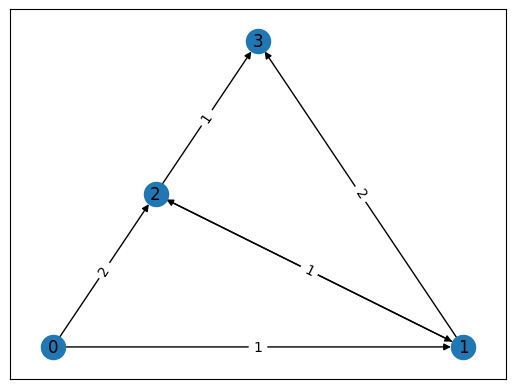
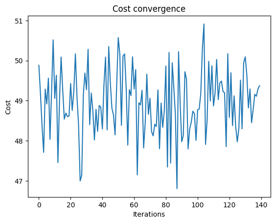
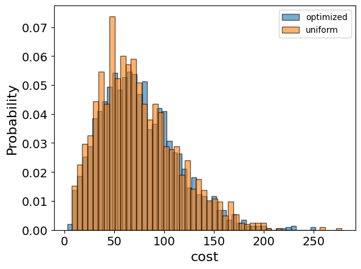
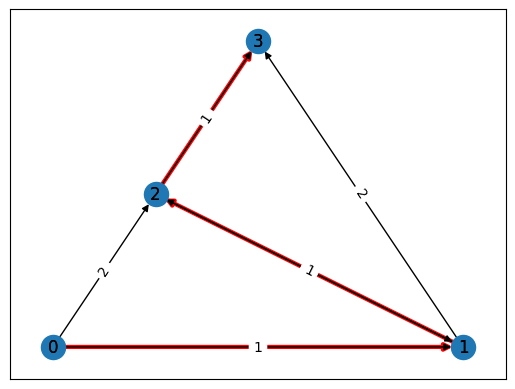

<Card title="View on GitHub" icon="github" href="https://github.com/Classiq/classiq-library/blob/main/applications/logistics/traveling_salesman_problem/traveling_salesman_problem.ipynb">
  Open this notebook in GitHub to run it yourself
</Card>

The "Travelling Salesman Problem" \[[1](#tspwiki)] refers to finding the shortest route between cities, given their relative distances. In a more general sense, given a weighted directed graph, find the shortest route along the graph that goes through all the cities, where the weights correspond to the distance between cities.

For example, in the graph below, the route along $0\rightarrow 1\rightarrow 2\rightarrow 3$ yields a total distance 3, which is the shortest:

```python
import networkx as nx  # noqa

nonedge = 5
graph = nx.DiGraph()
graph.add_nodes_from([0, 1, 2, 3])
graph.add_edges_from([(0, 1), (1, 2), (2, 1), (2, 3)], weight=1)
graph.add_edges_from([(0, 2), (1, 3)], weight=2)
pos = nx.planar_layout(graph)
nx.draw_networkx(graph, pos=pos)

labels = nx.get_edge_attributes(graph, "weight")
nx.draw_networkx_edge_labels(graph, pos, edge_labels=labels)
distance_matrix = nx.convert_matrix.to_numpy_array(graph, nonedge=nonedge)
```


As with many real world problems, this task can be cast as a combinatorial optimization problem.

This demo shows how to employ the Quantum Approximate Optimization Algorithm \[[2](#qaoa)] on the Classiq platform to solve the Travelling Salesperson Problem.

## Mathematical Formulation

First, model the problem mathematically.

The input is the set of distances between the cities: this is given by a matrix $w$, whose $(i,j)$ entry refers to the distance between city $i$ to city $j$.

The output of the model is an optimized route.

Any route can be captured by a binary matrix $x$ that states at each step (row) which city was visited (column):

$$
\begin{aligned}
x_{ij} =
\begin{cases}
      1 & \text{at time step } i \text{ the route is in city } j \\
      0 & \text{else}
\end{cases}\\
\end{aligned}
$$
For example:

$$
\begin{aligned}
x=\begin{pmatrix}
0 & 1 & 0 & 0 \\
0 & 0 & 0 & 1 \\
0 & 0 & 1 & 0 \\
1 & 0 & 0 & 0
\end{pmatrix}
\end{aligned}
$$
means starting from city 1, going to city 3 and then to city 2, and ending at city 

0. **The constrained optimization problem is defined as follows:**

Find x, which minimizes the path distance -

\$

$$
\begin{aligned}
\min_{x_{i, p} \in \{0, 1\}}  \Sigma_{i, j} w_{i, j} \Sigma_p x_{i, p} x_{j, p + 1}\\
\end{aligned}
$$
$$

(Note that the inner sum over $p$ is simply an indicator for whether to go from city $i$ to city $j$.)

such that

- each point is visited once -

$
\begin{aligned}
\forall i, \hspace{0.2cm} \Sigma_p x_{i, p} = 1\\
\end{aligned}
$$
- in each step only a single point is visited -

\$

$$
\begin{aligned}
\forall p, \hspace{0.2cm} \Sigma_i x_{i, p} = 1\\
\end{aligned}
$$
$$

**Directed graph:**

In some cases, such as the graph above, not all cities are connected, and it is more suitable to describe the problem with a weighted, directed graph. In this case, to find the shortest path, assume that unconnected cities have an infinite distance between them. For example, the graph above corresponds to this matrix:

$$
$$
\begin{aligned}
w=\begin{pmatrix}
\infty & 1 & 2 & \infty \\
\infty & \infty & 1 & 2 \\
\infty & 1 & \infty & 1 \\
\infty & \infty & \infty & \infty
\end{pmatrix}
\end{aligned}
$$
$$

In practice, choose a large enough weight rather than infinity.
$$

## Solving with the Classiq Platform

Solve the problem with the Classiq platform using QAOA by defining a Pyomo model.

#

## Building the Pyomo Model from a Matrix of Distances Input

```python
import numpy as np  # noqa
import pyomo.core as pyo
```
```python

## Define a function that gets the matrix of distances and returns a Pyomo model


def PyomoTSP(dis_mat: np.ndarray) -> pyo.ConcreteModel:
    model = pyo.ConcreteModel("TSP")

    assert dis_mat.shape[0] == dis_mat.shape[1], "error distance matrix is not square"

    NofCities = dis_mat.shape[0]  # total number of cities
    cities = range(NofCities)  # list of cities

    # Define the variable, which is the binary matrix x: x[i, j] = 1 indicates that point i is visited at step j
    model.x = pyo.Var(cities, cities, domain=pyo.Binary)

    # we add constraints
    @model.Constraint(cities)
    def each_step_visits_one_point_rule(model, ii):
        return sum(model.x[ii, jj] for jj in range(NofCities)) == 1

    @model.Constraint(cities)
    def each_point_visited_once_rule(model, jj):
        return sum(model.x[ii, jj] for ii in range(NofCities)) == 1

    # Define the Objective function
    def is_connected(i1: int, i2: int):
        return sum(model.x[i1, kk] * model.x[i2, kk + 1] for kk in cities[:-1])

    model.cost = pyo.Objective(
        expr=sum(
            dis_mat[i1, i2] * is_connected(i1, i2) for i1, i2 in model.x.index_set()
        )
    )

    return model
```
#

## Generating a Specific Problem

Pick a specific problem: the graph introduced above:

```python
# Generate a graph that defines the problem
import networkx as nx

graph = nx.DiGraph()
graph.add_nodes_from([0, 1, 2, 3])
graph.add_edges_from([(0, 1), (1, 2), (2, 1), (2, 3)], weight=1)
graph.add_edges_from([(0, 2), (1, 3)], weight=2)
pos = nx.planar_layout(graph)
nx.draw_networkx(graph, pos=pos)

labels = nx.get_edge_attributes(graph, "weight")
nx.draw_networkx_edge_labels(graph, pos, edge_labels=labels);
```


Convert the graph object into a matrix of distances and then generate a Pyomo model for this example:

```python
nonedge = 5  # this variable refers to how much we penalize for unconnected points
distance_matrix = nx.convert_matrix.to_numpy_array(graph, nonedge=nonedge)
tsp_model = PyomoTSP(distance_matrix)
```
#

## Setting Up the Classiq Problem Instance

To solve the Pyomo model defined above, use the `CombinatorialProblem` Python class.

Under the hood it translates the Pyomo model to a quantum model of QAOA \[[1](#qaoa)], with the cost Hamiltonian translated from the Pyomo model.

Choose the number of layers for the QAOA ansatz using the `num_layers` argument:

```python
from classiq import *
from classiq.applications.combinatorial_optimization import CombinatorialProblem

combi = CombinatorialProblem(pyo_model=tsp_model, num_layers=8)

qmod = combi.get_model()
```
#

## Synthesizing the QAOA Circuit and Solving the Problem

Synthesize and view the QAOA circuit (ansatz) used to solve the optimization problem:

```python
qprog = combi.get_qprog()
show(qprog)
```
<Info>
  **Output:**

  

```

Quantum program link: https://platform.classiq.io/circuit/2zJRXpc3YfcnB9t3wHdi4C956A7
  

```
</Info>

Solve the problem by calling the `optimize` method of the `CombinatorialProblem` object.

For the classical optimization part of QAOA, define the maximum number of classical iterations (`maxiter`) and the $\alpha$-parameter (`quantile`) for running CVaR-QAOA, an improved variation of QAOA \[[2](#cvar)]:

```python
optimized_params = combi.optimize(maxiter=150, quantile=0.6)
```
<Info>
  **Output:**

  

```

Optimization Progress:  93%|████████████████████████████████████████████████████████████████████████████████████████████████████████████████████████████████████████████████████████████████████████▉            | 140/150 [13:14<00:56,  5.68s/it]
  

```
</Info>

Check the convergence of the run:

```python
import matplotlib.pyplot as plt

plt.plot(combi.cost_trace)
plt.xlabel("Iterations")
plt.ylabel("Cost")
plt.title("Cost convergence")
```
<Info>
  **Output:**

  

```

Text(0.5, 1.0, 'Cost convergence')
  

```
</Info>



## Optimization Results

Examine the statistics of the algorithm. To get samples with the optimized parameters, call the `sample` method:

```python
optimization_result = combi.sample(optimized_params)
optimization_result.sort_values(by="cost").head(5)
```
|      | solution                                               | probability | cost |
| ---- | ------------------------------------------------------ | ----------- | ---- |
| 108  | \{'x': \[\[1, 0, 0, 0], \[0, 1, 0, 0], \[0, 0, 1, 0... | 0.000488    | 3    |
| 41   | \{'x': \[\[0, 0, 0, 1], \[0, 0, 0, 1], \[1, 0, 0, 0... | 0.000977    | 5    |
| 896  | \{'x': \[\[1, 0, 0, 0], \[0, 1, 0, 0], \[0, 0, 0, 0... | 0.000488    | 7    |
| 147  | \{'x': \[\[1, 0, 0, 0], \[0, 0, 0, 0], \[0, 0, 0, 0... | 0.000488    | 8    |
| 1240 | \{'x': \[\[1, 0, 0, 0], \[0, 1, 0, 0], \[0, 0, 0, 1... | 0.000488    | 8    |

Compare the optimized results with uniformly sampled results:

```python
uniform_result = combi.sample_uniform()
```

And compare the histograms:

```python
optimization_result["cost"].plot(
    kind="hist",
    bins=50,
    edgecolor="black",
    weights=optimization_result["probability"],
    alpha=0.6,
    label="optimized",
)
uniform_result["cost"].plot(
    kind="hist",
    bins=50,
    edgecolor="black",
    weights=uniform_result["probability"],
    alpha=0.6,
    label="uniform",
)
plt.legend()
plt.ylabel("Probability", fontsize=16)
plt.xlabel("cost", fontsize=16)
plt.tick_params(axis="both", labelsize=14)
```


Plot the solution:

```python
best_solution = optimization_result.solution[optimization_result.cost.idxmin()]
best_solution
```
<Info>
  **Output:**

  

```
{'x': [[1, 0, 0, 0], [0, 1, 0, 0], [0, 0, 1, 0], [0, 0, 0, 1]]}
  

```
</Info>

Lastly, compare with the classical solution of the problem:

```python
from pyomo.opt import SolverFactory

solver = SolverFactory("couenne")
solver.solve(tsp_model)

tsp_model.display()
```
<Info>
  **Output:**

  

```

Model TSP

    Variables:
      x : Size=16, Index=x_index
          Key    : Lower : Value : Upper : Fixed : Stale : Domain
          (0, 0) :     0 :   1.0 :     1 : False : False : Binary
          (0, 1) :     0 :   0.0 :     1 : False : False : Binary
          (0, 2) :     0 :   0.0 :     1 : False : False : Binary
          (0, 3) :     0 :   0.0 :     1 : False : False : Binary
          (1, 0) :     0 :   0.0 :     1 : False : False : Binary
          (1, 1) :     0 :   1.0 :     1 : False : False : Binary
          (1, 2) :     0 :   0.0 :     1 : False : False : Binary
          (1, 3) :     0 :   0.0 :     1 : False : False : Binary
          (2, 0) :     0 :   0.0 :     1 : False : False : Binary
          (2, 1) :     0 :   0.0 :     1 : False : False : Binary
          (2, 2) :     0 :   1.0 :     1 : False : False : Binary
          (2, 3) :     0 :   0.0 :     1 : False : False : Binary
          (3, 0) :     0 :   0.0 :     1 : False : False : Binary
          (3, 1) :     0 :   0.0 :     1 : False : False : Binary
          (3, 2) :     0 :   0.0 :     1 : False : False : Binary
          (3, 3) :     0 :   1.0 :     1 : False : False : Binary

    Objectives:
      cost : Size=1, Index=None, Active=True
          Key  : Active : Value
          None :   True :   3.0

    Constraints:
      each_step_visits_one_point_rule : Size=4
          Key : Lower : Body : Upper
            0 :   1.0 :  1.0 :   1.0
            1 :   1.0 :  1.0 :   1.0
            2 :   1.0 :  1.0 :   1.0
            3 :   1.0 :  1.0 :   1.0
      each_point_visited_once_rule : Size=4
          Key : Lower : Body : Upper
            0 :   1.0 :  1.0 :   1.0
            1 :   1.0 :  1.0 :   1.0
            2 :   1.0 :  1.0 :   1.0
            3 :   1.0 :  1.0 :   1.0
  

```
</Info>

If you get the right solution, plot it:

```python
best_classical_solution = np.array(
    [int(pyo.value(tsp_model.x[idx])) for idx in np.ndindex(distance_matrix.shape)]
)
```
```python

best_quantum_solution = np.array(
    optimization_result.solution[optimization_result.cost.idxmin()]["x"]
)
```
```python

if (best_classical_solution == best_quantum_solution.flatten()).all():
    routesol = np.zeros(4, dtype=int)
    for k in range(4):
        indices = np.where(
            best_quantum_solution.reshape(distance_matrix.shape)[k, :] == 1
        )[0]
        routesol[k] = int(indices[0]) if len(indices) > 0 else 0
    edgesol = list(nx.utils.pairwise(routesol))
    nx.draw_networkx(
        graph,
        pos,
        with_labels=True,
        edgelist=edgesol,
        edge_color="red",
        node_size=200,
        width=3,
    )
    nx.draw_networkx(graph, pos=pos)

    labels = nx.get_edge_attributes(graph, "weight")
    nx.draw_networkx_edge_labels(graph, pos, edge_labels=labels)
    print("The route of the traveller is:", routesol)
```
<Info>
  **Output:**

  

```

The route of the traveller is: [0 1 2 3]
  

```
</Info>



## References

<a id="tspwiki">\[1]</a> [Travelling Salesman Problem (Wikipedia).](https://en.wikipedia.org/wiki/Travelling_salesman_problem)

<a id="qaoa">\[2]</a> [Farhi, Edward, Jeffrey Goldstone, and Sam Gutmann. (2014). A quantum approximate optimization algorithm. arXiv preprint arXiv:1411.4028.](https://arxiv.org/abs/1411.4028)

<a id="cvar">\[3]</a> [Barkoutsos, Panagiotis Kl, et al. (2020). Improving variational quantum optimization using CVaR. Quantum 4: 256.](https://arxiv.org/abs/1907.04769)