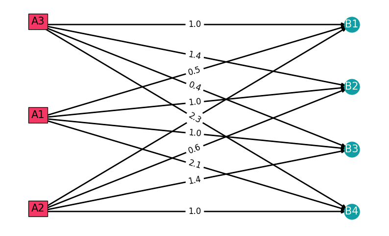
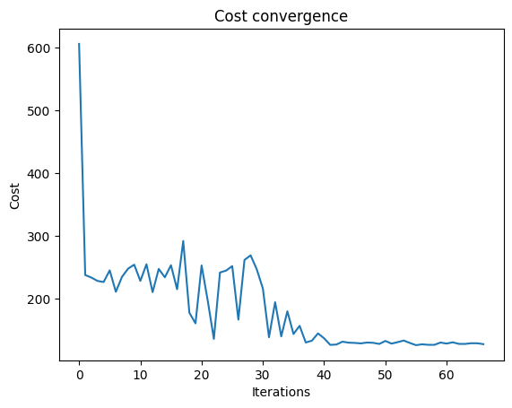
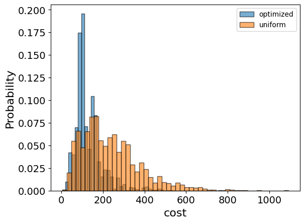
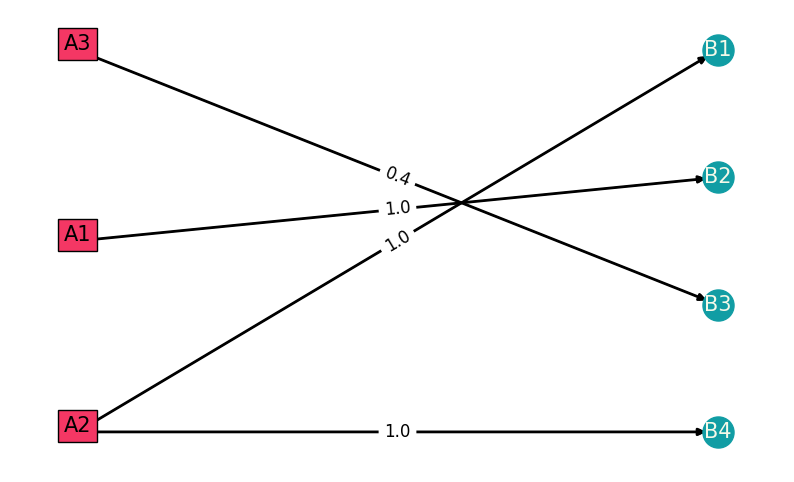
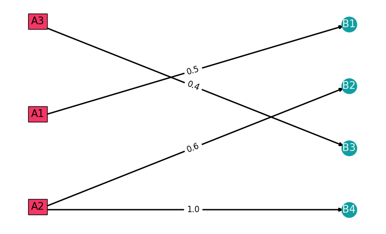

<Card title="View on GitHub" icon="github" href="https://github.com/Classiq/classiq-library/blob/main/applications/optimization/electric_grid_optimization/electric_grid_optimization.ipynb">
  Open this notebook in GitHub to run it yourself
</Card>

For a set of N power plants (sources) and M consumers, the goal is to supply power to all consumers while meeting the constraints of the power plants and minimizing the total cost of supplying power.

The model here is a minor variation of \[[1](#oppwer)].

Mathematical model, minimizing the objective function:

$$
z = \sum_{i=1}^{n} \sum_{j=1}^{m} Z_{ij}x_{ij}
$$
where $x_{ij}$ is the required values of the transmitted power from source $A_i$ to consumer $B_j$.

The unit cost of transmitting power from node $A_i$ to node $B_j$ is $Z_{ij}$.

Constraint: the sum of powers flowing from power plant transmission lines to all customer nodes must be up to the power of the source $A_i$:

$$
\sum_{j=1}^{M} x_{ij} \leq A_{i}   \quad    i=1,2,...,N
$$
Each consumer receives power $B_{j}$:

$$
\sum_{i=1}^{N} x_{ij} = B_{j}   \quad    j=1,2,...,M
$$
This example takes $B_{j} = 1$ and $A_{i} = 2$.

Note the use of two kinds of constraints: equality and inequality.

## Building the Problem

```python
import random

import numpy as np
import torch

random.seed(8)
np.random.seed(8)
torch.manual_seed(8)
```
<Info>
  **Output:**

  

```
<torch._C.

Generator at 0x7135940974b0>
  

```
</Info>

```python
from itertools import product

import matplotlib.pyplot as plt
import networkx as nx  # noqa
import numpy as np
import pandas as pd

# building data matrix, it doesn't need to be a symmetric matrix.
cost_matrix = np.array(
    [[0.5, 1.0, 1.0, 2.1], [1.0, 0.6, 1.4, 1.0], [1.0, 1.4, 0.4, 2.3]]
)

Sources = ["A1", "A2", "A3"]
Consumers = ["B1", "B2", "B3", "B4"]

# number of sources
N = len(Sources)
# number of consumers
M = len(Consumers)

graph = nx.DiGraph()
graph.add_nodes_from(Sources + Consumers)
for n, m in product(range(N), range(M)):
    graph.add_edges_from([(Sources[n], Consumers[m])], weight=cost_matrix[n, m])


# Plot the graph
plt.figure(figsize=(10, 6))
left = nx.bipartite.sets(graph)[0]
pos = nx.bipartite_layout(graph, left)

nx.draw_networkx(graph, pos=pos, nodelist=Consumers, font_size=22, font_color="None")
nx.draw_networkx_nodes(
    graph, pos, nodelist=Consumers, node_color="#119DA4", node_size=500
)
for fa in Sources:
    x, y = pos[fa]
    plt.text(
        x,
        y,
        s=fa,
        bbox=dict(facecolor="#F43764", alpha=1),
        horizontalalignment="center",
        fontsize=15,
    )

nx.draw_networkx_edges(graph, pos, width=2)
labels = nx.get_edge_attributes(graph, "weight")
nx.draw_networkx_edge_labels(graph, pos, edge_labels=labels, font_size=12)
nx.draw_networkx_labels(
    graph,
    pos,
    labels={co: co for co in Consumers},
    font_size=15,
    font_color="#F4F9E9",
)

plt.axis("off")
plt.show()
```


Build the Pyomo mjodel for a classical combinatorial optimization problem:

```python
import pyomo.environ as pyo
from IPython.display import Markdown, display

opt_model = pyo.ConcreteModel()

sources_lst = range(N)
consumers_lst = range(M)

opt_model.x = pyo.Var(sources_lst, consumers_lst, domain=pyo.Binary)


@opt_model.Constraint(sources_lst)
def source_supply_rule(model, n):  # constraint (1)
    return sum(model.x[n, m] for m in consumers_lst) <= 2


@opt_model.Constraint(consumers_lst)
def each_consumer_is_supplied_rule(model, m):  # constraint (2)
    return sum(model.x[n, m] for n in sources_lst) == 1


opt_model.cost = pyo.Objective(
    expr=sum(
        cost_matrix[n, m] * opt_model.x[n, m]
        for n in sources_lst
        for m in consumers_lst
    ),
    sense=pyo.minimize,
)
```

Print the classical optimization problem:

```python
opt_model.pprint()
```
<Info>
  **Output:**

  

```
1 Var Declarations
      x : Size=12, Index={0, 1, 2}*{0, 1, 2, 3}
          Key    : Lower : Value : Upper : Fixed : Stale : Domain
          (0, 0) :     0 :  None :     1 : False :  True : Binary
          (0, 1) :     0 :  None :     1 : False :  True : Binary
          (0, 2) :     0 :  None :     1 : False :  True : Binary
          (0, 3) :     0 :  None :     1 : False :  True : Binary
          (1, 0) :     0 :  None :     1 : False :  True : Binary
          (1, 1) :     0 :  None :     1 : False :  True : Binary
          (1, 2) :     0 :  None :     1 : False :  True : Binary
          (1, 3) :     0 :  None :     1 : False :  True : Binary
          (2, 0) :     0 :  None :     1 : False :  True : Binary
          (2, 1) :     0 :  None :     1 : False :  True : Binary
          (2, 2) :     0 :  None :     1 : False :  True : Binary
          (2, 3) :     0 :  None :     1 : False :  True : Binary

  1 Objective Declarations
      cost : Size=1, Index=None, Active=True
          Key  : Active : Sense    : Expression
          None :   True : minimize : 0.5*x[0,0] + x[0,1] + x[0,2] + 2.1*x[0,3] + x[1,0] + 0.6*x[1,1] + 1.4*x[1,2] + x[1,3] + x[2,0] + 1.4*x[2,1] + 0.4*x[2,2] + 2.3*x[2,3]

  2 Constraint Declarations
      each_consumer_is_supplied_rule : Size=4, Index={0, 1, 2, 3}, Active=True
          Key : Lower : Body                     : Upper : Active
            0 :   1.0 : x[0,0] + x[1,0] + x[2,0] :   1.0 :   True
            1 :   1.0 : x[0,1] + x[1,1] + x[2,1] :   1.0 :   True
            2 :   1.0 : x[0,2] + x[1,2] + x[2,2] :   1.0 :   True
            3 :   1.0 : x[0,3] + x[1,3] + x[2,3] :   1.0 :   True
      source_supply_rule : Size=3, Index={0, 1, 2}, Active=True
          Key : Lower : Body                              : Upper : Active
            0 :  -Inf : x[0,0] + x[0,1] + x[0,2] + x[0,3] :   2.0 :   True
            1 :  -Inf : x[1,0] + x[1,1] + x[1,2] + x[1,3] :   2.0 :   True
            2 :  -Inf : x[2,0] + x[2,1] + x[2,2] + x[2,3] :   2.0 :   True

  4 Declarations: x source_supply_rule each_consumer_is_supplied_rule cost
  

```
</Info>

## Solving with Classiq

Take the specific example outlined above.

#

## Generating Parameters for the Quantum Circuit

```python
from classiq import *
from classiq.applications.combinatorial_optimization import CombinatorialProblem

combi = CombinatorialProblem(pyo_model=opt_model, num_layers=4, penalty_factor=10)

qmod = combi.get_model()
```
#

## Synthesizing the QAOA Circuit and Solving the Problem

Synthesize and view the QAOA circuit (ansatz) used to solve the optimization problem:

```python
qprog = combi.get_qprog()
show(qprog)
```
<Info>
  **Output:**

  

```

Quantum program link: https://platform.classiq.io/circuit/39Z3KwseLb8I9dfXZ3jjAPvBXrL
  

```
</Info>

<Info>
  **Output:**

  

```
https://platform.classiq.io/circuit/39Z3KwseLb8I9dfXZ3jjAPvBXrL?login=True&version=17
  

```
</Info>

Solve the problem by calling the `optimize` method of the `CombinatorialProblem` object.

For the classical optimization part of QAOA, define the maximum number of classical iterations (`maxiter`) and the $\alpha$-parameter (`quantile`) for running CVaR-QAOA, an improved variation of the QAOA algorithm \[[3](#cvar)]:

```python
optimized_params = combi.optimize(maxiter=100, quantile=1)
```

Check the convergence of the run:

```python
import matplotlib.pyplot as plt

plt.plot(combi.cost_trace)
plt.xlabel("Iterations")
plt.ylabel("Cost")
plt.title("Cost convergence")
```
<Info>
  **Output:**

  

```

Text(0.5, 1.0, 'Cost convergence')
  

```
</Info>



## Best Solution Statistics

```python
optimization_result = combi.sample(optimized_params)
optimization_result.sort_values(by="cost").head(5)
```
|      | solution                                               | probability | cost |
| ---- | ------------------------------------------------------ | ----------- | ---- |
| 415  | \{'x': \[\[0, 1, 0, 0], \[1, 0, 0, 1], \[0, 0, 1, 0... | 0.000488    | 3.4  |
| 1022 | \{'x': \[\[0, 1, 0, 1], \[0, 0, 0, 0], \[1, 0, 1, 0... | 0.000488    | 4.5  |
| 348  | \{'x': \[\[1, 0, 0, 0], \[0, 0, 0, 1], \[0, 0, 1, 0... | 0.000488    | 21.9 |
| 169  | \{'x': \[\[0, 0, 0, 0], \[0, 1, 0, 0], \[0, 0, 1, 1... | 0.000977    | 23.3 |
| 1215 | \{'x': \[\[0, 0, 0, 1], \[1, 0, 0, 0], \[0, 0, 1, 0... | 0.000488    | 23.5 |

Compare the optimized results to uniformly sampled results:

```python
uniform_result = combi.sample_uniform()
```

And compare the histograms:

```python
optimization_result["cost"].plot(
    kind="hist",
    bins=50,
    edgecolor="black",
    weights=optimization_result["probability"],
    alpha=0.6,
    label="optimized",
)
uniform_result["cost"].plot(
    kind="hist",
    bins=50,
    edgecolor="black",
    weights=uniform_result["probability"],
    alpha=0.6,
    label="uniform",
)
plt.legend()
plt.ylabel("Probability", fontsize=16)
plt.xlabel("cost", fontsize=16)
plt.tick_params(axis="both", labelsize=14)
```


## Best Solution

```python
# This function plots the solution in a table and a graph


def plotting_sol(x_sol, cost, is_classic: bool):
    x_sol_to_mat = np.reshape(np.array(x_sol), [N, M])  # vector to matrix
    # opened facilities will be marked in red
    opened_fac_dict = {}
    for fa in range(N):
        if sum(x_sol_to_mat[fa, m] for m in range(M)) > 0:
            opened_fac_dict.update({Sources[fa]: "background-color: #F43764"})

    # classical or quantum
    if is_classic == True:
        display(Markdown("**CLASSICAL SOLUTION**"))
        print("total cost= ", cost)
    else:
        display(Markdown("**QAOA SOLUTION**"))
        print("total cost= ", cost)

    # plotting in a table
    df = pd.DataFrame(x_sol_to_mat)
    df.columns = Consumers
    df.index = Sources
    plotable = df.style.apply(lambda x: x.index.map(opened_fac_dict))
    display(plotable)

    # plotting in a graph
    graph_sol = nx.DiGraph()
    graph_sol.add_nodes_from(Sources + Consumers)
    for n, m in product(range(N), range(M)):
        if x_sol_to_mat[n, m] > 0:
            graph_sol.add_edges_from(
                [(Sources[n], Consumers[m])], weight=cost_matrix[n, m]
            )

    plt.figure(figsize=(10, 6))
    left = nx.bipartite.sets(graph_sol, top_nodes=Sources)[0]
    pos = nx.bipartite_layout(graph_sol, left)

    nx.draw_networkx(
        graph_sol, pos=pos, nodelist=Consumers, font_size=22, font_color="None"
    )
    nx.draw_networkx_nodes(
        graph_sol, pos, nodelist=Consumers, node_color="#119DA4", node_size=500
    )
    for fa in Sources:
        x, y = pos[fa]
        if fa in opened_fac_dict.keys():
            plt.text(
                x,
                y,
                s=fa,
                bbox=dict(facecolor="#F43764", alpha=1),
                horizontalalignment="center",
                fontsize=15,
            )
        else:
            plt.text(
                x,
                y,
                s=fa,
                bbox=dict(facecolor="#F4F9E9", alpha=1),
                horizontalalignment="center",
                fontsize=15,
            )

    nx.draw_networkx_edges(graph_sol, pos, width=2)
    labels = nx.get_edge_attributes(graph_sol, "weight")
    nx.draw_networkx_edge_labels(graph, pos, edge_labels=labels, font_size=12)
    nx.draw_networkx_labels(
        graph_sol,
        pos,
        labels={co: co for co in Consumers},
        font_size=15,
        font_color="#F4F9E9",
    )

    plt.axis("off")
    plt.show()


best_solution = optimization_result.loc[optimization_result.cost.idxmin()]

plotting_sol(
    [best_solution.solution["x"][i] for i in range(len(best_solution.solution["x"]))],
    best_solution.cost,
    is_classic=False,
)
```
<Info>
  **Output:**

  

```
<IPython.core.display.

Markdown object>
  

```
</Info>

<Info>
  **Output:**

  

```
total cost=  3.4
  

```
</Info>

<style type="text/css"> #T\_209ee\_row0\_col0, #T\_209ee\_row0\_col1, #T\_209ee\_row0\_col2, #T\_209ee\_row0\_col3, #T\_209ee\_row1\_col0, #T\_209ee\_row1\_col1, #T\_209ee\_row1\_col2, #T\_209ee\_row1\_col3, #T\_209ee\_row2\_col0, #T\_209ee\_row2\_col1, #T\_209ee\_row2\_col2, #T\_209ee\_row2\_col3 \{ background-color: #F43764;
} </style>

<table id="T_209ee">
  <thead>
    <tr>
      <th className="blank level0" />

      <th id="T_209ee_level0_col0" className="col_heading level0 col0">B1</th>
      <th id="T_209ee_level0_col1" className="col_heading level0 col1">B2</th>
      <th id="T_209ee_level0_col2" className="col_heading level0 col2">B3</th>
      <th id="T_209ee_level0_col3" className="col_heading level0 col3">B4</th>
    </tr>
  </thead>

  <tbody>
    <tr>
      <th id="T_209ee_level0_row0" className="row_heading level0 row0">A1</th>
      <td id="T_209ee_row0_col0" className="data row0 col0">0</td>
      <td id="T_209ee_row0_col1" className="data row0 col1">1</td>
      <td id="T_209ee_row0_col2" className="data row0 col2">0</td>
      <td id="T_209ee_row0_col3" className="data row0 col3">0</td>
    </tr>

    <tr>
      <th id="T_209ee_level0_row1" className="row_heading level0 row1">A2</th>
      <td id="T_209ee_row1_col0" className="data row1 col0">1</td>
      <td id="T_209ee_row1_col1" className="data row1 col1">0</td>
      <td id="T_209ee_row1_col2" className="data row1 col2">0</td>
      <td id="T_209ee_row1_col3" className="data row1 col3">1</td>
    </tr>

    <tr>
      <th id="T_209ee_level0_row2" className="row_heading level0 row2">A3</th>
      <td id="T_209ee_row2_col0" className="data row2 col0">0</td>
      <td id="T_209ee_row2_col1" className="data row2 col1">0</td>
      <td id="T_209ee_row2_col2" className="data row2 col2">1</td>
      <td id="T_209ee_row2_col3" className="data row2 col3">0</td>
    </tr>
  </tbody>
</table>



## Comparing to a Classical Solver

```python
from pyomo.opt import SolverFactory

solver = SolverFactory("couenne")
solver.solve(opt_model)

best_classical_solution = np.array(
    [pyo.value(opt_model.x[idx]) for idx in np.ndindex(cost_matrix.shape)]
).reshape(cost_matrix.shape)

plotting_sol(
    np.round([pyo.value(opt_model.x[idx]) for idx in np.ndindex(cost_matrix.shape)]),
    pyo.value(opt_model.cost),
    is_classic=True,
)
```
<Info>
  **Output:**

  

```
<IPython.core.display.

Markdown object>
  

```
</Info>

<Info>
  **Output:**

  

```
total cost=  2.4999999996418167
  

```
</Info>

<style type="text/css"> #T\_96020\_row0\_col0, #T\_96020\_row0\_col1, #T\_96020\_row0\_col2, #T\_96020\_row0\_col3, #T\_96020\_row1\_col0, #T\_96020\_row1\_col1, #T\_96020\_row1\_col2, #T\_96020\_row1\_col3, #T\_96020\_row2\_col0, #T\_96020\_row2\_col1, #T\_96020\_row2\_col2, #T\_96020\_row2\_col3 \{ background-color: #F43764;
} </style>

<table id="T_96020">
  <thead>
    <tr>
      <th className="blank level0" />

      <th id="T_96020_level0_col0" className="col_heading level0 col0">B1</th>
      <th id="T_96020_level0_col1" className="col_heading level0 col1">B2</th>
      <th id="T_96020_level0_col2" className="col_heading level0 col2">B3</th>
      <th id="T_96020_level0_col3" className="col_heading level0 col3">B4</th>
    </tr>
  </thead>

  <tbody>
    <tr>
      <th id="T_96020_level0_row0" className="row_heading level0 row0">A1</th>
      <td id="T_96020_row0_col0" className="data row0 col0">1.000000</td>
      <td id="T_96020_row0_col1" className="data row0 col1">0.000000</td>
      <td id="T_96020_row0_col2" className="data row0 col2">0.000000</td>
      <td id="T_96020_row0_col3" className="data row0 col3">0.000000</td>
    </tr>

    <tr>
      <th id="T_96020_level0_row1" className="row_heading level0 row1">A2</th>
      <td id="T_96020_row1_col0" className="data row1 col0">0.000000</td>
      <td id="T_96020_row1_col1" className="data row1 col1">1.000000</td>
      <td id="T_96020_row1_col2" className="data row1 col2">0.000000</td>
      <td id="T_96020_row1_col3" className="data row1 col3">1.000000</td>
    </tr>

    <tr>
      <th id="T_96020_level0_row2" className="row_heading level0 row2">A3</th>
      <td id="T_96020_row2_col0" className="data row2 col0">0.000000</td>
      <td id="T_96020_row2_col1" className="data row2 col1">-0.000000</td>
      <td id="T_96020_row2_col2" className="data row2 col2">1.000000</td>
      <td id="T_96020_row2_col3" className="data row2 col3">0.000000</td>
    </tr>
  </tbody>
</table>



## References

<a id="oppower">\[1]</a> [O. V. Shemelova, E. V. Yakovleva, T. G. Makuseva, I. I. Eremina, and O. N. Makusev. (2019). Solving optimization problems when designing power supply circuits. E3S Web of Conferences 124, 04011.](https://www.e3s-conferences.org/articles/e3sconf/pdf/2019/50/e3sconf_ses18_04011.pdf)