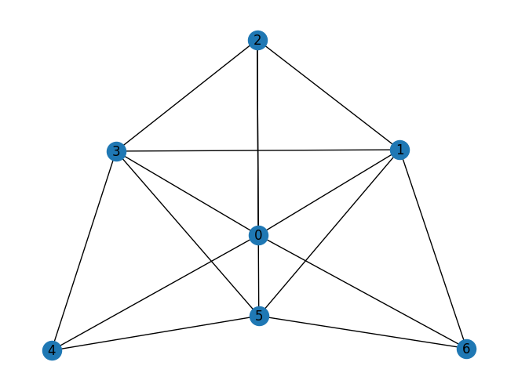
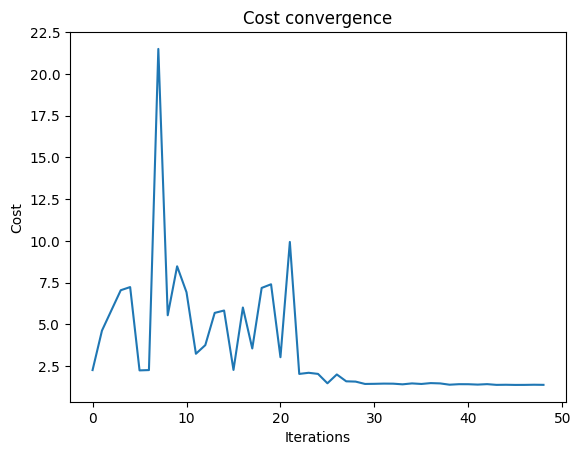
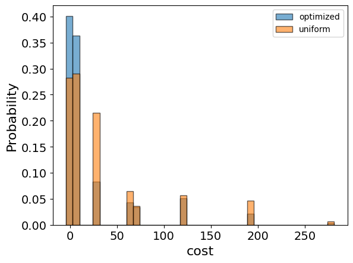
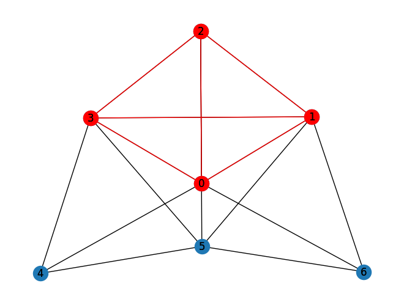

<Card title="View on GitHub" icon="github" href="https://github.com/Classiq/classiq-library/blob/main/applications/optimization/max_clique/max_clique.ipynb">
  Open this notebook in GitHub to run it yourself
</Card>

This tutorial solves the max clique problem in graph theory using Classiq.

A clique is a subset of vertices in a graph such that each pair is adjacent to one other.

Given a graph $G = (V,E)$, find the maximal clique in the graph. It is known to be in the NP-hard complexity class.

## Defining the Optimization Problem

Encode each node as a binary variable:

```python
import networkx as nx
import numpy as np
import pyomo.environ as pyo


def define_max_clique_model(graph):
    model = pyo.ConcreteModel()

    # each x_i states if node i belongs to the cliques
    model.x = pyo.Var(graph.nodes, domain=pyo.Binary)
    x_variables = np.array(list(model.x.values()))

    # define the complement adjacency matrix as the matrix where 1 exists for each non-existing edge
    adjacency_matrix = nx.convert_matrix.to_numpy_array(graph, nonedge=0)
    complement_adjacency_matrix = (
        1
        - nx.convert_matrix.to_numpy_array(graph, nonedge=0)
        - np.identity(len(model.x))
    )

    # constraint that 2 nodes without edge in the graph cannot be chosen together
    model.clique_constraint = pyo.Constraint(
        expr=x_variables @ complement_adjacency_matrix @ x_variables == 0
    )

    # maximize the number of nodes in the chosen clique
    model.value = pyo.Objective(expr=sum(x_variables), sense=pyo.maximize)

    return model
```

Initialize the model with parameters:

```python
graph = nx.erdos_renyi_graph(7, 0.6, seed=79)
nx.draw_kamada_kawai(graph, with_labels=True)
max_clique_model = define_max_clique_model(graph)
```


## Setting Up the Classiq Problem Instance

To solve the Pyomo model defined above, use the `CombinatorialProblem` Python class.

Under the hood, it translates the Pyomo model to a quantum model of the Quantum Approximate Optimization Algorithm (QAOA) \[[1](#qaoa)], with a cost Hamiltonian translated from the Pyomo model.

Choose the number of layers for the QAOA ansatz using the `num_layers` argument:

```python
from classiq import *
from classiq.applications.combinatorial_optimization import CombinatorialProblem

combi = CombinatorialProblem(pyo_model=max_clique_model, num_layers=3)

qmod = combi.get_model()
```

## Synthesizing the QAOA Circuit and Solving the Problem

Synthesize and view the QAOA circuit (ansatz) used to solve the optimization problem:

```python
qprog = combi.get_qprog()
show(qprog)
```
<Info>
  **Output:**

  

```

Quantum program link: https://platform.classiq.io/circuit/38w9cHY6lrCyQi3RXfs4B8gw3Ys
  

```
</Info>

<Info>
  **Output:**

  

```
https://platform.classiq.io/circuit/38w9cHY6lrCyQi3RXfs4B8gw3Ys?login=True&version=15
  

```
</Info>

Set the quantum backend on which to execute:

```python
execution_preferences = ExecutionPreferences(
    backend_preferences=ClassiqBackendPreferences(backend_name="simulator"),
)
```

Solve the problem by calling the `optimize` method of the `CombinatorialProblem` object.

For the classical optimization part of the QAOA algorithm, define the maximum number of classical iterations (`maxiter`) and the $\alpha$-parameter (`quantile`) for running CVaR-QAOA, an improved variation of the QAOA algorithm \[[2](#cvar)]:

```python
optimized_params = combi.optimize(execution_preferences, maxiter=50, quantile=0.7)
```
```python

import matplotlib.pyplot as plt

plt.plot(combi.cost_trace)
plt.xlabel("Iterations")
plt.ylabel("Cost")
plt.title("Cost convergence")
```
<Info>
  **Output:**

  

```

Text(0.5, 1.0, 'Cost convergence')
  

```
</Info>



## Viewing the Optimization Results

Examine the statistics of the algorithm.

The optimization is always defined as a minimization problem, so the Pyomo-to-Qmod translator changes the positive maximization objective to negative minimization.

To get samples with the optimized parameters, call the `sample` method:

```python
optimization_result = combi.sample(combi.optimized_params)
optimization_result.sort_values(by="cost").head(5)
```
|    | solution                       | probability | cost |
| -- | ------------------------------ | ----------- | ---- |
| 37 | \{'x': \[1, 1, 1, 1, 0, 0, 0]} | 0.006836    | -4   |
| 52 | \{'x': \[0, 1, 1, 1, 0, 1, 0]} | 0.004395    | -4   |
| 44 | \{'x': \[1, 0, 0, 1, 1, 0, 0]} | 0.005371    | -3   |
| 34 | \{'x': \[0, 0, 0, 1, 1, 1, 0]} | 0.007812    | -3   |
| 50 | \{'x': \[1, 1, 0, 0, 0, 0, 1]} | 0.004883    | -3   |

Compare the optimized results to uniformly sampled results:

```python
uniform_result = combi.sample_uniform()
```

And compare the histograms:

```python
optimization_result["cost"].plot(
    kind="hist",
    bins=40,
    edgecolor="black",
    weights=optimization_result["probability"],
    alpha=0.6,
    label="optimized",
)
uniform_result["cost"].plot(
    kind="hist",
    bins=40,
    edgecolor="black",
    weights=uniform_result["probability"],
    alpha=0.6,
    label="uniform",
)
plt.legend()
plt.ylabel("Probability", fontsize=16)
plt.xlabel("cost", fontsize=16)
plt.tick_params(axis="both", labelsize=14)
```


Plot the solution:

```python
best_solution = optimization_result.solution[optimization_result.cost.idxmin()]
best_solution
```
<Info>
  **Output:**

  

```
{'x': [1, 1, 1, 1, 0, 0, 0]}
  

```
</Info>

```python
solution_nodes = [v for v in graph.nodes if best_solution["x"][v]]
solution_edges = [
    (u, v) for u, v in graph.edges if u in solution_nodes and v in solution_nodes
]
nx.draw_kamada_kawai(graph, with_labels=True)
nx.draw_kamada_kawai(
    graph,
    with_labels=True,
    nodelist=solution_nodes,
    edgelist=solution_edges,
    node_color="r",
    edge_color="r",
)
```


## Comparing to a Classical Solver

Lastly, compare to the classical solution of the problem:

```python
from pyomo.opt import SolverFactory

solver = SolverFactory("couenne")
solver.solve(max_clique_model)
classical_solution = [
    int(pyo.value(max_clique_model.x[i])) for i in range(len(max_clique_model.x))
]
print("Classical solution:", classical_solution)
```
<Info>
  **Output:**

  

```

Classical solution: [1, 1, 1, 1, 0, 0, 0]
  

```
</Info>

```python
solution = [int(pyo.value(max_clique_model.x[i])) for i in graph.nodes]
solution_nodes = [v for v in graph.nodes if solution[v]]
solution_edges = [
    (u, v) for u, v in graph.edges if u in solution_nodes and v in solution_nodes
]
nx.draw_kamada_kawai(graph, with_labels=True)
nx.draw_kamada_kawai(
    graph,
    with_labels=True,
    nodelist=solution_nodes,
    edgelist=solution_edges,
    node_color="r",
    edge_color="r",
)
```


## References

<a id="qaoa">\[1]</a> [Farhi, Edward, Jeffrey Goldstone, and Sam Gutmann. (2014). A quantum approximate optimization algorithm. arXiv preprint arXiv:1411.4028.](https://arxiv.org/abs/1411.4028)

<a id="cvar">\[2]</a> [Barkoutsos, Panagiotis Kl, et al. (2020). Improving variational quantum optimization using CVaR. Quantum 4: 256.](https://arxiv.org/abs/1907.04769)