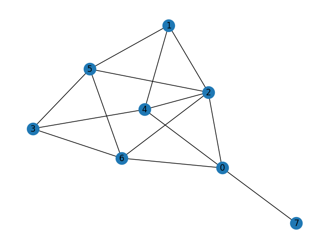
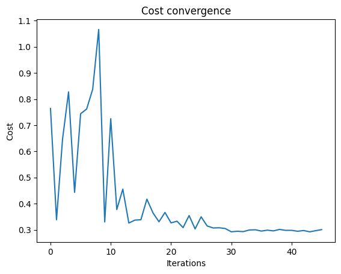
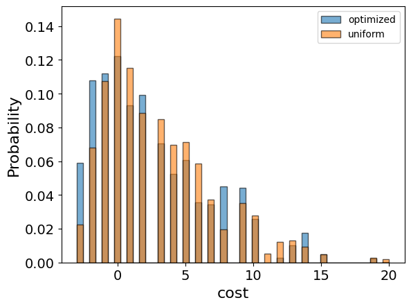
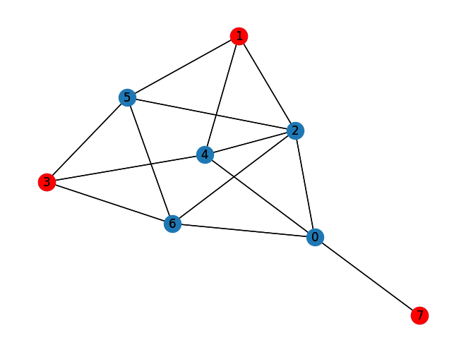
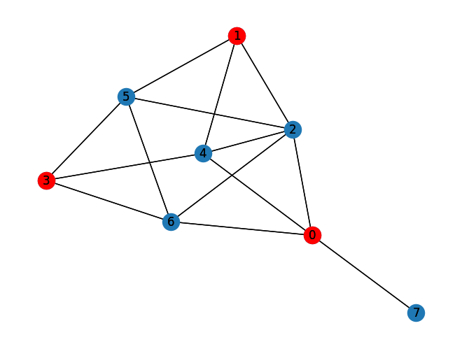

<Card title="View on GitHub" icon="github" href="https://github.com/Classiq/classiq-library/blob/main/applications/optimization/max_independent_set/max_independent_set.ipynb">
  Open this notebook in GitHub to run it yourself
</Card>

In the Maximum Independent Set Problem \[[1](#miswiki)], the challenge is to find the largest subset of vertices in a given graph, such that no two vertices in the subset are adjacent.

This is an NP-hard problem in general graph structures, with applications in various fields such as network design, bioinformatics, and scheduling.

## Mathematical Formulation

Given a graph $G=(V,E)$, an independent set $I \subseteq V$ is a set of vertices such that no two vertices in $I$ are adjacent.

The Maximum Independent Set Problem is the problem of finding the independent set $I$ with maximum cardinality. In binary form, each vertex $v$ is represented as being in or out of the independent set $I$ by a binary variable $x_v$, with $x_v = 1$ if $v \in I$, and $x_v = 0$ otherwise.

The problem can then be formulated as

Maximize $\sum_{v \in V} x_v$

subject to

$x_{u} + x_{v} \leq 1, \forall (u, v) \in E$

where each $x_v \in {0,1}$.

## Solving with the Classiq Platform

Go through the steps of solving the problem with the Classiq platform, using the Quantum Approximate Optimization Algorithm (QAOA) \[[2](#qaoa)].

The solution is based on defining a Pyomo model for the optimization problem to solve:

```python
import networkx as nx
import numpy as np
import pyomo.core as pyo
from IPython.display import Markdown, display
from matplotlib import pyplot as plt
```

## Building the Pyomo Model from Graph Input

Define the Pyomo model to use on the Classiq platform, with the mathematical formulation defined above:

```python
def mis(graph: nx.Graph) -> pyo.ConcreteModel:
    model = pyo.ConcreteModel()
    model.x = pyo.Var(graph.nodes, domain=pyo.Binary)

    @model.Constraint(graph.edges)
    def independent_rule(model, node1, node2):
        return model.x[node1] + model.x[node2] <= 1

    model.cost = pyo.Objective(expr=sum(model.x.values()), sense=pyo.maximize)

    return model
```

The model consists of

- Index set declarations (`model.Nodes`, `model.Arcs`).
- Binary variable declaration for each node (`model.x`) indicating whether that node is included in the set.
- Constraint rule - for each edge, at least one of the corresponding node variables is 

0.
- Objective rule - the sum of the variables equals the set size.

```python
num_nodes = 8
p_edge = 0.4
graph = nx.fast_gnp_random_graph(n=num_nodes, p=p_edge, seed=12345)

nx.draw_kamada_kawai(graph, with_labels=True)
mis_model = mis(graph)
```


```python
mis_model.pprint()
```
<Info>
  **Output:**

  

```
1 Var Declarations
      x : Size=8, Index={0, 1, 2, 3, 4, 5, 6, 7}
          Key : Lower : Value : Upper : Fixed : Stale : Domain
            0 :     0 :  None :     1 : False :  True : Binary
            1 :     0 :  None :     1 : False :  True : Binary
            2 :     0 :  None :     1 : False :  True : Binary
            3 :     0 :  None :     1 : False :  True : Binary
            4 :     0 :  None :     1 : False :  True : Binary
            5 :     0 :  None :     1 : False :  True : Binary
            6 :     0 :  None :     1 : False :  True : Binary
            7 :     0 :  None :     1 : False :  True : Binary

  1 Objective Declarations
      cost : Size=1, Index=None, Active=True
          Key  : Active : Sense    : Expression
          None :   True : maximize : x[0] + x[1] + x[2] + x[3] + x[4] + x[5] + x[6] + x[7]

  1 Constraint Declarations
      independent_rule : Size=14, Index={(0, 7), (2, 4), (1, 2), (0, 4), (3, 4), (1, 5), (1, 4), (0, 6), (0, 2), (2, 6), (5, 6), (3, 6), (2, 5), (3, 5)}, Active=True
          Key    : Lower : Body        : Upper : Active
          (0, 2) :  -Inf : x[0] + x[2] :   1.0 :   True
          (0, 4) :  -Inf : x[0] + x[4] :   1.0 :   True
          (0, 6) :  -Inf : x[0] + x[6] :   1.0 :   True
          (0, 7) :  -Inf : x[0] + x[7] :   1.0 :   True
          (1, 2) :  -Inf : x[1] + x[2] :   1.0 :   True
          (1, 4) :  -Inf : x[1] + x[4] :   1.0 :   True
          (1, 5) :  -Inf : x[1] + x[5] :   1.0 :   True
          (2, 4) :  -Inf : x[2] + x[4] :   1.0 :   True
          (2, 5) :  -Inf : x[2] + x[5] :   1.0 :   True
          (2, 6) :  -Inf : x[2] + x[6] :   1.0 :   True
          (3, 4) :  -Inf : x[3] + x[4] :   1.0 :   True
          (3, 5) :  -Inf : x[3] + x[5] :   1.0 :   True
          (3, 6) :  -Inf : x[3] + x[6] :   1.0 :   True
          (5, 6) :  -Inf : x[5] + x[6] :   1.0 :   True

  3 Declarations: x independent_rule cost
  

```
</Info>

## Setting Up the Classiq Problem Instance

To solve the Pyomo model defined above, use the `CombinatorialProblem` Python class.

Under the hood, it translates the Pyomo model to a quantum model of QAOA, with a cost Hamiltonian translated from the Pyomo model.

Choose the number of layers for the QAOA ansatz using the `num_layers` argument:

```python
from classiq import *
from classiq.applications.combinatorial_optimization import CombinatorialProblem

combi = CombinatorialProblem(pyo_model=mis_model, num_layers=3)

qmod = combi.get_model()
```

## Synthesizing the QAOA Circuit and Solving the Problem

Synthesize and view the QAOA circuit (ansatz) used to solve the optimization problem:

```python
qprog = combi.get_qprog()
show(qprog)
```
<Info>
  **Output:**

  

```

Quantum program link: https://platform.classiq.io/circuit/39FhfvIzGJnBrxpW2A41Nyl81zx
  

```
</Info>

<Info>
  **Output:**

  

```
https://platform.classiq.io/circuit/39FhfvIzGJnBrxpW2A41Nyl81zx?login=True&version=17
  

```
</Info>

Solve the problem by calling the `optimize` method of the `CombinatorialProblem` object.

For the classical optimization part of the QAOA algorithm, define the maximum number of classical iterations (`maxiter`) and the $\alpha$-parameter (`quantile`) for running CVaR-QAOA, an improved variation of QAOA \[[3](#cvar)]:

```python
optimized_params = combi.optimize(maxiter=60, quantile=0.7)
```

Check the convergence of the run:

```python
plt.plot(combi.cost_trace)
plt.xlabel("Iterations")
plt.ylabel("Cost")
plt.title("Cost convergence")
```
<Info>
  **Output:**

  

```

Text(0.5, 1.0, 'Cost convergence')
  

```
</Info>



## Optimization Results

Examine the statistics of the algorithm.

The optimization is always defined as a minimization problem, so the Pyomo-to-Qmod translator changes the positive maximization objective to negative minimization.

To get samples with the optimized parameters, call the `sample` method:

```python
optimization_result = combi.sample(optimized_params)
optimization_result.sort_values(by="cost").head(5)
```
|     | solution                          | probability | cost |
| --- | --------------------------------- | ----------- | ---- |
| 0   | \{'x': \[0, 1, 0, 1, 0, 0, 0, 1]} | 0.025391    | -3   |
| 8   | \{'x': \[0, 0, 0, 0, 1, 1, 0, 1]} | 0.017578    | -3   |
| 35  | \{'x': \[1, 1, 0, 1, 0, 0, 0, 0]} | 0.007812    | -3   |
| 79  | \{'x': \[0, 1, 0, 0, 0, 0, 1, 1]} | 0.004395    | -3   |
| 108 | \{'x': \[0, 0, 1, 1, 0, 0, 0, 1]} | 0.002930    | -3   |

Compare the optimized results to uniformly sampled results:

```python
uniform_result = combi.sample_uniform()
```

And compare the histograms:

```python
optimization_result["cost"].plot(
    kind="hist",
    bins=50,
    edgecolor="black",
    weights=optimization_result["probability"],
    alpha=0.6,
    label="optimized",
)
uniform_result["cost"].plot(
    kind="hist",
    bins=50,
    edgecolor="black",
    weights=uniform_result["probability"],
    alpha=0.6,
    label="uniform",
)
plt.legend()
plt.ylabel("Probability", fontsize=16)
plt.xlabel("cost", fontsize=16)
plt.tick_params(axis="both", labelsize=14)
```


Plot the best solution:

```python
best_solution = optimization_result.solution[optimization_result.cost.idxmin()]["x"]
```
```python

independent_set = [node for node in graph.nodes if best_solution[node] == 1]
print("Independent Set: ", independent_set)
print("Size of Independent Set: ", len(independent_set))
```
<Info>
  **Output:**

  

```

Independent Set:  [1, 3, 7]
  Size of Independent Set:  3
  

```
</Info>

```python
nx.draw_kamada_kawai(graph, with_labels=True)
nx.draw_kamada_kawai(
    graph,
    with_labels=True,
    nodelist=independent_set,
    node_color="r",
)
```


Lastly, compare to the classical solution of the problem:

```python
from pyomo.opt import SolverFactory

solver = SolverFactory("couenne")
solver.solve(mis_model)
classical_solution = [pyo.value(mis_model.x[i]) for i in graph.nodes]
```
```python

independent_set_classical = [
    node for node in graph.nodes if np.allclose(classical_solution[node], 1)
]
print("Classical Independent Set: ", independent_set_classical)
print("Size of Classical Independent Set: ", len(independent_set_classical))
```
<Info>
  **Output:**

  

```

Classical Independent Set:  [0, 1, 3]
  Size of Classical Independent Set:  3
  

```
</Info>

```python
nx.draw_kamada_kawai(graph, with_labels=True)
nx.draw_kamada_kawai(
    graph,
    with_labels=True,
    nodelist=independent_set_classical,
    node_color="r",
)
```


## References

<a id="miswiki">\[1]</a> [Max Independent Set (Wikipedia).](https://en.wikipedia.org/wiki/Partition_problem)

<a id="qaoa">\[2]</a> [Farhi, Edward, Jeffrey Goldstone, and Sam Gutmann. (2014). A quantum approximate optimization algorithm. arXiv preprint arXiv:1411.4028.](https://arxiv.org/abs/1411.4028)

<a id="cvar">\[3]</a> [Barkoutsos, Panagiotis Kl, et al. (2020). Improving variational quantum optimization using CVaR. Quantum 4 (2020): 256.](https://arxiv.org/abs/1907.04769)