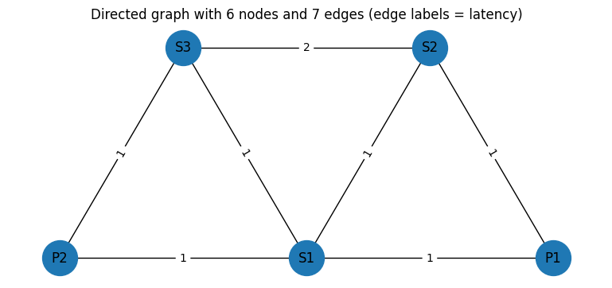
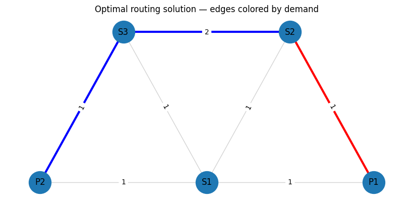
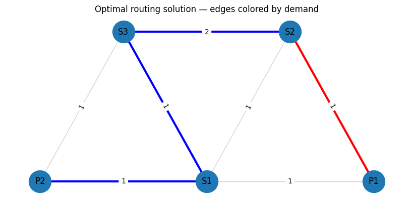
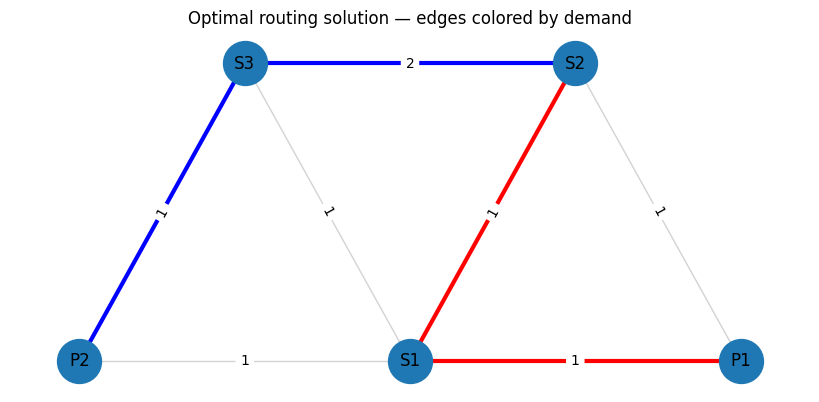
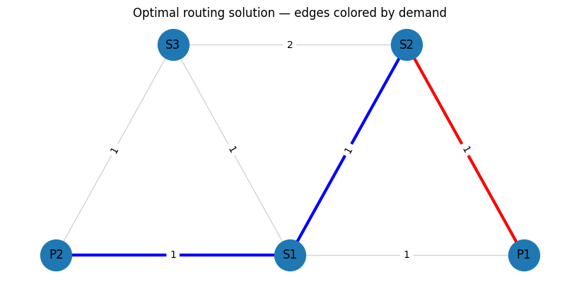

<Card title="View on GitHub" icon="github" href="https://github.com/Classiq/classiq-library/blob/main/applications/telecom/resiliency_planning/resiliency_planning_AMD.ipynb">
  Open this notebook in GitHub to run it yourself
</Card>

This notebook implements the quantum-based resiliency planning using QAOA.

This instance of the notebook does not use the Classiq built-in simulator but a specific build of the Qiskit Aer simulator for AMD GPUs. To leverage the Qiskit AMD simulator it is required to have a local AMD card availible.

## Before running

This notebook has commented out the code that compiles the AMD Qiskit Aer simulator, in order to use the AMD simulator make sure that you uncomment the code in the first cell, and selecte GPU device in the Qiskit Aer simulator cell.

```python
!pip install -qq qiskit_qasm3_import
!pip install -qq qiskit_aer
```
```python

# %%bash

# # set environment variables
# export ROCM_PATH=/opt/rocm
# export AER_THRUST_BACKEND=ROCM
# export QISKIT_AER_PACKAGE_NAME=qiskit-aer-gpu-rocm
# export ROCR_VISIBLE_DEVICES=0
# export HIP_VISIBLE_DEVICES=0
# ulimit -s unlimited

# 

## Get Git
# apt-get update && apt-get install -y git ninja-build

# # pull rocm-qiskit-aer branch
# mkdir quantum-sim  && cd quantum-sim/
# git clone https://github.com/coketaste/qiskit-aer.git
# cd qiskit-aer/
# git switch coketaste/amd-rocm-mi300


# # build rocm-qiskit-aer branch
# rm -rf _skbuild dist build
# pip install cmake pybind11 "conan<2" scikit-build
# pip install -r requirements-dev.txt
# python3 setup.py bdist_wheel -- \
#   -DCMAKE_CXX_COMPILER=/opt/rocm/llvm/bin/clang++ \
#   -DCMAKE_HIP_COMPILER=/opt/rocm/llvm/bin/clang++ \
#   -DAER_THRUST_BACKEND=ROCM


# pip install --force-reinstall dist/qiskit_aer_gpu_rocm*.whl
# pip install qiskit


# # run sample benchmark
# examples/single_gpu/benchmark.py
```
```python

import math
import random
from itertools import product
from platform import node

import matplotlib.pyplot as plt
import networkx as nx
import numpy as np
import pandas as pd
from scipy.optimize import minimize
from tqdm import tqdm

from classiq import *
from classiq.execution import ExecutionPreferences, ExecutionSession
```

## Create the graph

```python
# ---

- Graph ----
graph = nx.Graph()
V = ["P1", "P2", "S1", "S2", "S3"]
graph.add_nodes_from(V)

E_with_weights = [
    ("P1", "S1", {"lat": 1, "perr": 0.1}),
    ("P1", "S2", {"lat": 1, "perr": 0.1}),
    ("S2", "S1", {"lat": 1, "perr": 0.1}),
    ("P2", "S1", {"lat": 1, "perr": 0.1}),
    ("S3", "S1", {"lat": 1, "perr": 0.1}),
    ("P2", "S3", {"lat": 1, "perr": 0.1}),
    ("S3", "S2", {"lat": 2, "perr": 0.1}),
]

lat_vec = np.array([w["lat"] for (_, _, w) in E_with_weights], dtype=float)
perr_vec = np.array([w["perr"] for (_, _, w) in E_with_weights], dtype=float)
graph.add_edges_from(E_with_weights)

E = graph.edges()
lat = {(u, v): w["lat"] for (u, v, w) in E_with_weights}
perr = {(u, v): w["perr"] for (u, v, w) in E_with_weights}
ordered_edges = [(u, v) for (u, v, _) in E_with_weights]
edge_ids = [f"({u},{v})" for (u, v) in ordered_edges]
ids = edge_ids + V


def weight_of_e(u, v, weights):
    if (u, v) in lat.keys():
        return weights[(u, v)]
    return weights[(v, u)]


def lat_of_e(u, v):
    return weight_of_e(u, v, lat)


def perr_of_e(u, v):
    return weight_of_e(u, v, perr)


# ---

- Demands ----
# From S2
source_node = "S2"
demands = [
    {"name": "d1", "s": source_node, "t": "P1"},
    {"name": "d2", "s": source_node, "t": "P2"},
]

D = len(demands)
m = len(E)
n = len(V)

# ---

- Z 2D matrix ----
row_len = m + n
Z = np.zeros((D, (m + n)), dtype=int)

# Creating the solution we aim to get
Z[0, 1] = Z[0, 7] = Z[0, 10] = 1
Z[1, 5] = Z[1, 6] = Z[1, 11] = Z[1, 10] = Z[1, 8] = 1


Z_df = pd.DataFrame(
    Z, index=[f"{d['name']}({d['s']}→{d['t']})" for d in demands], columns=ids
)

# ---

- Plot ----
pos = {
    "P1": (2.0, 1.0),
    "P2": (1.0, 1.0),
    "S1": (1.5, 1.0),
    "S2": (1.75, 2.0),
    "S3": (1.25, 2.0),
}
plt.figure(figsize=(7.5, 3.2))
nx.draw(graph, pos, with_labels=True, node_size=1000)
nx.draw_networkx_edge_labels(
    graph, pos, edge_labels={(u, v): f"{lat_of_e(u,v)}" for (u, v) in E}
)
plt.title("Directed graph with 6 nodes and 7 edges (edge labels = latency)")
plt.tight_layout()
plt.show()


print("\nDemands (2 total):")
print(
    pd.DataFrame(
        [{"Demand": d["name"], "Source": d["s"], "Target": d["t"]} for d in demands]
    )
)

print("\nZ (D x (m+n)) binary matrix — rows=demand, cols=edge (initialized to 0):")
print(Z_df)
```
<Info>
  **Output:**

  

```
/var/folders/kk/nlz2dw2921g33r494qcnf4jh0000gn/T/ipykernel_60956/3897101284.py:81: UserWarning: This figure includes Axes that are not compatible with tight_layout, so results might be incorrect.
    plt.tight_layout()
  

```
</Info>



<Info>
  **Output:**

  

```

Demands (2 total):
    Demand Source Target
  0     d1     S2     P1
  1     d2     S2     P2

  Z (D x (m+n)) binary matrix — rows=demand, cols=edge (initialized to 0):
             (P1,S1)  (P1,S2)  (S2,S1)  (P2,S1)  (S3,S1)  (P2,S3)  (S3,S2)  P1  \
  d1(S2→P1)        0        1        0        0        0        0        0   1   
  d2(S2→P2)        0        0        0        0        0        1        1   0   

             P2  S1  S2  S3  
  d1(S2→P1)   0   0   1   0  
  d2(S2→P2)   1   0   1   1
  

```
</Info>

```python
num_edges = len(ordered_edges)
err_correlation = np.full((num_edges, num_edges), 0)
correlated = True
i = j = 0
for index, (u1, v1) in enumerate(ordered_edges):
    if (u1, v1) in [("P1", "S2"), ("S2", "P1")]:
        i = index
    if (u1, v1) in [("S1", "S2"), ("S2", "S1")]:
        j = index
assert i != j != 0
if correlated:
    err_correlation[i, j] = err_correlation[j, i] = 1
err_correlation
```
<Info>
  **Output:**

  

```
array([[0, 0, 0, 0, 0, 0, 0],
         [0, 0, 1, 0, 0, 0, 0],
         [0, 1, 0, 0, 0, 0, 0],
         [0, 0, 0, 0, 0, 0, 0],
         [0, 0, 0, 0, 0, 0, 0],
         [0, 0, 0, 0, 0, 0, 0],
         [0, 0, 0, 0, 0, 0, 0]])
  

```
</Info>

For convience and easy visualization, let's add a helper function that prints the solution into the graph.

This function gets our assigned solution (the 2D array of binary variables).

```python
import matplotlib.pyplot as plt


def get_edge(u, v, arr):
    if (u, v) in arr:
        return (u, v)
    return (v, u)


def print_solution_graph(assigned_z, index=None):
    # Assign a distinct color per demand
    colors_for_demands = ["red", "blue", "green", "yellow"]
    edge_colors = []
    edge_widths = []
    node_colors = []

    # Build a mapping from edge -> demand index (if chosen)
    edge_to_demand = {}
    for d_idx, d in enumerate(demands):
        for e_idx, (u, v) in enumerate(ordered_edges):
            if assigned_z[d_idx, e_idx] == 1:
                edge_to_demand[(u, v)] = d_idx

    # Create color list for all edges in E
    for u, v in E:
        if (u, v) in edge_to_demand or (v, u) in edge_to_demand:
            demand_idx = edge_to_demand[get_edge(u, v, edge_to_demand)]
            edge_colors.append(colors_for_demands[demand_idx])
            edge_widths.append(3.0)
        else:
            edge_colors.append("lightgray")
            edge_widths.append(1.0)

    # Plot the graph
    plt.figure(figsize=(8, 3.6))
    nx.draw(
        graph,
        pos,
        with_labels=True,
        node_size=1000,
        edge_color=edge_colors,
        width=edge_widths,
    )
    nx.draw_networkx_edge_labels(
        graph, pos, edge_labels={(u, v): f"{lat_of_e(u,v)}" for (u, v) in ordered_edges}
    )
    if index is not None:
        plt.title(
            f"Routing solution for sample index {index} — edges colored by demand"
        )
    else:
        plt.title("Optimal routing solution — edges colored by demand")
    plt.show()


print(Z_df)
print_solution_graph(Z)
```
<Info>
  **Output:**

  

```
(P1,S1)  (P1,S2)  (S2,S1)  (P2,S1)  (S3,S1)  (P2,S3)  (S3,S2)  P1  \
  d1(S2→P1)        0        1        0        0        0        0        0   1   
  d2(S2→P2)        0        0        0        0        0        1        1   0   

             P2  S1  S2  S3  
  d1(S2→P1)   0   0   1   0  
  d2(S2→P2)   1   0   1   1
  

```
</Info>



```python
# The mixer Hamiltonian is effectively X/2 and has eigenvalues -0.5 and +

0.

5. So the difference between minimum and maximum eigenvalues is exactly 

1.
# This can be rescaled by a global scaling parameter.
GlobalScalingParameter = 1

# The constraint Hamiltonian has the property that a minimal constraint violation is 1 and no constraint violation is 

0.
# We wish to normalise the constraint Hamiltonian relative to the total cost Hamiltonian such that the constraint violation will be 1~2 x larger than the maximal difference between total cost values.
RelativeConstraintNormalisation = 5

# The cost Hamiltonian should be similar in eigenvalue difference to the mixer Hamiltonian and should be normalised to about 

1.
# To find the exact normalisation requires solving this NP hard problem so we always use approximation.
# Since this is approximate, there is a relative scaling parameter we can twitch
RelativeCostNormalisation = 1 / 40

TotalCostNormalisation = GlobalScalingParameter * RelativeCostNormalisation
TotalConstraintNormalisation = RelativeConstraintNormalisation * TotalCostNormalisation

# B stands for the relationship between error correlation and latency
B = 10

# Normalize latencies
min_lat_guess = (
    3  # can be calculated with Dijkstra when removing the single assignment constraint
)
max_lat_guess = 4  # any guess that fits the constraints will work

lat_normalized = {}
for e, w in lat.items():
    lat_normalized[e] = w * TotalCostNormalisation / (max_lat_guess - min_lat_guess)

min_prob_guess = 0.03
max_prob_guess = 1.0

print(lat_normalized)
```
<Info>
  **Output:**

  

```
{('P1', 'S1'): 0.025, ('P1', 'S2'): 0.025, ('S2', 'S1'): 0.025, ('P2', 'S1'): 0.025, ('S3', 'S1'): 0.025, ('P2', 'S3'): 0.025, ('S3', 'S2'): 0.05}
  

```
</Info>

## Helper Functions

```python
def edge_fidx(d_idx, e_idx):
    return d_idx * row_len + e_idx


def node_fidx(d_idx, n_idx):
    return d_idx * row_len + n_idx + m
```

## Define Objective Function

```python
def sum_per_array(assigned_z, array):
    return sum(
        (array[e] * assigned_z[edge_fidx(d_idx, e_idx)])
        for d_idx, d in enumerate(demands)
        for e_idx, e in enumerate(ordered_edges)
    )


# Objective: sum_d sum_e lat_e * Z[d,e]
def objective_func(assigned_z):
    lat_sum = sum_per_array(assigned_z, lat_normalized)
    return lat_sum
```

## Define Single Assignment Cosntraint

```python
def edges_per_node(node):
    for edge_idx, edge in enumerate(ordered_edges):
        if node in edge:
            yield edge_idx


def flow_conservation_per_node_per_demand(
    node, node_idx, demand_idx, demand, assigned_z
):
    node_flow = 0

    # If node is the start/end of this demand, add 1 imaginary edge
    if node in demand.values():
        node_flow += 1

    # If the node is in the path, subtract 2 required edges
    node_flow -= 2 * assigned_z[node_fidx(d_idx=demand_idx, n_idx=node_idx)]

    # Add 1 edge for each used edge for this node
    for edge_idx in edges_per_node(node):
        node_flow += assigned_z[edge_fidx(d_idx=demand_idx, e_idx=edge_idx)]

    # Valid solution should have node_flow == 0 since:
    # * For nodes not in the path - no edges should be chosen
    # * For nodes in the path, there should be exactly 2 edges, or 1 edge for start/end ( + imaginary edge)
    return node_flow**2


def my_not(value):
    # Assumes value is 0 or 1
    return 1 - value


def constraint_starting_nodes(assigned_z):
    return sum(
        my_not(assigned_z[node_fidx(d_idx=demand_idx, n_idx=V.index(v_of_demand))])
        for demand_idx, demand in enumerate(demands)
        for v_of_demand in list(demand.values())[1:]
    )


def constraint_flow_conservation(assigned_z):
    total_flow = sum(
        flow_conservation_per_node_per_demand(
            node=node,
            node_idx=node_idx,
            demand=demand,
            demand_idx=demand_idx,
            assigned_z=assigned_z,
        )
        for node_idx, node in enumerate(V)
        for demand_idx, demand in enumerate(demands)
    )
    return total_flow + constraint_starting_nodes(assigned_z)
```
```python

def sum_correlation(assigned_z):
    return sum(
        err_correlation[e1_idx, e2_idx]
        * assigned_z[edge_fidx(0, e1_idx)]
        * assigned_z[edge_fidx(1, e2_idx)]
        for e1_idx in range(len(ordered_edges))
        for e2_idx in range(len(ordered_edges))
        if err_correlation[e1_idx, e2_idx] > 0
    )


def node_resiliency(assigned_z):
    return sum(
        B
        * TotalCostNormalisation
        * assigned_z[node_fidx(d_idx=0, n_idx=node_idx)]
        * assigned_z[node_fidx(d_idx=1, n_idx=node_idx)]
        for node_idx in range(len(V))
        if V[node_idx] is not source_node
    )


def objective_minimal_resiliency(assigned_z):
    return sum_correlation(assigned_z)
```
```python

def cost_hamiltonian(assigned_Z):
    return (
        objective_func(assigned_Z)
        + node_resiliency(assigned_Z)
        + objective_minimal_resiliency(assigned_Z)
        + TotalConstraintNormalisation * (constraint_flow_conservation(assigned_Z))
    )
```

## Create QAOA Code

```python
NUM_LAYERS = 20


@qfunc
def mixer_layer(beta: CReal, qba: QArray[QBit]):
    apply_to_all(lambda q: RX(GlobalScalingParameter * beta, q), qba)


@qfunc
def cost_layer(gamma: CReal, qba: QArray[QBit]):
    phase(cost_hamiltonian(qba), gamma)


@qfunc
def main(
    params: CArray[CReal, 2 * NUM_LAYERS],
    z: Output[QArray[QBit, D * row_len]],
) -> None:
    allocate(z)
    hadamard_transform(z)

    repeat(
        count=NUM_LAYERS,
        iteration=lambda i: (
            cost_layer(params[2 * i], z),
            mixer_layer(params[2 * i + 1], z),
        ),
    )
```
```python

qprog = synthesize(main)
```
#

## Pre-execution setup

We will create a `qaoa_samples()` function that will leverage the GPU accelerated Qiskit Aer simulator

```python
import qiskit.qasm3 as qasm3
from qiskit import transpile
from qiskit_aer import AerSimulator
```
```python

qasm_string = str(qprog.transpiled_circuit.qasm)
```

## Create the simulator

NOTE: Make you `device=gpu` is set when you want to use the AMD GPU, for now it is set to CPU.

```python
qc = qasm3.loads(qasm_string)
qc.measure_all()

# Here we will add the AMD GPU toggle
sim = AerSimulator(device="CPU")
qc_t = transpile(qc, sim)

params = qc_t.parameters
```
```python

import re


def make_aer_bind_dict(qc_t, values):
    """
    Build Aer-compatible parameter_binds dict:
      Parameter('params_param_k') -> [values[k]]
    """
    values = list(values)  # works for np arrays too
    bind = {}

    seen = set()
    for p in qc_t.parameters:
        m = re.search(r"params_param_(\d+)$", p.name)
        if not m:
            raise ValueError(f"Unexpected parameter name: {p.name!r}")
        k = int(m.group(1))
        if k in seen:
            raise ValueError(f"Duplicate parameter index {k} in circuit params")
        seen.add(k)

        if k >= len(values):
            raise ValueError(f"Need values[{k}] but only {len(values)} values provided")

        bind[p] = [float(values[k])]  # <

- IMPORTANT: list, not scalar

    # Optional: sanity check that you covered exactly what you think you did
    if len(seen) != len(values):
        # Not always an error (circuit may use fewer params), but usually worth flagging
        print(f"Warning: circuit has {len(seen)} params, values has {len(values)}")

    return bind
```
```python

def qaoa_samples(samples, shots=1000, flip_endian: bool = True):

    bind_dict = make_aer_bind_dict(qc_t, samples)

    job = sim.run(qc_t, shots=shots, memory=True, parameter_binds=[bind_dict])
    res = job.result()

    samples = res.get_memory(0)

    if flip_endian:
        samples = [s[::-1] for s in samples]

    return samples
```

We will use a small converter to changet the qiskit output format back to Classiq format.

```python
from collections import Counter
from typing import Any, Dict, List, Optional


class ParsedShot:
    """
    Mimics Classiq's ParsedShot structure for compatibility.
    """

    def __init__(self, state: Dict[str, List[int]], shots: int):
        self.state = state
        self.shots = shots

    def __repr__(self):
        return f"ParsedShot(state={self.state}, shots={self.shots})"


class ClassiqSampleResult:
    """
    Mimics Classiq's sample result structure for compatibility.
    """

    def __init__(self, parsed_counts: List[ParsedShot]):
        self.parsed_counts = parsed_counts

    def __repr__(self):
        return f"ClassiqSampleResult(parsed_counts={self.parsed_counts})"


def qiskit_to_classiq_samples(
    qiskit_samples: np.ndarray,
    variable_name: str = "z",
    wire_labels: Optional[Dict[str, int]] = None,
):
    """
    Convert Qiskit sample output to Classiq ExecutionSession sample format.
    """

    # Convert numpy array to list of lists for easier processing
    if isinstance(qiskit_samples, np.ndarray):
        if qiskit_samples.ndim == 1:
            # Single shot, reshape to (1, n_qubits)
            qiskit_samples = qiskit_samples.reshape(1, -1)
        samples_list = qiskit_samples.tolist()
    else:
        samples_list = qiskit_samples

    # If wire_labels provided, reorder qubits according to labels
    if wire_labels is not None:
        # Create mapping from original index to new index
        ordered_indices = [wire_labels[wire] for wire in sorted(wire_labels.keys())]
        reordered_samples = []
        for sample in samples_list:
            reordered_sample = [sample[i] for i in ordered_indices]
            reordered_samples.append(reordered_sample)
        samples_list = reordered_samples

    # Count occurrences of each unique outcome
    # Convert each sample to tuple for hashing, then count
    sample_tuples = [tuple(sample) for sample in samples_list]
    counts = Counter(sample_tuples)

    # Convert to ParsedShot objects
    parsed_counts = []
    for outcome_tuple, shot_count in counts.items():
        outcome_list = list(outcome_tuple)
        state = {variable_name: outcome_list}
        parsed_shot = ParsedShot(state=state, shots=shot_count)
        parsed_counts.append(parsed_shot)

    return ClassiqSampleResult(parsed_counts)
```

## Execute QAOA

```python
NUM_SHOTS = 2000
backend_preferences = ClassiqBackendPreferences(
    backend_name=ClassiqSimulatorBackendNames.SIMULATOR
)


def initial_qaoa_params(NUM_LAYERS) -> np.ndarray:
    initial_gammas = math.pi * np.linspace(
        1 / (2 * NUM_LAYERS), 1 - 1 / (2 * NUM_LAYERS), NUM_LAYERS
    )
    initial_betas = math.pi * np.linspace(
        1 - 1 / (2 * NUM_LAYERS), 1 / (2 * NUM_LAYERS), NUM_LAYERS
    )

    initial_params = []

    for i in range(NUM_LAYERS):
        initial_params.append(initial_gammas[i])
        initial_params.append(initial_betas[i])

    return np.array(initial_params)


initial_params = initial_qaoa_params(NUM_LAYERS)
```
```python

def estimate_cost(params):
    samples = qaoa_samples(params)

    samples = [[int(c) for c in row] for row in samples]

    shot_costs = np.array([cost_hamiltonian(s) for s in samples], dtype=float)
    objective_val = shot_costs.mean()
    print(f"Cost Hamiltonian = {np.round(objective_val, decimals=3)}")

    return objective_val
```
```python

cost_func = lambda state: cost_hamiltonian(state["z"])


def estimate_cost_func(params):
    objective_val = estimate_cost(params.tolist())
    print(f"Cost Hamiltonian = {np.round(objective_val, decimals=3)}")
    return objective_val
```
```python

MAX_ITERATIONS = 1  # Increase to improve the results
optimization_res = minimize(
    estimate_cost_func,
    x0=initial_params,
    method="COBYLA",
    options={"maxiter": MAX_ITERATIONS},
)
```
<Info>
  **Output:**

  

```

Cost Hamiltonian = 1.351
  Cost Hamiltonian = 1.351
  

```
</Info>

```python
samples = qaoa_samples(
    optimization_res.x.tolist(), shots=40000
)  # es.sample({"params": optimization_res.x.tolist()})
res = qiskit_to_classiq_samples([[int(c) for c in row] for row in samples])
```
```python

def check_validity(assigned_z: list[int]) -> bool:
    if constraint_flow_conservation(assigned_z) != 0:
        return False
    if node_resiliency(assigned_z) != 0:
        return False
    return True
```
```python

sorted_counts = sorted(res.parsed_counts, key=lambda pc: pc.shots, reverse=True)


def print_res(sampled, idx):
    assigned_z = sampled.state["z"]
    if not check_validity(assigned_z):
        return
    valid_solutions_indices.append(idx)
    print(
        f"Valid solution found at index {idx}, probability={sampled.shots/NUM_SHOTS*100}%, cost={cost_hamiltonian(assigned_z)}, latency={round(objective_func(assigned_z) / TotalCostNormalisation * (max_lat_guess - min_lat_guess))}"
    )


valid_solutions_indices = []
for idx, sampled in enumerate(sorted_counts[:100]):
    print_res(sampled, idx)

print(
    f"Accumulated valid probability is {sum(sampled.shots for sampled in sorted_counts if check_validity(sampled.state['z']))/NUM_SHOTS*100}%"
)
```
<Info>
  **Output:**

  

```

Valid solution found at index 1, probability=12.55%, cost=0.1, latency=4
  Valid solution found at index 7, probability=6.65%, cost=0.125, latency=5
  Valid solution found at index 14, probability=4.6%, cost=0.125, latency=5
  Valid solution found at index 83, probability=1.4500000000000002%, cost=1.075, latency=3
  Accumulated valid probability is 25.8%
  

```
</Info>

```python
def convert_1d_to_2d(array_1d):
    array_2d = np.zeros((D, row_len))
    for d_idx in range(D):
        for e_idx in range(m):
            array_2d[d_idx][e_idx] = array_1d[edge_fidx(d_idx, e_idx)]
        for n_idx in range(n):
            array_2d[d_idx][m + n_idx] = array_1d[node_fidx(d_idx, n_idx)]
    return array_2d
```
```python

def print_solution(index):
    print(index)
    solution = sorted_counts[index].state["z"]
    sol_2d = convert_1d_to_2d(solution)
    print_solution_graph(sol_2d)
    sol_df = pd.DataFrame(
        sol_2d, index=[f"{d['name']}({d['s']}→{d['t']})" for d in demands], columns=ids
    )
    print(sol_df)
    print(
        f"{objective_func(solution)/TotalCostNormalisation * (max_lat_guess-min_lat_guess)=}"
    )
    print(f"cost={cost_hamiltonian(solution)}")
    print(f"Flow Conservation: {constraint_flow_conservation(solution)}")
    print(f"Resiliency: {node_resiliency(solution)}")


# for index in valid_solutions_indices:
for index in valid_solutions_indices:
    print_solution(index)
```
<Info>
  **Output:**

  

```
1
  

```
</Info>


<Info>
  **Output:**

  

```
(P1,S1)  (P1,S2)  (S2,S1)  (P2,S1)  (S3,S1)  (P2,S3)  (S3,S2)   P1  \
  d1(S2→P1)      0.0      1.0      0.0      0.0      0.0      0.0      0.0  1.0   
  d2(S2→P2)      0.0      0.0      0.0      0.0      0.0      1.0      1.0  0.0   

              P2   S1   S2   S3  
  d1(S2→P1)  0.0  0.0  1.0  0.0  
  d2(S2→P2)  1.0  0.0  1.0  1.0  
  objective_func(solution)/TotalCostNormalisation * (max_lat_guess-min_lat_guess)=4.0
  cost=0.1
  Flow Conservation: 0
  Resiliency: 0.0
  7
  

```
</Info>



<Info>
  **Output:**

  

```
(P1,S1)  (P1,S2)  (S2,S1)  (P2,S1)  (S3,S1)  (P2,S3)  (S3,S2)   P1  \
  d1(S2→P1)      0.0      1.0      0.0      0.0      0.0      0.0      0.0  1.0   
  d2(S2→P2)      0.0      0.0      0.0      1.0      1.0      0.0      1.0  0.0   

              P2   S1   S2   S3  
  d1(S2→P1)  0.0  0.0  1.0  0.0  
  d2(S2→P2)  1.0  1.0  1.0  1.0  
  objective_func(solution)/TotalCostNormalisation * (max_lat_guess-min_lat_guess)=5.0
  cost=0.125
  Flow Conservation: 0
  Resiliency: 0.0
  14
  

```
</Info>



<Info>
  **Output:**

  

```
(P1,S1)  (P1,S2)  (S2,S1)  (P2,S1)  (S3,S1)  (P2,S3)  (S3,S2)   P1  \
  d1(S2→P1)      1.0      0.0      1.0      0.0      0.0      0.0      0.0  1.0   
  d2(S2→P2)      0.0      0.0      0.0      0.0      0.0      1.0      1.0  0.0   

              P2   S1   S2   S3  
  d1(S2→P1)  0.0  1.0  1.0  0.0  
  d2(S2→P2)  1.0  0.0  1.0  1.0  
  objective_func(solution)/TotalCostNormalisation * (max_lat_guess-min_lat_guess)=5.0
  cost=0.125
  Flow Conservation: 0
  Resiliency: 0.0
  83
  

```
</Info>



<Info>
  **Output:**

  

```
(P1,S1)  (P1,S2)  (S2,S1)  (P2,S1)  (S3,S1)  (P2,S3)  (S3,S2)   P1  \
  d1(S2→P1)      0.0      1.0      0.0      0.0      0.0      0.0      0.0  1.0   
  d2(S2→P2)      0.0      0.0      1.0      1.0      0.0      0.0      0.0  0.0   

              P2   S1   S2   S3  
  d1(S2→P1)  0.0  0.0  1.0  0.0  
  d2(S2→P2)  1.0  1.0  1.0  0.0  
  objective_func(solution)/TotalCostNormalisation * (max_lat_guess-min_lat_guess)=3.0000000000000004
  cost=1.075
  Flow Conservation: 0
  Resiliency: 0.0
  

```
</Info>