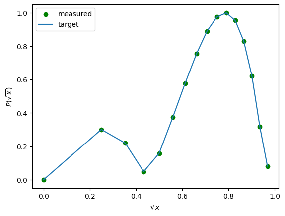

<Card title="View on GitHub" icon="github" href="https://github.com/Classiq/classiq-library/blob/main/functions/qmod_library_reference/classiq_open_library/qsvt/qsvt.ipynb">
  Open this notebook in GitHub to run it yourself
</Card>

The Quantum Singlar Value Transformation (QSVT) [\[1\]](#qsvt) is an algorithmic framework, used to apply polynomial transformation on the singular values of a block encoded matrix. It has wide range of applications such as matrix inversion, amplitude amplification and hamiltonian simulation.

Given a unitary $U$, a list of phase angles  $\phi_1, \phi_2, ..., \phi_{d+1}$ and 2 projector-controlled-not operands $C_{\Pi}NOT,C_{\tilde{\Pi}}NOT$ , the QSVT sequence is as follows:

$$
\tilde{\Pi}_{\phi_{d+1}}U \prod_{k=1}^{(d-1)/2} (\Pi_{\phi_{d-2k}} U^{\dagger}\tilde{\Pi}_{\phi_{d - (2k+1)}}U)\Pi_{\phi_{1}}
$$
for odd $d$, and:

$$
\prod_{k=1}^{d/2} (\Pi_{\phi_{d-(2k-1)}} U^{\dagger}\tilde{\Pi}_{\phi_{d-2k}}U)\Pi_{\phi_{1}}
$$
for even $d$.

Each of the projector-controlled-phase unitaries $\Pi$ consists of a $Z$ rotation of an auxilliary qubit wrapped by the $C_{\Pi}NOT$s, NOTing the auxilliary qubit:

$$
\Pi_{\phi} = (C_{\Pi}NOT) e^{-i\frac{\phi}{2}Z}(C_{\Pi}NOT)
$$
The transformation will result with a polynomial of order $d$.

Function: `qsvt`

Arguments:

- `phase_seq: CArray[CReal]` - a $d+1$ sized sequence of phase angles.
- `proj_cnot_1: QCallable[QArray[QBit], QBit]` - projector-controlled-not unitary that locates the encoded matrix columns within $U$.

Accepts quantum variable of the size of `qvar`, and a qubit that is set to $|1\rangle$ when the state is in the block.
- `proj_cnot_2: QCallable[QArray[QBit], QBit]` - projector-controlled-not unitary that locates the encoded matrix rows within $U$.

Accepts quantum variable of the size of `qvar`, and a qubit that is set to $|1\rangle$ when the state is in the block.
- `u: QCallable[QArray[QBit]]` - $U$ a block encoding unitary of a matrix $A$, such that $A = \tilde{\Pi}U\Pi$.
- `qvar: QArray[QBit]` - the quantum variable on which $U$ applies, which resides in the entire block encoding space.
- `aux: QBit` - a zero auxilliary qubit, used for the projector-controlled-phase rotations.

Given as an input so that qsvt can be used as a building-block in a larger algorithm.

```python
!pip install -qq "classiq[qsp]"
```
#

## Example: polynomial transformation on a $\sqrt(x)$ block encoding

The following example implements a random polynomial transformation on a given block, based on [\[2\]](#qsvt-derivative).

The unitary $U$ here is a square-root transformation: $U|x\rangle_n|0\rangle_{n+1} = |x\rangle_n(\sqrt{x}|\psi_0\rangle_{n}|0\rangle + \sqrt{1-x}|\psi_1\rangle_{n}|1\rangle)$ where $x$ is a fixed-point variable in the range $[0, 1)$.

The example samples a random odd-polynomial, calculates the necessary phase sequence, then applies the qsvt and verifies the results.

There are 2 distinct projector-controlled-not unitaries - one is applying on the entire $(n+1)$ variable, and the second is on the 1-qubits auxilliary in the image.

```python
from typing import Dict, Tuple

import numpy as np
from numpy.polynomial import Polynomial

from classiq import *
from classiq.qmod.symbolic import logical_and

NUM_QUBITS = 4


@qfunc
def u_sqrt(state: QNum, ref: QNum, ind: QBit) -> None:
    hadamard_transform(ref)
    ind ^= state <= ref


@qfunc
def qsvt_sqrt_polynomial(
    qsvt_phases: list[float], state: QNum, ref: QNum, ind: QBit, qsvt_aux: QBit
) -> None:
    qsvt(
        qsvt_phases,
        lambda _aux: inplace_xor(ref == 0, _aux),
        lambda _aux: inplace_xor(ind == 0, _aux),
        lambda: u_sqrt(state, ref, ind),
        qsvt_aux,
    )
```
```python

import matplotlib.pyplot as plt

from classiq.applications.qsp import qsvt_phases


def sample_random_chebyshev_polynomial(degree):
    # Generate random coefficients
    coefficients = np.random.uniform(-1, 1, degree + 1)
    # take care for parity
    coefficients[int(degree + 1) % 2 :: 2] = 0

    # Create the polynomial
    p = np.polynomial.Chebyshev(coefficients)
    # Evaluate the polynomial over the interval [-1, 1]
    x = np.linspace(-1, 1, 500)
    y = p(x)

    # Normalize the polynomial
    poly = p / (np.max(np.abs(y)) + 0.001)
    print(poly)
    return poly


def parse_qsvt_results(result) -> Tuple[np.ndarray, np.ndarray]:
    parsed_state_vector = result.parsed_state_vector

    d: Dict = {x: [] for x in range(2**NUM_QUBITS)}
    for parsed_state in parsed_state_vector:
        if (
            parsed_state["qsvt_aux"] == 0
            and parsed_state["ind"] == 0
            and np.linalg.norm(parsed_state.amplitude) > 1e-15
            and (DEGREE % 2 == 1 or parsed_state["ref"] == 0)
        ):
            d[parsed_state["state"]].append(parsed_state.amplitude)
    d = {k: np.linalg.norm(v) for k, v in d.items()}
    values = [d[i] for i in range(len(d))]

    x = np.sqrt(np.linspace(0, 1 - 1 / (2**NUM_QUBITS), 2**NUM_QUBITS))

    measured_poly_values = np.sqrt(2**NUM_QUBITS) * np.array(values)
    target_poly_values = np.abs(POLY(x))

    plt.scatter(x, measured_poly_values, label="measured", c="g")
    plt.plot(x, target_poly_values, label="target")
    plt.xlabel(r"$\sqrt{x}$")
    plt.ylabel(r"$P(\sqrt{x})$")
    plt.legend()

    return measured_poly_values, target_poly_values
```
```python

DEGREE = 5

np.random.seed(1)

# choosing in purpose odd polynomial
POLY = sample_random_chebyshev_polynomial(DEGREE)
QSVT_PHASES = qsvt_phases(POLY.coef)
```
<Info>
  **Output:**

  

```
0.0 + 0.33582085·T₁(x) + 0.0·T₂(x) - 0.30128672·T₃(x) + 0.0·T₄(x) -
  0.62136169·T₅(x)
  

```
</Info>

```python
@qfunc
def main(
    state: Output[QNum[NUM_QUBITS]],
    ref: Output[QNum[NUM_QUBITS]],
    ind: Output[QBit],
    qsvt_aux: Output[QBit],
) -> None:
    allocate(state)
    allocate(ref)
    allocate(ind)
    allocate(qsvt_aux)

    hadamard_transform(state)
    qsvt_sqrt_polynomial(QSVT_PHASES, state, ref, ind, qsvt_aux)


qmod = create_model(
    main,
    constraints=Constraints(optimization_parameter="width"),
    execution_preferences=ExecutionPreferences(
        num_shots=1,
        backend_preferences=ClassiqBackendPreferences(
            backend_name="simulator_statevector"
        ),
    ),
)
qprog = synthesize(qmod)
```
```python

show(qprog)
```
<Info>
  **Output:**

  

```

Quantum program link: https://platform.classiq.io/circuit/3FmW1eMFbXPFRVnq1mtPbK1wBSc
  

```
</Info>

```python
result = execute(qprog).result_value()

measured, target = parse_qsvt_results(result)
assert np.allclose(measured, target, atol=0.02)
```


## References

<a id="qsvt">\[1]</a>: András Gilyén, Yuan Su, Guang Hao Low, and Nathan Wiebe. 2019. Quantum singular value transformation and beyond: exponential improvements for quantum matrix arithmetics. In Proceedings of the 51st Annual ACM SIGACT Symposium on Theory of Computing (STOC 2019). Association for Computing Machinery, New York, NY, USA, 193–204 [https://doi.org/10.1145/3313276.3316366](https://doi.org/10.1145/3313276.3316366).

<a id="qsvt-derivative">\[2]</a>: Stamatopoulos, Nikitas, and William J. Zeng. "Derivative pricing using quantum signal processing." arXiv preprint arXiv:2307.14310 (2023).