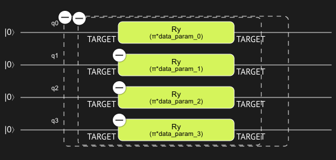
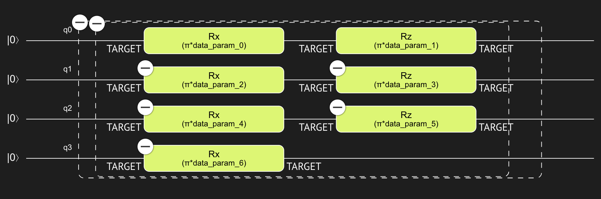

<Card title="View on GitHub" icon="github" href="https://github.com/Classiq/classiq-library/blob/main/functions/qmod_library_reference/classiq_open_library/variational_data_encoding/variational_data_encoding.ipynb">
  Open this notebook in GitHub to run it yourself
</Card>

Encoding classical data on quantum states is an important subroutine in variational quantum circuits, such as Quantum Singular Vector Machine (QSVM) and Quantum Neural Networks (QNN).

## Encode in angle

This function encodes $n$ data points on $n$ qubits, mapping the data point $x_i$ to a RY rotation on the $i$-th qubit with a $\pi x_i$ angle.

Function: `encode_in_angle`

Arguments:

- `data`: `CArray[Creal]`
- `qba`: `Output[QArray[QBit]]`

The `qba` quantum argument is the quantum state on which we encode the classical array `data`.

## Example

```python
from classiq import *


@qfunc
def main(data: CArray[CReal, 4], x: Output[QArray[QBit]]):
    encode_in_angle(data, x)


qmod = create_model(main)
```
```python

from classiq import synthesize

qprog = synthesize(qmod)
```


<Frame caption="Angle encoding." />

## Encode on Bloch

This function encodes $n$ data points on $\lceil n/2 \rceil$, mapping pairs of data points $(x_{2i}, x_{2i+1})$ to the bloch sphere via RX rotation with an angle $\pi x_{2i}$ followed by a RZ rotation with an angle $\pi x_{2i+1}$. If the number of data points is odd then a single RX rotation is applied to the last qubit, with an angle of $2\pi x_n$.

Function: `encode_on_bloch`

Arguments:

- `data`: `CArray[Creal]`
- `qba`: `Output[QArray[QBit]]`

The `qba` quantum argument is the quantum state on which we encode the classical array `data`.

## Example

```python
from classiq import *


@qfunc
def main(data: CArray[CReal, 7], x: Output[QArray[QBit]]):
    encode_on_bloch(data, x)


qmod = create_model(main)
```
```python

from classiq import synthesize

qprog = synthesize(qmod)
```


<Frame caption="Dense angle (Bloch sphere) encoding." />