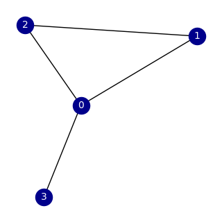
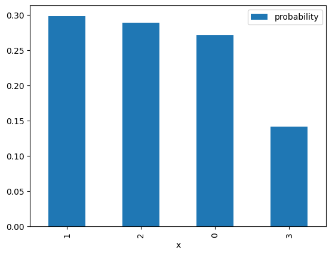
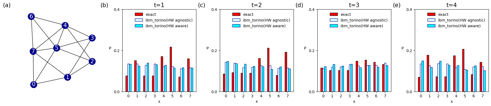

<Card title="View on GitHub" icon="github" href="https://github.com/Classiq/classiq-library/blob/main/tutorials/basic_tutorials/quantumwalk_complex_network/quantumwalk_complex_network.ipynb">
  Open this notebook in GitHub to run it yourself
</Card>

## What this notebook does

Quantum walks are often used as building blocks for graph exploration / graph-based quantum algorithms.

This notebook simulates a **discrete-time quantum walk** on a **complex network (graph)**.

- The **graph** is a set of nodes connected by edges (we generate it with NetworkX).
- The **walker position** is stored in a quantum register `x`.
- A second register `y` acts like a **coin / direction / neighbor-choice register**.
- Each step of the walk applies:
  

1. **Coin operator** (mix amplitudes in a way that depends on the current node's neighbors)
  

1. **Shift operator** (moves the walker according to the coin register)

At the end we **measure** the position register and plot a **probability distribution over nodes**.

> Note: This is a *discrete-time* walk (coin + shift), not a continuous-time walk.


## Imports and dependencies

```python
import matplotlib.pyplot as plt
import networkx as nx
import numpy as np

from classiq import *
```

## Step 1 

- Create a "complex network" (the graph)

Here we generate a small graph `G`.

The notebook currently uses a **Watts-Strogatz** model, which is a classic "small-world" network model:

- it has high clustering (like regular lattices),
- and short path lengths (like random graphs).

You can switch to other models by uncommenting the alternatives:

- Erdős-Rényi (random graph)
- Barabási-Albert (scale-free graph)

Then we draw the graph so we can visually connect the output distribution to the network structure.

```python
G = nx.connected_watts_strogatz_graph(n=4, k=2, p=0.2, tries=100, seed=312)
# G = nx.erdos_renyi_graph(n=4, p=0.3, seed=42)
# G = nx.barabasi_albert_graph(n=8,m=2)
plt.figure(figsize=(3, 3))
nx.draw(
    G,
    with_labels=True,
    node_color="darkblue",
    edge_color="black",
    font_color="white",
    font_size=10,
)
```


## Step 2 

- Decide how many qubits are needed for the position register

If the graph has `N` nodes, we need enough qubits to encode node indices in binary.

- `N = len(G.nodes())`
- `num_qubits = ceil(log2(N))`

That means the quantum register `x` can represent `2**num_qubits` = `N`.

```python
N = len(G.nodes())
num_qubits = int(np.ceil(np.log2(N)))
print("number of nodes=", N, "number of required qubits=", num_qubits)
```
<Info>
  **Output:**

  

```
number of nodes= 4 number of required qubits= 2
  

```
</Info>

## Step 3 

- Build "neighbor-aware" probability vectors

A quantum walk on a graph needs a way to represent "where can I go next from node $i$?".

We create helper functions:

- `get_edges_of_node(G, i)`: returns the neighbors of node `i`.
- `inner_degree(G, num_qubits, i)`: builds a length `2**num_qubits` vector where:
  - entries corresponding to neighbors of `i` are `1`,
  - all others are `0`,
  - then we normalize by the node degree `k` to get a **uniform distribution over neighbors**.

This vector is used to prepare the `y` register so it represents "allowed moves" from the current node.

```python
def get_edges_of_node(G, i):
    return [j for j in G.neighbors(i)]


# DEGREE_LIST = np.zeros(N)
# for i in range(N):
#    DEGREE_LIST[i] = len(get_edges_of_node(G, i))


def inner_degree(G, num_qubits, i):
    l_array = np.zeros(2**num_qubits)
    neighbors_list = get_edges_of_node(G, i)
    k = len(neighbors_list)
    for j in neighbors_list:
        l_array[j] = 1
    return l_array / k
```

## Step 4 

- Define the quantum walk (state prep, coin, shift, and repeated steps)

This cell defines the core quantum logic using Classiq `@qfunc`.

#

## Registers

- `x`: **position register** (which node the walker is on)
- `y`: **coin / neighbor register** (encodes the neighbor-choice space)

#

## 4.1 Initial state: `prepare_initial_state(x, y)`

Goal: start with a clean, interpretable state.

1. Prepare `x` in a **uniform superposition over valid nodes**:
   

- If `N` is exactly `2**num_qubits`, a Hadamard transform gives uniform superposition automatically.
   

- Otherwise, we prepare a custom probability vector that gives equal weight to nodes `0..N-1` and zero to invalid states.

1. Prepare `y` **conditioned on the current node in `x`**:
   For each node `i`, if `x == i`, we prepare `y` using the neighbor distribution vector from `inner_degree(...)`.

So after this, the state is conceptually:

- "uniform over nodes" in `x`,
- and for each node, `y` contains amplitudes only on its neighbors.

#

## 4.2 Coin operator: `my_coin(x, y)`

A discrete-time quantum walk needs a "coin flip" to mix amplitudes.

Here, the coin depends on the current node:

- If `x == i`, apply a **Grover diffuser** on register `y` corresponding to neighbors of node `i`.

This mixes the neighbor amplitudes in a structured way.

#

## 4.3 Shift operator: `my_shift(x, y)`

This updates the position based on the coin information.

#

## 4.4 Repeating steps: `discrete_quantum_walk(time, coin, shift, x, y)`

We apply the pair `(coin, shift)` repeatedly `time` times using `power(time, ...)`.

That is exactly the discrete-time walk loop:
**(coin → shift) × t**

```python
@qfunc
def prepare_initial_state(x: QNum[num_qubits], y: QNum[num_qubits]):
    if N == 2**num_qubits:
        hadamard_transform(x)
    else:
        prob_array = np.ones(2**num_qubits) / N
        prob_array[N : 2**num_qubits] = 0
        inplace_prepare_state(prob_array.tolist(), 0.0, x)
    for i in range(N):
        control(
            x == i,
            lambda: inplace_prepare_state(
                inner_degree(G, num_qubits, i).tolist(), 0.0, y
            ),
        )


@qfunc
def my_coin(x: QNum[num_qubits], y: QNum[num_qubits]):
    for i in range(N):
        control(
            x == i,
            stmt_block=lambda: grover_diffuser(
                lambda y: inplace_prepare_state(
                    inner_degree(G, num_qubits, i).tolist(), 0.0, y
                ),
                y,
            ),
        )


@qfunc
def my_shift(x: QNum[num_qubits], y: QNum[num_qubits]):
    multiswap(x, y)


@qfunc
def discrete_quantum_walk(
    time: CInt,
    coin_qfuncs: QCallable[QNum, QNum],
    shift_qfuncs: QCallable[QNum, QNum],
    x: QNum,
    y: QNum,
):
    power(
        time,
        lambda: (
            coin_qfuncs(x, y),
            shift_qfuncs(x, y),
        ),
    )
```

## Step 5 

- Choose number of steps, build `main`, and synthesize the circuit

#

## Number of steps

`t` controls how far the quantum walk evolves.

More steps usually means:

- wider spreading over the graph,
- more interference patterns,
- sometimes more "structure" in the final distribution (depending on the graph).

#

## The `main` quantum program

`main(x: Output[QNum[num_qubits]])`:

1. Allocates `x` (position) and `y` (coin).
1. Prepares the initial state.
1. Applies the discrete-time quantum walk for `t` steps.
1. Drops `y` (we only care about measuring the position distribution in `x`).

Finally:

- `synthesize(main)` compiles the high-level program into an executable quantum program.
- `show(qprog)` displays the synthesized result.

```python
# quantum walk steps
t = 3


@qfunc
def main(x: Output[QNum[num_qubits]]):
    y = QNum("y", num_qubits)
    allocate(num_qubits, x)
    allocate(num_qubits, y)
    prepare_initial_state(x, y)
    discrete_quantum_walk(t, my_coin, my_shift, x, y)
    drop(y)


qprog = synthesize(main)
show(qprog)
```
<Info>
  **Output:**

  

```

Quantum program link: https://platform.classiq.io/circuit/3AYfsuRGxfFQPTvOVlovit1v2zJ
  

```
</Info>

<Info>
  **Output:**

  

```
https://platform.classiq.io/circuit/3AYfsuRGxfFQPTvOVlovit1v2zJ?login=True&version=17
  

```
</Info>

## Step 6 

- Execute and collect results

Here we run the synthesized program and fetch the results.

The key output we care about is the measured distribution of the **position register `x`**:

- each possible node index `x` has a probability,
- these probabilities should sum to \~1 (up to sampling / execution effects).

```python
execution_job = execute(qprog)
result = execution_job.result_value()
```

## Step 7 

- Visualize the probability distribution over nodes

We plot a bar chart:

- **x-axis**: node index (the measured value of the position register `x`)
- **y-axis**: probability of measuring that node

Tip for interpretation:

- Compare "high-probability nodes" to the graph drawing.
- Try changing the graph model or `t` and see how the distribution changes.

```python
result.dataframe.plot.bar(x="x", y="probability")
```
<Info>
  **Output:**

  

```
<Axes: xlabel='x'>
  

```
</Info>



## (Optional) Hardware-Aware Synthesis and Hardware Execution

In this notebook, we executed the circuit on the `ibm_torino` processor.

The Classiq platform allows specifying a particular processor through ExecutionPreferences.

Before executing on quantum hardware, you can perform synthesis that incorporates hardware-specific constraints by configuring the `preference` settings.

The following command runs hardware-aware synthesis to optimize your circuit for a target device.

For more details, refer to the [Hardware-Aware Synthesis](https://docs.classiq.io/latest/user-guide/synthesis/hardware-aware-synthesis/).

```python
# preferences = Preferences(
#     backend_service_provider="IBM Quantum", backend_name="ibm_torino"
# )
# synthesize(main, preferences=preferences)
# qprog = synthesize(main)
```

Once the synthesis is complete, you can configure the execution settings to run your circuit on a real quantum device or a specific simulator.

The `ExecutionPreferences` class allows you to define parameters such as the number of shots and backend-specific credentials.

The following code demonstrates how to set up an execution session for an IBM Quantum backend:

```python
# execution_preferences = ExecutionPreferences(
#     num_shots=1024,
#     backend_preferences=IBMBackendPreferences(
#         backend_name='ibm_torino',
#         access_token="A Valid API access token to IBM Quantum",
#         channel="IBM Cloud Channel",
#         instance_crn="IBM Cloud Instance CRN",
#     )
# )

# with ExecutionSession(qprog, execution_preferences=execution_preferences) as es:
#     res = es.sample()
```

## Result

#

## $N=4$

Once the graph structure is defined, you can perform a quantum spatial search to find a specific node. In this example, the search is conducted on a Watts-Strogatz small-world graph, which is generated using the NetworkX library to create a complex network topology.

Below data is quantum spatial search on `G = nx.connected_watts_strogatz_graph(n=4, k=2, p=0.2, tries=100, seed=312)` .

```python
import numpy as np

# withou HW synthesis
prob_torino_t1 = np.array([3258, 2340, 2549, 1853]) / 10000
prob_torino_t2 = np.array([2856, 2736, 2153, 2255]) / 10000
prob_torino_t3 = np.array([2474, 2468, 2389, 2669]) / 10000
prob_torino_t4 = np.array([2352, 2717, 2296, 2635]) / 10000

# with HW-level synthesis
prob_torino_t1_hw = np.array([2228, 2650, 2286, 2836]) / 10000
prob_torino_t2_hw = np.array([2296, 2428, 2461, 2815]) / 10000
prob_torino_t3_hw = np.array([2567, 2477, 2483, 2473]) / 10000
prob_torino_t4_hw = np.array([2269, 2385, 2339, 3007]) / 10000

# Simulator result (ideal)
prob_sim_t1 = [0.5, 0.20833333, 0.20833333, 0.08333333]
prob_sim_t2 = [0.33333333, 0.28690075, 0.28690075, 0.09286516]
prob_sim_t3 = [0.25953183, 0.29985427, 0.29985427, 0.14075964]
prob_sim_t4 = [0.54789448, 0.1859174, 0.1859174, 0.08027073]

prob_torino_list_n4 = [prob_torino_t1, prob_torino_t2, prob_torino_t3, prob_torino_t4]
prob_torino_hw_list_n4 = [
    prob_torino_t1_hw,
    prob_torino_t2_hw,
    prob_torino_t3_hw,
    prob_torino_t4_hw,
]
prob_sim_list_n4 = [prob_sim_t1, prob_sim_t2, prob_sim_t3, prob_sim_t4]
```
#

## $N=8$

Below data is quantum spatial search on `G = nx.connected_watts_strogatz_graph(n=8, k=4, p=0.2, tries=100, seed=312)` .

```python
# withou HW synthesis
prob_torino_t1 = np.array([1330, 1238, 1391, 1302, 1283, 1144, 1158, 1154]) / 10000
prob_torino_t2 = np.array([1463, 1361, 1340, 1230, 1214, 1083, 1202, 1107]) / 10000
prob_torino_t3 = np.array([1213, 1320, 1243, 1334, 1160, 1277, 1183, 1270]) / 10000
prob_torino_t4 = np.array([1487, 1175, 1478, 1276, 1272, 1038, 1258, 1016]) / 10000

# with HW-level synthesis
prob_torino_t1_hw = np.array([1350, 1352, 1275, 1342, 1205, 1214, 1104, 1158]) / 10000
prob_torino_t2_hw = np.array([1431, 1386, 1167, 1187, 1274, 1273, 1135, 1147]) / 10000
prob_torino_t3_hw = np.array([1115, 1186, 1195, 1306, 1250, 1274, 1283, 1391]) / 10000
prob_torino_t4_hw = np.array([1347, 1270, 1363, 1351, 1167, 1087, 1201, 1214]) / 10000

# Simulator result (ideal)
prob_sim_t1 = [
    0.07708333,
    0.15,
    0.07708333,
    0.07708333,
    0.17083333,
    0.21666667,
    0.07083333,
    0.16041667,
]
prob_sim_t2 = [
    0.0856499,
    0.09285754,
    0.08907021,
    0.08907021,
    0.16118512,
    0.21198126,
    0.07902679,
    0.19115897,
]
prob_sim_t3 = [
    0.11548278,
    0.10271175,
    0.10264854,
    0.10264854,
    0.14767895,
    0.15389152,
    0.14311526,
    0.13182268,
]
prob_sim_t4 = [
    0.06987609,
    0.17753849,
    0.072522,
    0.072522,
    0.17425693,
    0.20675877,
    0.08323824,
    0.14328747,
]

prob_torino_list_n8 = [prob_torino_t1, prob_torino_t2, prob_torino_t3, prob_torino_t4]
prob_torino_hw_list_n8 = [
    prob_torino_t1_hw,
    prob_torino_t2_hw,
    prob_torino_t3_hw,
    prob_torino_t4_hw,
]
prob_sim_list_n8 = [prob_sim_t1, prob_sim_t2, prob_sim_t3, prob_sim_t4]
```
#

## Vizualization

```python
import matplotlib.pyplot as plt
import networkx as nx
import numpy as np

G = nx.connected_watts_strogatz_graph(n=8, k=4, p=0.2, tries=100, seed=312)

x = np.arange(8)
width = 0.2
gap = 0.4
titles = ["t=1", "t=2", "t=3", "t=4"]

fig, axes = plt.subplots(1, 5, figsize=(18, 4))
axes = axes.flatten()


panel_labels = ["(a)", "(b)", "(c)", "(d)", "(e)"]
ax0 = axes[0]
pos = nx.spring_layout(G, seed=312)

nx.draw(
    G,
    pos=pos,
    ax=ax0,
    with_labels=True,
    node_color="darkblue",
    edge_color="black",
    font_color="white",
    font_size=15,
)

ax0.text(-0.3, 1.08, panel_labels[0], transform=ax0.transAxes, fontsize=15, va="top")

prob_sim_list = prob_sim_list_n8
prob_torino_list = prob_torino_hw_list_n8
prob_torino_hw_list = prob_torino_list_n8

for i in range(4):
    ax = axes[i + 1]

    ax.bar(
        x - gap / 2,
        prob_sim_list[i],
        width=width,
        color="red",
        edgecolor="black",
        label="exact",
    )
    ax.bar(
        x,
        prob_torino_list[i],
        width=width,
        color="lightcyan",
        edgecolor="darkblue",
        label="ibm_torino(HW agnostic)",
    )
    ax.bar(
        x + gap / 2,
        prob_torino_hw_list[i],
        width=width,
        color="cyan",
        edgecolor="darkblue",
        label="ibm_torino(HW aware)",
    )

    ax.set_title(titles[i], fontsize=15)
    ax.set_ylabel("P", rotation=0, labelpad=10)
    ax.set_xlabel("x")
    ax.set_ylim(0, 0.3)
    ax.set_xticks(x)
    ax.set_yticks([0.0, 0.2, 0.4])
    ax.legend(fontsize=10, frameon=False)
    ax.text(
        -0.3, 1.08, panel_labels[i + 1], transform=ax.transAxes, fontsize=15, va="top"
    )

plt.tight_layout()
plt.show()
```
