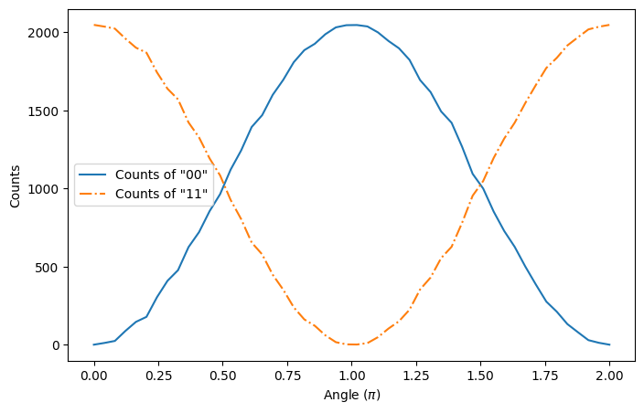
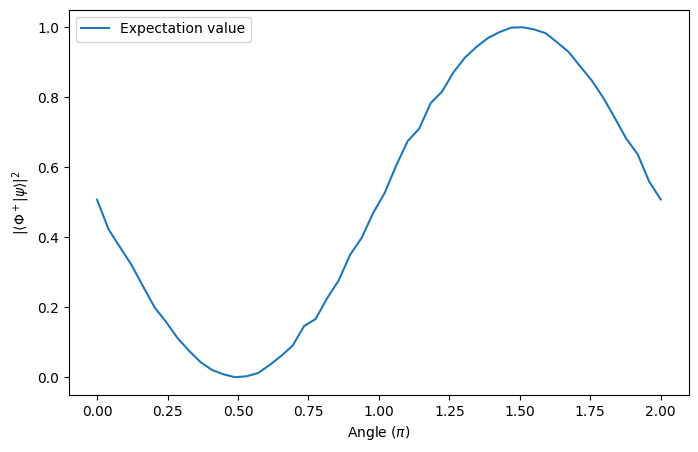

<Card title="View on GitHub" icon="github" href="https://github.com/Classiq/classiq-library/blob/main/tutorials/basic_tutorials/the_classiq_tutorial/execution_tutorial_part2.ipynb">
  Open this notebook in GitHub to run it yourself
</Card>

## Expectation Values and Parameterized Quantum Programs

This tutorial covers the basics of measuring observables expressed as linear combinations of Pauli strings and executing a parameterized quantum program using Classiq via Python SDK. Alternatively, you can use the [Classiq IDE web page](https://platform.classiq.io) to execute quantum algorithms.

A parameterized quantum program is a quantum circuit with adjustable parameters, such as angles in rotation gates, that can be tuned to alter the circuit's behavior.

Think of it like tuning a camera with adjustable settings: the camera (the circuit) stays the same, but adjusting the settings (parameters) changes the captured images (outputs). In quantum computing, tuning these parameters helps identify the configuration that yields the most useful results.

These programs are particularly useful in quantum machine learning and optimization, where the goal is to find the best parameter set.

First, we create a parameterized quantum program using two qubits.

The program applies an X gate, a parameterized RY rotation, and a CX gate.

The rotation angle is controlled by a variable called `angle`.

```python
from classiq import *


@qfunc
def main(angle: CReal, x: Output[QBit], y: Output[QBit]) -> None:
    allocate(x)
    allocate(y)
    X(x)
    RY(angle, x)
    CX(x, y)


qprog = synthesize(main)
show(qprog)
```
<Info>
  **Output:**

  

```

Quantum program link: https://platform.classiq.io/circuit/3DuJkbhvAlRZokLgJCdNrEWdUqX
  

```
</Info>

The first thing we can do is to sample the outputs of the quantum program for a given parameter.

For example, $\pi / 2$.

We can now execute the quantum program and obtain a sample of output states using [ExecutionSession](https://docs.classiq.io/latest/sdk-reference/execution/#classiq.execution.ExecutionSession). To do this, we define the parameter values using a dictionary.

```python
import numpy as np

# Set angle parameter to pi/2 for sampling
parameter = {"angle": np.pi / 2}
```

After generating the `ExecutionSession`, it is possible to show the counts for this particular parameter value:

```python
first_sample = sample(qprog, parameters=parameter)

print("Counts for angle = pi/2: ")
first_sample
```
<Info>
  **Output:**

  

```

Submitting job to simulator
  Job: https://platform.classiq.io/jobs/6577986e-df35-477e-921c-9ba673415632
  

```
</Info>

<Info>
  **Output:**

  

```

Counts for angle = pi/2:
  

```
</Info>

|   | x | y | counts | probability | bitstring |
| - | - | - | ------ | ----------- | --------- |
| 0 | 0 | 0 | 1031   | 0.503418    | 00        |
| 1 | 1 | 1 | 1017   | 0.496582    | 11        |

Running your circuit with different parameter values helps explore how the output changes, revealing trends or minima in a cost function.

This is especially useful in quantum optimization. As an example, we'll evaluate the circuit over 50 values of `angle` from $0$ to $2\pi$.

```python
# Create a list of 50 angle values from 0 to 2π
angles_list = np.linspace(0, 2 * np.pi, 50)
parameters_list = [{"angle": angles} for angles in angles_list]

# Execute batch sampling over all angles
second_sample = sample(qprog, parameters=parameters_list)
```
<Info>
  **Output:**

  

```

Submitting job to simulator
  Job: https://platform.classiq.io/jobs/3b55e716-dc5f-44c0-a53c-cb542aaf65b6
  

```
</Info>

When the `parameters` argument is a list, the result of `sample` is also a list of results, one for each angle value.

Therefore, we can analyze the data from each parameter on `angles_list`.

For example, an interesting way of analyzing this data is to plot the number of counts of the states $|00\rangle$ and $|11\rangle$ as functions of `angle`:

```python
# extract counts of |11> and |00> for each result
def get_counts(res, bitstring):
    pops = []
    for results in res:
        matches = results[results["bitstring"] == bitstring]
        if matches.empty:
            pops.append(0)
        else:
            pops.append(matches["counts"].iloc[0])
    return pops


pops_00 = get_counts(second_sample, "00")
pops_11 = get_counts(second_sample, "11")
```
```python

import matplotlib.pyplot as plt

plt.figure(figsize=(8, 5))
plt.plot(angles_list / np.pi, pops_00, label='Counts of "00"')
plt.plot(angles_list / np.pi, pops_11, label='Counts of "11"', linestyle="-.")

plt.xlabel(r"$\mathrm{Angle} \; (\pi)$")
plt.ylabel("Counts")
plt.legend()
plt.show()
```


## Measuring Pauli Strings

Measuring observables from a quantum program turns out to be necessary when you want to obtain information that can't be accessed only from the populations of states.

For this end, you can measure Pauli Strings using Classiq. As an example, if we want to measure how close the output of our system is to the Bell state:

$$
|\Phi^+ \rangle = \frac{1}{\sqrt{2}} \left( |00\rangle + |11\rangle \right),
$$
it is possible measure the expected value of its projection:

$$
P(\Phi^+) = |\Phi^+ \rangle \langle \Phi^+ | = \frac{1}{2} \left( |00\rangle + |11\rangle \right) \left( \langle00| + \langle 11| \right) = \frac{1}{2} \left ( |00\rangle \langle 00| + |00\rangle \langle 11 | + |11 \rangle \langle 00 | + |11\rangle \langle |11\right).
$$
The projector operator, by its turn, can be represented as a Pauli string:

$$
P(\Phi^+) = \frac{1}{4} \left( II + XX - YY + ZZ \right)
$$
Therefore, if we want to measure the projector expected value for some output of the quantum circuit, say angle $= \pi/5$, it is possible using `estimate` and `ExecutionSession`.

For this, first we need to define the Hamiltonian to be measured:

```python
projector_operator = 0.25 * (
    Pauli.I(0) * Pauli.I(1)
    + Pauli.X(0) * Pauli.X(1)
    

- Pauli.Y(0) * Pauli.Y(1)
    + Pauli.Z(0) * Pauli.Z(1)
)
```

Now, using `observe`, evaluate the expected value of the output:

```python
parameter = {"angle": np.pi / 5}

expectation_value_1 = observe(qprog, projector_operator, parameters=parameter)

print("Expected value for angle = pi/5: ", expectation_value_1)
```
<Info>
  **Output:**

  

```

Submitting job to simulator
  Job: https://platform.classiq.io/jobs/a599de9a-f855-493f-bc5d-21e12e106008
  

```
</Info>

<Info>
  **Output:**

  

```

Expected value for angle = pi/5:  0.212890625
  

```
</Info>

The same can be done in batches, for example, if we want to plot a graph of fidelity between the output of the quantum program and the $|\Phi^+\rangle$ state:

```python
expectation_value_2 = observe(qprog, projector_operator, parameters=parameters_list)
```
<Info>
  **Output:**

  

```

Submitting job to simulator
  Job: https://platform.classiq.io/jobs/62178e6a-1e58-4fac-817b-d9f99a3a5f4d
  

```
</Info>

```python
plt.figure(figsize=(8, 5))
plt.plot(angles_list / np.pi, expectation_value_2, label="Expectation value")

plt.xlabel(r"$\mathrm{Angle} \; (\pi)$")
plt.ylabel(r"$|\langle \Phi^+ | \psi \rangle |^2$")
plt.legend()
plt.show()
```


## Retrieving Jobs Executed Using Execution Session

When executing a job that may take longer to complete, or when running on a hardware backend with a job queue, it is useful to have a way to retrieve the job results later.

For this purpose, Classiq supports submitting an `ExecutionJob`, which is associated with a unique job ID.

The job can then be retrieved later using this ID.

To submit a job, use an `ExecutionSession` together with one of the execution functions that has the [`submit_` prefix](https://docs.classiq.io/sdk-reference/execution#submit_sample), such as `submit_sample`.

As an example, we submit two different jobs and then retrieve their outputs using their job IDs. First, we submit the jobs:

```python
with ExecutionSession(qprog) as execution_session:
    # These are the sampling jobs
    sample_job = execution_session.submit_sample(parameter)
    # These are the estimate jobs
    estimate_job = execution_session.submit_estimate(projector_operator, parameter)


# These are the job IDs for the respective jobs
sample_job_ID = sample_job.id
estimate_job_ID = estimate_job.id
```

Once you have the job ID, it is possible to retrieve its execution data using `ExecutionJob`.

For example, here we retrieve a previously execution of `estimate_job` and compare it to the outputs of `first_sample` - they should be close:

```python
# Retrieving the job from its ID
retrieved_estimate = ExecutionJob.from_id(estimate_job_ID)

print("Retrieved job result:", retrieved_estimate.result_value().value)
```
<Info>
  **Output:**

  

```

Retrieved job result: (0.19482421875+0j)
  

```
</Info>

As expected, the retrieved job result is very close to the first sample, since they execute the same quantum circuit.

## Application: Variational Quantum Circuit to Prepare a Bell State

In this additional session, we create a simple parameterized quantum algorithm that prepares the Bell State $|\Phi^+\rangle$.

For this, an ansatz with two parameters is constructed:

```python
# Note that now angles are declared as a CArray[CReal, 2], where 2 represents its length


@qfunc
def main(angles: CArray[CReal, 2], x: Output[QBit], y: Output[QBit]) -> None:
    allocate(x)
    allocate(y)
    RX(angles[0], x)
    RY(angles[1], x)
    CX(x, y)


qprog_bell = synthesize(main)
```

Then define the function that is subject to classical optimization. In this case, we aim to maximize the expected value of the `projector_operator`. Therefore, we create a `negative_coeffs_projector_operator` to minimize:

```python
negative_coeffs_projector_operator = (-1) * projector_operator
```

The final step is to perform the optimization of the cost function defined by the quantum ansatz. In this tutorial, the `minimize` method from `ExecutionSession` will be employed.

```python
res = variational_minimize(
    qprog_bell,
    cost_function=negative_coeffs_projector_operator,
    initial_params={"angles": [0, 0]},
    max_iteration=200,
)
```
<Info>
  **Output:**

  

```

Submitting job to simulator
  Job: https://platform.classiq.io/jobs/ccdb464b-a6b2-4c67-8638-074c21f82d36
  

```
</Info>

```python
coefficients = res[-1][1]
fidelity = -res[-1][0]
print("Fidelity =", fidelity, "Coefficients: ", coefficients)
```
<Info>
  **Output:**

  

```

Fidelity = 1.0 Coefficients:  {'angles': [0.025111834053147968, 1.5657679610396165]}
  

```
</Info>

These values corresponds to the quantum circuit that generates this Bell State using RX, RY, and CX gates.

## Final Remarks

In this tutorial, we built a simple parameterized quantum circuit, explored sampling it with specific parameter values, and visualized how output probabilities vary with those parameters. At the end, a simple Variational Quantum Algorithm is presented to prepare a Bell State.

These techniques form the foundation for building and optimizing more complex quantum algorithms.