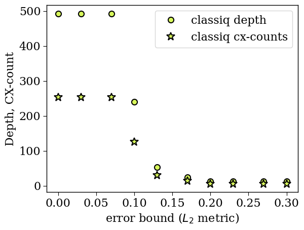

<Card title="View on GitHub" icon="github" href="https://github.com/Classiq/classiq-library/blob/main/tutorials/technology_demonstrations/approximated_state_preparation/approximated_state_preparation.ipynb">
  Open this notebook in GitHub to run it yourself
</Card>

This tutorial demonstrates an approximated quantum function: a state preparation.

Depending on the given functional error, the synthesis engine automatically chooses implementation with fewer resources.

The demonstration is on a random state vector, of size $2^6$.

```python
import numpy as np

NUM_QUBITS = 8
np.random.seed(1)
x = np.linspace(-1, 1, 2**NUM_QUBITS)

# Structured polynomial trend
trend = 0.6 - 0.4 * x + 0.8 * x**2 - 0.3 * x**3

# Small perturbation
perturbation_strength = 0.05
perturbation = perturbation_strength * np.random.randn(2**NUM_QUBITS)

amplitudes = trend + perturbation

amplitudes = amplitudes - np.mean(amplitudes)

amplitudes = (amplitudes / np.linalg.norm(amplitudes)).tolist()
```
```python

bounds = np.linspace(0.0, 0.3, 10)
print("The upper bounds:", bounds)
```
<Info>
  **Output:**

  

```

The upper bounds: [

0.         0.03333333 0.06666667 0.1        0.13333333 0.16666667
   0.2        0.23333333 0.26666667 0.3       ]
  

```
</Info>

```python
from classiq import *

preferences = Preferences(
    custom_hardware_settings=CustomHardwareSettings(basis_gates=["cx", "u"]),
    random_seed=1235,
    optimization_timeout_seconds=100,
    transpilation_option="custom",
)


depths = []
cx_counts = []
qprogs = []

for b in bounds:

    @qfunc
    def main(out: Output[QArray]) -> None:
        prepare_amplitudes(amplitudes=amplitudes, bound=b, out=out)

    qprog = synthesize(main, preferences=preferences)
    qprogs.append(qprog)

    depths.append(qprog.transpiled_circuit.depth)
    cx_counts.append(qprog.transpiled_circuit.count_ops["cx"])
```
```python

print("classiq depths:", depths)
print("cx-counts depths:", cx_counts)
```
<Info>
  **Output:**

  

```
classiq depths: [493, 493, 493, 240, 54, 25, 12, 12, 12, 12]
  cx-counts depths: [254, 254, 254, 126, 30, 14, 6, 6, 6, 6]
  

```
</Info>

```python
import matplotlib.pyplot as plt

classiq_color = "#D7F75B"
plt.rcParams["font.family"] = "serif"
plt.rc("savefig", dpi=300)

plt.rcParams["axes.linewidth"] = 1
plt.rcParams["xtick.major.size"] = 5
plt.rcParams["xtick.minor.size"] = 5
plt.rcParams["ytick.major.size"] = 5
plt.rcParams["ytick.minor.size"] = 5


plt.plot(
    np.round(bounds, 2),
    depths,
    "o",
    label="classiq depth",
    markerfacecolor=classiq_color,
    markeredgecolor="k",
    markersize=8,
    markeredgewidth=1.5,
)
plt.plot(
    np.round(bounds, 2),
    cx_counts,
    "*",
    label="classiq cx-counts",
    markerfacecolor=classiq_color,
    markeredgecolor="k",
    markersize=12,
    markeredgewidth=1.5,
)


plt.legend(fontsize=16, loc="upper right")


plt.ylabel("Depth, CX-count", fontsize=16)
plt.xlabel("error bound ($L_2$ metric)", fontsize=16)
plt.yticks(fontsize=16)
plt.xticks(fontsize=16);
```
