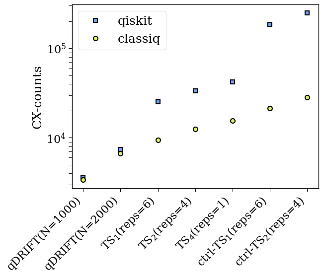

<Card title="View on GitHub" icon="github" href="https://github.com/Classiq/classiq-library/blob/main/tutorials/technology_demonstrations/hamiltonian_evolution/hamiltonian_evolution.ipynb">
  Open this notebook in GitHub to run it yourself
</Card>

This tutorial demonstrates the ability of the Classiq synthesis engine to reduce depth and cx-counts in approximated quantum functions for Hamiltonian evolution, focusing on Suzuki-Trotter (ST) and qDRIFT (qD) product formulas and their controlled operations. In addition, it is compared to the equivalent quantum examples in Qiskit.

The demonstration is for the Hamiltonian of a water molecule, which has 551 terms and a dimension of 12 qubits.

Define a molecule and get the Hamiltonian as a list of Pauli strings and coefficients:

```python
from openfermion.chem import MolecularData
from openfermionpyscf import run_pyscf

from classiq.applications.chemistry.mapping import FermionToQubitMapper
from classiq.applications.chemistry.op_utils import qubit_op_to_pauli_terms
from classiq.applications.chemistry.problems import FermionHamiltonianProblem

molecule_H2O_geometry = [
    ("O", (0.0, 0.0, 0.0)),
    ("H", (0, 0.586, 0.757)),
    ("H", (0, 0.586, -0.757)),
]
molecule = MolecularData(molecule_H2O_geometry, "sto-3g", 1, 0)

molecule = run_pyscf(molecule)

problem = FermionHamiltonianProblem.from_molecule(molecule, first_active_index=1)
mapper = FermionToQubitMapper()
hamiltonian = qubit_op_to_pauli_terms(mapper.map(problem.fermion_hamiltonian))
```

These cases are examined:

```python
ORDERS_for_ST = [1, 2, 4]
REPETITIONS_for_ST = [6, 4, 1]
N_QDS_for_qDRIFT = [1000, 2000]
```
```python

classiq_depths = []
classiq_cx_counts = []
```
```python

# transpilation_options = {"classiq": "custom", "qiskit": 3}
transpilation_options = {"classiq": "auto optimize", "qiskit": 1}
```

## 

1. Approximating with Suzuki-Trotter formulas

```python
from classiq import *

preferences = Preferences(
    custom_hardware_settings=CustomHardwareSettings(basis_gates=["cx", "u"]),
    transpilation_option=transpilation_options["classiq"],
)

all_qprogs = []

for k in range(len(ORDERS_for_ST)):

    @qfunc
    def main(qbv: Output[QArray]) -> None:
        allocate(hamiltonian.num_qubits, qbv)
        suzuki_trotter(
            pauli_operator=hamiltonian,
            evolution_coefficient=1,
            order=ORDERS_for_ST[k],
            repetitions=REPETITIONS_for_ST[k],
            qbv=qbv,
        )

    qprog = synthesize(main, preferences=preferences)
    all_qprogs.append(qprog)

    classiq_depths.append(qprog.transpiled_circuit.depth)
    classiq_cx_counts.append(qprog.transpiled_circuit.count_ops["cx"])
```

## 

2. Implementing Controlled Hamiltonian Dynamics

```python
for k in range(2):

    @qfunc
    def main(qbv: Output[QArray]) -> None:
        allocate(hamiltonian.num_qubits, qbv)
        ctrl = QBit()
        allocate(ctrl)
        control(
            ctrl=ctrl,
            stmt_block=lambda: suzuki_trotter(
                pauli_operator=hamiltonian,
                evolution_coefficient=1,
                order=ORDERS_for_ST[k],
                repetitions=REPETITIONS_for_ST[k],
                qbv=qbv,
            ),
        )

    qprog = synthesize(main, preferences=preferences)
    all_qprogs.append(qprog)

    classiq_depths.append(qprog.transpiled_circuit.depth)
    classiq_cx_counts.append(qprog.transpiled_circuit.count_ops["cx"])
```

## 

3. Approximating with the qDRIFT Formula

```python
for n_qd in N_QDS_for_qDRIFT:

    @qfunc
    def main(qbv: Output[QArray]) -> None:
        allocate(hamiltonian.num_qubits, qbv)
        qdrift(
            pauli_operator=hamiltonian,
            evolution_coefficient=1,
            num_qdrift=n_qd,
            qbv=qbv,
        )

    qprog = synthesize(main, preferences=preferences)
    all_qprogs.append(qprog)

    classiq_depths.append(qprog.transpiled_circuit.depth)
    classiq_cx_counts.append(qprog.transpiled_circuit.count_ops["cx"])
```

## 

4. Comparing to Qiskit Implementation

Comments:

- Qiskit's Suzuki-Trotter of order 1 is a separate function, called the Lie-Trotter function.
- Qiskit's qDRIFT takes a long time to run for unclear problems. Alternatively, a random product formula is implemented, which is equivalent to qDRIFT.

The qiskit data was generated using qiskit version 1.

0.

0. To run the qiskit code uncomment the commented cells below.

```python
qiskit_cx_counts = [25164, 33508, 41882, 186067, 248232, 3581, 7404]
qiskit_depths = [30627, 42879, 53581, 300924, 402125, 3463, 7141]
```
```python

# from importlib.metadata import version
# try:
#     import qiskit
#     if version('qiskit') != "1.0.0":
#       !pip uninstall qiskit -y
#       !pip install qiskit==1.0.0
# except ImportError:
#     !pip install qiskit==1.0.0
```
```python

# from qiskit.circuit.library import PauliEvolutionGate
# from qiskit.quantum_info import SparsePauliOp
# from qiskit.synthesis import LieTrotter as LieTrotter_qiskit

# qiskit_depths = []
# qiskit_cx_counts = []

# operator = SparsePauliOp.from_list(pauli_list)
# gate = PauliEvolutionGate(operator, 1)
```
```python

# 

## Suzuki-Trotter of order 1 = Lie-Trotter
# from qiskit import transpile

# lt = LieTrotter_qiskit(reps=REPETITIONS_for_ST[0])
# circ = lt.synthesize(gate)
# tqc = transpile(
#     circ, basis_gates=["u", "cx"], optimization_level=transpilation_options["qiskit"]
# )
# qiskit_depths.append(tqc.depth())
# qiskit_cx_counts.append(tqc.count_ops()["cx"])
```
```python

# 

## Suzuki-Trotter
# from qiskit.synthesis import SuzukiTrotter as SuzukiTrotter_qiskit

# for k in range(1, 3):
#     st = SuzukiTrotter_qiskit(order=ORDERS_for_ST[k], reps=REPETITIONS_for_ST[k])
#     circ = st.synthesize(gate)
#     tqc = transpile(
#         circ,
#         basis_gates=["u", "cx"],
#         optimization_level=transpilation_options["qiskit"],
#     )
#     qiskit_depths.append(tqc.depth())
#     qiskit_cx_counts.append(tqc.count_ops()["cx"])
```
```python

# # Controlled dynamics
# lt_ctrl = LieTrotter_qiskit(reps=REPETITIONS_for_ST[0])
# circ = lt_ctrl.synthesize(gate).control(1)
# tqc = transpile(
#     circ, basis_gates=["u", "cx"], optimization_level=transpilation_options["qiskit"]
# )
# qiskit_depths.append(tqc.depth())
# qiskit_cx_counts.append(tqc.count_ops()["cx"])

# for k in range(1, 2):
#     st_ctrl = SuzukiTrotter_qiskit(order=ORDERS_for_ST[k], reps=REPETITIONS_for_ST[k])
#     circ = st_ctrl.synthesize(gate).control(1)
#     tqc = transpile(
#         circ,
#         basis_gates=["u", "cx"],
#         optimization_level=transpilation_options["qiskit"],
#     )
#     qiskit_depths.append(tqc.depth())
#     qiskit_cx_counts.append(tqc.count_ops()["cx"])
```
```python

# 

## For qDRIFT, generate a random sequence
# import numpy as np


# def index_channel(n, list_coe):
#     """
#     This function gets an ordered list of coefficients 'list_coe' and a number of calls 'n' as inputs.
#     It returns a random ordered list of size n with elements from list_coe',
#     where the probability of choosing the i-th elements is list_coe[i]/sum(list_coe),
#     """
#     coe = np.array(list_coe) / sum(list_coe)
#     c_coe = np.cumsum(coe)
#     return np.searchsorted(c_coe, np.random.uniform(size=n))


# assert (
#     pauli_list[0][0] == len(pauli_list[0][0]) * "I"
# ), """The Identity term is not the first on the list of Paulis,
# please modify the code accordingly """

# pauli_list_without_id = pauli_list[1::]
# po_coe = [
#     np.abs(np.real(p[1])) for p in pauli_list_without_id
# ]  # gets absolute value of coefficients

# for n_qd in N_QDS_for_qDRIFT:
#     new_indices = index_channel(n_qd, po_coe)
#     small_lambda = sum(po_coe)
#     randomly_generated_pauli_list = [
#         (
#             pauli_list_without_id[new_indices[k]][0],
#             np.sign(pauli_list_without_id[new_indices[k]][1]) * small_lambda / n_qd,
#         )
#         for k in range(n_qd)
#     ]
#     randomly_generated_pauli_list += [pauli_list[0]]  # adding the identity
#     gate_qd = PauliEvolutionGate(
#         SparsePauliOp.from_list(randomly_generated_pauli_list), 1
#     )
#     qd = LieTrotter_qiskit(reps=1)
#     circ = qd.synthesize(gate_qd)
#     tqc = transpile(
#         circ,
#         basis_gates=["u", "cx"],
#         optimization_level=transpilation_options["qiskit"],
#     )
#     qiskit_depths.append(tqc.depth())
#     qiskit_cx_counts.append(tqc.count_ops()["cx"])
```

## 

5. Plotting the Data

```python
print("The cx-counts on Classiq:", classiq_cx_counts)
print("The cx-counts on Qiskit:", qiskit_cx_counts)
```
<Info>
  **Output:**

  

```

The cx-counts on Classiq: [9402, 12458, 15570, 21252, 28270, 3388, 6712]
  The cx-counts on Qiskit: [25164, 33508, 41882, 186067, 248232, 3581, 7404]
  

```
</Info>

```python
import matplotlib.pyplot as plt

classiq_color = "#D7F75B"
qiskit_color = "#6FA4FF"
plt.rcParams["font.family"] = "serif"
plt.rc("savefig", dpi=300)
plt.rcParams["axes.linewidth"] = 1
plt.rcParams["xtick.major.size"] = 5
plt.rcParams["xtick.minor.size"] = 5
plt.rcParams["ytick.major.size"] = 5
plt.rcParams["ytick.minor.size"] = 5

plt.semilogy(
    qiskit_cx_counts[-2::] + qiskit_cx_counts[0:5],
    "s",
    label="qiskit",
    markerfacecolor=qiskit_color,
    markeredgecolor="k",
    markersize=6,
    markeredgewidth=1.5,
)
plt.semilogy(
    classiq_cx_counts[-2::] + classiq_cx_counts[0:5],
    "o",
    label="classiq",
    markerfacecolor=classiq_color,
    markeredgecolor="k",
    markersize=6.5,
    markeredgewidth=1.5,
)

labels = [
    "qDRIFT(N=1000)",
    "qDRIFT(N=2000)",
    "TS$_1$(reps=6)",
    "TS$_2$(reps=4)",
    "TS$_4$(reps=1)",
    "ctrl-TS$_1$(reps=6)",
    "ctrl-TS$_2$(reps=4)",
]
plt.xticks([0, 1, 2, 3, 4, 5, 6], labels, rotation=45, fontsize=16, ha="right")
plt.ylabel("CX-counts", fontsize=18)
plt.yticks(fontsize=16)
plt.legend(loc="upper left", fontsize=18, fancybox=True, framealpha=0.5)
```
<Info>
  **Output:**

  

```
<matplotlib.legend.

Legend at 0x309718e10>
  

```
</Info>

