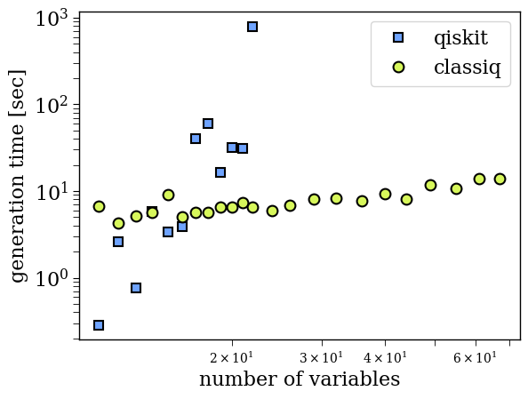

<Card title="View on GitHub" icon="github" href="https://github.com/Classiq/classiq-library/blob/main/tutorials/technology_demonstrations/oracle_generation/3sat_oracles.ipynb">
  Open this notebook in GitHub to run it yourself
</Card>

This notebook demonstrates Classiq's capabilities in the framework of phase oracles.

The focus is 3-SAT problems on a growing number of variables. To highlight the advantage of generation times, we skip transpilation for the synthesis output.

The following utility functions generate random 3-SAT problems for $N$ boolean variables, consisting of $N$ clauses.

```python
import numpy as np

from classiq.qmod.symbolic import logical_and, logical_not, logical_or


def generate_permutation_for_3sat_expression(num_qubits, max_samples=1000):
    """
    A function that generates two permutations on a list of num_qubits variables,
    for introducing a random and valid 3-SAT problem
    """

    direct_arr = np.array([k for k in range(num_qubits)])
    for k in range(max_samples):
        permut1 = np.random.permutation(num_qubits)
        permut2 = np.random.permutation(num_qubits)
        if (
            (0 not in permut2 - direct_arr)
            and (0 not in permut1 - direct_arr)
            and (0 not in permut1 - permut2)
        ):
            break

    assert (
        k < max_samples
    ), "Could not find a random 3-SAT problem, try to increase max_samples"
    return direct_arr, permut1, permut2


def generate_3sat_qbit_expression(vars, s0, s1, s2):
    """
    A function that generates a 3-SAT problem on a list of QBit variables.

The returned expression contains num_qubits=len(vars) clauses and contains
    triplets of the form (x_k or ~x_s1(k) or x_s2(k)), where s1, s2 are permutations.
    """

    num_qubits = len(vars)
    k = 0
    y = logical_or(logical_or(vars[s0[k]], logical_not(vars[s1[k]])), vars[s2[k]])
    for k in range(1, num_qubits):
        temp = logical_or(
            logical_or(vars[s0[k]], logical_not(vars[s1[k]])), vars[s2[k]]
        )
        y = logical_and(y, temp)
    return y
```

## 

1. Generating Phase Oracles

For each 3-SAT problem we generate an oracle with Classiq and save the generation time, as well as the circuits' width.

```python
from classiq import *

qmods = []
qprogs = []


def get_generation_time_classiq(s0, s1, s2, num_qubits):
    start_cl = time.time()

    @qfunc
    def main(qbv: Output[QArray]):

        def inner_call(aux: QNum):
            aux ^= generate_3sat_qbit_expression(
                [qbv[k] for k in range(num_qubits)], s0, s1, s2
            )

        allocate(num_qubits, qbv)
        aux = QNum("aux")
        allocate(1, aux)
        within_apply(
            lambda: (X(aux), H(aux)),
            lambda: inner_call(aux),
        )
        free(aux)

    qmod = create_model(main)
    qmod = set_preferences(qmod, preferences=Preferences(transpilation_option="none"))
    qmods.append(qmod)
    qprog = synthesize(qmod)
    qprogs.append(qprog)

    return qprog.data.width, time.time() - start_cl
```

The following function generates a phase oracle with qiskit.

```python
def get_generation_time_qiskit(s0, s1, s2, num_qubits):
    start_qs = time.time()
    dict_of_qnums = {f"x{k}": QNum(f"x{k}") for k in range(num_qubits)}
    expression = str(
        generate_3sat_qbit_expression(
            [dict_of_qnums[f"x{k}"] for k in range(num_qubits)], s0, s1, s2
        )
    )
    expression = expression.replace("or", "|")
    expression = expression.replace("not", "~")
    expression = expression.replace("and", "&")
    oracle = PhaseOracle(expression, var_order=None)
    q = QuantumRegister(num_qubits)
    qc = QuantumCircuit(q)
    qc.append(oracle, q[:])

    return time.time() - start_qs
```
*For generating the same data with Qiskit please uncomment the commented lines (including the `pip install command`).* We work with qiskit version 1.0.

0.

```python
import time

from qiskit import QuantumCircuit, QuantumRegister, transpile
from qiskit.circuit.library import PhaseOracle
```

We skip generating data with Qiskit for $N>23$, as generation times exponentially diverge with the number of variables.

```python
np.random.seed(128)
cl_times = []
num_qubits_list = [k for k in range(11, 23)] + [
    int(l) for l in np.logspace(np.log2(24), np.log2(68), 11, base=2)
]
```
```python

# from importlib.metadata import version
# try:
#     import qiskit
#     if version('qiskit') != "1.0.0":
#       !pip uninstall qiskit -y
#       !pip install qiskit==1.0.0
# except ImportError:
#     !pip install qiskit==1.0.0

# ! pip install tweedledum
# qs_times = []
```
```python

for l in num_qubits_list:
    num_qubits = l
    print("num_qubits:", num_qubits)
    s0, s1, s2 = generate_permutation_for_3sat_expression(num_qubits)

    cl_width, classiq_generation_time = get_generation_time_classiq(
        s0, s1, s2, num_qubits
    )
    cl_times.append(classiq_generation_time)
    print("classiq_width:", cl_width, ",   classiq_time:", classiq_generation_time)

    # if l<23:
    #     qiskit_generation_time = get_generation_time_qiskit(s0, s1, s2, num_qubits)
    #     qs_times.append(qiskit_generation_time)
    #     print("qiskit_time:", qiskit_generation_time)
```
<Info>
  **Output:**

  

```
num_qubits: 11
  classiq_width: 25 ,   classiq_time: 6.707828998565674
  num_qubits: 12
  classiq_width: 28 ,   classiq_time: 4.241983890533447
  num_qubits: 13
  classiq_width: 31 ,   classiq_time: 5.165003061294556
  num_qubits: 14
  classiq_width: 34 ,   classiq_time: 5.6608970165252686
  num_qubits: 15
  classiq_width: 37 ,   classiq_time: 9.164438009262085
  num_qubits: 16
  classiq_width: 34 ,   classiq_time: 5.097576856613159
  num_qubits: 17
  classiq_width: 38 ,   classiq_time: 5.640438079833984
  num_qubits: 18
  classiq_width: 38 ,   classiq_time: 5.6844401359558105
  num_qubits: 19
  classiq_width: 44 ,   classiq_time: 6.499827861785889
  num_qubits: 20
  classiq_width: 43 ,   classiq_time: 6.553148031234741
  num_qubits: 21
  classiq_width: 44 ,   classiq_time: 7.41901421546936
  num_qubits: 22
  classiq_width: 45 ,   classiq_time: 6.614210844039917
  num_qubits: 24
  classiq_width: 60 ,   classiq_time: 5.969420909881592
  num_qubits: 26
  classiq_width: 60 ,   classiq_time: 6.843206882476807
  num_qubits: 29
  classiq_width: 64 ,   classiq_time: 8.168700218200684
  num_qubits: 32
  classiq_width: 77 ,   classiq_time: 8.244300842285156
  num_qubits: 36
  classiq_width: 87 ,   classiq_time: 7.734289884567261
  num_qubits: 40
  classiq_width: 89 ,   classiq_time: 9.301125764846802
  num_qubits: 44
  classiq_width: 109 ,   classiq_time: 8.133974075317383
  num_qubits: 49
  classiq_width: 102 ,   classiq_time: 11.690325021743774
  num_qubits: 55
  classiq_width: 113 ,   classiq_time: 10.843430042266846
  num_qubits: 61
  classiq_width: 138 ,   classiq_time: 13.8468017578125
  num_qubits: 67
  classiq_width: 142 ,   classiq_time: 13.800977945327759
  

```
</Info>

## 

2. Plotting the Data

Since generating the data takes time we hard-coded the Qiskit results in the notebook. If you run this notebook by yourself please comment out the following cell.

```python
qs_times = [
    0.2850170135498047,
    2.6256730556488037,
    0.75693678855896,
    5.783859968185425,
    3.3723957538604736,
    3.9280269145965576,
    39.92809295654297,
    60.67643904685974,
    16.551968097686768,
    31.536834955215454,
    31.086618900299072,
    794.9081449508667,
]
```
```python

import matplotlib.pyplot as plt

classiq_color = "#D7F75B"
qiskit_color = "#6FA4FF"
plt.rcParams["font.family"] = "serif"
plt.rc("savefig", dpi=300)

plt.rcParams["axes.linewidth"] = 1
plt.rcParams["xtick.major.size"] = 5
plt.rcParams["xtick.minor.size"] = 5
plt.rcParams["ytick.major.size"] = 5
plt.rcParams["ytick.minor.size"] = 5


plt.loglog(
    [n for n in num_qubits_list if n < 23],
    qs_times,
    "s",
    label="qiskit",
    markerfacecolor=qiskit_color,
    markeredgecolor="k",
    markersize=7,
    markeredgewidth=1.5,
    linewidth=1.5,
    color=qiskit_color,
)
plt.loglog(
    num_qubits_list,
    cl_times,
    "o",
    label="classiq",
    markerfacecolor=classiq_color,
    markeredgecolor="k",
    markersize=8.5,
    markeredgewidth=1.5,
    linewidth=1.5,
    color=classiq_color,
)

plt.legend(fontsize=16, loc="upper right")


plt.ylabel("generation time [sec]", fontsize=16)
plt.xlabel("number of variables", fontsize=16)
plt.yticks(fontsize=16)
plt.xticks(fontsize=16)
```
<Info>
  **Output:**

  

```
(array([   1.,   10.,  100., 1000.]),
   [Text(1.0, 0, '$\\mathdefault{10^{0}}$'),
    Text(10.0, 0, '$\\mathdefault{10^{1}}$'),
    Text(100.0, 0, '$\\mathdefault{10^{2}}$'),
    Text(1000.0, 0, '$\\mathdefault{10^{3}}$')])
  

```
</Info>

