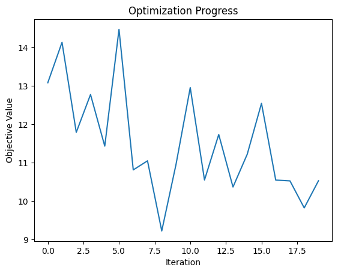

<Card title="View on GitHub" icon="github" href="https://github.com/Classiq/classiq-library/blob/main/tutorials/workshops/finance_workshops/combi_workshop_Inequality_constriants_PO.ipynb">
  Open this notebook in GitHub to run it yourself
</Card>

## Dealing with constraint using portfolio optimization

## Guidance for the workshop:

**The `# TODO` or `# Your code` is there for you to do yourself.**
**The `# Solution start` and `# Solution end` are only for helping you.

Please delete the `Solution` and try doing it yourself...**

## Portfolio Optimization with the Quantum Approximate Optimization Algorithm (QAOA)

#

## Introduction

Portfolio optimization is the process of allocating a portfolio of financial assets optimally, according to some predetermined goal. Usually, the goal is to maximize the potential return while minimizing the financial risk of the portfolio.

One can express this problem as a combinatorial optimization problem like many other real-world problems. In this demo, we'll show how the Quantum Approximate Optimization Algorithm (QAOA) can be employed on the Classiq platform to solve the problem of portfolio optimization.

#

## Modeling the Portfolio Optimization Problem

As a first step, we have to model the problem mathematically. We will use a simple yet powerful model, which captures the essence of portfolio optimization:

- A portfolio is built from a pool of $n$ financial assets, each asset labeled $i \in \{1,\ldots,n\}$.
- Every asset's return is a random variable, with expected value $\mu_i$ and variance $\Sigma_i$ (modeling the financial risk involved in the asset).
- Every two assets $i \neq j$ have covariance $\Sigma_{ij}$ (modeling market correlation between assets).
- Every asset $i$ has a weight $w_i \in D_i = \{0,\ldots,b_i\}$ in the portfolio, with $b_i$ defined as the budget for asset $i$ (modeling the maximum allowed weight of the asset).
- The return vector $\mu$, the covariance matrix $\Sigma$ and the weight vector $w$ are defined naturally from the above (with the domain $D = D_1 \times D_2 \times \ldots \times D_n$ for $w$).

With the above definitions, the total expected return of the portfolio is $\mu^T w$ and the total risk is $w^T \Sigma w$. We'll use a simple difference of the two as our cost function, with the additional constraint that the total sum of assets does not exceed a predefined budget $B$. We note that there are many other possibilities for defining a cost function (e.g. add a scaling factor to the risk/return or even some non-linear relation).

For reasons of simplicity we select the model below, and we assume all constants and variables are dimensionless.
Thus, the problem is, given the constant inputs $\mu, \Sigma, D, B$, to find optimal variable $w$ as follows:

$$
\begin{equation*}
\min_{w \in D}  w^T \Sigma w - \mu^T w,
\end{equation*}
$$
subject to

$$
\Sigma_{i} w_i \leq B
$$
The case presented above is called integer portfolio optimization, since the domains $D_i$ are over the (positive) integers.

Another variation of this problem defines weights over binary domains, and will not be discussed here.

```python
import math
from typing import List

import matplotlib.pyplot as plt
import networkx as nx
import numpy as np
from scipy.optimize import minimize

from classiq import *
```
#

### Finaly, we will add inequality constraints:

$$
\begin{equation*}
\min_{w \in D}  w^T \Sigma w - \mu^T w,
\end{equation*}
$$
subject to:

$$
\Sigma_{i} w_i \leq B
$$
**We will do it similarly to the equality constraint but we add slack variable that can take multiple values to make sure $\Sigma_{i} w_i \leq B$**

In this case, we will change the objective function as follows:

$$
\begin{equation*}
\min_{w \in D}  w^T \Sigma w - \mu^T w + P * (\Sigma_{i} w_i + slack - B)^2
\end{equation*}
$$
Where $P$ is the penalty value you need to define.

## The Portfolio Optimization Problem Parameters

First we define the parameters of the optimization problem, which include the expected return vector, the covariance matrix, the total budget and the asset-specific budgets.

```python
returns = np.array([3, 4, -1])
# fmt: off
covariances = np.array(
    [
        [ 0.9,  0.5, -0.7],
        [ 0.5,  0.9, -0.2],
        [-0.7, -0.2,  0.9],
    ]
)
# fmt: on
total_budget = 6
```

## Defining the variables

The number of slack qubits needs to reach to get to the number $B$.

```python
num_assets = 3

num_qubits_per_asset = 2  # Defines the possible values of choosing each asset.

num_slack = 3


class PortfolioOptimizationVars(QStruct):
    a: QArray[QNum[num_qubits_per_asset], num_assets]
    slack: QNum[num_slack]
```
#

## Define the expected return

Define a function that describes $\mu^T w$ where $\mu$ is the `return` vector.

```python
def expected_return_cost(
    returns: np.ndarray, w_array: PortfolioOptimizationVars
) -> float:
    return sum(returns[i] * w_array.a[i] for i in range(len(returns)))
```
#

## Define the risk term

Define a function that describes the risk term in the objective function $w^T \Sigma w$ where $\Sigma$ is the `covariances` matrix.

$$
\begin{equation*}
\min_{w \in D}  w^T \Sigma w - \mu^T w + P * (\Sigma_{i} w_i + slack - B)^2
\end{equation*}
$$

```python
def risk_cost(covariances: np.ndarray, w_array: PortfolioOptimizationVars) -> float:
    risk_term = sum(
        w_array.a[i]
        * sum(w_array.a[j] * covariances[i][j] for j in range(covariances.shape[0]))
        for i in range(covariances.shape[0])
    )
    return risk_term
```
#

## Define the entire portfolio optimization objective function

Combine the risk term and the expected return functions.

There a a term called return coefficient `return_coeff` that defines how much you prefer certainly over return.

Higher values is more risky but can be more profitable.

Later try changing it to see how the result changes.

```python
return_coeff = 1.4
Penalty = 1.3


def objective_portfolio_inequality(
    w_array: PortfolioOptimizationVars,
    returns: np.ndarray,
    covariances: np.ndarray,
    return_coeff: float,
) -> float:
    # Your code

    # Solution start
    return (
        risk_cost(covariances, w_array)
        - return_coeff * expected_return_cost(returns, w_array)
        + Penalty
        * (
            sum(w_array.a[i] for i in range(len(returns)))
            + w_array.slack
            - total_budget
        )
        ** 2
    )
    # Solution end
```

## Build the QAOA circuit

```python
@qfunc
def mixer_layer(beta: CReal, qba: QArray):
    # Your code here

    # Solution start
    apply_to_all(lambda q: RX(beta, q), qba)
    # Solution end
```
```python

NUM_LAYERS = 4


@qfunc
def main(
    params: CArray[CReal, 2 * NUM_LAYERS], w_array: Output[PortfolioOptimizationVars]
) -> None:

    # Allocating the qubits
    allocate(w_array)

    # Your code

    # Solution start

    hadamard_transform(w_array)

    repeat(
        count=int(params.len / 2),
        iteration=lambda i: (
            phase(
                objective_portfolio_inequality(
                    w_array, returns, covariances, return_coeff
                ),
                params[2 * i],
            ),
            mixer_layer(params[2 * i + 1], w_array),
        ),
    )

    # Solution end
```

## Synthesizing and visualizing

```python
qprog = synthesize(main)
show(qprog)
```
<Info>
  **Output:**

  

```

Quantum program link: https://platform.classiq.io/circuit/2ygh3y09PSqCwRCitOK3J7bCW3g
  

```
</Info>

## Execution and post processing

For the hybrid execution, we use `ExecutionSession`, which can evaluate the circuit in multiple methods, such as sampling the circuit, giving specific values for the parameters, and evaluating to a specific Hamiltonian, which is very common in chemical applications.

In QAOA, we will use the `estimate_cost` method, which samples the cost function and returns their average cost from all measurements.

That helps to optimize easily.

```python
NUM_SHOTS = 1000

es = ExecutionSession(
    qprog, execution_preferences=ExecutionPreferences(num_shots=NUM_SHOTS)
)

# Build `initial_params` list of np.array type.
# The gamma values should start from 0 and, in each layer, should approach closer to 1 linearly
# The beta values should start from 1 and in each layer, should approach closer to 0 linearly
# Then unify it to one list so scipy minimize can digest it.
# Your code here


# Solution start
def initial_qaoa_params(NUM_LAYERS) -> np.ndarray:
    initial_gammas = math.pi * np.linspace(0, 1, NUM_LAYERS)
    initial_betas = math.pi * np.linspace(1, 0, NUM_LAYERS)

    initial_params = []

    for i in range(NUM_LAYERS):
        initial_params.append(initial_gammas[i])
        initial_params.append(initial_betas[i])

    return np.array(initial_params)


# Solution end

initial_params = initial_qaoa_params(NUM_LAYERS)
```
#

## Define a callback function to track the optimization

```python
# Record the steps of the optimization
intermediate_params = []
objective_values = []


# Define the callback function to store the intermediate steps
def callback(xk):
    intermediate_params.append(xk)
```
#

## Define the objective function

```python
# You code
# You can use the hints in the comments

# cost_func = lambda state: objective_portfolio_inequality(
#     w_array = ...,
#     returns = ...,
#     covariances = ...,
#     return_coeff= ...
# )
# def estimate_cost_func(params: np.ndarray) -> float:
#     objective_value = es.estimate_cost(
#         cost_func = ...,
#         parameters = {"params": params.tolist()}
#     )
#     # Your code here
#     # Save the result for convergence graph

#     return objective_value

# Solution start


cost_func = lambda state: objective_portfolio_inequality(
    w_array=state["w_array"],
    returns=returns,
    covariances=covariances,
    return_coeff=return_coeff,
)


def estimate_cost_func(params: np.ndarray) -> float:
    objective_value = es.estimate_cost(
        cost_func=cost_func, parameters={"params": params.tolist()}
    )
    objective_values.append(objective_value)
    return objective_value


# Solution end
```
#

## Optimize

```python
# You code
# You can use the hints in the comments

# optimization_res = minimize(
#     fun = ...,
#     x0=...,
#     method="COBYLA",
#     callback=...,
#     options={"maxiter": 10},
# )

# Solution start

optimization_res = minimize(
    estimate_cost_func,
    x0=initial_params,
    method="COBYLA",
    callback=callback,
    options={"maxiter": 20},
)
# Solution end
```
#

## Look at the results

```python
res = es.sample({"params": optimization_res.x.tolist()})

print(f"Optimized parameters: {optimization_res.x.tolist()}")

sorted_counts = sorted(
    res.parsed_counts,
    key=lambda pc: objective_portfolio_inequality(
        pc.state["w_array"],
        returns=returns,
        covariances=covariances,
        return_coeff=return_coeff,
    ),
)

for sampled in sorted_counts:
    w_sample = sampled.state["w_array"]
    print(
        f"solution={w_sample} probability={sampled.shots/NUM_SHOTS} "
        f"cost={objective_portfolio_inequality(w_array=w_sample,returns = returns, covariances = covariances, return_coeff= return_coeff)}"
    )
```
<Info>
  **Output:**

  

```

Optimized parameters: [0.0, 4.141592653589793, 1.0471975511965976, 3.0943951023931957, 2.0943951023931953, 2.047197551196598, 3.141592653589793, 1.0]
  solution={'a': [1, 3, 1], 'slack': 1} probability=0.003 cost=-9.299999999999999
  solution={'a': [2, 3, 1], 'slack': 0} probability=0.007 cost=-9.199999999999998
  solution={'a': [2, 2, 2], 'slack': 0} probability=0.001 cost=-9.199999999999998
  solution={'a': [1, 3, 0], 'slack': 2} probability=0.006 cost=-8.999999999999998
  solution={'a': [3, 1, 2], 'slack': 0} probability=0.002 cost=-8.999999999999998
  solution={'a': [1, 2, 0], 'slack': 3} probability=0.001 cost=-8.899999999999999
  solution={'a': [1, 2, 1], 'slack': 2} probability=0.001 cost=-8.8
  solution={'a': [3, 2, 1], 'slack': 0} probability=0.003 cost=-8.799999999999999
  solution={'a': [2, 1, 1], 'slack': 2} probability=0.003 cost=-8.4
  solution={'a': [2, 2, 1], 'slack': 2} probability=0.003 cost=-8.4
  solution={'a': [3, 2, 2], 'slack': 0} probability=0.001 cost=-8.399999999999999
  solution={'a': [2, 2, 0], 'slack': 2} probability=0.001 cost=-8.399999999999999
  solution={'a': [1, 3, 1], 'slack': 0} probability=0.004 cost=-7.999999999999999
  solution={'a': [2, 2, 2], 'slack': 1} probability=0.005 cost=-7.899999999999998
  solution={'a': [2, 3, 1], 'slack': 1} probability=0.002 cost=-7.899999999999998
  solution={'a': [1, 3, 2], 'slack': 0} probability=0.002 cost=-7.799999999999999
  solution={'a': [1, 3, 0], 'slack': 3} probability=0.003 cost=-7.699999999999998
  solution={'a': [0, 2, 0], 'slack': 4} probability=0.002 cost=-7.6
  solution={'a': [1, 2, 0], 'slack': 2} probability=0.003 cost=-7.599999999999999
  solution={'a': [1, 2, 1], 'slack': 3} probability=0.005 cost=-7.500000000000001
  solution={'a': [1, 2, 1], 'slack': 1} probability=0.002 cost=-7.500000000000001
  solution={'a': [2, 1, 0], 'slack': 3} probability=0.002 cost=-7.5
  solution={'a': [2, 1, 2], 'slack': 1} probability=0.002 cost=-7.499999999999999
  solution={'a': [3, 2, 1], 'slack': 1} probability=0.001 cost=-7.499999999999999
  solution={'a': [2, 3, 0], 'slack': 1} probability=0.002 cost=-7.4999999999999964
  solution={'a': [0, 3, 0], 'slack': 4} probability=0.005 cost=-7.399999999999996
  solution={'a': [0, 3, 0], 'slack': 2} probability=0.004 cost=-7.399999999999996
  solution={'a': [3, 1, 1], 'slack': 0} probability=0.001 cost=-7.199999999999998
  solution={'a': [2, 1, 1], 'slack': 3} probability=0.005 cost=-7.1000000000000005
  solution={'a': [2, 1, 1], 'slack': 1} probability=0.003 cost=-7.1000000000000005
  solution={'a': [2, 2, 0], 'slack': 1} probability=0.004 cost=-7.099999999999999
  solution={'a': [2, 2, 0], 'slack': 3} probability=0.001 cost=-7.099999999999999
  solution={'a': [1, 1, 0], 'slack': 4} probability=0.006 cost=-6.999999999999999
  solution={'a': [1, 2, 2], 'slack': 1} probability=0.002 cost=-6.9
  solution={'a': [1, 3, 2], 'slack': 1} probability=0.004 cost=-6.499999999999999
  solution={'a': [1, 1, 1], 'slack': 3} probability=0.003 cost=-6.499999999999998
  solution={'a': [3, 0, 2], 'slack': 1} probability=0.002 cost=-6.499999999999997
  solution={'a': [3, 1, 3], 'slack': 0} probability=0.003 cost=-6.399999999999998
  solution={'a': [0, 2, 0], 'slack': 5} probability=0.005 cost=-6.3
  solution={'a': [0, 3, 1], 'slack': 3} probability=0.008 cost=-6.299999999999999
  solution={'a': [0, 3, 1], 'slack': 1} probability=0.001 cost=-6.299999999999999
  solution={'a': [2, 1, 0], 'slack': 4} probability=0.001 cost=-6.2
  solution={'a': [2, 1, 0], 'slack': 2} probability=0.001 cost=-6.2
  solution={'a': [2, 1, 2], 'slack': 0} probability=0.006 cost=-6.199999999999999
  solution={'a': [2, 1, 2], 'slack': 2} probability=0.003 cost=-6.199999999999999
  solution={'a': [3, 1, 0], 'slack': 2} probability=0.001 cost=-6.1999999999999975
  solution={'a': [2, 3, 0], 'slack': 2} probability=0.002 cost=-6.199999999999997
  solution={'a': [1, 1, 0], 'slack': 3} probability=0.005 cost=-5.699999999999999
  solution={'a': [1, 2, 2], 'slack': 0} probability=0.001 cost=-5.6000000000000005
  solution={'a': [2, 2, 3], 'slack': 0} probability=0.002 cost=-5.599999999999999
  solution={'a': [2, 0, 1], 'slack': 3} probability=0.007 cost=-5.3
  solution={'a': [1, 1, 1], 'slack': 4} probability=0.005 cost=-5.199999999999998
  solution={'a': [1, 1, 1], 'slack': 2} probability=0.001 cost=-5.199999999999998
  solution={'a': [3, 0, 1], 'slack': 3} probability=0.005 cost=-5.099999999999999
  solution={'a': [3, 0, 1], 'slack': 1} probability=0.003 cost=-5.099999999999999
  solution={'a': [3, 1, 0], 'slack': 3} probability=0.001 cost=-4.899999999999998
  solution={'a': [0, 2, 1], 'slack': 2} probability=0.002 cost=-4.799999999999999
  solution={'a': [0, 2, 1], 'slack': 4} probability=0.001 cost=-4.799999999999999
  solution={'a': [2, 0, 0], 'slack': 4} probability=0.001 cost=-4.799999999999999
  solution={'a': [3, 0, 3], 'slack': 0} probability=0.001 cost=-4.799999999999995
  solution={'a': [3, 2, 0], 'slack': 2} probability=0.003 cost=-4.7999999999999945
  solution={'a': [3, 2, 0], 'slack': 0} probability=0.001 cost=-4.7999999999999945
  solution={'a': [0, 1, 0], 'slack': 5} probability=0.003 cost=-4.699999999999999
  solution={'a': [0, 3, 2], 'slack': 1} probability=0.002 cost=-4.699999999999999
  solution={'a': [2, 2, 1], 'slack': 3} probability=0.001 cost=-4.500000000000001
  solution={'a': [3, 0, 0], 'slack': 3} probability=0.001 cost=-4.499999999999998
  solution={'a': [3, 3, 0], 'slack': 0} probability=0.001 cost=-4.199999999999996
  solution={'a': [1, 3, 1], 'slack': 3} probability=0.001 cost=-4.099999999999999
  solution={'a': [2, 0, 1], 'slack': 2} probability=0.003 cost=-4.0
  solution={'a': [2, 0, 1], 'slack': 4} probability=0.002 cost=-4.0
  solution={'a': [2, 0, 2], 'slack': 2} probability=0.003 cost=-3.999999999999999
  solution={'a': [1, 3, 0], 'slack': 0} probability=0.004 cost=-3.799999999999998
  solution={'a': [1, 2, 0], 'slack': 5} probability=0.002 cost=-3.6999999999999984
  solution={'a': [1, 2, 0], 'slack': 1} probability=0.002 cost=-3.6999999999999984
  solution={'a': [1, 2, 1], 'slack': 4} probability=0.006 cost=-3.6000000000000005
  solution={'a': [1, 2, 1], 'slack': 0} probability=0.005 cost=-3.6000000000000005
  solution={'a': [3, 2, 1], 'slack': 2} probability=0.007 cost=-3.5999999999999988
  solution={'a': [3, 2, 3], 'slack': 0} probability=0.001 cost=-3.599999999999995
  solution={'a': [2, 0, 0], 'slack': 3} probability=0.006 cost=-3.499999999999999
  solution={'a': [2, 1, 3], 'slack': 1} probability=0.001 cost=-3.4999999999999982
  solution={'a': [0, 3, 0], 'slack': 1} probability=0.006 cost=-3.4999999999999956
  solution={'a': [0, 3, 0], 'slack': 5} probability=0.004 cost=-3.4999999999999956
  solution={'a': [3, 0, 3], 'slack': 1} probability=0.001 cost=-3.4999999999999956
  solution={'a': [0, 1, 0], 'slack': 4} probability=0.006 cost=-3.3999999999999995
  solution={'a': [0, 1, 0], 'slack': 6} probability=0.001 cost=-3.3999999999999995
  solution={'a': [0, 3, 2], 'slack': 0} probability=0.001 cost=-3.3999999999999995
  solution={'a': [1, 0, 0], 'slack': 5} probability=0.003 cost=-3.2999999999999994
  solution={'a': [3, 1, 1], 'slack': 3} probability=0.006 cost=-3.299999999999998
  solution={'a': [2, 1, 1], 'slack': 0} probability=0.001 cost=-3.2
  solution={'a': [2, 1, 1], 'slack': 4} probability=0.001 cost=-3.2
  solution={'a': [1, 2, 3], 'slack': 0} probability=0.002 cost=-3.1999999999999993
  solution={'a': [2, 2, 0], 'slack': 0} probability=0.007 cost=-3.1999999999999984
  solution={'a': [3, 0, 0], 'slack': 2} probability=0.001 cost=-3.1999999999999984
  solution={'a': [3, 0, 0], 'slack': 4} probability=0.001 cost=-3.1999999999999984
  solution={'a': [2, 2, 0], 'slack': 4} probability=0.001 cost=-3.1999999999999984
  solution={'a': [1, 3, 3], 'slack': 0} probability=0.002 cost=-3.1999999999999966
  solution={'a': [1, 1, 2], 'slack': 3} probability=0.001 cost=-2.8999999999999995
  solution={'a': [1, 1, 2], 'slack': 1} probability=0.001 cost=-2.8999999999999995
  solution={'a': [3, 3, 0], 'slack': 1} probability=0.008 cost=-2.899999999999996
  solution={'a': [0, 2, 2], 'slack': 2} probability=0.007 cost=-2.799999999999999
  solution={'a': [2, 0, 2], 'slack': 1} probability=0.001 cost=-2.6999999999999993
  solution={'a': [2, 0, 2], 'slack': 3} probability=0.001 cost=-2.6999999999999993
  solution={'a': [3, 1, 3], 'slack': 1} probability=0.005 cost=-2.4999999999999973
  solution={'a': [0, 2, 0], 'slack': 2} probability=0.012 cost=-2.3999999999999995
  solution={'a': [0, 2, 0], 'slack': 6} probability=0.006 cost=-2.3999999999999995
  solution={'a': [0, 3, 1], 'slack': 4} probability=0.007 cost=-2.3999999999999986
  solution={'a': [0, 3, 1], 'slack': 0} probability=0.004 cost=-2.3999999999999986
  solution={'a': [2, 1, 0], 'slack': 1} probability=0.004 cost=-2.3
  solution={'a': [2, 1, 2], 'slack': 3} probability=0.001 cost=-2.299999999999999
  solution={'a': [2, 3, 0], 'slack': 3} probability=0.003 cost=-2.2999999999999963
  solution={'a': [3, 3, 1], 'slack': 1} probability=0.001 cost=-2.1000000000000005
  solution={'a': [1, 0, 0], 'slack': 4} probability=0.001 cost=-1.9999999999999993
  solution={'a': [1, 0, 0], 'slack': 6} probability=0.001 cost=-1.9999999999999993
  solution={'a': [2, 3, 3], 'slack': 0} probability=0.005 cost=-1.9999999999999991
  solution={'a': [1, 1, 0], 'slack': 6} probability=0.004 cost=-1.799999999999999
  solution={'a': [1, 2, 2], 'slack': 3} probability=0.002 cost=-1.7000000000000002
  solution={'a': [2, 2, 3], 'slack': 1} probability=0.003 cost=-1.6999999999999984
  solution={'a': [0, 1, 1], 'slack': 3} probability=0.004 cost=-1.4999999999999993
  solution={'a': [0, 1, 1], 'slack': 5} probability=0.002 cost=-1.4999999999999993
  solution={'a': [0, 2, 2], 'slack': 1} probability=0.002 cost=-1.499999999999999
  solution={'a': [1, 1, 1], 'slack': 1} probability=0.001 cost=-1.299999999999998
  solution={'a': [3, 0, 2], 'slack': 3} probability=0.002 cost=-1.2999999999999972
  solution={'a': [3, 0, 1], 'slack': 0} probability=0.004 cost=-1.1999999999999984
  solution={'a': [3, 0, 1], 'slack': 4} probability=0.002 cost=-1.1999999999999984
  solution={'a': [1, 0, 1], 'slack': 5} probability=0.001 cost=-1.0999999999999994
  solution={'a': [3, 1, 0], 'slack': 4} probability=0.007 cost=-0.9999999999999973
  solution={'a': [3, 1, 0], 'slack': 0} probability=0.002 cost=-0.9999999999999973
  solution={'a': [0, 2, 1], 'slack': 1} probability=0.001 cost=-0.8999999999999986
  solution={'a': [3, 2, 0], 'slack': 3} probability=0.004 cost=-0.8999999999999941
  solution={'a': [1, 1, 3], 'slack': 1} probability=0.001 cost=-0.09999999999999964
  solution={'a': [0, 3, 3], 'slack': 0} probability=0.002 cost=1.7763568394002505e-15
  solution={'a': [1, 0, 2], 'slack': 3} probability=0.001 cost=0.30000000000000027
  solution={'a': [2, 0, 0], 'slack': 6} probability=0.009 cost=0.40000000000000124
  solution={'a': [2, 0, 0], 'slack': 2} probability=0.001 cost=0.40000000000000124
  solution={'a': [2, 1, 3], 'slack': 2} probability=0.002 cost=0.40000000000000213
  solution={'a': [2, 0, 3], 'slack': 2} probability=0.003 cost=0.40000000000000235
  solution={'a': [2, 0, 3], 'slack': 0} probability=0.002 cost=0.40000000000000235
  solution={'a': [0, 1, 0], 'slack': 3} probability=0.003 cost=0.5000000000000009
  solution={'a': [0, 1, 0], 'slack': 7} probability=0.002 cost=0.5000000000000009
  solution={'a': [0, 3, 2], 'slack': 3} probability=0.001 cost=0.5000000000000009
  solution={'a': [3, 0, 0], 'slack': 1} probability=0.006 cost=0.700000000000002
  solution={'a': [1, 3, 3], 'slack': 1} probability=0.001 cost=0.7000000000000037
  solution={'a': [1, 1, 2], 'slack': 0} probability=0.003 cost=1.0000000000000009
  solution={'a': [1, 1, 2], 'slack': 4} probability=0.002 cost=1.0000000000000009
  solution={'a': [3, 3, 0], 'slack': 2} probability=0.001 cost=1.0000000000000044
  solution={'a': [1, 1, 3], 'slack': 0} probability=0.001 cost=1.2000000000000004
  solution={'a': [1, 1, 3], 'slack': 2} probability=0.001 cost=1.2000000000000004
  solution={'a': [2, 0, 2], 'slack': 0} probability=0.002 cost=1.200000000000001
  solution={'a': [0, 0, 0], 'slack': 5} probability=0.005 cost=1.3
  solution={'a': [0, 3, 3], 'slack': 1} probability=0.003 cost=1.3000000000000018
  solution={'a': [1, 0, 2], 'slack': 2} probability=0.006 cost=1.6000000000000003
  solution={'a': [1, 0, 0], 'slack': 3} probability=0.001 cost=1.9000000000000008
  solution={'a': [2, 2, 1], 'slack': 4} probability=0.001 cost=2.0
  solution={'a': [1, 2, 3], 'slack': 2} probability=0.006 cost=2.000000000000001
  solution={'a': [3, 2, 2], 'slack': 2} probability=0.008 cost=2.0000000000000018
  solution={'a': [0, 1, 2], 'slack': 4} probability=0.007 cost=2.2
  solution={'a': [0, 1, 2], 'slack': 2} probability=0.003 cost=2.2
  solution={'a': [0, 0, 1], 'slack': 5} probability=0.005 cost=2.3
  solution={'a': [0, 2, 2], 'slack': 0} probability=0.002 cost=2.4000000000000012
  solution={'a': [0, 2, 2], 'slack': 4} probability=0.002 cost=2.4000000000000012
  solution={'a': [2, 3, 1], 'slack': 3} probability=0.002 cost=2.5000000000000036
  solution={'a': [2, 3, 2], 'slack': 2} probability=0.003 cost=2.6000000000000014
  solution={'a': [3, 1, 2], 'slack': 3} probability=0.005 cost=2.700000000000003
  solution={'a': [1, 3, 0], 'slack': 5} probability=0.002 cost=2.700000000000003
  solution={'a': [1, 0, 1], 'slack': 2} probability=0.001 cost=2.8000000000000007
  solution={'a': [1, 2, 1], 'slack': 5} probability=0.002 cost=2.9000000000000004
  solution={'a': [3, 2, 3], 'slack': 1} probability=0.001 cost=2.9000000000000057
  solution={'a': [0, 3, 0], 'slack': 0} probability=0.006 cost=3.0000000000000053
  solution={'a': [0, 3, 0], 'slack': 6} probability=0.002 cost=3.0000000000000053
  solution={'a': [3, 3, 2], 'slack': 1} probability=0.002 cost=3.100000000000003
  solution={'a': [3, 1, 1], 'slack': 4} probability=0.006 cost=3.200000000000003
  solution={'a': [2, 2, 0], 'slack': 5} probability=0.001 cost=3.3000000000000025
  solution={'a': [0, 0, 1], 'slack': 6} probability=0.002 cost=3.5999999999999996
  solution={'a': [0, 2, 3], 'slack': 0} probability=0.002 cost=3.6000000000000005
  solution={'a': [3, 3, 3], 'slack': 0} probability=0.001 cost=3.600000000000003
  solution={'a': [1, 3, 2], 'slack': 3} probability=0.003 cost=3.900000000000002
  solution={'a': [0, 2, 0], 'slack': 1} probability=0.002 cost=4.100000000000001
  solution={'a': [0, 2, 0], 'slack': 7} probability=0.002 cost=4.100000000000001
  solution={'a': [0, 3, 1], 'slack': 5} probability=0.007 cost=4.100000000000002
  solution={'a': [2, 1, 2], 'slack': 4} probability=0.002 cost=4.200000000000002
  solution={'a': [2, 3, 0], 'slack': 4} probability=0.004 cost=4.200000000000005
  solution={'a': [2, 0, 3], 'slack': 3} probability=0.008 cost=4.3000000000000025
  solution={'a': [3, 3, 1], 'slack': 2} probability=0.002 cost=4.4
  solution={'a': [2, 3, 3], 'slack': 1} probability=0.003 cost=4.500000000000002
  solution={'a': [1, 1, 0], 'slack': 7} probability=0.001 cost=4.700000000000002
  solution={'a': [1, 2, 2], 'slack': 4} probability=0.005 cost=4.800000000000001
  solution={'a': [1, 0, 3], 'slack': 2} probability=0.001 cost=4.800000000000001
  solution={'a': [0, 0, 0], 'slack': 4} probability=0.001 cost=5.2
  solution={'a': [3, 0, 2], 'slack': 4} probability=0.002 cost=5.200000000000004
  solution={'a': [3, 0, 1], 'slack': 5} probability=0.002 cost=5.3000000000000025
  solution={'a': [1, 0, 2], 'slack': 1} probability=0.001 cost=5.5
  solution={'a': [3, 1, 0], 'slack': 5} probability=0.008 cost=5.5000000000000036
  solution={'a': [3, 2, 0], 'slack': 4} probability=0.009 cost=5.600000000000007
  solution={'a': [0, 1, 2], 'slack': 5} probability=0.002 cost=6.1000000000000005
  solution={'a': [0, 0, 2], 'slack': 4} probability=0.002 cost=6.4
  solution={'a': [2, 0, 1], 'slack': 6} probability=0.006 cost=6.400000000000001
  solution={'a': [2, 0, 0], 'slack': 1} probability=0.001 cost=6.900000000000002
  solution={'a': [3, 0, 3], 'slack': 3} probability=0.001 cost=6.900000000000006
  solution={'a': [3, 0, 0], 'slack': 0} probability=0.001 cost=7.200000000000003
  solution={'a': [1, 3, 3], 'slack': 2} probability=0.003 cost=7.200000000000005
  solution={'a': [0, 0, 1], 'slack': 3} probability=0.001 cost=7.5
  solution={'a': [0, 2, 3], 'slack': 3} probability=0.001 cost=7.500000000000001
  solution={'a': [1, 1, 2], 'slack': 5} probability=0.001 cost=7.500000000000002
  solution={'a': [0, 0, 2], 'slack': 5} probability=0.003 cost=7.7
  solution={'a': [2, 0, 2], 'slack': 5} probability=0.001 cost=7.700000000000002
  solution={'a': [1, 0, 1], 'slack': 7} probability=0.001 cost=9.3
  solution={'a': [1, 0, 3], 'slack': 0} probability=0.004 cost=10.0
  solution={'a': [3, 2, 2], 'slack': 3} probability=0.001 cost=11.100000000000001
  solution={'a': [1, 3, 1], 'slack': 5} probability=0.003 cost=11.500000000000002
  solution={'a': [0, 1, 3], 'slack': 4} probability=0.004 cost=11.600000000000001
  solution={'a': [0, 0, 2], 'slack': 2} probability=0.001 cost=11.600000000000001
  solution={'a': [0, 0, 2], 'slack': 6} probability=0.001 cost=11.600000000000001
  solution={'a': [1, 1, 3], 'slack': 4} probability=0.001 cost=11.600000000000001
  solution={'a': [2, 3, 1], 'slack': 4} probability=0.002 cost=11.600000000000003
  solution={'a': [0, 0, 0], 'slack': 3} probability=0.001 cost=11.700000000000001
  solution={'a': [3, 1, 2], 'slack': 4} probability=0.002 cost=11.800000000000002
  solution={'a': [1, 0, 2], 'slack': 0} probability=0.002 cost=12.000000000000002
  solution={'a': [3, 2, 3], 'slack': 2} probability=0.001 cost=12.000000000000005
  solution={'a': [0, 3, 0], 'slack': 7} probability=0.001 cost=12.100000000000005
  solution={'a': [0, 0, 3], 'slack': 3} probability=0.02 cost=12.3
  solution={'a': [3, 1, 1], 'slack': 5} probability=0.001 cost=12.300000000000002
  solution={'a': [2, 1, 1], 'slack': 6} probability=0.002 cost=12.4
  solution={'a': [0, 1, 2], 'slack': 0} probability=0.004 cost=12.600000000000001
  solution={'a': [0, 1, 2], 'slack': 6} probability=0.001 cost=12.600000000000001
  solution={'a': [1, 3, 2], 'slack': 4} probability=0.001 cost=13.000000000000002
  solution={'a': [3, 1, 3], 'slack': 3} probability=0.001 cost=13.100000000000003
  solution={'a': [0, 2, 0], 'slack': 0} probability=0.002 cost=13.200000000000001
  solution={'a': [2, 1, 2], 'slack': 5} probability=0.002 cost=13.3
  solution={'a': [2, 1, 0], 'slack': 7} probability=0.001 cost=13.3
  solution={'a': [3, 3, 1], 'slack': 3} probability=0.001 cost=13.5
  solution={'a': [0, 0, 3], 'slack': 2} probability=0.01 cost=13.600000000000001
  solution={'a': [2, 3, 3], 'slack': 2} probability=0.006 cost=13.600000000000001
  solution={'a': [0, 0, 3], 'slack': 4} probability=0.003 cost=13.600000000000001
  solution={'a': [1, 1, 0], 'slack': 0} probability=0.001 cost=13.8
  solution={'a': [1, 2, 2], 'slack': 5} probability=0.003 cost=13.9
  solution={'a': [2, 2, 3], 'slack': 3} probability=0.004 cost=13.900000000000002
  solution={'a': [0, 0, 1], 'slack': 2} probability=0.006 cost=14.0
  solution={'a': [0, 2, 3], 'slack': 4} probability=0.001 cost=14.000000000000002
  solution={'a': [1, 1, 1], 'slack': 7} probability=0.004 cost=14.300000000000002
  solution={'a': [3, 1, 0], 'slack': 6} probability=0.001 cost=14.600000000000003
  solution={'a': [0, 2, 1], 'slack': 7} probability=0.003 cost=14.700000000000003
  solution={'a': [2, 0, 1], 'slack': 7} probability=0.004 cost=15.5
  solution={'a': [2, 0, 0], 'slack': 0} probability=0.002 cost=16.0
  solution={'a': [2, 1, 3], 'slack': 4} probability=0.001 cost=16.000000000000004
  solution={'a': [3, 0, 3], 'slack': 4} probability=0.007 cost=16.000000000000007
  solution={'a': [0, 3, 2], 'slack': 5} probability=0.004 cost=16.1
  solution={'a': [3, 0, 0], 'slack': 7} probability=0.003 cost=16.300000000000004
  solution={'a': [1, 0, 3], 'slack': 5} probability=0.001 cost=16.5
  solution={'a': [1, 1, 2], 'slack': 6} probability=0.008 cost=16.6
  solution={'a': [3, 3, 0], 'slack': 4} probability=0.001 cost=16.600000000000005
  solution={'a': [2, 0, 2], 'slack': 6} probability=0.004 cost=16.8
  solution={'a': [1, 0, 0], 'slack': 1} probability=0.004 cost=17.5
  solution={'a': [0, 0, 3], 'slack': 5} probability=0.004 cost=17.5
  solution={'a': [0, 0, 3], 'slack': 1} probability=0.003 cost=17.5
  solution={'a': [0, 1, 1], 'slack': 0} probability=0.006 cost=18.0
  solution={'a': [0, 2, 2], 'slack': 6} probability=0.003 cost=18.0
  solution={'a': [0, 0, 2], 'slack': 1} probability=0.008 cost=18.1
  solution={'a': [0, 1, 3], 'slack': 5} probability=0.001 cost=18.1
  solution={'a': [2, 0, 3], 'slack': 5} probability=0.001 cost=19.900000000000002
  solution={'a': [0, 3, 3], 'slack': 4} probability=0.005 cost=20.800000000000004
  solution={'a': [1, 0, 2], 'slack': 7} probability=0.002 cost=21.1
  solution={'a': [0, 1, 2], 'slack': 7} probability=0.001 cost=21.700000000000003
  solution={'a': [2, 2, 1], 'slack': 6} probability=0.007 cost=22.799999999999997
  solution={'a': [0, 2, 3], 'slack': 5} probability=0.001 cost=23.1
  solution={'a': [1, 3, 1], 'slack': 6} probability=0.001 cost=23.200000000000003
  solution={'a': [2, 3, 2], 'slack': 4} probability=0.001 cost=23.4
  solution={'a': [1, 3, 0], 'slack': 7} probability=0.005 cost=23.5
  solution={'a': [1, 2, 1], 'slack': 7} probability=0.006 cost=23.7
  solution={'a': [3, 2, 3], 'slack': 3} probability=0.001 cost=23.700000000000003
  solution={'a': [3, 2, 1], 'slack': 5} probability=0.001 cost=23.700000000000003
  solution={'a': [3, 3, 2], 'slack': 3} probability=0.01 cost=23.900000000000002
  solution={'a': [0, 0, 3], 'slack': 6} probability=0.003 cost=24.0
  solution={'a': [2, 2, 0], 'slack': 7} probability=0.004 cost=24.1
  solution={'a': [2, 1, 1], 'slack': 7} probability=0.002 cost=24.1
  solution={'a': [1, 3, 2], 'slack': 5} probability=0.001 cost=24.700000000000003
  solution={'a': [3, 3, 1], 'slack': 4} probability=0.011 cost=25.2
  solution={'a': [2, 3, 3], 'slack': 3} probability=0.007 cost=25.3
  solution={'a': [1, 0, 3], 'slack': 6} probability=0.003 cost=25.6
  solution={'a': [1, 2, 2], 'slack': 6} probability=0.002 cost=25.6
  solution={'a': [2, 2, 3], 'slack': 4} probability=0.001 cost=25.6
  solution={'a': [3, 0, 2], 'slack': 6} probability=0.002 cost=26.000000000000004
  solution={'a': [3, 0, 1], 'slack': 7} probability=0.001 cost=26.1
  solution={'a': [3, 2, 0], 'slack': 6} probability=0.004 cost=26.400000000000006
  solution={'a': [0, 1, 3], 'slack': 6} probability=0.012 cost=27.200000000000003
  solution={'a': [0, 0, 2], 'slack': 0} probability=0.001 cost=27.200000000000003
  solution={'a': [0, 3, 2], 'slack': 6} probability=0.01 cost=27.8
  solution={'a': [0, 1, 0], 'slack': 0} probability=0.004 cost=27.8
  solution={'a': [1, 1, 2], 'slack': 7} probability=0.001 cost=28.3
  solution={'a': [1, 0, 0], 'slack': 0} probability=0.002 cost=29.2
  solution={'a': [1, 2, 3], 'slack': 5} probability=0.003 cost=29.3
  solution={'a': [0, 2, 2], 'slack': 7} probability=0.001 cost=29.700000000000003
  solution={'a': [2, 0, 3], 'slack': 6} probability=0.007 cost=31.6
  solution={'a': [1, 1, 3], 'slack': 6} probability=0.001 cost=32.4
  solution={'a': [0, 0, 0], 'slack': 1} probability=0.003 cost=32.5
  solution={'a': [0, 3, 3], 'slack': 5} probability=0.001 cost=32.5
  solution={'a': [0, 0, 3], 'slack': 7} probability=0.006 cost=33.1
  solution={'a': [0, 0, 1], 'slack': 0} probability=0.001 cost=34.8
  solution={'a': [2, 2, 1], 'slack': 7} probability=0.002 cost=37.1
  solution={'a': [3, 2, 2], 'slack': 5} probability=0.004 cost=37.10000000000001
  solution={'a': [1, 3, 1], 'slack': 7} probability=0.001 cost=37.50000000000001
  solution={'a': [2, 2, 2], 'slack': 6} probability=0.004 cost=37.60000000000001
  solution={'a': [2, 3, 1], 'slack': 6} probability=0.001 cost=37.60000000000001
  solution={'a': [3, 2, 1], 'slack': 6} probability=0.002 cost=38.00000000000001
  solution={'a': [3, 1, 1], 'slack': 7} probability=0.004 cost=38.300000000000004
  solution={'a': [3, 1, 3], 'slack': 5} probability=0.004 cost=39.10000000000001
  solution={'a': [2, 1, 2], 'slack': 7} probability=0.002 cost=39.300000000000004
  solution={'a': [2, 3, 0], 'slack': 7} probability=0.001 cost=39.30000000000001
  solution={'a': [3, 3, 1], 'slack': 5} probability=0.001 cost=39.5
  solution={'a': [1, 2, 2], 'slack': 7} probability=0.001 cost=39.900000000000006
  solution={'a': [2, 2, 3], 'slack': 5} probability=0.001 cost=39.900000000000006
  solution={'a': [3, 2, 0], 'slack': 7} probability=0.001 cost=40.70000000000001
  solution={'a': [3, 0, 3], 'slack': 6} probability=0.01 cost=42.00000000000001
  solution={'a': [2, 1, 3], 'slack': 6} probability=0.004 cost=42.00000000000001
  solution={'a': [0, 3, 2], 'slack': 7} probability=0.001 cost=42.10000000000001
  solution={'a': [1, 3, 3], 'slack': 5} probability=0.001 cost=42.30000000000001
  solution={'a': [3, 3, 0], 'slack': 6} probability=0.003 cost=42.60000000000001
  solution={'a': [2, 0, 3], 'slack': 7} probability=0.004 cost=45.900000000000006
  solution={'a': [0, 0, 0], 'slack': 0} probability=0.001 cost=46.800000000000004
  solution={'a': [0, 2, 3], 'slack': 7} probability=0.004 cost=49.10000000000001
  solution={'a': [3, 2, 2], 'slack': 6} probability=0.003 cost=54.0
  solution={'a': [2, 2, 2], 'slack': 7} probability=0.002 cost=54.50000000000001
  solution={'a': [2, 3, 2], 'slack': 6} probability=0.002 cost=54.6
  solution={'a': [3, 2, 3], 'slack': 5} probability=0.001 cost=54.900000000000006
  solution={'a': [3, 2, 1], 'slack': 7} probability=0.001 cost=54.900000000000006
  solution={'a': [1, 3, 2], 'slack': 7} probability=0.002 cost=55.900000000000006
  solution={'a': [3, 3, 1], 'slack': 6} probability=0.001 cost=56.400000000000006
  solution={'a': [2, 3, 3], 'slack': 5} probability=0.001 cost=56.5
  solution={'a': [2, 2, 3], 'slack': 6} probability=0.001 cost=56.800000000000004
  solution={'a': [2, 1, 3], 'slack': 7} probability=0.002 cost=58.900000000000006
  solution={'a': [1, 3, 3], 'slack': 6} probability=0.006 cost=59.2
  solution={'a': [3, 3, 0], 'slack': 7} probability=0.001 cost=59.50000000000001
  solution={'a': [0, 3, 3], 'slack': 7} probability=0.002 cost=63.7
  solution={'a': [3, 2, 2], 'slack': 7} probability=0.001 cost=73.5
  solution={'a': [2, 3, 2], 'slack': 7} probability=0.003 cost=74.10000000000001
  solution={'a': [3, 2, 3], 'slack': 6} probability=0.001 cost=74.4
  solution={'a': [3, 3, 1], 'slack': 7} probability=0.002 cost=75.9
  solution={'a': [2, 3, 3], 'slack': 6} probability=0.002 cost=76.0
  solution={'a': [3, 2, 3], 'slack': 7} probability=0.001 cost=96.5
  solution={'a': [3, 3, 3], 'slack': 6} probability=0.001 cost=97.2
  solution={'a': [2, 3, 3], 'slack': 7} probability=0.003 cost=98.1
  solution={'a': [3, 3, 3], 'slack': 7} probability=0.002 cost=121.9
  

```
</Info>

#

## Convergence graph

```python
plt.plot(objective_values)
plt.xlabel("Iteration")
plt.ylabel("Objective Value")
plt.title("Optimization Progress")
```
<Info>
  **Output:**

  

```

Text(0.5, 1.0, 'Optimization Progress')
  

```
</Info>



## Solution

```python
import math
from typing import List

import matplotlib.pyplot as plt
import networkx as nx
import numpy as np
from scipy.optimize import minimize

from classiq import *

NUM_LAYERS = 3

num_slack = 3

returns = np.array([3, 4, -1])
# fmt: off
covariances = np.array(
    [
        [ 0.9,  0.5, -0.7],
        [ 0.5,  0.9, -0.2],
        [-0.7, -0.2,  0.9],
    ]
)
# fmt: on
total_budget = 6
specific_budgets = 3

return_coeff = 10.0

num_assets = 3

num_qubits_per_asset = 2

Penalty = 30.5

# start with integer variables


class PortfolioOptimizationVars(QStruct):
    a: QArray[QNum[num_qubits_per_asset], num_assets]
    slack: QNum[num_slack]


def expected_return_cost(
    returns: np.ndarray, w_array: PortfolioOptimizationVars
) -> float:
    return sum(returns[i] * w_array.a[i] for i in range(len(returns)))


def risk_cost(covariances: np.ndarray, w_array: PortfolioOptimizationVars) -> float:
    risk_term = sum(
        w_array.a[i]
        * sum(w_array.a[j] * covariances[i][j] for j in range(covariances.shape[0]))
        for i in range(covariances.shape[0])
    )
    return risk_term


def objective_portfolio_inequality(
    w_array: PortfolioOptimizationVars,
    returns: np.ndarray,
    covariances: np.ndarray,
    return_coeff: float,
) -> float:
    return (
        risk_cost(covariances, w_array)
        - return_coeff * expected_return_cost(returns, w_array)
        + Penalty
        * (
            sum(w_array.a[i] for i in range(len(returns)))
            + w_array.slack
            - total_budget
        )
        ** 2
    )


@qfunc
def mixer_layer(beta: CReal, qba: QArray):
    apply_to_all(lambda q: RX(beta, q), qba)


@qfunc
def main(
    params: CArray[CReal, 2 * NUM_LAYERS], w_array: Output[PortfolioOptimizationVars]
) -> None:
    allocate(w_array)

    hadamard_transform(w_array)

    repeat(
        count=int(params.len / 2),
        iteration=lambda i: (
            phase(
                objective_portfolio_inequality(
                    w_array, returns, covariances, return_coeff
                ),
                params[2 * i],
            ),
            mixer_layer(params[2 * i + 1], w_array),
        ),
    )


qprog = synthesize(main)
show(qprog)


NUM_SHOTS = 1000

es = ExecutionSession(
    qprog, execution_preferences=ExecutionPreferences(num_shots=NUM_SHOTS)
)


def initial_qaoa_params(NUM_LAYERS) -> np.ndarray:
    initial_gammas = math.pi * np.linspace(0, 1, NUM_LAYERS)
    initial_betas = math.pi * np.linspace(1, 0, NUM_LAYERS)

    initial_params = []

    for i in range(NUM_LAYERS):
        initial_params.append(initial_gammas[i])
        initial_params.append(initial_betas[i])

    return np.array(initial_params)


initial_params = initial_qaoa_params(NUM_LAYERS)

# Record the steps of the optimization
intermediate_params = []
objective_values = []


# Define the callback function to store the intermediate steps
def callback(xk):
    intermediate_params.append(xk)


cost_func = lambda state: objective_portfolio_inequality(
    w_array=state["w_array"],
    returns=returns,
    covariances=covariances,
    return_coeff=return_coeff,
)


def estimate_cost_func(params: np.ndarray) -> float:
    objective_value = es.estimate_cost(
        cost_func=cost_func, parameters={"params": params.tolist()}
    )
    objective_values.append(objective_value)
    return objective_value


optimization_res = minimize(
    estimate_cost_func,
    x0=initial_params,
    method="COBYLA",
    callback=callback,
    options={"maxiter": 20},
)

res = es.sample({"params": optimization_res.x.tolist()})

print(f"Optimized parameters: {optimization_res.x.tolist()}")

sorted_counts = sorted(
    res.parsed_counts,
    key=lambda pc: objective_portfolio_inequality(
        pc.state["w_array"],
        returns=returns,
        covariances=covariances,
        return_coeff=return_coeff,
    ),
)

for sampled in sorted_counts:
    w = sampled.state["w_array"]
    print(
        f"solution={w} probability={sampled.shots/NUM_SHOTS} "
        f"cost={objective_portfolio_inequality(w_array=w,returns = returns, covariances = covariances, return_coeff= return_coeff)}"
    )

plt.plot(objective_values)
plt.xlabel("Iteration")
plt.ylabel("Objective Value")
plt.title("Optimization Progress")
```