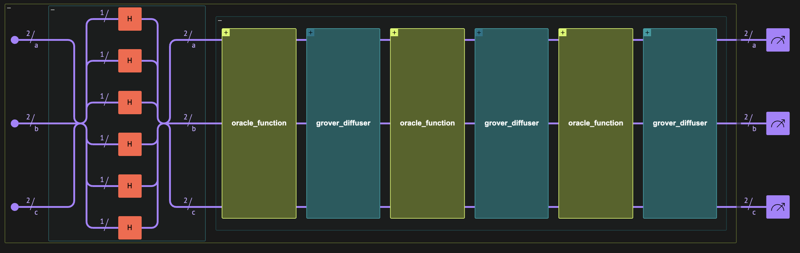
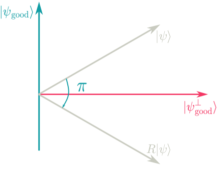
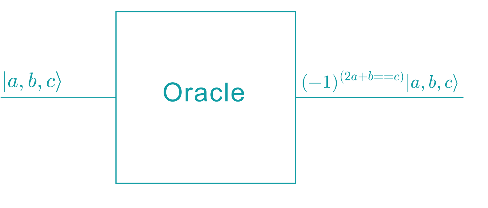
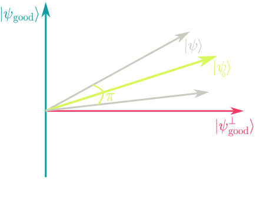

<Card title="View on GitHub" icon="github" href="https://github.com/Classiq/classiq-library/blob/main/tutorials/workshops/grover_workshop/grover_workshop.ipynb">
  Open this notebook in GitHub to run it yourself
</Card>

## Setting the scene

```python
# !pip install -U classiq
```
```python

new_classiq_user = False
if new_classiq_user:
    import classiq

    classiq.authenticate()
```

## Warm Up

#

## First Example

Write a function that prepares the plus state $|{+}\rangle^{\otimes n}=\left[\frac{1}{\sqrt2}(|{0}\rangle+|{1}\rangle)\right]^{\otimes n}$, assuming the state of the input quantum variable is $|x\rangle^{\otimes n}$

<Accordion title="HINT">
  Use either `apply_to_all()` with `H(x)`, or `hadamard_transform()`.
</Accordion>

```python
from classiq import *
from classiq.qmod.symbolic import pi
```

Now we will test our code:

```python
n = 5


@qfunc
def main(x: Output[QArray[QBit]]):
    allocate(5, x)
    hadamard_transform(x)  # Prepare the plus state
```
```python

qprog = synthesize(main)
```
```python

show(qprog)
```
<Info>
  **Output:**

  

```

Quantum program link: https://platform.classiq.io/circuit/3BDZ0CrFpw76x6WbQ3GSz1oh9aD
  

```
</Info>

Some basic explanations about the high-level functional design with Classiq:

- There should always be a main (`def main(...)`) function - the model that captures your algortihm is described there

- The model is always generated out of the main function

- The model is sent to the synthesis engine (compiler) that return a quantum program which contains the quantum circuit

Some basic guidelines about the modeling language (Qmod):

1. Every quantum variable should be declared, either as a parameter of a funciton e.g. `def main(x: Output[QBit])` or within the function itself with `x = QBit()`

1. Some quantum variables need to be initalized with the `allocate` function.

This is required in 2 cases:

- A variable is a parameter of a function with the declaration `Output` like `def main(x: Output[QNum])`
- A variable that is declared within a function like `a = QNum()`

3. For the `main` function, you should always use `Output` for all variables, as the function does not receive any input

Important tip!

You can see all the declarations of the functions with their parameters in the `functions.py` file within the classiq package (or by just right clicking a function and presing `Go To Defintion`)

## Grover's algorithm 

- Summary

Before diving into Grover's algorithm implementation, it is important to analyze its different building blocks. We start by looking at the overall quantum algorithm and then start build it step-by-step.



- **Initial state preparation**: The algorithm starts by preparing a uniform superposition $\lvert + \rangle^{\otimes n}$ using Hadamard gates.

This ensures that all possible states are explored simultaneously. At this stage, each state has equal probability amplitude.

- **Grover Oracle**: The oracle encodes the problem by marking the solution state(s). It does this by applying a phase flip, effectively distinguishing "good" states from "bad" ones. Importantly, it does not reveal the solution directly, only modifies its phase.

- **Grover Diffuser**: The diffuser amplifies the probability of the marked states through a reflection about the average amplitude.

This step increases the likelihood of measuring the correct solution.

Repeating the oracle and diffuser gradually concentrates probability on the target state.

## Oracle 

- Reflection about bad states

#

## Theoretical Background

Overall we can understand the Grover operator as composed of two reflection operators:

1. about the superposition of 'bad states' (i.e. not the solutions)
1. about the initial guess state

In this section we will build the first reflection operator which is also the implementation of the oracle function.

Geometrically it can be understood in the 2D vector space of $\text{Span}\{|{\psi_{\text{good}}}\rangle,|{\psi_{\text{bad}}}\rangle\}$.



The above figure describe geometrically the reflection of some state $|{\psi}\rangle=\alpha|{\psi_\text{good}}\rangle+\beta|{\psi_\text{bad}}\rangle$ about the state $|{\psi_\text{bad}}\rangle$ such that

$$
\begin{equation}
R(\alpha|{\psi_\text{good}}\rangle+\beta|{\psi_\text{bad}}\rangle) = -\alpha|{\psi_\text{good}}\rangle+\beta|{\psi_\text{bad}}\rangle
\end{equation}
$$
This operator can also be written as

$$
\begin{equation}
R|{x}\rangle=(-1)^{(x==\text{good solution})}|{x}\rangle
\end{equation}
$$
so if the state of $x$ is a solution it gets a $(-)$ phase.

#

## Implementation

Now we turn to actually implementing the oracle.

With Qmod quantum expressions, capturing the intent becomes straightforward.

The compiler does the heavy-lifting of synthesizing the reversible circuits for us.

For our purposes, we want to find all the states that obey $2a+b=c$ so there are 3 quantum variables. In addition, we want to store our results in the relative phase of such states. In other words, we want:

$$
\begin{equation} |{a,b,c}\rangle\rightarrow(-1)^{(2a+b==c)}|{a,b,c}\rangle\end{equation}
$$
In a visual representation, this is what we want:



Now we can implement it by defining the `oracle_function`:

```python
@qperm
def oracle_function(a: Const[QNum], b: Const[QNum], c: Const[QNum]):
    control((2 * a + b == c), phase(pi))
```

## Diffuser 

- Reflection about initial guess

#

## Theoretical Background

The second part of the Grover operator is the diffuser, which can be viewed as the reflection operator about our initial guess.



As with the oracle reflection operator, we can describe any state $|{\psi}\rangle$ as a superposition of the initial state $|{\psi_0}\rangle$ such that  and the orthogoanl state to it $|{\psi_0^{\bot}}\rangle$

$$
\begin{equation}
|{\psi}\rangle = \alpha |{\psi_0}\rangle +\beta |{\psi_0^{\bot}}\rangle
\end{equation}
$$
Here we want to apply a $\pi$ phase to all states that are not equal our initial guess.

The reflection operator (our diffuser) is defined as:

$$
\begin{equation}
R(\alpha |{\psi_0}\rangle +\beta |{\psi_0^{\bot}}\rangle) = \alpha |{\psi_0}\rangle -\beta |{\psi_0^{\bot}}\rangle
\end{equation}
$$

To implement a reflection about the initial state $\vert \psi_0 \rangle$, we instead perform a reflection about the computational zero state $\vert 0 \rangle$, conjugated by our state-preparation unitary for the initial state $\vert \psi_0 \rangle$.

That is, if $U_{\psi_0}|{0}\rangle=|{\psi_0}\rangle$ then we will implement the desired $R$ operator with:

$$
\begin{equation}
R = U_{\psi_0}R_0 U_{\psi_0}^{\dagger}
\end{equation}
$$
where $R_0$ is the reflection operator about the zero state:

$$
\begin{equation}
R_0|{x}\rangle = (-1)^{(x\ne0)}|{x}\rangle= (2|{0}\rangle\langle{0}|-I)|{x}\rangle
\end{equation}
$$

#

## Implementation

We will use the controlled `phase` operation once more. To conjugate it within Hadamard transforms, we use `within_apply`:

```python
@qfunc
def grover_diffuser(state: QNum) -> None:
    within_apply(
        lambda: hadamard_transform(state),
        lambda: control(state != 0, lambda: phase(pi)),
    )
```

## Putting all together

That's it! Complete your grover operator by implementing the two functions that you've built, first the `oracle_function` and then the `grover_diffuser`:

```python
@qfunc
def my_grover_operator(a: QNum, b: QNum, c: QNum):
    # TODO complete here
    pass
```

Now that we have our Grover operator, we can run it within our code. We have 3 steps here:

1. Initalize `a`,`b` and `c` within the scope of the `main` function using the `allocate` operation
1. Create the initial states for `a`,`b` and `c`
1. Apply your Grover operator

```python
size_a = 2
size_b = 2
size_c = 3


@qfunc
def main(a: Output[QNum], b: Output[QNum], c: Output[QNum]):
    allocate(size_a, a)
    allocate(size_b, b)
    allocate(size_c, c)

    # TODO complete here
    pass
```

Synthesize your model:

```python
qprog = synthesize(main)
```

And view it within the IDE:

```python
show(qprog)
```
<Info>
  **Output:**

  

```

Quantum program link: https://platform.classiq.io/circuit/3BDZ0Oj00fjmqsR9QKcsGqmJ0HB
  

```
</Info>

Is it what you were expecting?
Now we can play with the constraints as we did in the IDE:

```python
qprog_depth_optimized = synthesize(
    main, constraints=Constraints(optimization_parameter="depth")
)  # or 'width'
show(qprog_depth_optimized)
```
<Info>
  **Output:**

  

```

Quantum program link: https://platform.classiq.io/circuit/3BDZ0fTM0RneZZeGNTJ9XxpiAx6
  

```
</Info>

#

## CONGRATULATIONS!

You have completed your own Grover algorithm implementation from functional building blocks without sweeping under the rug any details, really impressive work!

#

### The full solution for your reference

```python
from classiq import *
from classiq.qmod.symbolic import pi


@qperm
def oracle_function(a: Const[QNum], b: Const[QNum], c: Const[QNum]):
    control((2 * a + b == c), lambda: phase(pi))


@qfunc
def grover_diffuser(state: QNum) -> None:
    within_apply(
        lambda: hadamard_transform(state),
        lambda: control(state != 0, lambda: phase(pi)),
    )


@qfunc
def my_grover_operator(a: QNum, b: QNum, c: QNum):
    oracle_function(a, b, c)
    grover_diffuser([a, b, c])


@qfunc
def main(a: Output[QNum], b: Output[QNum], c: Output[QNum]):
    allocate(size_a, a)
    allocate(size_b, b)
    allocate(size_c, c)
    hadamard_transform([a, b, c])
    my_grover_operator(a, b, c)


qprog = synthesize(main)
show(qprog)

constraints = Constraints(optimization_parameter="depth")  # or 'width'
qprog_depth_optimized = synthesize(main, constraints=constraints)
show(qprog_depth_optimized)
```
<Info>
  **Output:**

  

```

Quantum program link: https://platform.classiq.io/circuit/3BDZ1HvwH1GQxmlAVeElrmEtqZm
  Quantum program link: https://platform.classiq.io/circuit/3BDZ2l0vxNe8XvU6ZbqoUsEvTnN
  

```
</Info>