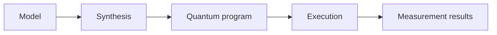

Welcome to Classiq. This guide walks you through your first quantum program and introduces the core Classiq workflow: modeling, synthesis, execution, and result analysis.

You can get started with Classiq in one of the following ways:

- **Studio Python**: code in Python directly in the browser. No local installation required.
- **Local Python SDK**: code in Python from your local environment, notebook, or preferred editor.
- **Qmod in the Classiq Platform**: write Qmod directly in the browser-based Model Editor.

<Note>
To use Classiq, you need a Classiq account. Register through the [Classiq Platform](https://platform.classiq.io/) or follow the [registration guide](/getting-started/registration_installations/).
</Note>

Both paths use the same core workflow:



In this example, you create a small quantum program that introduces the basic Classiq workflow. The program allocates a one-qubit quantum number, applies a 
Hadamard gate to place it in superposition, assigns a classical value to a second quantum number, and adds the two values into a third quantum number.

The model uses three output variables:

- `x`: a one-qubit quantum number prepared in superposition.
- `y`: a quantum number assigned the value `2`.
- `z`: a quantum number that stores the expression `x + y`.

Because `x` is placed in superposition, execution samples two possible arithmetic outcomes:

- When `x = 0`, `z = 2`.
- When `x = 1`, `z = 3`.

By the end of this example, you will have:

- Created a simple Qmod model
- Synthesized it into a quantum program
- Executed it
- Verified that the results show the expected relation between `x`, `y`, and `z`

Choose your path:

- **Use Python in Classiq Studio** if you want to work with Python in a setup-free, cloud-based coding editor.
- **Use the Python SDK locally** if you want to work in notebooks or scripts in your local development environment.
- **Use Qmod-native syntax in the Classiq Platform** if you want to write Qmod directly in the browser-based Model Editor.

All paths produce the same expected behavior.

<Tabs>
<Tab title="Studio Python SDK">
Use the Classiq Studio if you want to build, synthesize, execute, and inspect quantum programs directly in your browser while still coding in Python - 
no need to install anything.

Open the [Classiq Studio](https://platform.classiq.io/studio/) and create the arithmetic model in a new file:


```python
from classiq import *

@qfunc
def main(x: Output[QNum], y: Output[QNum], z: Output[QNum]):
    allocate(1, x)
    H(x)
    y |= 2
    z |= x + y 

qprog = synthesize(main)

show(qprog)
```


The program visualization displays the synthesized quantum program. A Hadamard gate is applied to the quantum number `x`, and an arithmetic block is applied between 
`x`, `y`, and `z` to perform the equation $z = x + y$.

To execute the quantum program, run:

[comment]: DO_NOT_TEST

```python
res = sample(qprog)

print(res)
```

Example output:

| x | y | z | counts | probability | bitstring |
| - | - | - | ------ | ----------- | --------- |
| 0 | 2 | 2 | 1049   | 0.512207    | 11        |
| 1 | 2 | 3 | 999    | 0.487793    | 00        |

Your exact counts may differ, but the measured results should contain only $(x, y, z) = (0, 2, 2)$ and $(x, y, z) = (1, 2, 3)$, with roughly equal probabilities. 
This is the result of the arithmetic operation executed by the quantum program.

In this path, you used `synthesize` to compile the high-level model into a quantum program, `show` to visualize it, and `sample` to execute it and inspect the measurement results.

</Tab>
<Tab title="Local Python SDK">
Use the Python SDK if you want to work locally, in a notebook, or in your preferred code editor.
You can follow the more detailed [installation page](/getting-started/sdk_installation) or follow the summarized installation:

Install the Classiq Python package:

```bash
pip install classiq
```

Authenticate your account: ` from classiq import authenticate; authenticate()`

Do not forget to import classiq:

```python
from classiq import *
```

After installing and authenticating, create the arithmetic model:

```python
from classiq import *

@qfunc
def main(x: Output[QNum], y: Output[QNum], z: Output[QNum]):
    allocate(1, x)
    H(x)
    y |= 2
    z |= x + y 

qprog = synthesize(main)

show(qprog)
```


The program visualization displays the synthesized quantum program. A Hadamard gate is applied to the quantum number `x`, and an arithmetic block is applied between 
`x`, `y`, and `z` to perform the equation $z = x + y$.

To execute the quantum program, run:

[comment]: DO_NOT_TEST

```python
res = sample(qprog)

print(res)
```

Example output:

| x | y | z | counts | probability | bitstring |
| - | - | - | ------ | ----------- | --------- |
| 0 | 2 | 2 | 1049   | 0.512207    | 11        |
| 1 | 2 | 3 | 999    | 0.487793    | 00        |

Your exact counts may differ, but the measured results should contain only $(x, y, z) = (0, 2, 2)$ and $(x, y, z) = (1, 2, 3)$, with roughly equal probabilities. 
This is the result of the arithmetic operation executed by the quantum program.

In this path, you used `synthesize` to compile the high-level model into a quantum program, `show` to visualize it, and `sample` to execute it and inspect the measurement results.

</Tab>
<Tab title="Classiq Platform">

Use the Classiq Platform if you want to build, synthesize, execute, and inspect quantum programs directly in your browser.

Open the [Model Editor](https://platform.classiq.io/dsl-synthesis) and enter the arithmetic model in Qmod-native syntax:

```qmod
qfunc main(output x: qnum, output y: qnum, output z: qnum) {
  allocate(1, x);
  H(x);
  y = 2;
  z = x + y;
}
```

Click **Synthesize** in the top-right corner.


After synthesis, the quantum program can be visualized:


The program visualization displays the synthesized quantum program. A Hadamard gate is applied to the quantum number `x`, and an arithmetic block is applied between 
`x`, `y`, and `z` to perform the equation $z = x + y$.

Click **Execute** in the top-right corner to open the [execution page](https://platform.classiq.io/execution), where you can configure execution settings such as 
the backend and number of shots.


Select **Run** in the top-right corner to execute the quantum program. After execution, the results page displays the measured probabilities and counts. 
You can also export the results as JSON or CSV files.


Your exact counts may differ, but the measured results should contain only $(x, y, z) = (0, 2, 2)$ and $(x, y, z) = (1, 2, 3)$, with roughly equal probabilities. 
This is the result of the arithmetic operation executed by the quantum program.

In this path, you used the browser-based Model Editor to define the model, the **Synthesize** button to compile it into a quantum program, and the execution 
interface to run the program and inspect the results.

</Tab>
</Tabs>

## What this example introduced

This first program introduced the main ideas you will use throughout Classiq:

- A quantum function defines reusable quantum logic.
- `main` is the entry point of a Qmod model.
- `allocate` initializes quantum variables.
- Quantum gates such as `H` that manipulates quantum information.
- Synthesis compiles a high-level model into a quantum program.
- Execution runs the quantum program and returns measurement results.
- Result analysis helps you verify that the program behaves as expected.

## Next steps

Choose your next tutorial based on your goal:

- **Learn Qmod fundamentals**: [Qmod Tutorial, Part 1](/getting-started/classiq_tutorial/classiq_overview_tutorial)
- **Go deeper into Qmod**: [Qmod Tutorial, Part 2](/getting-started/classiq_tutorial/Qmod_tutorial_part2)
- **Understand synthesis and optimization**: [Synthesis Tutorial](/getting-started/classiq_tutorial/Qmod_tutorial_part1)
- **Learn execution workflows**: [Execution Tutorial, Part 1](/getting-started/classiq_tutorial/execution_tutorial)
- **Work with parameterized and variational workflows**: [Execution Tutorial, Part 2](/getting-started/classiq_tutorial/execution_tutorial_part2)

You can also join the [Classiq Community Slack](https://classiq-community.slack.com/) for support, questions, and discussions.
