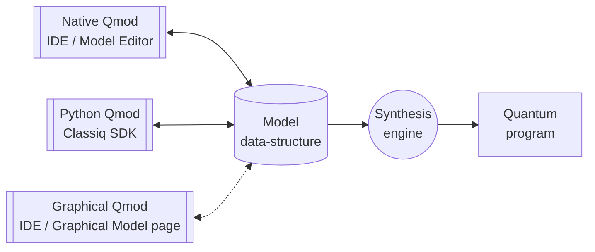

---
search:
    boost: 2.716
---

# Qmod - the Quantum Modeling Language

The Qmod language lets you describe quantum algorithms at a high level of abstraction.
It supports unique quantum-computing concepts, as well as more conventional concepts
available in high-level classical programming languages.

With Qmod you can focus on the pure functional intent of your algorithm, and leave
implementation details to be worked out by a powerful compiler and synthesis engine.
Gate-level implementation and qubit management decisions made by the engine will be
geared toward the required circuit properties.

## One Language, Three Input Formats

Qmod can be coded in its own native syntax, and processed by a dedicated parser. This can
be done in Classiq's platform web application, in the "Model" page. Qmod can also be coded
in Python as part of the Classiq Python SDK, using the `classiq` package. These two input
formats are equivalent - they expose the same set of constructs with the same semantics. A
Qmod description in Python can be translated to an equivalent in the native
syntax and vice versa. Each of these may appeal to different users in different situations.

The Qmod native syntax is designed to express the concepts of the language in a pure
and concise form. In addition, the Classiq platform features smart editor support
for Qmod, which is tuned for the language syntax and semantics.

Users who feel comfortable programming in the Python language and environment, may
find the Python format easier to use. Being embedded in a strong general-purpose
language such as Python has another key advantage. Users can utilize general Python
computation and existing Python packages to construct parts of the Qmod descriptions.

A third way to describe a quantum model is using the Qmod graphical syntax. Graphical
editing of Qmod is available through the Classiq web application on the "Graphical Model" page.
Only a subset of the Qmod constructs are currently supported in the graphical model editor,
but it will grow to cover all of Qmod over the coming releases.

