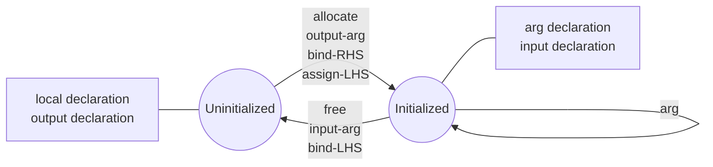

---
search:
    boost: 2.809
---

# Quantum Variables

A model operates on quantum objects, by modifying their states using different kinds of
operations. Quantum objects represent values that are stored on one or more qubits. The simplest
quantum object is a single qubit, representing the values 0 or 1 when measured. Other types
of quantum objects are stored on multiple qubits and represent numeric values or arrays of qubits.

Quantum objects are managed in Qmod using quantum variables. Variables are introduced into
the scope of a quantum function through the declaration of arguments or the declaration of
local variables.

A quantum variable establishes its reference to some object by explicitly initializing it. This
is often done by passing it as the output argument of a function, such as `allocate()`.
Once initialized, the state of the object it references can be modified, but the variable's
reference itself is immutable.

=== "Python"

    A quantum variable is declared as a function argument using a Python class as a
    type hint. The same Python class is instantiated to declare a local variable,
    in which case the name of the variable is optionally specified as a constructor
    argument and otherwise inferred automatically.

    ```python
    from classiq import Output, QBit, allocate, qfunc, CX


    @qfunc
    def main(q1: Output[QBit]):
        q2 = QBit()  # The variable name can be set explicitly: QBit("q")
        allocate(q1)
        allocate(q2)
        CX(q1, q2)
    ```

=== "Native"

    ```
    qfunc main(output q1: qbit) {
      q2: qbit;
      allocate(q1);
      allocate(q2);
      CX(q1, q2);
    }
    ```

## Managing Quantum Variables

Here are the rules for managing quantum variables:

-   Local variables and output-only arguments (arguments declared with the `output`
    modifier) are uninitialized upon declaration.
-   Quantum arguments declared without a modifier or with the `input` modifier are
    guaranteed to be initialized.
-   A variable is initialized in one of the following ways:
    -   It is passed as the output-only argument of a function
    -   It is used as the left-value of an assignment
    -   It occurs on the right side of a `->` (bind) statement
-   Once initialized, a variable can be used as an argument in any number of quantum
    function calls, as long as it is not an output only or input-only argument (an argument
    declared with the `output` or `input` modifier).
-   An initialized variable returns to its uninitialized state in one of the following ways:
    -   It is passed as the input-only argument of a function
    -   It occurs on the left side of a `->` (bind) statement

The following diagram illustrates these rules:



In the next example, the local variable `a` must be initialized prior to applying `X()`
on it, since it is declared as an output-only argument of function `main`. Similarly, the local
variable `b` is uninitialized upon declaration, and subsequently initialized through
the call to `prepare_state`, to which it is passed as an output-only argument.

=== "Python"

    ```python
    from classiq import allocate, qfunc, QBit, QArray, prepare_state, Output, X


    @qfunc
    def main(a: Output[QBit]) -> None:
        allocate(a)
        X(a)
        b = QArray()
        prepare_state(probabilities=[0.25, 0.25, 0.25, 0.25], bound=0.01, out=b)
    ```

=== "Native"

    ```
    qfunc main(output a: qbit) {
      allocate(a);
      X(a);
      b: qbit[];
      prepare_state([0.25, 0.25, 0.25, 0.25], 0.01, b);
    }
    ```

## Allocate

The _allocate_ statement is used to initialize quantum variables, allocating a sequence
of qubits to store the new quantum object. The number of qubits allocated, and the
numeric type attributes in the case of a numeric variable, are either explicitly specified,
or derived from the variable's type.

### Syntax

=== "Python"

    [comment]: DO_NOT_TEST
    ```python
    @overload
    def allocate(out: Output[QVar]) -> None:
        pass


    @overload
    def allocate(num_qubits: Union[int, SymbolicExpr], out: Output[QVar]) -> None:
        pass


    @overload
    def allocate(
        num_qubits: Union[int, SymbolicExpr],
        is_signed: Union[bool, SymbolicExpr],
        fraction_digits: Union[int, SymbolicExpr],
        out: Output[QVar],
    ) -> None:
        pass
    ```

=== "Native"

    **allocate** **(** [ _size-int-expr_  **,** [ _sign-bool-expr_ **,** _frac-digits-int-expr_ **,** ] ] _var_ **)**

It is recommended to use the `SIGNED` and `UNSIGNED` built-in constants instead
of `True` and `False` respectively when specifying the _sign-bool-expr_.

### Semantics

-   Prior to an _allocate_ statement _var_ must be uninitialized, and subsequently it
    becomes initialized.
-   The _size-int-expr_, if specified, must agree with the declared size of the variable.
    If the variable declaration does not determine the size, the type of the variable is
    inferred to accommodate the specified size. See more under
    [Quantum Types](https://docs.classiq.io/latest/qmod-reference/language-reference/quantum-types/).
-   For variables of type `qnum`, _sign-bool-expr_ and _frac-digits-int-expr_, if specified,
    must agree with the quantum type of the variable. Here too, if the variable declaration
    does not determine these numeric properties, they are inferred per the specified values.

### Example

The following example demonstrates three uses of `allocate` on two local variables and one
output parameter of `main`. Note how the overall size of the quantum object is used in
the inference of its type.

=== "Python"

    ```python
    from classiq import *


    @qfunc
    def main(qnarr: Output[QArray[QNum, 2]]):
        qb = QBit()
        allocate(qb)  # allocates a single qubit

        qn = QNum()  # declares a quantum number with unspecified size
        allocate(3, SIGNED, 0, qn)  # allocates a 3 bit signed integer (ranging in [-4, 3])

        allocate(6, qnarr)  # allocates an array of 3 elements, each with size 2

        hadamard_transform([qb, qn, qnarr])
    ```

=== "Native"

    ```
    qfunc main(output qnarr: qnum[2]) {
      qb: qbit;
      allocate(qb);  // allocates a single qubit

      qn: qnum;  // declares a quantum number with unspecified size
      allocate(3, SIGNED, 0, qn);  // allocates a 3 bit signed integer (ranging in [-4, 3])

      allocate(6, qnarr);  // allocates an array of 3 elements, each with size 2

      hadamard_transform({qb, qn, qnarr});
    }
    ```

## Free

The _free_ statement is used to declare that a quantum variable is back to its initial
$|0\rangle$ state, and no longer used. Subsequently, the variable becomes uninitialized
and its qubits can are reclaimed by the compiler for subsequent use.

### Syntax

=== "Python"

    [comment]: DO_NOT_TEST
    ```python
    def free(out: Input[QVar]) -> None:
        pass
    ```

=== "Native"

    **free** **(** _var_ **)**

### Semantics

-   Prior to a _free_ statement _var_ must be initialized, and subsequently it
    becomes uninitialized.
-   The quantum object referenced by _var_ must be in the $|0\rangle$ state when it is freed.
    This property is not enforced by the compiler.
-   Local variables that are explicitly freed are not considered uncomputation candidates,
    and are not restricted to permutable use contexts. See more under
    [Uncomputation](https://docs.classiq.io/latest/qmod-reference/language-reference/uncomputation/).

<!-- prettier-ignore-start -->
!!! warning
    It is the programmer's responsibility to apply `free` only to quantum variables that are
    known to be in the $|0\rangle$ state. Failing to do so may lead to undefined behavior.
<!-- prettier-ignore-end -->

### Example

Explicitly freeing a variable is typically not needed and is only used for specific purposes.
The following example demonstrates the use of `free` in a phase-kickback pattern. It is
used to release an auxiliary qubit that is known to be returned to state $|0\rangle$, despite
having applied the Hadamard gate to it.

=== "Python"

    ```python
    from classiq import *


    @qfunc
    def flip_phase(val: CInt, state: Const[QNum]):
        aux = QBit()
        allocate(aux)
        within_apply(
            lambda: (X(aux), H(aux)),
            lambda: control(state == val, lambda: X(aux)),
        )
        free(aux)  # aux is known to be in the |0> state
    ```

=== "Native"

    ```
    qfunc flip_phase(val: int, const state: qnum) {
      aux: qbit;
      allocate(aux);
      within {
        X(aux);
        H(aux);
      } apply {
        control (state == val) {
          X(aux);
        }
      }
      free(aux);  // aux is known to be in the |0> state
    }
    ```

Note that an alternative approach to implementing a phase-kickback pattern, which does
not require the use of `free`, is to encapsulate the calls to `H` in a function
with an as unchecked _const_ parameter.

## Drop

The _drop_ statement is used to declare that a quantum variable is no longer
used and should be exluded from any future uncomputation. Subsequently, the
variable becomes uninitialized, while its qubits retain their current
state &mdash; which may be dirty and entangled with functional qubits &mdash; and cannot be reused.

### Syntax

=== "Python"

    [comment]: DO_NOT_TEST
    ```python
    def drop(var: Input[QVar]) -> None:
        pass
    ```

=== "Native"

    **drop** **(** _var_ **)**

### Semantics

-   Prior to a _drop_ statement _var_ must be initialized, and subsequently it
    becomes uninitialized.
-   Local variables that are explicitly dropped are not considered uncomputation candidates,
    and are not restricted to permutable use contexts. See more under
    [Uncomputation](https://docs.classiq.io/latest/qmod-reference/language-reference/uncomputation/).

### Example

Explicitly dropping a variable is typically not needed and is only used for specific purposes.
The following example demonstrates the use of `drop` in a swap test algorithm,
where the two quantum states cannot be uncomputed, yet we do not wish to measure
them.

=== "Python"

    ```python
    from classiq import *


    @qfunc
    def main(test: Output[QBit]):
        state1 = QArray("state1")
        state2 = QArray("state2")
        prepare_state([0.1, 0.5, 0.3, 0.1], 0.0, state1)
        prepare_state([0.2, 0.1, 0.4, 0.3], 0.0, state2)
        swap_test(state1, state2, test)
        drop(state1)
        drop(state2)
    ```

=== "Native"

    ```
    qfunc main(output test: qbit) {
      state1: qbit[];
      state2: qbit[];
      prepare_state([0.1, 0.5, 0.3, 0.1], 0.0, state1);
      prepare_state([0.2, 0.1, 0.4, 0.3], 0.0, state2);
      swap_test(state1, state2, test);
      drop(state1);
      drop(state2);
    }
    ```

## Concatenation Operator

The _concatenation operator_ is used to combine a sequence of quantum objects
(or their parts) into a
[quantum array](https://docs.classiq.io/latest/qmod-reference/language-reference/quantum-types/#quantum-arrays).

=== "Python"

    A concatenation is a Python list containing quantum objects.

    **[** _path-expressions_ **]**

    _path-expressions_ is a comma-separated sequence of one or more quantum
    [path expressions](http://docs.classiq.io/latest/qmod-reference/language-reference/statements/numeric-assignment/?h=path+expression#path-operators).

=== "Native"

    **{** _path-expressions_ **}**

    _path-expressions_ is a comma-separated sequence of one or more quantum
    [path expressions](http://docs.classiq.io/latest/qmod-reference/language-reference/statements/numeric-assignment/?h=path+expression#path-operators).

For example, the model below uses the concatenation operator to apply
`hadamard_transform` to a specific set of qubits drawn from two quantum
variables:

=== "Python"

    ```python
    from classiq import allocate, qfunc, QBit, QArray, hadamard_transform


    @qfunc
    def main():
        v1 = QArray(length=4)
        allocate(v1)
        v2 = QArray(length=4)
        allocate(v2)
        v3 = QBit()
        allocate(v3)
        hadamard_transform([v1[3], v3, v2[1:3], v1[0]])
    ```

=== "Native"

    ```
    qfunc main() {
      v1: qbit[4];
      allocate(v1);
      v2: qbit[4];
      allocate(v2);
      v3: qbit;
      allocate(v3);
      hadamard_transform({v1[3], v3, v2[1:3], v1[0]});
    }
    ```

This model allocates three quantum objects: quantum arrays `v1` and `v2` and
a qubit `v3`.
The model uses a concatenation operator to create a quantum array and apply
`hadamard_transform` to it.
The quantum array comprises the last bit of `v1`, the entirety of `v3`, the
middle two qubits of `v2`, and the first qubit of `v1`.

<!-- prettier-ignore-start -->
!!! warning
    Currently, concatenations are only supported in function call arguments
    and control expressions.
<!-- prettier-ignore-end -->
