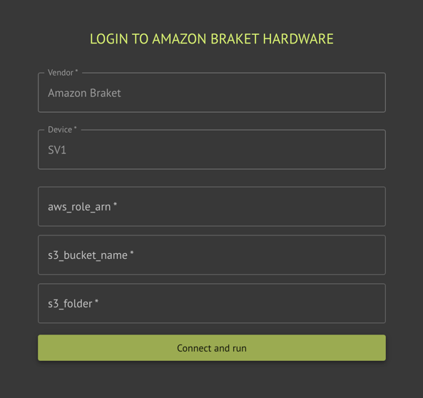

The Classiq executor supports execution on Amazon Braket's cloud simulators and hardware.


<Tip>
Backends may sometimes be unavailable. Check the availability windows with Amazon Braket.


</Tip>
## Usage

Execution on Amazon Braket requires an AWS account, and a role that Classiq can assume for execution.

<Tabs>
<Tab title="SDK">

[comment]: DO_NOT_TEST

```python
from classiq import AwsBackendPreferences

preferences = AwsBackendPreferences(
    backend_name="Name of requested simulator or hardware",
    aws_access_key_id="Amazon access key ID for the user with Braket access",
    aws_secret_access_key="Secret access key for the user's key ID",
    s3_bucket_name="S3 bucket name to save the results",
    s3_folder="The folder path within the S3 bucket, where the results will be saved",
    job_timeout="Timeout for execution (Optional)",
)
```
</Tab>
<Tab title="IDE">

 
</Tab>
</Tabs>

### Initial Account Setup

Before first use, the platform needs your permission to connect to your
AWS account. This is done by creating a cross-account role.

Classiq provides with the attached CloudFormation `AssumeRole.cf.yaml` file. It only has the permissions needed for Braket.

To create the cross-account role that only Classiq can use, deploy the CloudFormation file to your account:

1. Download the [AssumeRole.cf.yaml](./resources/AssumeRole.cf.yaml.txt) file.
2. Install [AWS CLI](https://docs.aws.amazon.com/cli/latest/userguide/getting-started-install.html).
3. Contact [Classiq support](mailto:support@classiq.io) to obtain these parameters:
    1. `CORRECT_TRUSTED_ACCOUNT`
    2. `CORRECT_EXTERNAL_ID_VALUE`
4. Execute this command:
    ```
    aws cloudformation create-stack --stack-name ClassiqBraketRole --template-body file://AssumeRole.cf.yaml --capabilities CAPABILITY_NAMED_IAM --parameters ParameterKey=TrustedAccount,ParameterValue=${CORRECT_TRUSTED_ACCOUNT} ParameterKey=ExternalId,ParameterValue=${CORRECT_EXTERNAL_ID_VALUE}
    ```


<Warning>
The required parameters may differ between users.
Contacting Classiq support is required!


</Warning>
To learn more about IAM roles, refer to the [AWS documentation](https://docs.aws.amazon.com/IAM/latest/UserGuide/id_roles.html).

### Required Credentials

When executing via the platform using AWS Cloud, there are several
required credentials:

1. `aws_access_key_id`
    1. Create a user with Braket full access
    2. Create AWS secret key for this user
    3. Fill the access key id as you got in the earlier steps
2. `aws_secret_access_key`
    1. Fill the Secret access key from the steps above
3. `s3_bucket_name`
    1. Create a new bucket. Its name must start with `amazon-braket-`.
    2. Use the bucket name as the `s3_bucket_name`.
       This is the bucket that saves the execution results.
4. `s3_folder`
    1. Enter the path to the folder in the `S3 bucket`.
       This is the path in the bucket where the execution results are
       saved.

For further support, contact [Classiq support](mailto:support@classiq.io).

## Device emulation (emulate)

Set `emulate=True` on [`AwsBackendPreferences`](/sdk-reference/providers/AWS) to use Classiq’s **device-aware Braket circuit preparation** for the selected Amazon Braket **device**: the circuit is translated using constraints from that device before the job is submitted. This path differs from the default Qiskit–Braket conversion and can be required for some programs targeting specific hardware.

-   **Default** `emulate=False`: standard adapter from Qiskit to Braket.
-   **`emulate=True`**: use Classiq’s emulator-style translation for the chosen device. If compilation fails, try without `emulate` or another backend; see the error message from the executor.

Behavior depends on the Braket device and circuit; refer to [Amazon Braket documentation](https://docs.aws.amazon.com/braket/) for device capabilities.

[comment]: DO_NOT_TEST

```python
from classiq import AwsBackendPreferences

preferences = AwsBackendPreferences(
    backend_name="Ankaa-3",
    aws_access_key_id="…",
    aws_secret_access_key="…",
    s3_bucket_name="amazon-braket-…",
    s3_folder="results",
    emulate=True,
)
```

## Supported Backends

The Classiq executor supports any available gate-based Amazon Braket simulator and quantum hardware.

Included hardware:

-   "Forte 1"
-   "Emerald"
-   "Ankaa-3"
-   "Garnet"

Included simulators:

-   "SV1"
-   "TN1"
-   "dm1"
