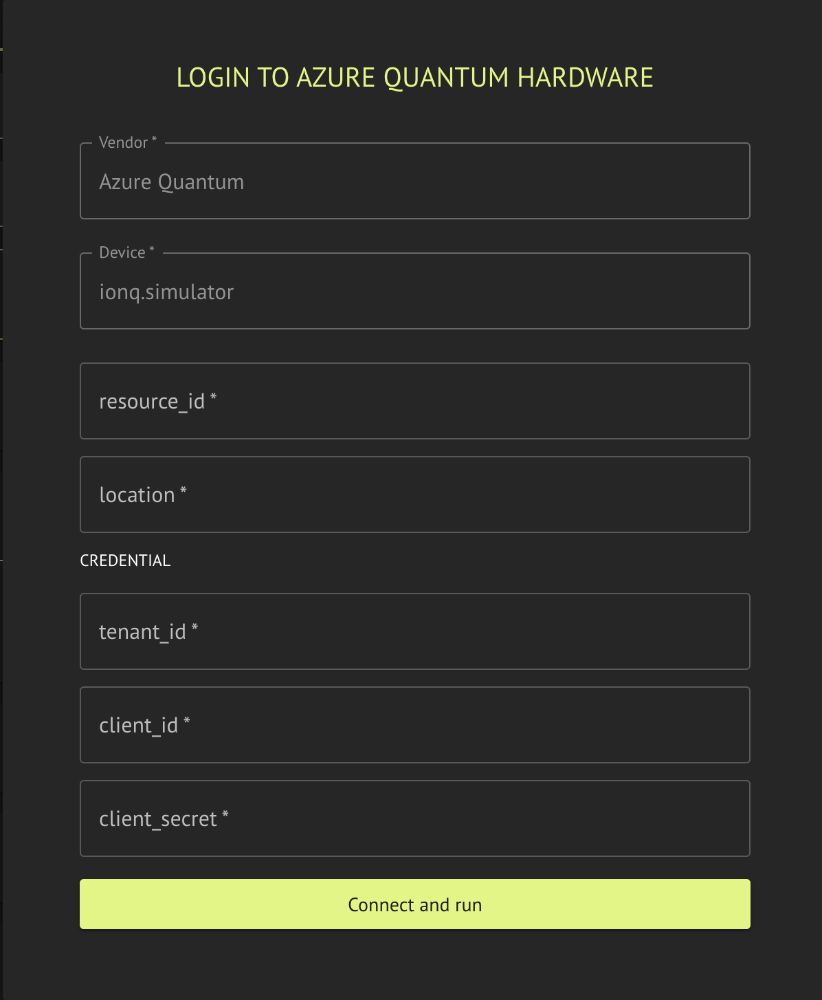
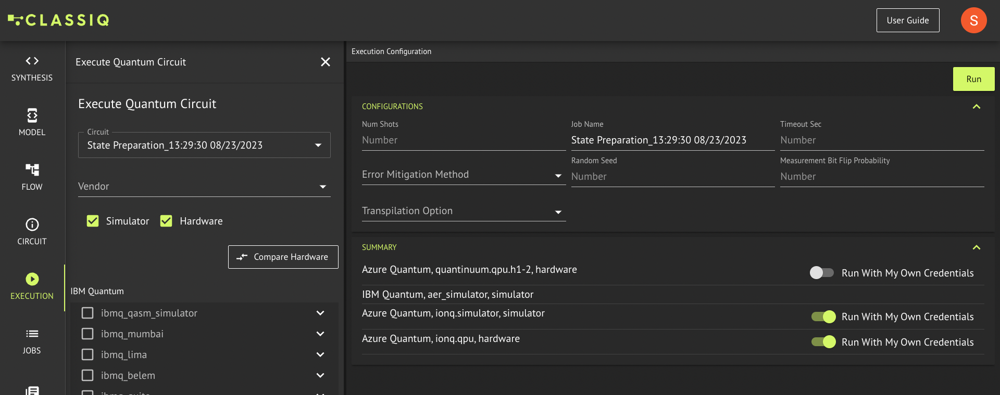

The Classiq executor supports execution on Azure Quantum cloud simulators and hardware.


<Tip>
Backends may sometimes be unavailable. Check the availability windows with Azure Quantum.


</Tip>
## Usage

Possible modes of operation:

-   Running via Classiq-Azure integration. In this mode you do not need to provide credentials or location.
-   Executing on your private Azure Quantum Workspace by providing credentials.
    For more details, see [Executing on Your Quantum Workspace](#executing-on-your-quantum-workspace).

<Tabs>
<Tab title="SDK">

[comment]: DO_NOT_TEST

```python
from classiq import (
    AzureCredential,
    AzureBackendPreferences,
)

# Running via Classiq-Azure integration:
preferences = AzureBackendPreferences(
    backend_name="Name of requsted simulator or hardware",
)

# Running via a private Azure account:
cred = AzureCredential(
    tenant_id="Azure Tenant ID (from Azure Active Directory)",
    client_id="Azure Application (client) ID",
    client_secret="Azure Client Secret",
    resource_id="Azure Quantum Workspace Resource ID",
)

preferences = AzureBackendPreferences(
    backend_name="Name of requsted simulator or hardware",
    credentials=cred,
    location="Azure region of Quantum Workspace",
)
```
</Tab>
<Tab title="IDE">

 
</Tab>
</Tabs>

For academic users, backends run via Classiq-Azure integration by default. To override this configuration, switch on "Run with my own credentials" in the backends summary section on the Execution page:



## Executing on Your Quantum Workspace

Execution on your private Azure Quantum Workspace requires an Azure account with
an active subscription. To authenticate, provide these details:

-   `Resource ID`: Azure Quantum Workspace resource ID.
-   `Location`: Azure region of the Quantum Workspace.
-   `Tenant ID`: Azure Active Directory tenant ID.
-   `Client ID`: Azure client ID of a registered application.
-   `Client secret`: Azure client secret of a registered application.

Following is a brief description of the steps to configure and acquire these details:

1. Create an Azure Quantum Workspace (see
   [Azure documentation](https://docs.microsoft.com/en-us/azure/quantum/how-to-create-workspace)).
   In the workspace overview are the `Location` and `Resource ID`.

2. Register a new application in Azure, including creating a client secret (see
   [Azure documentation](https://learn.microsoft.com/en-us/azure/developer/python/sdk/authentication-on-premises-apps?tabs=azure-portal#1---register-the-application-in-azure)).
   At the end of this step are the settings for `Client ID`, `Client secret`, and `Tenant ID`.

3. Assign the `Contributor` role to the registered application on the Quantum Workspace
   or a resource group containing the Quantum Workspace (see
   [Azure documentation](https://learn.microsoft.com/en-us/azure/developer/python/sdk/authentication-on-premises-apps?tabs=azure-portal#2---assign-roles-to-the-application-service-principal)).

4. Add the `Jobs.ReadWrite` permission (under `Azure Quantum`) to the application (see
   [Azure documentation](https://learn.microsoft.com/en-us/azure/active-directory/develop/howto-add-app-roles-in-azure-ad-apps#assign-app-roles-to-applications)).

## Supported Backends

Included hardware:

-   "ionq.qpu.forte-1"
-   "ionq.qpu.forte-enterprise-1"

Included simulators:

-   "ionq.simulator"
-   "rigetti.sim.qvm"
-   "quantinuum.sim.h2-1sc"
-   "quantinuum.sim.h2-1e"

## IonQ hardware noise simulation on Azure Quantum (emulate)

For **IonQ QPU** targets on Azure Quantum (`backend_name` values that start with `ionq.qpu.`), set `emulate=True` on [`AzureBackendPreferences`](/sdk-reference/providers/Azure) to enable IonQ’s **hardware noise model simulation**. Classiq passes Azure’s `noise` job options using the matching noise profile for the selected backend.

Behavior details, allowed profiles, shots, and qubit limits are defined by Azure and IonQ; see [Noise model simulation (Microsoft Learn)](https://learn.microsoft.com/en-us/azure/quantum/provider-ionq#noise-model-simulation).

When `emulate` does **not** apply, it is **ignored** (no error): for example `ionq.simulator`, Quantinuum targets, Rigetti targets, or any backend that is not an IonQ QPU. That lets you reuse one preferences object across several Azure targets.

`emulate` is separate from `ionq_error_mitigation_flag`, which controls debiasing-style error mitigation on IonQ hardware.

[comment]: DO_NOT_TEST

```python
from classiq import AzureBackendPreferences

preferences = AzureBackendPreferences(
    backend_name="ionq.qpu.aria-1",
    emulate=True,
)
```
