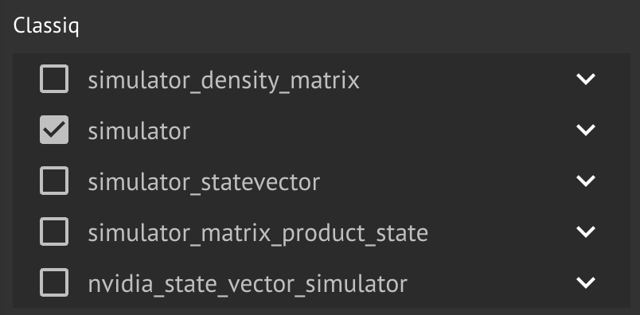
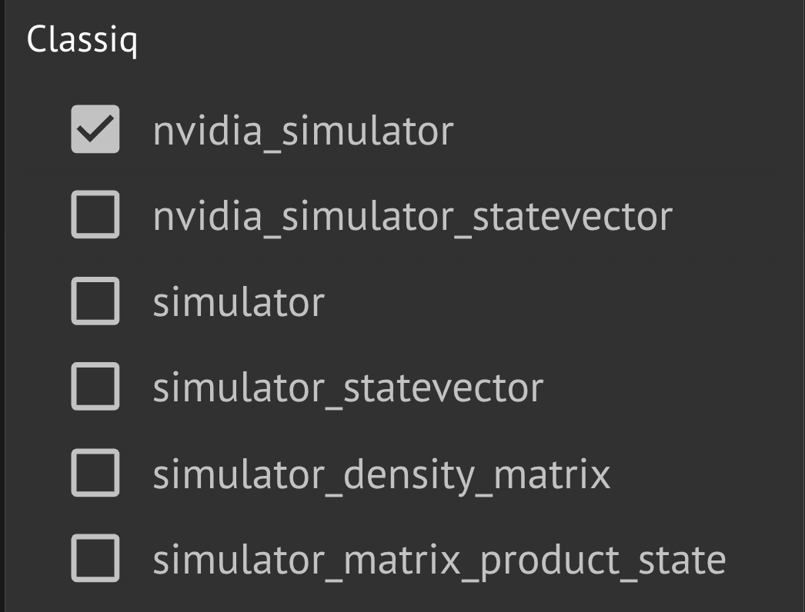

Classiq offers execution on simulators that are located at the Classiq backend.


<Tip>
These simulators don't require an account on a different cloud, and are usually
fast to execute.


</Tip>
## Simulator Usage

<Tabs>
<Tab title="SDK">

[comment]: DO_NOT_TEST

```python
from classiq import ClassiqBackendPreferences

preferences = ClassiqBackendPreferences(
    backend_name="Name of requested quantum simulator"
)
```
</Tab>
<Tab title="IDE">


</Tab>
</Tabs>

Classiq supports following simulators:

1. `simulator`: A general-purpose quantum simulator capable of handling circuits with up to 25 qubits.

2. `simulator_statevector`: Returns the full state vector, including phase information of the output state produced by the quantum circuit. Due to the exponential growth of the state vector, this simulator is suitable only for circuits with up to 18 qubits.

3. `simulator_density_matrix`: Uses density matrices to simulate open quantum circuits and supports simulations for circuits containing up to 25 qubits.

4. `simulator_matrix_product_state`: Efficiently simulates quantum circuits of up to 25 qubits, especially suited for circuits exhibiting low entanglement.

You can access these simulators through `ClassiqSimulatorBackendNames`.

## Custom noise models

Classiq simulators support user-defined gate and readout noise through
`ClassiqSimulatorNoiseSpecification`. This is separate from preset device noise
(`noise_model` on `ClassiqBackendPreferences`). See
[Custom noise models on Classiq simulators](./custom-noise-models) for channel types,
validation rules, and code examples.

## Nvidia Simulator Usage

Execution on Nvidia simulators requires specific license permissions.
Before first use, contact [Classiq support](mailto:support@classiq.io).

Classiq supports two types of Nvidia simulators, with the same inputs and outputs but different underlying infrastructure, capable of simulating circuits with up to 29 qubits:

1. The backends `ClassiqNvidiaBackendNames.SIMULATOR` and `ClassiqNvidiaBackendNames.SIMULATOR_STATEVECTOR` are better suited when multiple circuits need to be executed in sequence.
2. The backends `ClassiqNvidiaBackendNames.BRAKET_NVIDIA_SIMULATOR` and `ClassiqNvidiaBackendNames.BRAKET_NVIDIA_SIMULATOR_STATEVECTOR` are executed using Amazon Braket's infrastructure, and provide faster execution for single circuits. Credentials for AWS are not needed.

Both `ClassiqNvidiaBackendNames.SIMULATOR_STATEVECTOR` and `ClassiqNvidiaBackendNames.braket_nvidia_simulator_statevector` return the state vector at the end of the circuit's execution (analogous to the
above `simulator_statevector`).

**Precision:** Nvidia and Braket Nvidia simulators use **double precision** (float64) by default. Set `use_single_precision=True` in `ClassiqBackendPreferences` to use single precision (float32), which can be faster and use less memory at the cost of numerical precision.

<Tabs>
<Tab title="SDK">

```python
from classiq import ClassiqBackendPreferences, ClassiqNvidiaBackendNames

preferences = ClassiqBackendPreferences(
    backend_name=ClassiqNvidiaBackendNames.SIMULATOR
)

# Optional: use single precision (float32) instead of default double (float64)
preferences_single = ClassiqBackendPreferences(
    backend_name=ClassiqNvidiaBackendNames.BRAKET_NVIDIA_SIMULATOR,
    use_single_precision=True,
)
```
</Tab>
<Tab title="IDE">


</Tab>
</Tabs>

<Note>
The number of execution requests to the NVIDIA simulator may be limited.
If you encounter any problem, contact
[Classiq support](mailto:support@classiq.io).


</Note>
## DGX Statevector Simulator

Classiq offers a GPU-accelerated statevector simulator running on an NVIDIA DGX system. It is designed for large circuits, supporting up to **35 qubits**, making it well suited for state-vector simulations that exceed the capacity of the standard Classiq simulators.

Like the other GPU simulators, the DGX simulator requires specific license permissions. Before first use, contact [Classiq support](mailto:support@classiq.io).

The DGX simulator supports both execution modes:

1. **Sampling**: returns measurement counts for a given number of shots.
2. **Statevector**: returns the full output state vector. Because the state vector grows exponentially with the number of qubits, large statevector requests can be very large; filtering the returned registers is recommended.

The DGX simulator is selected by passing `backend="classiq/dgx_simulator"` to your execution call. For example:

[comment]: DO_NOT_TEST

```python
sample(qprog, backend="classiq/dgx_simulator")
```

**Precision:** The DGX simulator runs in **single precision** (float32), which keeps the memory footprint low enough to reach its 35-qubit capacity.

<Note>
The number of execution requests to the DGX simulator may be limited, and large circuits can take a long time to run. If you encounter any problem, contact [Classiq support](mailto:support@classiq.io).
</Note>
## Supported Backends

Included simulators:

-   "nvidia_simulator_statevector"
-   "simulator"
-   "simulator_statevector"
-   "simulator_density_matrix"
-   "nvidia_simulator"
-   "braket_nvidia_simulator"
-   "simulator_matrix_product_state"
-   "braket_nvidia_simulator_statevector"
-   "dgx_simulator"
