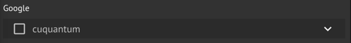

Classiq offers execution on a GPU based simulator that is located in the Google Cloud Platform.


<Tip>
This simulator doesn't require an account on GCP.


</Tip>
## Simulator Usage

Execution on this simulator requires specific license permissions.
Before first use, contact [Classiq support](mailto:support@classiq.io).

<Tabs>
<Tab title="SDK">

```python
from classiq import GCPBackendPreferences

preferences = GCPBackendPreferences(backend_name="cuquantum")
```
</Tab>
<Tab title="IDE">


</Tab>
</Tabs>

## Supported Backends

Included simulators:

-   "cuquantum"
-   "cuquantum_statevector"
