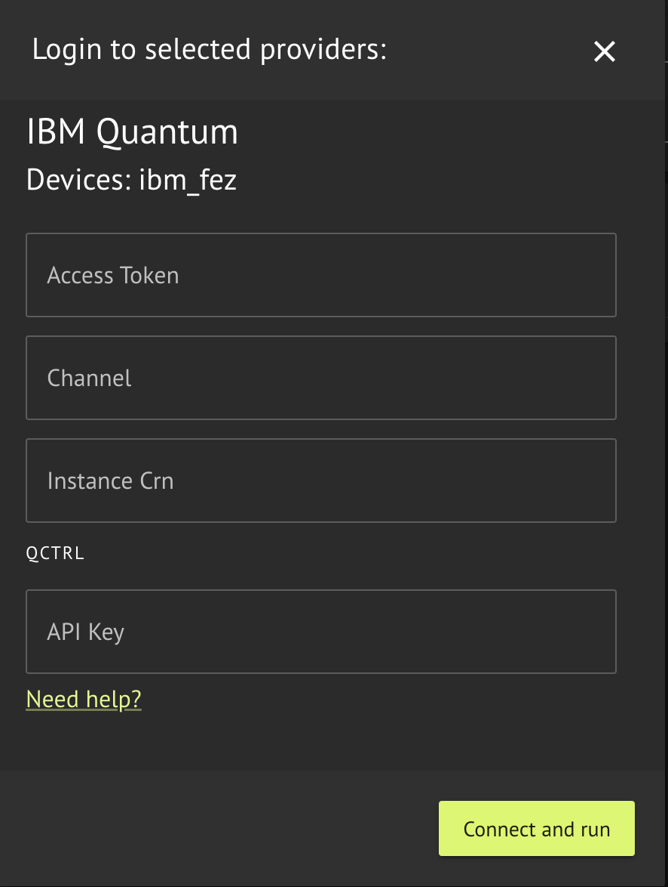

## Usage

### Execution on IBM Hardware

Execution on IBM hardware requires a valid IBM Quantum Cloud API access token, and access to the requested hardware with an IBM Quantum hub, group, and project name.
The access token is the API token that appears at the top of the [IBM Quantum Cloud page](https://quantum.cloud.ibm.com/), when you are logged in. You must create an account with IBM quantum if you do not have one already.

IBM Backend Preferences configuration options are described in the sections above and in [IBM hardware noise simulation (emulate)](#ibm-hardware-noise-simulation-emulate).

<Tabs>
<Tab title="SDK">

[comment]: DO_NOT_TEST

```python
from classiq import (
    IBMBackendPreferences,
)

preferences = IBMBackendPreferences(
    backend_name="Name of requsted quantum hardware",
    access_token="A Valid API access token to IBM Quantum",
    channel="IBM Cloud Channel",
    instance_crn="IBM Cloud Instance CRN",
    emulate=False,
)
```
</Tab>
<Tab title="IDE">


</Tab>
</Tabs>

## IBM hardware noise simulation (emulate)

Set `emulate=True` on [`IBMBackendPreferences`](/sdk-reference/providers/IBM) to run a simulator with a **Qiskit noise model** inferred from a **real IBM Quantum device** name (for example `ibm_pittsburgh`, `ibm_boston`). You do not pass a separate noise model; `backend_name` must be one of the IBM backends supported for this path in the SDK (see validation errors if the name is not supported).

**Requirements and limitations**

-   Use **real** IBM hardware backend names (not `fake_*` simulators); fake backends already run locally and cannot be combined with `emulate=True`.
-   With `emulate=True`, execution does not use IBM Quantum hardware; it uses IBM's hardware noise model profile on Classiq's resources.
-   Emulation does not require IBM Quantum credentials or an IBM Quantum account.
-   Emulation runs on Classiq's execution environment; it does not use IBM Quantum's job queue or wait for IBM hardware availability.

[comment]: DO_NOT_TEST

```python
from classiq import IBMBackendPreferences

preferences = IBMBackendPreferences(
    backend_name="ibm_pittsburgh",
    access_token="…",
    channel="ibm_cloud",
    instance_crn="…",
    emulate=True,
)
```

## Supported Backends

Included hardware:

-   "ibm_kingston"
-   "ibm_boston"
-   "ibm_marrakesh"
-   "ibm_torino"
-   "ibm_fez"
-   "ibm_pittsburg"
