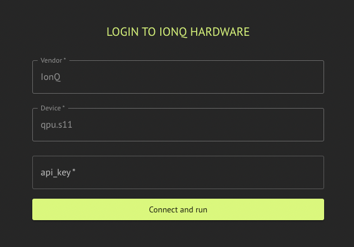

The Classiq executor supports execution on IonQ hardware and simulator.

## Usage

Execution on IonQ requires a valid IonQ API key.

IonQ Backend Preferences configuration options are summarized below; see [IonQ hardware noise simulation (emulate)](#ionq-hardware-noise-simulation-emulate) for the `emulate` flag.

-   **Error mitigation:** `bool` — valid for IonQ hardware; defaults to `False`.

<Tabs>
<Tab title="SDK (IonqBackendPreferences)">

[comment]: DO_NOT_TEST

```python
from classiq import IonqBackendPreferences

preferences = IonqBackendPreferences(
    backend_name="qpu.forte-1",
    api_key="A Valid IonQ API key",
    error_mitigation=True,
    emulate=False,
)
```
</Tab>
<Tab title="IDE">


</Tab>
</Tabs>

## IonQ hardware noise simulation (emulate)

Set `emulate=True` on [`IonqBackendPreferences`](/sdk-reference/providers/IonQ) to run on the **IonQ cloud simulator** while applying a **hardware noise profile** derived from your **QPU** backend name (for example `qpu.forte-1` → noise model `forte-1`). Classiq resolves the simulator backend and passes the appropriate run options to the IonQ provider.

**Requirements**

-   `backend_name` must be a **QPU** id (prefix `qpu.`, e.g. `qpu.aria-2`, `qpu.forte-1`). If `emulate=True` with a non-QPU backend name, preferences validation fails.

**Usage**

[comment]: DO_NOT_TEST

```python
from classiq import IonqBackendPreferences

preferences = IonqBackendPreferences(
    backend_name="qpu.forte-1",
    api_key="…",
    error_mitigation=False,
    emulate=True,
)
```

## Supported Backends

Included hardware:

-   "qpu.aria-2"
-   "qpu.forte-1"
-   "qpu.forte-enterprise-1"
-   "qpu.forte-enterprise-2"

Included simulators:

-   "simulator"
