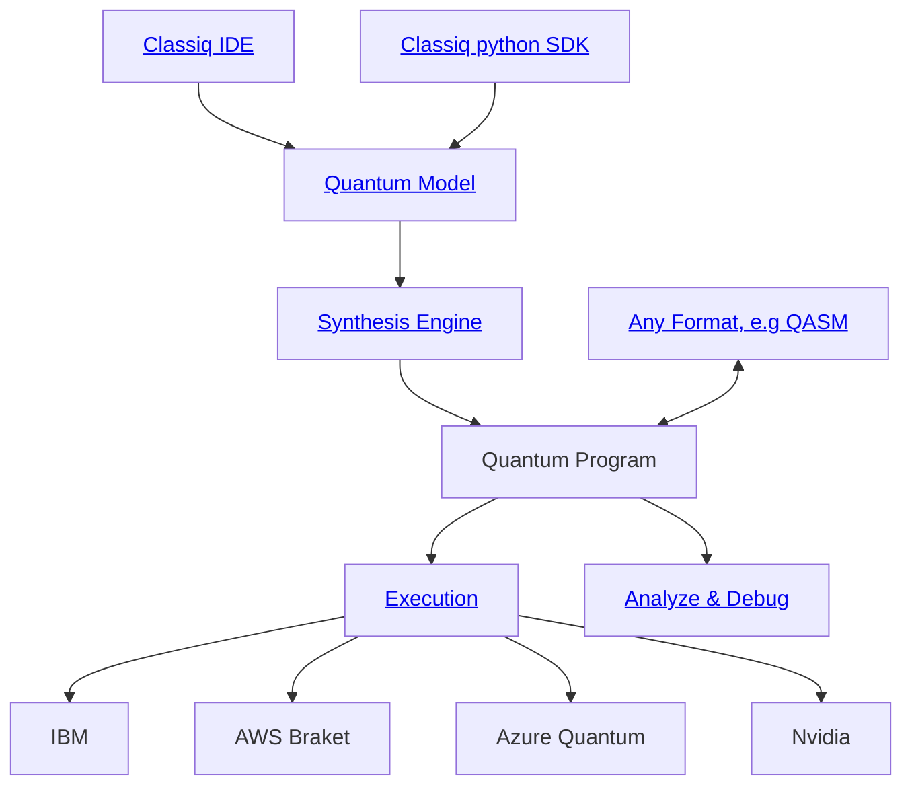

<div align="left">
    
</div>

# Create Quantum Programs with Classiq

The **Classiq** platform is all you need for creating any quantum program. Read more for the details.



<hr>
<br>

<p align="center">
   &emsp;
   <a href="https://short.classiq.io/join-slack">⚛️ Platform</a>
   &emsp;|&emsp;
   <a href="https://short.classiq.io/join-slack">👋 Join Slack</a>
   &emsp;|&emsp;
   <a href="https://docs.classiq.io/latest/user-guide/">📖 Documentation</a>
   &emsp; | &emsp;
   <a href="https://docs.classiq.io/latest/getting-started/">Getting Started</a>
   &emsp;
</p>

<hr>

## Classiq's Github Repository

You can find a wide collection of quantum functions, algorithms, applications and tutorials built with Classiq.

Usage Example - Portfolio Optimization:

Go to the Portfolio optimization directory: `applications/finance/portfolio_optimizaition`

### In the IDE:

1. Sign up to the <a href='https://platform.classiq.io/'>classiq platform</a>
2. Upload the `.qmod` file to the <a href='https://platform.classiq.io/synthesis'>synthesis tab</a>

### In the SDK:

1. Start with downloading Classiq:

```bash
pip install -U classiq
```

2. Download the `.ipynb` file
3. Run the notebook in your preferred environment

<hr>

## Build Your Own

With Classiq, you can build anything. Classiq provides a powerful modeling language to describe any quantum program, which can then be synthesized and executed on any hardware or simulator. Explore our <a href="https://docs.classiq.io/latest/user-guide/">Documentation</a> to learn everything.

### 3+5 with Classiq

### In the IDE:

1. Create a model (paste in the <a href="https://platform.classiq.io/dsl-synthesis">`model`</a> tab)

```
qfunc get_3(output x: qbit[2]){
allocate<2>(x);
 X(x[0:1]);
 X(x[1:2]);
}

qfunc get_5(output x: qbit[3]){
 allocate<3>(x);
 X(x[0:1]);
 X(x[2:3]);
}

qfunc main(output res: qbit[4]){
 a: qbit[2];
 b: qbit[3];
 get_3(a);
 get_5(b);
 res = a + b;
}
```

2. Press Synthesize:
<center>


</center>

3. Press Execute:
<center>


</center>

3. Press Run:
<center>


</center>

4. View Results:
<center>


</center>

### In the SDK:

```python
from classiq import (
    QArray,
    Output,
    allocate,
    QFunc,
    X,
    QInt,
    synthesize,
    create_model,
    show,
    execute,
)


@QFunc
def get_3(x: Output[QArray]) -> None:
    allocate(2, x)
    X(x[0])
    X(x[1])


@QFunc
def get_5(x: Output[QArray]) -> None:
    allocate(3, x)
    X(x[0])
    X(x[2])


@QFunc
def main(res: Output[QInt]) -> None:
    a = QInt("a")
    b = QInt("b")
    get_3(a)
    get_5(b)
    res |= a + b  # should be 8


qprog = synthesize(create_model(main))

show(qprog)
result = execute(qprog).result()
print(result[0].value.parsed_counts)
```

<hr>

Have questions? Feedback? Something to share?
Welcome to join our open <a href="https://short.classiq.io/join-slack">Slack Community</a>
