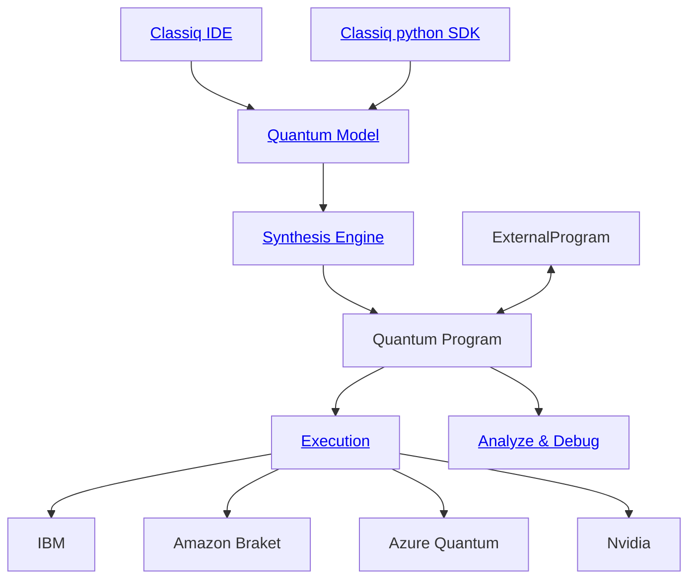
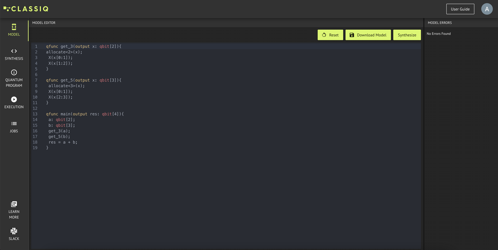
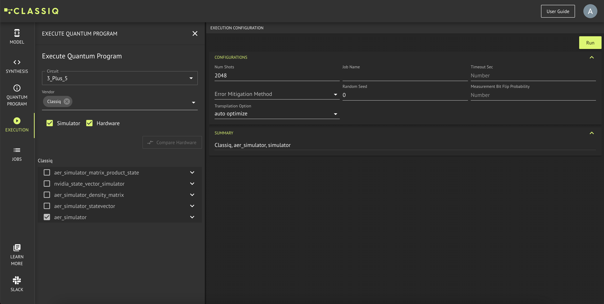
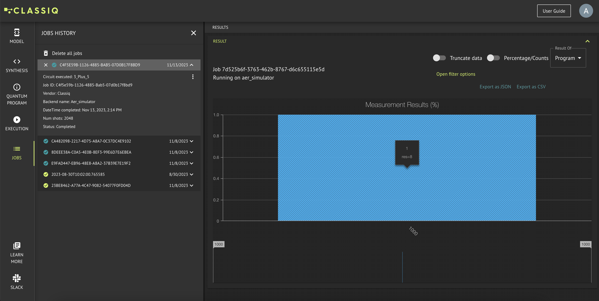

[](https://badge.fury.io/py/classiq)


<div align="center">
    
</div>

# Classiq

Your entry-point for creating & running quantum programs.

This repository holds a wide collection of quantum functions, algorithms, applications and tutorials built with Classiq.

<hr> <br>

<p align="center">
   &emsp;
   <a href="https://platform.classiq.io/">⚛️ Platform</a>
   &emsp;|&emsp;
   <a href="https://short.classiq.io/join-slack">👋 Join Slack</a>
   &emsp;|&emsp;
   <a href="https://docs.classiq.io/latest/">📖 Documentation</a>
   &emsp; | &emsp;
   <a href="https://docs.classiq.io/latest/">Getting Started</a>
   &emsp;
</p>

<hr>

# Installation

Working with Classiq's latest GUI requires no installations!
Just head over to [Classiq's platform](https://platform.classiq.io/) and follow the examples below over there :)

If you'd rather work programmatically, using Python, Classiq also provides an SDK, which can be installed as follows:

```bash
pip install classiq
```

Please note that the latest Classiq SDK for Python doesn't work in Python 3.12 yet. Please refer to [Issue #17](https://github.com/Classiq/classiq-library/issues/17).

## Running This Repository's Demos

This repository has 2 kinds of demos: `.qmod` and `.ipynb`.

The `.qmod` files are intended for usage with [Classiq's platform](https://platform.classiq.io/).
Upload those `.qmod` files into the [Synthesis tab](https://platform.classiq.io/synthesis)

The `.ipynb` files are intended to be viewed inside [JupyterLab](https://jupyter.org/).

# Create Quantum Programs with Classiq

The simplest quantum circuit has 1 qubit, and has a single `X` gate.

Using Classiq's SDK, it would look like so:

```python
from classiq import *

NUM_QUBITS = 1


@qfunc
def main(res: Output[QBit]):
    allocate(NUM_QUBITS, res)
    X(res)


model = create_model(main)
quantum_program = synthesize(model)

show(quantum_program)

result = execute(quantum_program).result()
print(result[0].value.parsed_counts)
# [{'res': 1.0}: 1000]
```

Let's unravel the code above:

1. `def main` : We define the logic of our quantum program. We'll expand on this point soon below.
2. `create_model` : We convert the logic we defined into a Model.
3. `synthesize` : We synthesize the Model into a Quantum Program. From a logical definition of quantum operations, into a series of quantum gates.
4. `execute` : Executing the quantum program. Can be executed on a physical quantum computer, or on simulations.

## 1) Defining the Logic of Quantum Programs

The function above had 4 lines:

```python
@qfunc
def main(res: Output[QBit]):
    allocate(NUM_QUBITS, res)
    X(res)
```

The 1st line states that the function will be a quantum one. [Further documentation](https://docs.classiq.io/latest/qmod-reference/language-reference/functions/).

The 2nd line defines the type of the output. [Further examples on types](https://docs.classiq.io/latest/qmod-reference/language-reference/classical-types/)

The 3rd line allocates several qubits (in this example, only 1) in this quantum variable. [Further details on allocate](https://docs.classiq.io/latest/qmod-reference/language-reference/quantum-variables/)

The 4th line applies an `X` operator on the quantum variable. [Further details on quantum operators](https://docs.classiq.io/latest/qmod-reference/language-reference/operators/)

### More Examples

Initializing $\ket{-}$ state:

```python
@qfunc
def prep_minus(out: Output[QBit]) -> None:
    allocate(1, out)
    X(out)
    H(out)
```

A part of the Deutsch Jozsa algorithm (see the full algorithm [here](/algorithms/deutsch_josza/deutsch_jozsa.ipynb))

```python
@qfunc
def deutsch_jozsa(predicate: QCallable[QNum, QBit], x: QNum) -> None:
    hadamard_transform(x)
    my_oracle(predicate=lambda x, y: predicate(x, y), target=x)
    hadamard_transform(x)
```

A part of a QML encoder (see the full algorithm [here](/algorithms/qml/quantum_autoencoder/quantum_autoencoder.ipynb))

```python
@qfunc
def angle_encoding(exe_params: CArray[CReal], qbv: Output[QArray[QBit]]) -> None:
    allocate(exe_params.len, qbv)
    repeat(
        count=exe_params.len,
        iteration=lambda index: RY(pi * exe_params[index], qbv[index]),
    )
```

For more, see this repository :)

## 2) Logic to Models

As we saw above, the `main` function can be converted to a model using `model = create_model(main)`.

A model is built out of 2 parts: a `qmod`, and `synthesis options`.
The former is a quantum language used for defining quantum programs, while the latter is a configuration for the execution of the program.

The model can be saved via `write_qmod(model, "file_name")`, which will save 2 files: `file_name.qmod` and `file_name.synthesis_options.json`.
You may encounter these files in this repository.

## 3) Synthesis : Models to Quantum Program

This is where the magic happens.
Taking a model, which is a set of logical operations, and synthesizing it into physical qubits and the gates entangling them, is not an easy task.

Classiq's synthesis engine is able to optimize this process, whether by requiring the minimal amount of physical qubits, thus reusing as many qubits as possible, or by requiring minimal circuit width, thus lowering execution time and possible errors.

## 4) Execution

Classiq provides an easy-to-use way to execute quantum programs, and provides various insights of the execution results.

## Diagrams

1 diagram is worth a thousand words



# Build Your Own

With Classiq, you can build anything. Classiq provides a powerful modeling language to describe any quantum program, which can then be synthesized and executed on any hardware or simulator. Explore our [Documentation](https://docs.classiq.io/latest/) to learn everything.

## SDK : Classiq's Python Interface

### Example: 3+5 with Classiq

```python
from classiq import (
    QArray,
    Output,
    allocate,
    qfunc,
    X,
    QNum,
    synthesize,
    create_model,
    show,
    execute,
)


@qfunc
def get_3(x: Output[QArray]) -> None:
    allocate(2, x)
    X(x[0])
    X(x[1])


@qfunc
def get_5(x: Output[QArray]) -> None:
    allocate(3, x)
    X(x[0])
    X(x[2])


@qfunc
def main(res: Output[QNum]) -> None:
    a = QNum("a")
    b = QNum("b")
    get_3(a)
    get_5(b)
    res |= a + b  # should be 8


model = create_model(main)
quantum_program = synthesize(model)

show(quantum_program)

result = execute(quantum_program).result()
print(result[0].value.parsed_counts)
```

## IDE : Classiq's Platform

The examples found in this repository can be accessed via [Classiq's platform](https://platform.classiq.io/), in the [`model`](https://platform.classiq.io/dsl-synthesis) tab, under the same folder structure.

Additionally, one may write their own model in the model editor (highlighted in green) or upload his own model (highlighted in red)


### Example: 3+5 with Classiq

1. Create a model (paste in the [`model`](https://platform.classiq.io/dsl-synthesis) tab)

```
qfunc get_3(output x: qnum){
allocate<2>(x);
 X(x[0]);
 X(x[1]);
}

qfunc get_5(output x: qnum){
 allocate<3>(x);
 X(x[0]);
 X(x[2]);
}

qfunc main(output res: qnum){
 a: qnum;
 b: qnum;
 get_3(a);
 get_5(b);
 res = a + b;
}
```

2. Press Synthesize:
<center>



</center>

3. Press Execute:
<center>


</center>

3. Press Run:
<center>



</center>

4. View Results:
<center>



</center>

<hr>

Have questions? Feedback? Something to share?
Welcome to join our open [Slack Community](https://short.classiq.io/join-slack)
