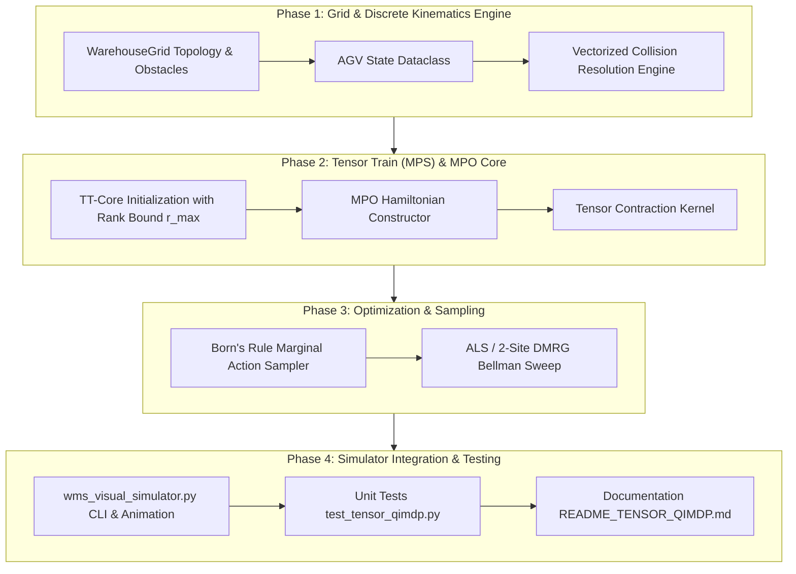

# Implementation Plan: Multi-Agent Warehouse Simulator using Tensor QI-MDP (Tensor Train / MPS)

> **File**: `Tensor_implementation.md`  
> **Source Specification**: `QI-MDP_tensorprompt.md`  
> **Target Module Location**: `applications/logistics/vehicle_routing_problem/`

---

## 1. Technical Context & High-Level Goal

### 1.1 The Microscopic MAPF Curse of Dimensionality
While macroscopic VRP clustering (via **Quantum F-Means**) partitions warehouse orders into balanced batches, the microscopic execution on the physical warehouse floor requires $N$ Automated Guided Vehicles (AGVs) to navigate simultaneously through shared aisles, intersections, and bottleneck corridors without collisions.
- **Exponential State Space**: $\mathcal{S} = V^N$. For a modest warehouse grid with $|V| = 30 \times 25 = 750$ cells and $N = 10$ AGVs:
  $$|\mathcal{S}| = 750^{10} \approx 5.63 \times 10^{28} \text{ states}$$
  Exact tabular dynamic programming and classical value iteration are completely intractable.
- **Conflict-Based Search (CBS) Limitations**: CBS computes individual paths and builds a conflict tree. Under high-density traffic ($C \to \infty$), CBS branches exponentially and times out.
- **Multi-Agent PPO (MAPPO) Limitations**: Suffers from high policy gradient variance, non-stationarity, and only enforces soft collision penalties (frequently resulting in corner collisions).

### 1.2 The Solution: Tensor QI-MDP (MPS + MPO)
- Represent the joint multi-agent value/policy function as a **Quantum Wavefunction $|\Psi\rangle$** factorized into a **Tensor Train of 3rd-order cores**:
  $$\Psi(s_1, \dots, s_N) \approx \sum_{\alpha_0, \dots, \alpha_N} G^{(1)}_{\alpha_0, s_1, \alpha_1} G^{(2)}_{\alpha_1, s_2, \alpha_2} \dots G^{(N)}_{\alpha_{N-1}, s_N, \alpha_N}$$
  with boundary ranks $r_0 = r_N = 1$ and maximum entanglement rank $r$.
- Represent spatial goals and physical collision penalties as a **Matrix Product Operator (MPO)** Hamiltonian:
  $$\hat{H} = \hat{H}_{\text{target}} + \lambda_v \hat{H}_{\text{vertex}} + \lambda_e \hat{H}_{\text{edge}}$$
- Optimize cores via **Alternating Least Squares (ALS) / 2-site DMRG local sweeps**, collapsing computational complexity from $\mathcal{O}(d^N)$ to $\mathcal{O}(N \cdot d \cdot r^3)$.
- Sample collision-free joint kinematic actions via **Born's Rule**:
  $$P(\mathbf{a}|\mathbf{s}) \propto |\langle \mathbf{s}, \mathbf{a} | \Psi \rangle|^2$$

---

## 2. Proposed Module Architecture

```
applications/logistics/vehicle_routing_problem/
├── QI-MDP_tensorprompt.md               # Original formal prompt and specification
├── Tensor_implementation.md             # This comprehensive implementation plan
├── wms_tensor_qimdp.py                  # [NEW] Grid, Simulator, MPO Hamiltonian & TensorTrainRouter
├── test_tensor_qimdp.py                 # [NEW] Automated unit & integration tests
├── README_TENSOR_QIMDP.md               # [NEW] Complete technical guide and benchmark analysis
├── wms_visual_simulator.py              # [MODIFY] Added --tensor-routing and discrete grid step rendering
├── wms_quantum_fmeans.py                # Macroscopic Quantum F-Means clustering engine
└── wms_quantum_optimization_pipeline.py # Macroscopic QAOA & QUBO routing pipeline
```

### 2.1 Component Details

#### 1. Core Tensor Engine: `wms_tensor_qimdp.py`
- **`WarehouseGrid`**:
  - Grid topology $(W \times H)$, static obstacle masks (racks, walls), charging pads, and Depot $(0,0)$.
  - Manhattan and BFS shortest-path distance matrices.
  - Coordinate $(x, y) \leftrightarrow$ linear index $idx = y \cdot W + x$ bidirectional mapping.
- **`AGVState`**:
  - Properties: `id`, current $(x, y)$, target $(x, y)$, battery, status (`IDLE`, `MOVING`, `BLOCKED`, `DELIVERED`).
- **`WarehouseSimulator`**:
  - Simultaneous step function executing joint action vectors $\mathbf{a} \in \{0, 1, 2, 3, 4\}^N$.
  - Algebraic simultaneous collision resolution:
    - **Vertex conflicts**: $\sum_{i \neq j} \mathbf{1}(s_i^{(t+1)} = s_j^{(t+1)})$.
    - **Edge swapping conflicts**: $\sum_{i \neq j} \mathbf{1}(s_i^{(t+1)} = s_j^{(t)} \land s_j^{(t+1)} = s_i^{(t)})$.
  - Penalty feedback: non-catastrophic localized penalty with freeze fallback (violating vehicle stays in place).
- **`CollisionMPO`**:
  - Constructs local operator tensors $W^{(k)}_{\beta_{k-1}, s_k, s_k', \beta_k}$ enforcing target distance and nearest-neighbor anti-collision repulsion.
- **`TensorTrainRouter`**:
  - TT-core initialization with bounded maximum entanglement rank $r_{\text{max}}$.
  - Contraction engine computing $|\Psi(\mathbf{a})\rangle = \prod_k G^{(k)}[:, a_k, :]$.
  - **Born's Rule Sampler**: Sequentially evaluates marginal action probabilities:
    $$P(a_k) \propto \|\text{carry} \cdot G^{(k)}[:, a_k, :]\|^2_F$$
  - **ALS/DMRG Sweep Optimizer**: Forward-backward Bellman residual minimization across core pairs $(G^{(k)}, G^{(k+1)})$.

#### 2. Test Suite: `test_tensor_qimdp.py`
- `test_grid_boundaries_and_obstacles()`: Confirms obstacle collisions and boundary clamping.
- `test_vertex_and_edge_conflict_resolution()`: Tests head-on collision and cell-sharing resolution.
- `test_tensor_train_contractions()`: Verifies matrix dimensions, boundary ranks $r_0=r_N=1$, and scalar contraction.
- `test_born_rule_probability_normalization()`: Confirms all action probability marginals sum to $1.0 \pm 10^{-6}$.
- `test_als_bellman_convergence()`: Checks that Bellman residual strictly decreases over sweeps.

#### 3. Visual Simulator Integration: `wms_visual_simulator.py`
- Add CLI flag: `--tensor-routing` (enables microscopic TT step simulation).
- Add mode: `--tensor-steps <int>` (number of kinematic grid steps to simulate).
- Visual enhancements:
  - Animate AGVs moving cell-by-cell on the discrete grid $G=(V, E)$.
  - Display collision avoidance maneuvers (yellow wait circles, detour arrows).

#### 4. Documentation: `README_TENSOR_QIMDP.md`
- Complete academic guide detailing the mathematical formulation, MPS factorization, MPO Hamiltonian, and ALS optimization.
- Multi-agent benchmark comparing Tensor QI-MDP against CBS and MAPPO.
- Step-by-step reproduction commands.

---

## 3. Phased Implementation Roadmap



### Phase 1: Environment & Kinematics Engine
- Create `WarehouseGrid` supporting grid dimensions $(W=30, H=25)$, rack obstacles, and index/coordinate conversion.
- Create `WarehouseSimulator` executing simultaneous joint actions $\mathbf{a} = (a_1, \dots, a_N)$ with algebraic collision detection for:
  - Vertex conflicts (two AGVs target same cell).
  - Edge conflicts (two AGVs swap cells across an edge).

### Phase 2: Quantum-Inspired Tensor Train (MPS) & MPO Architecture
- Implement `TensorTrainRouter` representing the joint policy/value wavefunction $|\Psi\rangle$ as an MPS chain of 3rd-order tensors $G^{(k)} \in \mathbb{R}^{r_{k-1} \times 5 \times r_k}$.
- Construct MPO Hamiltonian $\hat{H} = \hat{H}_{\text{target}} + \lambda_v \hat{H}_{\text{vertex}} + \lambda_e \hat{H}_{\text{edge}}$.

### Phase 3: Alternating Least Squares (ALS) & Born's Rule Action Sampling
- Implement contraction operations and sequential marginal action extraction under Born's rule:
  $$P(a_k | a_{<k}) \propto \|\text{carry} \cdot G^{(k)}[:, a_k, :]\|^2_F$$
- Implement ALS 2-site sweep updating adjacent cores against the Bellman residual.

### Phase 4: Integration with Visual Simulator
- Extend `wms_visual_simulator.py` to support `--tensor-routing` and `--tensor-steps`.
- Render discrete step-by-step kinematics, wait states, and conflict resolution indicators.

### Phase 5: Verification & Documentation
- Build `test_tensor_qimdp.py` with 100% pass rate.
- Benchmark scalability collapsing from $\mathcal{O}(d^N)$ to $\mathcal{O}(N \cdot d \cdot r^3)$.
- Document findings in `README_TENSOR_QIMDP.md`.

---

## 4. Verification Plan

### Automated Tests
1. **Unit Test Suite**:
   ```powershell
   & "c:\Users\vladimir.dobrouchkin\.gemini\antigravity-ide\scratch\classiq_env\Scripts\python.exe" -m unittest applications/logistics/vehicle_routing_problem/test_tensor_qimdp.py
   ```
2. **Corridor Bottleneck Benchmark**:
   - 4 AGVs attempting simultaneous crossing of a 1-cell wide corridor.
   - Verify conflict-free navigation with zero deadlocks.

### Visual & Interactive Verification
1. **Run Static Tensor Simulation**:
   ```powershell
   & "c:\Users\vladimir.dobrouchkin\.gemini\antigravity-ide\scratch\classiq_env\Scripts\python.exe" applications/logistics/vehicle_routing_problem/wms_visual_simulator.py --tensor-routing --tensor-steps 40 --output wms_tensor_simulation.png
   ```
2. **Run Animated GIF Tensor Simulation**:
   ```powershell
   & "c:\Users\vladimir.dobrouchkin\.gemini\antigravity-ide\scratch\classiq_env\Scripts\python.exe" applications/logistics/vehicle_routing_problem/wms_visual_simulator.py --tensor-routing --animate --output wms_tensor_simulation.gif
   ```
