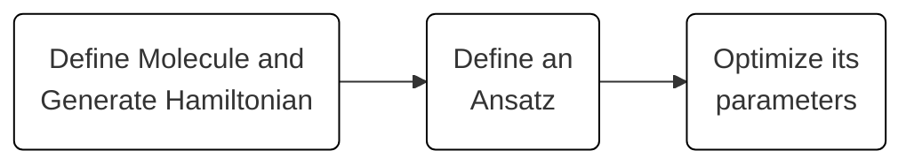

# Ground State Solving

The Variational Quantum Eigensolver (VQE) is a well-known algorithm for its applications in the chemistry field.
The Classiq platform uses this algorithm to solve ground state problems.

## Background

Calculating the energies of a molecular Hamiltonian, especially the ground state, allows insights into the chemical properties of the molecule.
Since the molecular Hamiltonian is inherently quantum, quantum computing calculates such properties efficiently by leveraging the same quantum effects in appropriate quantum algorithms.

Steps:

1. Define the molecule and calculate its Hamiltonian operator.
2. Construct an appropriate variational quantum model, containing the description of the quantum program (the ansatz) and the classical flow (VQE). Then synthesize the model to a quantum program.
3. Optimize the parameters in the ansatz by executing the hybrid quantum-classical algorithm to find the Hamiltonian (or molecule) ground state.

The process is described visually in the diagram:



## Defining a Molecule and Calculating Its Hamiltonian

Given a molecule, what is the full Hamiltonian describing the interactions between all electrons and nuclei?

Following is an example of calculating the Hamiltonian of the hydrogen molecule.

=== "IDE"

    In the IDE Model page - select the Chemistry option from the Built In Apps folder in the Models pane:

    

    Enter the following molecule model in the Chemistry problem editor:
    [comment]: DO_NOT_TEST
    


    If you edit the molecule model make sure to click the Apply button.
    You should now see the Hamiltonian in compact format in the Model Editor.

=== "SDK"

    ```python
    from classiq.applications.chemistry import Molecule, MoleculeProblem

    molecule = Molecule(
        atoms=[
            ("H", (0.0, 0.0, 0.0)),
            ("H", (0.0, 0.0, 0.735)),
        ],
    )
    gs_problem = MoleculeProblem(
        molecule=molecule,
        mapping="jordan_wigner",
    )

    hamiltonian = gs_problem.generate_hamiltonian()
    ```

The example above defines a hydrogen molecule by specifying its two hydrogen
atoms and their position in a 3D space.
The molecule is then used to create a `MoleculeProblem`, together with the following optional parameters:

-   `mapping: str` – The mapping between the fermionic Hamiltonian and a Pauli string Hamiltonian that can be applied on the qubits.
    Supported types:
    -   `"jordan_wigner"`
    -   `"parity"`
    -   `"bravyi_kitaev"`
    -   `"fast_bravyi_kitaev"`
-   `freeze_core: bool` – Remove the "core" orbitals of the atoms defining the molecule.
-   `two_qubit_reduction: bool` – Perform two qubit reduction if possible.
-   `z2_symmetries: bool` – Perform Z2 symmetries reduction [ [1] ](#z2_symmetries).

*   Currently, the only supported basis set is `"sto3g"` (see [PySCF](https://pyscf.org/index.html)).

Finally, the Hamiltonian can be generated from the `MoleculeProblem`, if needed.

## Constructing a Variational Quantum Model

The ground state of a Hamiltonian is found using an appropriate variational quantum program (usually called an ansatz),
which is combined with a classical optimizer to find the minimal expectation value for the Hamiltonian.
See the list of built-in [ansatzes](ansatzes/index.md).

### Unitary Coupled Cluster Ansatz Example

This example shows the generation of the commonly used, chemistry-inspired UCC
ansatz, which is a unitary version of the classical coupled cluster (CC) method [ [2] ](#UCC).
First, initialize the quantum program to the Hartree-Fock state, then apply the UCC function.
See details of the UCC ansatz in [UCC](ansatzes/ucc.md).

=== "IDE"

    After generating a Hamiltonian as described above, you can either Synthesize the quantum program or Re-edit the the chemistry model and the Hamiltonain.


    - `Synthesis` takes you to the Quantum Program tab.

=== "SDK"

    ```python
    from classiq import construct_chemistry_model, synthesize, show, OptimizerType
    from classiq.applications.chemistry import Molecule, MoleculeProblem
    from classiq.applications.chemistry import UCCParameters, ChemistryExecutionParameters


    molecule = Molecule(
        atoms=[("H", (0.0, 0.0, 0.0)), ("H", (0.0, 0.0, 0.735))],
    )
    gs_problem = MoleculeProblem(
        molecule=molecule,
        mapping="jordan_wigner",
    )


    ucc_params = UCCParameters(excitations=[1, 2])
    execution_params = ChemistryExecutionParameters(
        optimizer=OptimizerType.COBYLA,
        max_iteration=30,
    )

    # The construct_chemistry_model function wraps the quantum and classical parts together, and creates a full hybrid model.
    model = construct_chemistry_model(
        chemistry_problem=gs_problem,
        use_hartree_fock=True,
        ansatz_parameters=ucc_params,
        execution_parameters=execution_params,
    )
    qprog = synthesize(model)

    show(qprog)
    ```

This is the output quantum program.

.

## Optimizing to Find the Hamiltonian Ground State

After you specify a molecular Hamiltonian and an ansatz to use in the algorithm,
combine everything and execute the VQE algorithm to find the Hamiltonian ground state.

=== "IDE"

    [comment]: DO_NOT_TEST
    Ensure you are in the Execution tab.

    Click the `Run` button in the same way that you execute other quantum programs throughout the platform.
    In this case, the Classiq engine executes the hybrid algorithm, optimizing the parameters in the ansatz
    to find the minimum of the objective function $\left\langle \psi(\theta) \middle| H \middle| \psi(\theta) \right\rangle$.
    This process attempts to find the molecule's ground state.

=== "SDK"

    ```python
    from classiq import construct_chemistry_model, synthesize, show, OptimizerType
    from classiq.applications.chemistry import Molecule, MoleculeProblem
    from classiq.applications.chemistry import UCCParameters, ChemistryExecutionParameters

    from classiq import execute

    molecule = Molecule(
        atoms=[("H", (0.0, 0.0, 0.0)), ("H", (0.0, 0.0, 0.735))],
    )
    gs_problem = MoleculeProblem(
        molecule=molecule,
        mapping="jordan_wigner",
    )


    ucc_params = UCCParameters(excitations=[1, 2])
    execution_params = ChemistryExecutionParameters(
        optimizer=OptimizerType.COBYLA,
        max_iteration=30,
    )

    # The construct_chemistry_model function wraps the quantum and classical parts together, and creates a full hybrid model.
    model = construct_chemistry_model(
        chemistry_problem=gs_problem,
        use_hartree_fock=True,
        ansatz_parameters=ucc_params,
        execution_parameters=execution_params,
    )
    qprog = synthesize(model)

    result = execute(qprog).result()
    ```
    `execute(qprog)` executes the hybrid algorithm, optimizing the parameters in the ansatz
    to find the minimum of the objective function $\left\langle \psi(\theta) \middle| H \middle| \psi(\theta) \right\rangle$.
    This process attempts to find the molecule's ground state.

Compare the VQE result to the exact result for small molecules obtained by calculating the [ground state exact solution](advanced-usage/exact-solution.md).

For details of the resulting object (for molecule problems), see [GroundStateResult](molecule-result.md).

### Additional Examples

See further ansatz examples: [hardware efficient ansatz](ansatzes/hardware-efficient-ansatz.md), [Hamiltonian variational ansatz](ansatzes/hva.md).

## Troubleshooting the IDE

-   If the "Execute for Hamiltonian" checkbox is missing:
    -   The checkbox only appears when there is a Hamiltonian available for the quantum program. It might be missing if:
        -   You clicked the `Synthesize` button before the `Generate Hamiltonian` button.
        -   You used the SDK to synthesize the quantum program, but the IDE to execute it. Classiq does
            not support Hamiltonians generated in the SDK.

## References

<a name="z2_symmetries">[1]</a> Bravyi, Sergey, Jay M. Gambetta, Antonio Mezzacapo, and Kristan Temme,
[Tapering off qubits to simulate fermionic Hamiltonians](https://arxiv.org/abs/1701.08213) (2017).

<a name="UCC">[2]</a>
Panagiotis K. Barkoutsos, Jerome F. Gonthier, Igor Sokolov, Nikolaj Moll, Gian Salis, Andreas Fuhrer, Marc Ganzhorn, Daniel J. Egger, Matthias Troyer, Antonio Mezzacapo, Stefan Filipp, and Ivano Tavernelli,
[Quantum algorithms for electronic structure calculations: Particle-hole Hamiltonian and optimized wave-function expansions](https://arxiv.org/abs/1805.04340)
Phys. Rev. A 98, 022322 (2018).
